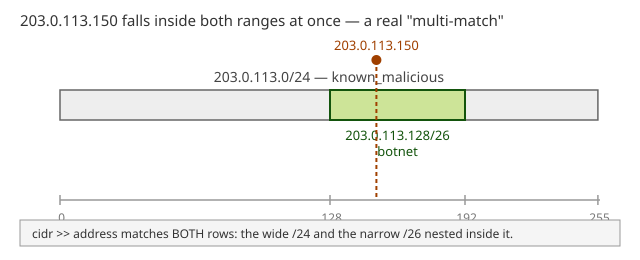

# Chapter 7 — IP and Network Filtering: `ip4r`

> *"An IP address is a number. A CIDR block is a range. PostgreSQL's
> built-in types treat the first well and the second as an afterthought —
> `ip4r` treats the range as the whole point."*

---

## Background

PostgreSQL already ships `inet` and `cidr` — you don't strictly need an
extension to store an IP address. So why does one exist? Because `inet`
and `cidr` were designed for storing addresses and networks, not for
answering the question a security team actually asks all day: *"is this
address inside any of these ranges?"* — over and over, at high volume,
fast. `cidr` is also stricter than it looks: it rejects a value with any
host bits set relative to its mask (`192.168.1.5/24` is refused outright —
more on that in Exercise 1), and neither built-in type ships a
purpose-built index structure for "find every range containing this point"
or "find every point inside this range" at scale. Every containment check
against a large blocklist falls back to a sequential scan unless you reach
for something else.

`ip4r` is that something else: a dedicated `ip4` type for single IPv4
addresses, an `ip4r` type for arbitrary IPv4 ranges (CIDR-aligned or not —
also unlike `cidr`), a GiST opclass built specifically for fast range
containment, and — despite the name — full IPv6 equivalents (`ip6`,
`ip6r`) plus polymorphic `ipaddress`/`iprange` types that work with either
family. This chapter builds a small network security monitoring setup
around it: logging access attempts, maintaining block and allow lists,
indexing them properly, and — because real blocklists and allowlists
eventually disagree with each other — finding and resolving the conflicts
that creates.

---

## The Scenario

Portsmith's online services — the resident portal, the business licensing
API from Chapter 5, the permit dashboard — all sit behind the same
logging and access-control layer. Every login attempt and API call gets
recorded, and a security team maintains two lists: a **blocklist** of
ranges observed doing something hostile (brute-force login attempts, known
Tor exit nodes, botnet activity), and an **allowlist** of ranges that
should never be blocked regardless — the city's own VPN, a trusted
vendor's office network.

| Table            | Purpose                                                             |
|-------------------|-----------------------------------------------------------------------|
| `network_events`  | One row per login attempt or API call — type, source IP, timestamp   |
| `blocklists`      | CIDR ranges flagged as malicious, with a category and description    |
| `allowlists`      | CIDR ranges that should never be blocked, regardless of blocklist entries |

Every range in this chapter's data uses IANA-reserved, non-routable
address space (the RFC 5737 documentation blocks `192.0.2.0/24`,
`198.51.100.0/24`, `203.0.113.0/24`, and the reserved `240.0.0.0/4` block)
— synthetic security data, not a real blocklist, using addresses that were
never going to belong to anyone.

---

## Exercise Goals

By the end of this chapter you will be able to:

- Explain what `ip4r` gets you over the built-in `inet`/`cidr` types, in
  storage and in what values each type actually accepts.
- Use the containment operators `>>` and `<<=` to check whether an address
  falls inside a range, and handle the case where it matches more than
  one.
- Build a GiST index for network containment queries — and know why it
  can't go directly on an `ip4` column, only an `ip4r` one.
- Aggregate events by subnet using both `ip4r`-native functions and the
  built-in `network()`/`masklen()` functions via a cast.
- Detect real conflicts between an allowlist and a blocklist using the
  overlap operator `&&`.
- Build a GiST-indexed function that resolves those conflicts and answers
  "is this IP blocked?" in one call.
- *(Additional)* Implement a token-bucket rate limiter keyed on `ip4r`,
  applied at both the host and `/24` netblock level, and explain why
  distributed abuse needs the second bucket to be caught at all.

---

## Installation

```bash
sudo apt install -y postgresql-16-ip4r
```

Enable it. Like `pgvector` in Chapter 6, `ip4r`'s control file does not
set `trusted = true`, so a regular database-owning role can't self-serve
this one either — it has to be done once, by a superuser:

```bash
sudo -u postgres psql portsmith -c "CREATE EXTENSION ip4r;"
```

Confirm it:

```sql
SELECT extversion FROM pg_extension WHERE extname = 'ip4r';
```

```
 extversion
------------
 2.4
```

> **If it doesn't show up:** double-check which database you ran the
> `CREATE EXTENSION` against. `psql -l` lists every database on the
> cluster — it's worth a glance if an extension you just enabled doesn't
> appear where you expect it.

---

## Loading the Data

### Run the seed script

```bash
python data/ch07_seed.py
```

Expected output:

```
Connecting to: dbname=portsmith
Creating schema …
Inserting 4 blocklist entries …
Inserting 3 allowlist entries …
Inserting 116 network events …
Done — 116 rows in network_events, 4 blocklist entries, 3 allowlist entries.
```

### Verify the load

Open `psql portsmith` and run these checks.

**Check 1 — table structure:**

```sql
\d network_events
```

```
                                      Table "public.network_events"
   Column    |           Type           | Collation | Nullable |                  Default
-------------+--------------------------+-----------+----------+--------------------------------------------
 id          | bigint                   |           | not null | nextval('network_events_id_seq'::regclass)
 event_type  | text                     |           | not null |
 source_ip   | ip4                      |           | not null |
 occurred_at | timestamp with time zone |           | not null |
 detail      | text                     |           | not null |
Indexes:
    "network_events_pkey" PRIMARY KEY, btree (id)
Check constraints:
    "network_events_event_type_check" CHECK (event_type = ANY (ARRAY['login_success'::text, 'login_failure'::text, 'api_call'::text, 'api_error'::text]))
```

**Check 2 — event counts by type:**

```sql
SELECT event_type, COUNT(*) FROM network_events GROUP BY event_type ORDER BY event_type;
```

```
  event_type   | count
---------------+-------
 api_call      |    47
 api_error     |     9
 login_failure |    41
 login_success |    19
(4 rows)
```

**Check 3 — list counts:**

```sql
SELECT COUNT(*) FROM blocklists;   -- 4
SELECT COUNT(*) FROM allowlists;   -- 3
```

If all three match, proceed to the exercises.

---

## Exercises

---

### Exercise 1 — `ip4r` vs. the Built-in `inet`/`cidr`

**1.1 — Storage**

```sql
SELECT pg_column_size('203.0.113.5'::ip4)      AS ip4_size,
       pg_column_size('203.0.113.5'::inet)     AS inet_size,
       pg_column_size('203.0.113.0/24'::ip4r)  AS ip4r_size,
       pg_column_size('203.0.113.0/24'::cidr)  AS cidr_size;
```

```
 ip4_size | inet_size | ip4r_size | cidr_size
----------+-----------+-----------+-----------
        4 |        10 |         8 |        10
```

`ip4` is a fixed 4-byte integer — nothing but the address. `inet` costs
10 bytes because it's a varlena type carrying an address family byte and a
netmask alongside the 4 address bytes, general enough to also hold IPv6.
`ip4r` stores a range as two 4-byte bounds (8 bytes) rather than a
network+prefix pair, and `cidr` costs the same 10 bytes as `inet` for the
same reason. At one row this is noise; at hundreds of millions of rows in
a real event log, 4 bytes versus 10 is not.

**1.2 — `cidr` is stricter than you might expect**

```sql
SELECT '192.168.1.5/24'::cidr;
```

```
ERROR:  invalid cidr value: "192.168.1.5/24"
DETAIL:  Value has bits set to right of mask.
```

`cidr` refuses any value where the host portion isn't all zero for the
given mask — it only accepts genuine network addresses. `inet` is more
permissive and keeps the host bits as part of the value:

```sql
SELECT '192.168.1.5/24'::inet;
```

```
    inet
----------------
 192.168.1.5/24
```

**1.3 — `ip4r` doesn't require CIDR alignment at all**

```sql
SELECT '203.0.113.5-203.0.113.20'::ip4r;
```

```
          ip4r
--------------------------
 203.0.113.5-203.0.113.20
```

```sql
SELECT '203.0.113.5-203.0.113.20'::cidr;
```

```
ERROR:  invalid input syntax for type cidr: "203.0.113.5-203.0.113.20"
```

This is the real semantic difference, not just performance: `cidr` and
`inet` can only represent power-of-two, mask-aligned networks. `ip4r` is a
genuine range type — a start and an end bound, no requirement that they
correspond to any CIDR block at all. A DHCP pool spanning
`.5` through `.20` is a completely ordinary `ip4r` value and simply not
expressible as a single `cidr`.

**1.4 — The wider family**

`ip4r` (the extension) is not limited to IPv4 despite the name:

```sql
\dx+ ip4r
```

lists casts and functions for `ip4`, `ip4r`, `ip6`, `ip6r`, and two
polymorphic types, `ipaddress` and `iprange`, that accept either address
family. This chapter sticks to IPv4 to match `network_events` and keep
the examples concrete, but everything here has a direct IPv6 equivalent.

---

### Exercise 2 — Containment: `>>` and `<<=`

**2.1 — "Does any blocklist entry contain this address?"**

```sql
SELECT id, category, description
FROM   blocklists
WHERE  cidr >> '203.0.113.150'::ip4;
```

```
 id |    category     |                                          description
----+-----------------+-----------------------------------------------------------------------------------------------
  1 | known_malicious | Repeated brute-force login attempts against the resident portal, flagged by the security team
  2 | botnet          | Subrange within 203.0.113.0/24 attributed to a specific credential-stuffing botnet
(2 rows)
```

`>>` means "left range contains right value." Two rows come back, not
one — `203.0.113.150` falls inside both the broad `203.0.113.0/24` entry
*and* the narrower `203.0.113.128/26` botnet subrange nested inside it.
Real blocklists routinely have this shape: a wide, low-confidence range
alongside a narrow, high-confidence one carved out of it.



**2.2 — The same check, written the other way around**

```sql
SELECT id, category, description
FROM   blocklists
WHERE  '203.0.113.150'::ip4 <<= cidr;
```

Identical result set. `<<=` means "left value is contained by (or equal
to) right range" — `a >> b` and `b <<= a` are the same test from opposite
sides. Which one reads more naturally depends on which value you think of
as the "subject" of the query; both compile to the same containment
check.

**2.3 — Handle the multi-match case deliberately**

Since Exercise 2.1 showed a single address can match more than one
blocklist entry, any real lookup needs to decide what to do with that —
return every match for an audit trail, or the most specific one for a
quick yes/no. Exercise 6 builds the second.

---

### Exercise 3 — GiST Indexing (and a Real Gotcha)

**3.1 — The unindexed cost**

```sql
EXPLAIN (ANALYZE, BUFFERS)
SELECT id, event_type, source_ip
FROM   network_events
WHERE  source_ip <<= '203.0.113.0/24'::ip4r;
```

```
                                                QUERY PLAN
----------------------------------------------------------------------------------------------------------
 Seq Scan on network_events  (cost=0.00..3.74 rows=1 width=44) (actual time=0.006..0.016 rows=38 loops=1)
   Filter: ((source_ip)::ip4r <<= '203.0.113.0/24'::ip4r)
   Rows Removed by Filter: 78
```

38 of 116 events fall inside that /24. At 116 rows this costs nothing; at
production log volume, a sequential scan per lookup is exactly the
bottleneck `ip4r` exists to remove.

**3.2 — The naive index fails**

```sql
CREATE INDEX idx_network_events_source_ip
    ON network_events USING GIST (source_ip);
```

```
ERROR:  data type ip4 has no default operator class for access method "gist"
HINT:  You must specify an operator class for the index or define a default operator class for the data type.
```

This is worth sitting with rather than working around blindly: `ip4r` (the
extension) ships a GiST operator class for `ip4r` (the **range** type)
only.

```sql
SELECT opcname, amname
FROM   pg_opclass oc JOIN pg_am am ON am.oid = oc.opcmethod
WHERE  opcname ILIKE '%ip4%';
```

```
    opcname     | amname
----------------+--------
 btree_ip4_ops  | btree
 btree_ip4r_ops | btree
 hash_ip4_ops   | hash
 hash_ip4r_ops  | hash
 gist_ip4r_ops  | gist
```

`ip4` (a single address) has B-tree and hash opclasses for equality and
ordering, but no GiST opclass at all — GiST is for indexing *containment
and overlap*, which only makes sense for a range. `network_events.source_ip`
is declared `ip4`, a plain address column, so there's nothing there for
GiST to build against directly.

**3.3 — The fix: index the range-cast expression**

```sql
CREATE INDEX idx_network_events_source_ip
    ON network_events USING GIST ((source_ip::ip4r));
```

Every `ip4` value casts losslessly to a single-address `ip4r` (a range
whose start and end are the same address), which does have a GiST
opclass. This is an **expression index** — it indexes the result of
`source_ip::ip4r`, not the raw column — so queries have to use the same
cast for the planner to recognize a match:

```sql
SET enable_seqscan = off;

EXPLAIN (ANALYZE, BUFFERS)
SELECT id, event_type, source_ip
FROM   network_events
WHERE  source_ip::ip4r <<= '203.0.113.0/24'::ip4r;

SET enable_seqscan = on;
```

```
                                                                  QUERY PLAN
-----------------------------------------------------------------------------------------------------------------------------------------------
 Index Scan using idx_network_events_source_ip on network_events  (cost=0.14..8.15 rows=1 width=44) (actual time=0.105..0.110 rows=38 loops=1)
   Index Cond: ((source_ip)::ip4r <<= '203.0.113.0/24'::ip4r)
```

Same 38 rows, now via `Index Scan`. The lesson generalizes beyond `ip4r`:
when a GiST opclass exists for a *range* type but your column stores
*points*, an expression index bridges the gap — cast to the range type in
both the index definition and every query that should use it.

---

### Exercise 4 — Aggregating by Subnet

**4.1 — The `ip4r`-native way**

```sql
SELECT ip4r_net_prefix(source_ip, 24) AS subnet_24, COUNT(*) AS events
FROM   network_events
GROUP  BY subnet_24
ORDER  BY events DESC, subnet_24;
```

```
    subnet_24    | events
-----------------+--------
 203.0.113.0/24  |     38
 192.0.2.0/24    |     31
 198.51.100.0/24 |     28
 240.1.2.0/24    |     11
 100.64.5.0/24   |      4
 100.64.9.0/24   |      4
(6 rows)
```

`ip4r_net_prefix(address, prefix_length)` computes the containing network
for an address directly, staying entirely within `ip4r`'s own types — no
cast round-trip needed.

**4.2 — The same result via the built-in `network()`/`set_masklen()`**

`ip4` casts directly to `cidr`, so the standard PostgreSQL network
functions work too, if you'd rather not learn `ip4r`-specific function
names:

```sql
SELECT network(set_masklen(source_ip::cidr, 24)) AS subnet_24, COUNT(*) AS events
FROM   network_events
GROUP  BY subnet_24
ORDER  BY events DESC, subnet_24;
```

Identical results. `set_masklen()` overrides the prefix length on a
`cidr`/`inet` value, and `network()` zeroes out the host bits to return
the network address — two built-in functions doing in two steps what
`ip4r_net_prefix()` does in one.

**4.3 — `masklen()` on the blocklist itself**

```sql
SELECT cidr, masklen(cidr::cidr) AS prefix_length, category
FROM   blocklists ORDER BY id;
```

```
       cidr       | prefix_length |      category
------------------+---------------+--------------------
 203.0.113.0/24   |            24 | known_malicious
 203.0.113.128/26 |            26 | botnet
 240.1.2.0/25     |            25 | tor_exit_node
 198.51.100.0/28  |            28 | brute_force_source
```

Worth noticing as a pattern, not just a query result: the narrower the
prefix (higher number, smaller range), the more specific and
higher-confidence the category tends to be here — `/24` for a broad
"something's wrong in this range" flag, `/26` and `/28` for a
credential-stuffing botnet and an automated feed's specific finding. Range
size is itself a signal about how much to trust an entry.

---

### Exercise 5 — Overlap Detection Between Allow and Block Lists

**5.1 — Find every conflict with `&&`**

```sql
SELECT b.id AS block_id, b.cidr AS blocked_range, b.category,
       a.id AS allow_id, a.cidr AS allowed_range, a.description
FROM   blocklists b
JOIN   allowlists a ON b.cidr && a.cidr
ORDER  BY b.id, a.id;
```

```
 block_id |  blocked_range  |      category      | allow_id |  allowed_range  |                    description
----------+-----------------+--------------------+----------+-----------------+----------------------------------------------------
        4 | 198.51.100.0/28 | brute_force_source |        1 | 198.51.100.0/24 | Portsmith City Hall internal network and staff VPN
(1 row)
```

`&&` is the general overlap test — true if the two ranges share *any*
address, regardless of which contains which. One real conflict: an
automated brute-force detection feed flagged `198.51.100.0/28`, a
sub-range that sits entirely inside the city's own allowlisted VPN block.
This is exactly the failure mode automated blocklist feeds produce in
practice — someone's VPN concentrator fails logins at a rate that looks
like an attack from outside, and gets flagged from inside a range that was
explicitly trusted.

**5.2 — Confirm it isn't hypothetical**

```sql
SELECT DISTINCT source_ip
FROM   network_events
WHERE  source_ip::ip4r <<= '198.51.100.0/28'::ip4r
ORDER  BY source_ip;
```

```
   source_ip
---------------
 198.51.100.5
 198.51.100.7
 198.51.100.12
```

Three real addresses in `network_events` sit inside the disputed range —
this isn't an edge case sitting unused in the blocklist table, it's
actively affecting real logged traffic from the city's own network.

---

### Exercise 6 — A Real-Time "Is This IP Blocked?" Function

**6.1 — Index the lookup tables themselves**

Exercise 3 needed an expression index because `network_events.source_ip`
is `ip4` (a point). `blocklists.cidr` and `allowlists.cidr` are already
`ip4r`, so they index directly, no casting required:

```sql
CREATE INDEX idx_blocklists_cidr ON blocklists USING GIST (cidr);
CREATE INDEX idx_allowlists_cidr ON allowlists USING GIST (cidr);
```

```sql
SET enable_seqscan = off;

EXPLAIN (ANALYZE, BUFFERS)
SELECT category, description FROM blocklists WHERE cidr >> '203.0.113.150'::ip4;

SET enable_seqscan = on;
```

```
                                                           QUERY PLAN
---------------------------------------------------------------------------------------------------------------------------------
 Index Scan using idx_blocklists_cidr on blocklists  (cost=0.13..8.15 rows=1 width=64) (actual time=0.073..0.074 rows=2 loops=1)
   Index Cond: (cidr >> '203.0.113.150'::ip4r)
```

**6.2 — The function: allowlist wins**

Exercise 5 found a real conflict. A production "is this blocked?" check
has to resolve it one way, consistently — this function checks the
allowlist *first* and short-circuits if it matches, so a trusted range is
never blocked no matter what an automated feed says about a sub-range of
it:

```sql
CREATE OR REPLACE FUNCTION is_blocked(check_ip ip4)
RETURNS TABLE (blocked BOOLEAN, reason TEXT) AS $$
BEGIN
    IF EXISTS (SELECT 1 FROM allowlists WHERE cidr >> check_ip) THEN
        RETURN QUERY SELECT FALSE, 'allowlisted'::TEXT;
        RETURN;
    END IF;

    RETURN QUERY
    SELECT TRUE, b.category || ': ' || b.description
    FROM   blocklists b
    WHERE  b.cidr >> check_ip
    LIMIT  1;

    IF NOT FOUND THEN
        RETURN QUERY SELECT FALSE, 'not listed'::TEXT;
    END IF;
END;
$$ LANGUAGE plpgsql STABLE;
```

`LIMIT 1` on the blocklist branch is deliberate — Exercise 2 showed an
address can match multiple blocklist entries, and for a yes/no gate one
matching reason is enough; an audit tool would drop the `LIMIT` and return
every match instead.

**6.3 — Test it against every case this chapter built**

```sql
SELECT * FROM is_blocked('203.0.113.150');  -- plain blocklist match
```

```
 blocked |                                                     reason
---------+----------------------------------------------------------------------------------------------------------------
 t       | known_malicious: Repeated brute-force login attempts against the resident portal, flagged by the security team
```

```sql
SELECT * FROM is_blocked('198.51.100.7');   -- the Exercise 5 conflict
```

```
 blocked |   reason
---------+-------------
 f       | allowlisted
```

Blocklisted *and* allowlisted, and the function correctly refuses to
block it — exactly the resolution Exercise 5's conflict needed.

```sql
SELECT * FROM is_blocked('192.0.2.10');     -- vendor allowlist, no conflict
SELECT * FROM is_blocked('8.8.8.8');        -- not on any list
```

```
 blocked |   reason
---------+-------------
 f       | allowlisted

 blocked |   reason
---------+------------
 f       | not listed
```

Four calls, four distinct real outcomes, all backed by GiST-indexed
lookups against tables that would scale to millions of blocklist entries
without changing a line of this function.

---

### Exercise 7 (Additional) — Rate Limiting by Host *and* `/24` with a Token Bucket

Blocklists are a permanent, deliberate verdict — someone reviewed a range
and decided it's hostile. Rate limiting is different: it's a *temporary*
throttle applied to traffic that isn't necessarily malicious, just too
frequent, and it needs to make that decision on every single request,
fast. This exercise builds one of the most common shapes for it — a
**token bucket** — and applies it at two levels at once: per individual
host, and per `/24` netblock, because some abuse only shows up when you
stop looking at hosts one at a time.

**7.1 — The token bucket model**

Each bucket has a **capacity** (the size of a burst it can absorb all at
once) and a **refill rate** (tokens added per second, up to capacity).
Every request tries to consume one token: if at least one is available,
the request is allowed and a token is spent; if not, it's denied. Tokens
refill continuously based on real elapsed time, not on a fixed clock tick
— a bucket that's been idle for ten seconds has ten seconds' worth of
refill waiting, whether or not anything asked.

**7.2 — Why two buckets, not one**

A per-host limit alone has a blind spot: ten different addresses in the
same `/24`, each individually staying just under the limit, add up to ten
times the traffic that netblock was ever supposed to send — a classic
shape for a botnet spread across one compromised network, or NAT'd traffic
from behind a single gateway. A per-host bucket alone never trips.
Checking a *second*, looser bucket keyed to the containing `/24` catches
exactly that pattern, without needing to lower the per-host limit enough
to hurt legitimate single users.



`check_rate_limit()`, built below, is exactly this diagram: the host
bucket is checked — and consumed — first, and only a request that clears
it goes on to spend a netblock token too.

**7.3 — Schema: bucket keyed by `ip4r`, not `ip4`**

```sql
CREATE TABLE rate_limit_buckets (
    bucket      ip4r PRIMARY KEY,
    capacity    NUMERIC NOT NULL,
    refill_rate NUMERIC NOT NULL,
    tokens      NUMERIC NOT NULL,
    updated_at  TIMESTAMPTZ NOT NULL DEFAULT clock_timestamp()
);
```

Using `ip4r` as the key, rather than `ip4` plus a separate "is this a host
or a netblock" flag, means a host bucket and a netblock bucket are just
two different-sized ranges sharing one table and one lookup path — a host
is stored as its `/32`, a netblock as its `/24`.

**7.4 — The atomic refill-and-consume function**

The refill math and the allow/deny decision have to happen as one atomic
operation — two concurrent requests against the same bucket must not both
read "4 tokens available" and both proceed, the same race Chapter 3 built
`FOR UPDATE SKIP LOCKED` to avoid in the job queue. Here the fix is
simpler — plain `FOR UPDATE`, no `SKIP LOCKED` — because a rate limit
*should* make the second concurrent request wait its turn for the lock
rather than skip ahead to a different row; there's only one row per
bucket, not a queue of interchangeable ones:

```sql
CREATE OR REPLACE FUNCTION try_consume_bucket(
    target_bucket ip4r,
    p_capacity    NUMERIC,
    p_refill_rate NUMERIC
) RETURNS TABLE (allowed BOOLEAN, tokens_remaining NUMERIC) AS $$
BEGIN
    INSERT INTO rate_limit_buckets (bucket, capacity, refill_rate, tokens, updated_at)
    VALUES (target_bucket, p_capacity, p_refill_rate, p_capacity, clock_timestamp())
    ON CONFLICT (bucket) DO NOTHING;

    RETURN QUERY
    WITH refilled AS (
        SELECT b.bucket,
               LEAST(b.capacity, b.tokens + b.refill_rate *
                     EXTRACT(EPOCH FROM (clock_timestamp() - b.updated_at))) AS available
        FROM   rate_limit_buckets b
        WHERE  b.bucket = target_bucket
        FOR UPDATE
    )
    UPDATE rate_limit_buckets u
    SET    tokens     = CASE WHEN r.available >= 1 THEN r.available - 1 ELSE r.available END,
           updated_at = clock_timestamp()
    FROM   refilled r
    WHERE  u.bucket = r.bucket
    RETURNING (r.available >= 1), u.tokens;
END;
$$ LANGUAGE plpgsql;
```

The `INSERT ... ON CONFLICT DO NOTHING` lazily creates a bucket at full
capacity the first time an address is ever seen — no separate
provisioning step. Note `clock_timestamp()`, not `now()`: this is the same
gotcha from Chapter 3 — `now()` freezes at transaction start, which would
make every refill calculation inside one transaction compute against the
same frozen instant instead of real elapsed wall-clock time.

**7.5 — Combine host and netblock into one check**

```sql
CREATE OR REPLACE FUNCTION check_rate_limit(check_ip ip4)
RETURNS TABLE (allowed BOOLEAN, reason TEXT, host_tokens NUMERIC, netblock_tokens NUMERIC) AS $$
DECLARE
    host_result     RECORD;
    netblock_result RECORD;
BEGIN
    -- Host bucket: tight limit, catches a single misbehaving address.
    SELECT * INTO host_result
    FROM   try_consume_bucket(check_ip::ip4r, 5, 1);

    IF NOT host_result.allowed THEN
        RETURN QUERY SELECT FALSE, 'host limit exceeded'::TEXT, host_result.tokens_remaining, NULL::NUMERIC;
        RETURN;
    END IF;

    -- Netblock bucket: looser limit, catches abuse spread across many
    -- hosts in the same /24, each individually within their own budget.
    SELECT * INTO netblock_result
    FROM   try_consume_bucket(ip4r_net_prefix(check_ip, 24), 20, 5);

    IF NOT netblock_result.allowed THEN
        RETURN QUERY SELECT FALSE, 'netblock limit exceeded'::TEXT, host_result.tokens_remaining, netblock_result.tokens_remaining;
        RETURN;
    END IF;

    RETURN QUERY SELECT TRUE, 'ok'::TEXT, host_result.tokens_remaining, netblock_result.tokens_remaining;
END;
$$ LANGUAGE plpgsql;
```

The host bucket (capacity 5, refills 1/sec) is checked — and, critically,
*consumed* — first. Only if the host bucket allows the request does the
function go on to check the netblock bucket (capacity 20, refills 5/sec).
This ordering is a real design decision, not an accident: it means a
request that the netblock bucket ultimately rejects still spent a host
token on the way there. The alternative — check both before consuming
either — avoids that, at the cost of two extra reads per request. For a
security throttle, spending a token on a request you were going to reject
anyway is a rounding error; use whichever trade-off matches what you're
actually optimizing for.

**7.6 — A single host bursting past its own limit**

```sql
SELECT allowed, reason, round(host_tokens, 2), round(netblock_tokens, 2)
FROM   check_rate_limit('203.0.113.5');
-- run six times in a row
```

```
 allowed |       reason         | host_tokens | netblock_tokens
---------+----------------------+-------------+------------------
 t       | ok                   |        4.00 |            19.00
 t       | ok                   |        3.05 |            18.27
 t       | ok                   |        2.09 |            17.45
 t       | ok                   |        1.13 |            16.63
 t       | ok                   |        0.17 |            15.83
 f       | host limit exceeded  |        0.20 |
```

Five rapid calls spend the host bucket's burst capacity of 5 (with a
sliver of refill accumulating between each real request — these were
genuinely separate round trips, not a batch); the sixth is denied, purely
on the host bucket. The netblock bucket barely moved. (Your own numbers
will differ in the small decimals — they depend on the exact wall-clock
gap between your requests — but the allow/allow/allow/allow/allow/deny
pattern will not.)

**7.7 — Distributed abuse across a `/24`: the case this whole exercise exists for**

Five different hosts in the same netblock, each making five rapid
requests — each individually within its own host budget:

```sql
-- for host in 203.0.113.10 .. 203.0.113.14, 5 calls each:
SELECT allowed, reason, round(host_tokens, 2), round(netblock_tokens, 2)
FROM   check_rate_limit(:host);
```

```
     host       | allowed |         reason           | host_tokens | netblock_tokens
-----------------+---------+--------------------------+-------------+------------------
 203.0.113.10   | t       | ok                       |        4.00 |            19.00
 203.0.113.10   | t       | ok                       |        3.04 |            18.19
 203.0.113.10   | t       | ok                       |        2.08 |            17.38
 203.0.113.10   | t       | ok                       |        1.11 |            16.57
 203.0.113.10   | t       | ok                       |        0.15 |            15.76
 203.0.113.11   | t       | ok                       |        4.00 |            14.94
 203.0.113.11   | t       | ok                       |        3.04 |            14.13
 203.0.113.11   | t       | ok                       |        2.07 |            13.32
 203.0.113.11   | t       | ok                       |        1.11 |            12.51
 203.0.113.11   | t       | ok                       |        0.15 |            11.70
 203.0.113.12   | t       | ok                       |        4.00 |            10.88
 203.0.113.12   | t       | ok                       |        3.04 |            10.07
 203.0.113.12   | t       | ok                       |        2.08 |             9.27
 203.0.113.12   | t       | ok                       |        1.11 |             8.46
 203.0.113.12   | t       | ok                       |        0.15 |             7.64
 203.0.113.13   | t       | ok                       |        4.00 |             6.82
 203.0.113.13   | t       | ok                       |        3.04 |             6.03
 203.0.113.13   | t       | ok                       |        2.08 |             5.23
 203.0.113.13   | t       | ok                       |        1.12 |             4.42
 203.0.113.13   | t       | ok                       |        0.16 |             3.62
 203.0.113.14   | t       | ok                       |        4.00 |             2.81
 203.0.113.14   | t       | ok                       |        3.04 |             2.02
 203.0.113.14   | t       | ok                       |        2.08 |             1.20
 203.0.113.14   | t       | ok                       |        1.11 |             0.38
 203.0.113.14   | f       | netblock limit exceeded  |        0.15 |             0.56
```

Read the `host_tokens` column top to bottom: **every single request
succeeds at the host level** — no address ever exhausts its own bucket,
each one's burst-of-5 fits comfortably within its own limit every time.
And yet the 25th request, from the fifth host, is denied — for
`netblock limit exceeded`, not a host limit. Twenty-five individually
reasonable requests from five individually well-behaved addresses added up
to more than the `/24` as a whole was ever budgeted for, and the second
bucket caught it. This is precisely the pattern a per-host-only rate
limiter is structurally blind to.

---

## Summary — What You Should Now Know

| Tool | What it does |
|------|-------------|
| `ip4` / `ip4r` | Dedicated address and range types — 4 and 8 bytes, versus 10 for `inet`/`cidr` |
| `ip6` / `ip6r` / `ipaddress` / `iprange` | The same machinery for IPv6, and family-agnostic polymorphic types |
| `cidr` | Stricter than `inet` — rejects any value with host bits set past the mask |
| `'a-b'::ip4r` | An arbitrary range, not required to be CIDR-aligned — something `cidr` cannot express at all |
| `a >> b` / `b <<= a` | Containment, read from either direction — "does `a` contain `b`?" / "is `b` contained by `a`?" |
| `a && b` | Overlap — true if two ranges share any address, regardless of which contains which |
| `GIST (col)` on `ip4r` | Fast containment/overlap lookups — but only for `ip4r`, `ip4` has no GiST opclass |
| `GIST ((col::ip4r))` on `ip4` | The expression-index fix when your column stores points, not ranges |
| `ip4r_net_prefix(ip, n)` | Native way to compute the containing /n network for an address |
| `network(set_masklen(col::cidr, n))` | The same computation via built-in `inet`/`cidr` functions |
| Token bucket, keyed by `ip4r` | Rate limiting at both host (`/32`) and netblock (`/24`) scope from one table, catching distributed abuse a per-host limit alone can't see |

**The key design insight** from this chapter is that a blocklist and an
allowlist are not just two tables you check in some order — they are two
sources of truth that *will* disagree, and Exercise 5 found a real
disagreement in four hand-written rows almost by accident. A security
system that doesn't actively check for that disagreement is trusting
whichever list happens to get consulted first, silently. `&&` makes
finding every such conflict a single query; `is_blocked()` makes resolving
it a permanent, enforced policy instead of a hope.

---

*Going further: this chapter's `is_blocked()` resolves conflicts with a
fixed rule — allowlist always wins. A more nuanced system might weight
by range specificity (Exercise 4's observation that narrower ranges tend
to be higher-confidence) or by how recently an entry was added. For very
large blocklists — commercial threat-intelligence feeds run to millions of
entries — also benchmark GiST against `ip4r`'s B-tree and hash opclasses
for the access patterns that are pure equality or pure sorting rather than
containment, since GiST is the right tool specifically for range queries,
not a strictly faster B-tree replacement. And if this system needs to
block traffic in real time rather than just log a verdict, the natural
next step is exposing `is_blocked()` at the application's edge — a
reverse proxy or API gateway calling it per request — which is exactly
the kind of function Chapter 10's PostgREST chapter would expose as an
RPC endpoint. The same is true of `check_rate_limit()` from Exercise 7 —
a real deployment calls it once per incoming request, before any other
work happens, and a single `rate_limit_buckets` table means every
application server sees the same limits regardless of which one handled
the last request, something an in-process rate limiter can't offer
without a shared store of its own. If per-request PL/pgSQL round trips
ever become the bottleneck rather than the safeguard, that's the point at
which a dedicated in-memory limiter (Redis and similar) starts to earn
its keep — but plenty of systems never reach the traffic level where that
trade-off is worth the added moving part.*
