# Chapter 12 — Recursive CTEs: Graphs and Hierarchies

> *"SQL doesn't have loops. `WITH RECURSIVE` is a query that keeps
> calling itself until it runs out of new things to say."*

---

## Background

Every table so far in this book has been "flat" — rows related to each
other through a foreign key, sure, but never through a relationship of
*unknown depth*. A resident belongs to one neighbourhood. A reading
belongs to one sensor. But "who does this employee ultimately report
to?" or "how do I get from this intersection to that one?" can't be
answered by following one foreign key — the answer might be one hop
away, or ten, and a plain `JOIN` has to know in advance how many hops to
write. A **recursive CTE**, written `WITH RECURSIVE`, is PostgreSQL's
answer to "I don't know how many joins this needs — figure it out as you
go."

Structurally, a recursive CTE has two halves glued together with
`UNION` or `UNION ALL`:

```sql
WITH RECURSIVE cte_name AS (
    SELECT ...              -- ① the anchor: runs exactly once
    UNION ALL
    SELECT ...               -- ② the recursive term: references cte_name itself
    FROM   some_table
    JOIN   cte_name ON ...
)
SELECT * FROM cte_name;
```

The **anchor** runs once and seeds the result with a starting set of
rows. The **recursive term** then runs *repeatedly* — each time, it sees
only the rows the *previous* run just produced, joins them against the
table again to find "the next hop," and adds whatever new rows come out.
This keeps going until one run of the recursive term produces zero new
rows, at which point PostgreSQL stops and the final result is everything
the anchor and every round of the recursive term ever added together.
Nothing here is exotic under the hood — it's an ordinary loop, just
spelled out as a query instead of application code, and it stops for the
most ordinary reason a loop ever stops: it ran out of new work.

**Trees are graphs that promised to behave.** A tree — an org chart, a
category hierarchy — is a graph where every node has exactly one parent
and there's no way to walk back to somewhere you've already been. A road
network makes no such promise: intersections connect to several other
intersections, and it's entirely possible to walk in a circle and end up
back where you started. Recursive CTEs handle both shapes with the same
syntax, but only the graph case needs you to actively guard against
walking in circles forever — Exercises 1 through 3 build the tree
intuition first, precisely so Exercise 4 can show you, concretely, what
goes wrong without that guard, before Exercise 5 asks you to navigate a
graph that has a real cycle built into it on purpose.

---

## The Scenario

| Object                        | Source                                          | Shape                                  |
|--------------------------------|--------------------------------------------------|-------------------------------------------|
| `city_org`                     | *(new)*                                          | Tree — Portsmith's 30-person city government, 4 levels deep |
| `intersections`, `road_segments` | *(new, derived from Chapter 2's `city_infrastructure`)* | Graph — a real road network, cycles included |
| `categories`                   | *(new, derived from Chapter 1's real category data)* | Tree — a 3-level faceted-search hierarchy |

`intersections` and `road_segments` aren't invented — every node is a
real point where two of Chapter 2's actual road `LINESTRING`s cross,
found with `ST_Intersects`, and every edge length is the real
along-the-road distance for that stretch, not a straight-line guess.
Ring Road bends around three sides of the city between some of its
intersections, so a straight line between two of its crossing points
would have understated the real distance by more than 5 kilometres in
one case — Exercise 5 puts that exact gap to use.

---

## Exercise Goals

By the end of this chapter you will be able to:

- Explain the anchor/recursive-term structure of `WITH RECURSIVE` well
  enough to predict how many times the recursive term will run for a
  given tree.
- Walk a hierarchy in both directions — up to the root, and down to
  every descendant — and know which direction each shape of question
  needs.
- Compute each node's depth and render an arbitrary-depth tree as
  indented text.
- Recognize when a self-referencing table can contain a genuine cycle,
  and use `CYCLE ... SET ... USING` to detect one instead of hanging.
- Write a breadth-first recursive CTE to find a shortest path through a
  graph, and explain why "fewest hops" and "shortest distance" are not
  always the same answer.
- Flatten a category tree into an ancestor list for faceted search.

---

## Installation

Nothing to install. `WITH RECURSIVE` has been part of core PostgreSQL
since version 8.4 (2009) — the same release that introduced Chapter 11's
window functions.

---

## Loading the Data

This chapter needs Chapters 1 and 2's data, plus its own new tables:

```bash
python data/ch01_seed.py   # businesses (categories are derived from this)
python data/ch02_seed.py   # city_infrastructure (roads are derived from this)
python data/ch12_seed.py   # city_org, intersections, road_segments, categories
```

### Verify the prerequisites

```sql
SELECT 'city_org' AS table, COUNT(*) FROM city_org
UNION ALL SELECT 'intersections', COUNT(*) FROM intersections
UNION ALL SELECT 'road_segments', COUNT(*) FROM road_segments
UNION ALL SELECT 'categories', COUNT(*) FROM categories;
```

```
     table      | count
----------------+-------
 city_org       |    30
 intersections  |    15
 road_segments  |    19
 categories     |    48
(4 rows)
```

If all four match, proceed to the exercises.

---

## Exercises

---

### Exercise 1 — Walking to the Root

**1.1 — The shape of `city_org`**

```sql
\d city_org
```

```
                            Table "public.city_org"
   Column    |  Type   | Collation | Nullable |               Default
--------------+---------+-----------+----------+---------------------------------------
 id           | integer |           | not null | nextval('city_org_id_seq'::regclass)
 name         | text    |           | not null |
 title        | text    |           | not null |
 manager_id   | integer |           |          |
Foreign-key constraints:
    "city_org_manager_id_fkey" FOREIGN KEY (manager_id) REFERENCES city_org(id)
```

A **self-referencing foreign key** — `manager_id` points to another row
in the same table. This one column is the entire tree: the Mayor's
`manager_id` is `NULL` (the root has no manager), and everyone else's
`manager_id` points to the row above them.

**1.2 — From a patrol officer to the Mayor**

```sql
WITH RECURSIVE chain AS (
    SELECT id, name, title, manager_id, 0 AS depth
    FROM   city_org
    WHERE  name = 'Kwame Asante'

    UNION ALL

    SELECT o.id, o.name, o.title, o.manager_id, chain.depth + 1
    FROM   city_org o
    JOIN   chain ON o.id = chain.manager_id
)
SELECT depth, name, title FROM chain ORDER BY depth;
```

```
 depth |     name      |      title
-------+---------------+------------------
     0 | Kwame Asante  | Patrol Officer
     1 | Marcus Reilly | Patrol Captain
     2 | Diane Okonjo  | Chief of Police
     3 | Coretta Vance | Mayor
(4 rows)
```

Trace exactly what happened, round by round, since this is the pattern
every other exercise in this chapter builds on:

- **Anchor** (`depth = 0`): finds exactly one row, Kwame Asante.
- **Round 1** of the recursive term: joins `city_org` against the
  anchor's *one* row, looking for whoever has `id = Kwame's manager_id`
  — finds Marcus Reilly, tags him `depth = 1`.
- **Round 2**: joins against *only* Marcus Reilly's row (not Kwame's
  again) — finds Diane Okonjo, `depth = 2`.
- **Round 3**: joins against *only* Diane's row — finds Coretta Vance,
  `depth = 3`.
- **Round 4**: joins against *only* Coretta's row, looking for whoever
  has `id = Coretta's manager_id` — but `manager_id` is `NULL` for the
  Mayor, and nothing has `id = NULL`. Zero rows come back. The recursion
  stops here, on its own, having found the natural end of the chain.

Four rounds for four levels — that's not a coincidence. A recursive CTE
walking one path up (or down) a tree always runs exactly as many times
as the tree is deep along that path, no more.

---

### Exercise 2 — Every Employee Under a Department Head

**2.1 — Same idea, opposite direction**

Exercise 1 walked *up*: "whose `id` equals my `manager_id`." Finding
everyone *under* a department head walks *down* instead: "whose
`manager_id` equals my `id`."

```sql
WITH RECURSIVE subtree AS (
    SELECT id, name, title, manager_id, 0 AS depth
    FROM   city_org
    WHERE  name = 'Marcus Webb'

    UNION ALL

    SELECT o.id, o.name, o.title, o.manager_id, subtree.depth + 1
    FROM   city_org o
    JOIN   subtree ON o.manager_id = subtree.id
)
SELECT name, title, depth FROM subtree ORDER BY depth, name;
```

```
    name     |              title              | depth
-------------+-----------------------------------+-------
 Marcus Webb | Director of Public Works        |     0
 Dana Ruiz   | Streets & Sanitation Supervisor |     1
 Tom Delgado | Water & Sewer Supervisor        |     1
 Ivy Chen    | Water & Sewer Crew              |     2
 Leo Park    | Streets Crew                    |     2
 Noah Brandt | Water & Sewer Crew              |     2
 Priya Nair  | Streets Crew                    |     2
 Sam Okafor  | Streets Crew                    |     2
(8 rows)
```

Only the `JOIN` condition flipped — `o.manager_id = subtree.id` instead
of `o.id = subtree.manager_id` — and the exact same query shape now
answers a completely different question. This distinction matters more
than it looks: get the join condition backward and PostgreSQL won't
error, it will just silently return the anchor row and nothing else,
since "everyone whose manager is Marcus Webb" and "whoever Marcus Webb's
manager is" are both perfectly valid, perfectly different questions with
perfectly valid, empty-looking answers if you meant to ask the other
one.

---

### Exercise 3 — Depth and an Indented Tree

**3.1 — The whole org chart at once**

Exercise 1's `depth` counter already generalizes to the entire tree —
start from every root instead of one named employee, and every
manager-report edge gets discovered in the same breadth-expanding way:

```sql
WITH RECURSIVE org_tree AS (
    SELECT id, name, title, manager_id, 0 AS depth, ARRAY[name] AS path
    FROM   city_org
    WHERE  manager_id IS NULL

    UNION ALL

    SELECT o.id, o.name, o.title, o.manager_id, org_tree.depth + 1, org_tree.path || o.name
    FROM   city_org o
    JOIN   org_tree ON o.manager_id = org_tree.id
)
SELECT repeat('  ', depth) || name || ' (' || title || ')' AS org_chart
FROM   org_tree
ORDER  BY path;
```

```
                      org_chart
-------------------------------------------------------
 Coretta Vance (Mayor)
   Aisha Bonner (Director of Parks & Recreation)
     Felix Wren (Parks Maintenance Supervisor)
       Ezra Kowalski (Groundskeeper)
       Nora Villalobos (Groundskeeper)
   Diane Okonjo (Chief of Police)
     Marcus Reilly (Patrol Captain)
       Bianca Ferro (Patrol Officer)
       Kwame Asante (Patrol Officer)
       Theo Lindqvist (Patrol Officer)
     Paula Mensah (Records Sergeant)
   Helena Cross (Director of Permitting & Licensing)
     Grace Halloway (Senior Permit Reviewer)
       Mia Sorensen (Permit Clerk)
       Owen Fitch (Permit Clerk)
     Ray Castellano (Building Inspector)
   Julian Ostrowski (Director of Finance)
     Colin Marsh (Budget Analyst)
     Renata Sikes (City Accountant)
   Marcus Webb (Director of Public Works)
     Dana Ruiz (Streets & Sanitation Supervisor)
       Leo Park (Streets Crew)
       Priya Nair (Streets Crew)
       Sam Okafor (Streets Crew)
     Tom Delgado (Water & Sewer Supervisor)
       Ivy Chen (Water & Sewer Crew)
       Noah Brandt (Water & Sewer Crew)
   Wendell Achebe (Director of IT)
     Hugo Petrakis (Database Administrator)
     Zara Lindholm (Systems Administrator)
(30 rows)
```

Two new pieces do all the work. `repeat('  ', depth)` turns the integer
depth into visible indentation — two spaces per level, the plainest
possible tree rendering. `path`, an array built up one name at a time as
the recursion descends (`org_tree.path || o.name`), is what makes
`ORDER BY path` produce a proper depth-first listing instead of grouping
everyone by depth first — without it, `ORDER BY depth` alone would print
all six directors before any of their reports, flattening the tree back
into levels instead of branches. `path` is never displayed here; it only
exists to sort correctly, which is a pattern worth remembering any time
a recursive CTE's *output order* matters as much as its contents.

---

### Exercise 4 — Cycle Detection

**4.1 — A bad `UPDATE`, on purpose**

`manager_id` is just a foreign key — PostgreSQL enforces that it points
to a real row, but nothing stops it from pointing to a row that,
somewhere further up the chain, points right back down to where you
started. Simulate exactly that data-entry mistake:

```sql
UPDATE city_org
SET    manager_id = (SELECT id FROM city_org WHERE name = 'Leo Park')
WHERE  name = 'Dana Ruiz';
```

Leo Park already reports to Dana Ruiz. This one `UPDATE` now also makes
Dana report to Leo — a two-person cycle, and a perfectly valid row by
every constraint the table has.

**4.2 — Where the cycle actually bites**

Exercise 3's root-to-leaves traversal doesn't even notice: Dana and Leo
simply stop being reachable from the Mayor at all (their `manager_id`
chain no longer leads back up to anyone the tree already found), and
they silently vanish from that query's output — 26 rows instead of 30, no
error, just two people and their two remaining reports quietly
orphaned. It's Exercise 1's *upward* direction — the one this whole
chapter has been building on — that walks straight into it. Before
running this, set a safety net; you're about to run a query you already
know doesn't terminate on its own:

```sql
SET statement_timeout = '3s';

WITH RECURSIVE chain AS (
    SELECT id, name, manager_id, 0 AS depth
    FROM   city_org
    WHERE  name = 'Priya Nair'

    UNION ALL

    SELECT o.id, o.name, o.manager_id, chain.depth + 1
    FROM   city_org o
    JOIN   chain ON o.id = chain.manager_id
)
SELECT COUNT(*) FROM chain;
```

```
ERROR:  canceling statement due to statement timeout
```

Priya reports to Dana, Dana now reports to Leo, and Leo reports to Dana
— the walk to the root never reaches a `NULL` `manager_id`, because
there isn't one anywhere on this path anymore. Without the timeout, this
query runs until it exhausts memory or disk, whichever comes first,
generating an unbounded stream of alternating Dana/Leo rows forever.
**Any time a recursive CTE walks a self-referencing column you don't
personally control the integrity of, set a `statement_timeout` before
the first run** — it's cheap insurance against exactly this.

```sql
RESET statement_timeout;
```

**4.3 — `CYCLE ... SET ... USING`: detect it instead of hanging**

```sql
WITH RECURSIVE chain AS (
    SELECT id, name, manager_id, 0 AS depth
    FROM   city_org
    WHERE  name = 'Priya Nair'

    UNION ALL

    SELECT o.id, o.name, o.manager_id, chain.depth + 1
    FROM   city_org o
    JOIN   chain ON o.id = chain.manager_id
)
CYCLE id SET is_cycle USING path
SELECT id, name, depth, is_cycle FROM chain;
```

```
 id |    name    | depth | is_cycle
----+------------+-------+-----------
  5 | Priya Nair |     0 | f
  3 | Dana Ruiz  |     1 | f
  4 | Leo Park   |     2 | f
  3 | Dana Ruiz  |     3 | t
(4 rows)
```

Four rows and it's done — no timeout needed. `CYCLE id` tells
PostgreSQL to track every `id` this query has already visited, in a
hidden array column named by `USING path`; the moment a round would
revisit an `id` already in that array, it stops expanding *that* branch,
flags the repeated row `is_cycle = t`, and moves on rather than looping.
Dana Ruiz shows up twice — once as Priya's genuine manager, once again
as proof the walk looped back to her — and that second appearance is
exactly the signal that something in the data is wrong, ready to
`WHERE is_cycle` for or alert on, instead of a hung connection and no
explanation at all.



**4.4 — Undo the damage**

```sql
UPDATE city_org
SET    manager_id = (SELECT id FROM city_org WHERE name = 'Marcus Webb')
WHERE  name = 'Dana Ruiz';
```

Back to the real org chart before moving on.

---

### Exercise 5 — Shortest Path Through a Graph

**5.1 — Roads go both ways; `road_segments` only says one**

```sql
SELECT road_name, from_intersection, to_intersection, length_m
FROM   road_segments
WHERE  road_name = 'Ring Road';
```

```
 road_name |from_intersection|to_intersection|length_m
-----------+------------------+----------------+----------
 Ring Road |               11 |              3 |  2002.4
 Ring Road |                3 |              5 | 10541.7
 Ring Road |                5 |             15 |  1888.9
 Ring Road |               15 |              8 |  2559.7
 Ring Road |                8 |             10 |  6111.4
 Ring Road |               10 |             13 |   443.9
 Ring Road |               13 |             11 |  3323.3
(7 rows)
```

Each row is stored once, in one direction, the same way Chapter 2's
`city_infrastructure` stores each road as a single `LINESTRING` — but a
car can drive either way down Ring Road. Build a bidirectional view of
the graph before doing anything else with it:

```sql
CREATE VIEW road_graph AS
SELECT from_intersection AS a, to_intersection AS b, road_name, length_m FROM road_segments
UNION ALL
SELECT to_intersection, from_intersection, road_name, length_m FROM road_segments;
```

**5.2 — Breadth-first search: fewest hops**

```sql
WITH RECURSIVE bfs AS (
    SELECT i.id AS node, ARRAY[i.id] AS path, 0 AS hops, 0.0 AS total_m
    FROM   intersections i
    WHERE  i.name = 'Fisherman''s Row & Market Street'

    UNION ALL

    SELECT g.b, bfs.path || g.b, bfs.hops + 1, bfs.total_m + g.length_m
    FROM   road_graph g
    JOIN   bfs ON g.a = bfs.node
    WHERE  NOT g.b = ANY(bfs.path)
)
SELECT hops, total_m, path
FROM   bfs
JOIN   intersections dest ON dest.id = bfs.node
WHERE  dest.name = 'Bay Street & Ring Road (East)'
ORDER  BY hops
LIMIT  1;
```

```
 hops | total_m |    path
------+---------+--------------
    4 | 15379.5 | {9,12,11,3,5}
(1 row)
```

`WHERE NOT g.b = ANY(bfs.path)` is doing the same job Exercise 4's
`CYCLE` clause did — this graph genuinely contains a cycle (Ring Road
loops back on itself), so without it, this query would walk in circles
exactly like Exercise 4.2's did. `ORDER BY hops LIMIT 1` takes the first
path that reaches the destination in the fewest steps: 4 hops, 15,379.5
metres.

**5.3 — The gotcha: fewest hops isn't shortest distance**

Widen the search instead of stopping at the first match:

```sql
WITH RECURSIVE bfs AS (
    SELECT i.id AS node, ARRAY[i.id] AS path, 0 AS hops, 0.0 AS total_m
    FROM   intersections i
    WHERE  i.name = 'Fisherman''s Row & Market Street'

    UNION ALL

    SELECT g.b, bfs.path || g.b, bfs.hops + 1, bfs.total_m + g.length_m
    FROM   road_graph g
    JOIN   bfs ON g.a = bfs.node
    WHERE  NOT g.b = ANY(bfs.path) AND bfs.hops < 6
)
SELECT hops, total_m, path
FROM   bfs
JOIN   intersections dest ON dest.id = bfs.node
WHERE  dest.name = 'Bay Street & Ring Road (East)'
ORDER  BY total_m;
```

```
 hops | total_m |      path
------+---------+-----------------
    5 | 10485.2 | {9,12,11,3,4,5}
    4 | 15379.5 | {9,12,11,3,5}
(2 rows)
```

The 4-hop path 5.2 found is *not* the shortest one — a 5-hop route
covers nearly 5 kilometres less. The 4-hop route takes the single giant
Ring Road segment straight from `Bay Street & Ring Road (West)` to
`Bay Street & Ring Road (East)` — the 10,541.7 m stretch Chapter 2's
`ST_LineSubstring` measured back in this chapter's data setup, the one a
straight-line guess would have badly understated. The 5-hop route
detours one extra intersection down Bay Street itself instead, trading
one more turn for two much shorter segments (4,800.3 m + 847.1 m instead
of 10,541.7 m).


`ORDER BY hops LIMIT 1` — plain breadth-first search —
optimizes for *number of turns*, not *distance travelled*, and those are
only the same question when every edge in the graph costs roughly the
same to traverse. They don't, here, and a recursive CTE has no built-in
concept of "cost" unless a query explicitly asks it to minimize one, the
way 5.3's `ORDER BY total_m` does instead of 5.2's `ORDER BY hops`.
Real routing (turn-by-turn navigation, Dijkstra's algorithm, `pgRouting`)
is built entirely around taking that distinction seriously; this
exercise is the smallest possible version of the same lesson.

---

### Exercise 6 — Ancestors of a Leaf, for Faceted Search

**6.1 — A category tree built from real Chapter 1 data**

```sql
SELECT c.name AS category, p.name AS parent
FROM   categories c
JOIN   categories p ON p.id = c.parent_id
WHERE  c.name IN ('bakery', 'restaurant');
```

```
  category  |     parent
------------+-----------------
 restaurant | All Categories
 bakery     | restaurant
```

`categories` isn't invented data — its two levels under "All Categories"
are exactly Chapter 1's real `category` and `subcategory`/`cuisine`
values, pulled straight out of `businesses.details` and organized into a
tree. "Bakery" is a real cuisine value on a real business (River Bend
Bakery, Chapter 1) three levels deep in this hierarchy.

**6.2 — Walk up, then flatten into a breadcrumb**

A faceted search UI wants "all ancestors of this leaf" to build a
breadcrumb trail — the exact same upward walk as Exercise 1, applied to
a different tree, finished off with `string_agg`:

```sql
WITH RECURSIVE ancestors AS (
    SELECT id, name, parent_id, 0 AS depth
    FROM   categories
    WHERE  name = 'bakery'

    UNION ALL

    SELECT c.id, c.name, c.parent_id, ancestors.depth + 1
    FROM   categories c
    JOIN   ancestors ON c.id = ancestors.parent_id
)
SELECT string_agg(name, ' > ' ORDER BY depth DESC) AS breadcrumb
FROM   ancestors;
```

```
              breadcrumb
---------------------------------------
 All Categories > restaurant > bakery
```

`ORDER BY depth DESC` inside `string_agg` puts the root first and the
leaf last — the walk itself discovers ancestors leaf-to-root (`depth`
increasing outward, exactly like Exercise 1's officer-to-Mayor chain),
so displaying them root-to-leaf means reversing that order at the very
end, not changing how the recursion runs. Nothing about this query knows
or cares that the tree is only three levels deep — the identical query
against a ten-level category tree would produce a ten-element breadcrumb
without a single line changing.

---

## Summary — What You Should Now Know

| Tool | What it does |
|------|---------------|
| `WITH RECURSIVE name AS (anchor UNION ALL recursive_term)` | Anchor runs once; the recursive term reruns against only the previous round's new rows until a round adds nothing |
| `o.id = cte.manager_id` | Walk *up* a hierarchy — toward the root |
| `o.manager_id = cte.id` | Walk *down* a hierarchy — toward the leaves |
| `depth` counter | Increment it once per recursive round to know how deep any given row is |
| `path` array + `ORDER BY path` | Make a recursive CTE's output print in proper depth-first tree order |
| `CYCLE col SET flag USING path` | Detect a repeated value instead of looping forever; flags the row where it happened |
| `WHERE NOT x = ANY(path)` | The hand-rolled version of cycle prevention, for graphs that need per-branch path tracking `CYCLE` alone doesn't give you |
| `SET statement_timeout` | Cheap insurance before running any recursive query over data you don't control the integrity of |
| BFS (`ORDER BY hops`) vs. shortest-distance (`ORDER BY total_m`) | Fewest steps and least total cost are different questions unless every edge costs the same |
| `string_agg(name, ' > ' ORDER BY depth DESC)` | Turn an ancestor walk into a breadcrumb, root first |

**The key design insight** from this chapter is that a recursive CTE is
just an ordinary query, run in a loop, over data that happens to
describe its own structure — the anchor decides where to start, the
join direction decides which way to walk, and everything past that is
the same `SELECT` you already know how to write. Trees are the friendly
case, where that loop is guaranteed to end because nothing points back
at itself. The moment real data — a bad `manager_id`, a road network
that loops — stops guaranteeing that, the loop needs its own explicit
exit condition, either `CYCLE`'s built-in bookkeeping or a hand-rolled
`path` array doing the same job. Every exercise in this chapter is one
of exactly two ideas: which direction to walk, and how to know when to
stop.

---

*Going further: Chapter 21's placeholder chapter on PostgreSQL 19's
`SQL/PGQ` property graphs picks up directly from Exercise 5 — the same
`road_segments` graph, queried with syntax purpose-built for path
traversal instead of a hand-rolled `path` array and a `WHERE NOT ...
ANY(...)` guard. Reading that chapter (once PostgreSQL 19 is out of beta
and this book can say something definite about it) right after this one,
rather than waiting for its place in the numbering, is a reasonable way
to see the same problem solved twice, eight chapters apart in the table
of contents but adjacent in what they're actually about. Chapter 17's
foreign data wrappers occasionally combine with recursive CTEs when a
hierarchy spans more than one database — the recursion itself doesn't
care where a row physically lives, only that the self-referencing column
resolves. And `pgRouting`, mentioned briefly in Exercise 5, is the
production answer to "I need real shortest-path routing, not the
smallest example that demonstrates the idea" — turn restrictions,
one-way streets, and genuine Dijkstra/A* implementations, all built on
top of the same PostGIS geometry this chapter's road graph came from.*
