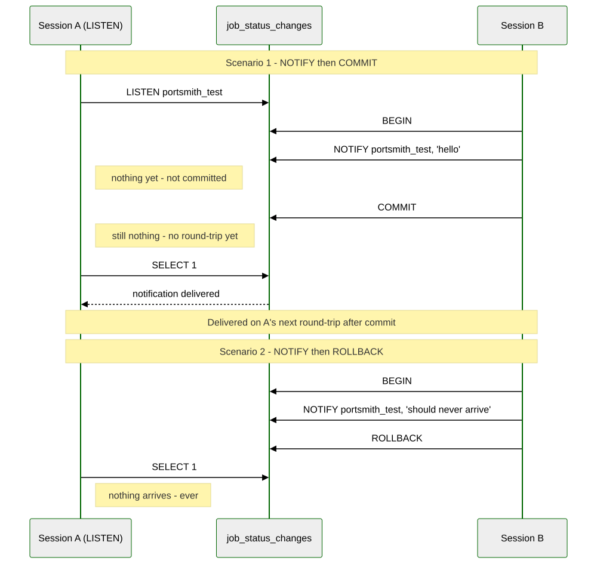

# Chapter 13 — `LISTEN`/`NOTIFY`: Database-Native Pub/Sub

> *"Polling asks 'did anything happen yet?' a thousand times a minute.
> `LISTEN` just waits to be told."*

---

## Background

The obvious way to build a dashboard that reacts to database changes is
to ask, repeatedly: `SELECT * FROM jobs WHERE status = ...`, once a
second, forever. It works, but every poll is a query the database has to
answer whether or not anything changed, and the dashboard is only ever
as fresh as its last poll — average half a polling interval stale, worst
case a whole interval. PostgreSQL has had a built-in alternative for
longer than most of its more famous features: `LISTEN` and `NOTIFY`, a
lightweight publish/subscribe system that ships inside the database
itself, no message broker required.

The shape of it is almost the whole idea: any session can run `LISTEN
channel_name` to subscribe to a named channel — just a string, nothing
has to be created or configured first. Any session — or, more usefully,
a trigger — can run `NOTIFY channel_name` (optionally with a short text
payload) to publish to it. Every session currently listening on that
channel gets the notification, asynchronously, with no polling on
anyone's part.

Three things about *when* a notification actually arrives are easy to
get wrong, so they're worth stating plainly before Exercise 1 shows them
happening:

1. **A notification is delivered only after the sending transaction
   commits.** `NOTIFY` inside a transaction that later rolls back is as
   if it never ran — nothing is sent, ever.
2. **A listening client only notices a notification is waiting the next
   time it talks to the server.** The notification arrives at the
   connection asynchronously, but most clients (including `psql`) only
   check for and display it around the next command they run — it
   doesn't interrupt whatever the client is already doing.
3. **Identical notifications collapse.** Two or more `NOTIFY` calls on
   the same channel with the exact same payload, inside the same
   transaction, are coalesced into a single delivery.

And one thing about what a notification *isn't*: it has no memory.
`NOTIFY` doesn't persist anything — if nobody is listening on a channel
the instant it fires, that notification is simply gone. That's why this
chapter builds a second, very unglamorous thing alongside the trigger: a
plain table logging every notification ever sent. `NOTIFY` says "wake up
and go look"; the log table is what a dashboard that just reconnected
looks *at* to catch up on whatever it missed while it was offline.

---

## The Scenario

Portsmith's permitting office wants a live status board for the job
queue Chapter 3 built — instead of a background process hammering
`jobs` on a timer, it should just be told the moment a permit's status
changes.

| Object                    | Source        | Purpose                                                       |
|----------------------------|----------------|------------------------------------------------------------------|
| `jobs`                     | Chapter 3      | The permit queue whose status changes this chapter reacts to      |
| `notifications`             | *(built here)* | Durable log of every notification sent — catch-up for a reconnecting dashboard |
| `notification_debounce`      | *(built here)* | Last-notified timestamp per job, so Exercise 5 can suppress noisy bursts |

Nothing new needs seeding — this chapter is entirely about reacting to
changes in data Chapter 3 already created.

---

## Exercise Goals

By the end of this chapter you will be able to:

- Send and receive a notification manually, across two sessions, and
  explain exactly when it becomes visible and why.
- Write a trigger that publishes a JSON payload on `NOTIFY` whenever a
  row's status changes.
- Subscribe from a Python 3.12 script using `psycopg`, replacing a
  polling loop with a blocking wait for the next event.
- Fan a single event stream out into multiple channels so different
  consumers can subscribe to only what they care about.
- Suppress a burst of near-duplicate notifications with a small
  debounce table.
- State `LISTEN`/`NOTIFY`'s real throughput and durability limits, and
  recognize the point past which a dedicated message broker is the
  right call instead.

---

## Installation

Nothing to install. `LISTEN` and `NOTIFY` are core SQL commands, part of
PostgreSQL since long before this book's PostgreSQL 16 baseline — no
extension, no configuration. This chapter's Python client (Exercise 3)
reuses the `psycopg` driver installed back in Chapter 1.

---

## Loading the Data

This chapter needs Chapter 3's `jobs` table:

```bash
python data/ch03_seed.py
```

### Verify the prerequisite

```sql
SELECT COUNT(*) FROM jobs;
```

```
 count
-------
    48
(1 row)
```

(48, not 45 — Chapter 10's PostgREST exercises filed three more permit
applications through the API. If you're at 45, that's fine too; nothing
in this chapter depends on the exact count.)

---

## Exercises

---

### Exercise 1 — Manual `NOTIFY`/`LISTEN`, Two Sessions

**1.1 — Subscribe in one session**

Open two `psql` sessions side by side. In **Session A**:

```sql
LISTEN portsmith_test;
```

```
LISTEN
```

Nothing else happens — `LISTEN` just registers this session's interest
in the channel and returns immediately.

**1.2 — Publish from the other**

In **Session B**:

```sql
NOTIFY portsmith_test, 'hello from session B';
```

```
NOTIFY
```

**1.3 — Back in Session A**

Switch back to Session A. Nothing has appeared yet — run any statement
to find out why:

```sql
SELECT 1;
```

```
 ?column?
----------
        1

Asynchronous notification "portsmith_test" with payload "hello from
session B" received from server process with PID 2718842.
```

The notification was sitting there the whole time, but `psql` only
surfaces it around the next command it sends — exactly the second point
from the Background section, now with a real timestamp attached to it in
the form of a PID you can watch change between runs.

**1.4 — A rolled-back `NOTIFY` never arrives**

With Session A still listening, run this in Session B:

```sql
BEGIN;
NOTIFY portsmith_test, 'should never arrive';
ROLLBACK;
```

```
BEGIN
NOTIFY
ROLLBACK
```

Back in Session A, run `SELECT 1;` again. Nothing prints — no
notification, no trace it was ever sent. `NOTIFY` inside a transaction
is exactly as durable as everything else in that transaction: commit it
or it didn't happen.

**1.5 — Identical notifications in one transaction collapse**

```sql
BEGIN;
NOTIFY portsmith_test, 'dup';
NOTIFY portsmith_test, 'dup';
NOTIFY portsmith_test, 'dup';
COMMIT;
```

Back in Session A:

```sql
SELECT 1;
```

```
Asynchronous notification "portsmith_test" with payload "dup" received
from server process with PID 2721455.
```

One delivery, not three. PostgreSQL deduplicates same-channel,
same-payload notifications within a single transaction before sending
anything — worth knowing before you assume a burst of identical
`NOTIFY`s inside one transaction will arrive as a burst on the other
end.



---

### Exercise 2 — A Trigger That `NOTIFY`s on Status Change

**2.1 — The durable log**

```sql
CREATE TABLE notifications (
    id          BIGSERIAL PRIMARY KEY,
    channel     TEXT NOT NULL,
    payload     JSONB NOT NULL,
    created_at  TIMESTAMPTZ NOT NULL DEFAULT clock_timestamp()
);
```

**2.2 — The trigger function**

```sql
CREATE OR REPLACE FUNCTION notify_job_status_change() RETURNS TRIGGER AS $$
DECLARE
    notice JSONB;
BEGIN
    IF NEW.status IS DISTINCT FROM OLD.status THEN
        notice := jsonb_build_object(
            'job_id', NEW.id,
            'job_type', NEW.job_type,
            'old_status', OLD.status,
            'new_status', NEW.status,
            'changed_at', clock_timestamp()
        );
        INSERT INTO notifications (channel, payload) VALUES ('job_status_changes', notice);
        PERFORM pg_notify('job_status_changes', notice::text);
    END IF;
    RETURN NEW;
END;
$$ LANGUAGE plpgsql;

CREATE TRIGGER trg_notify_job_status_change
AFTER UPDATE ON jobs
FOR EACH ROW
EXECUTE FUNCTION notify_job_status_change();
```

`IF NEW.status IS DISTINCT FROM OLD.status` matters as much as the
`NOTIFY` itself — without it, this trigger fires on *any* update to a
job row, including the heartbeat timestamp Chapter 3's workers write
every couple of seconds, flooding the channel with "changes" where the
status never actually moved. `pg_notify(channel, payload)` is the
function form of `NOTIFY` — it takes both arguments as ordinary
expressions, which plain `NOTIFY channel, 'literal'` syntax can't do,
and it's what makes a computed channel name possible at all (Exercise 4
depends on exactly that).

**2.3 — Trigger it**

```sql
UPDATE jobs
SET    status = 'in_progress', claimed_at = clock_timestamp(), claimed_by = 'worker-1'
WHERE  id = (SELECT id FROM jobs WHERE status = 'queued' ORDER BY id LIMIT 1);
```

A session already running `LISTEN job_status_changes;` sees, on its next
round-trip:

```
Asynchronous notification "job_status_changes" with payload
"{"job_id": 1, "job_type": "demolition_permit", "changed_at":
"2026-08-04T23:33:21.581832-04:00", "new_status": "in_progress",
"old_status": "queued"}" received from server process with PID 2734846.
```

And the durable copy is sitting in the log table regardless of whether
anyone was listening:

```sql
SELECT channel, payload, created_at FROM notifications;
```

```
       channel       |                                    payload                                     |          created_at
----------------------+----------------------------------------------------------------------------------+-------------------------------
 job_status_changes   | {"job_id": 1, "job_type": "demolition_permit", "old_status": "queued", ...}     | 2026-08-04 23:33:21.582461-04
```

---

### Exercise 3 — Subscribing from Python

**3.1 — A listener client**

```python
#!/usr/bin/env python3.12
# ch13_listen.py — Portsmith permit-status staff dashboard
import argparse
import json

import psycopg


def main() -> None:
    parser = argparse.ArgumentParser(description=__doc__)
    parser.add_argument("channels", nargs="*", default=["job_status_changes"])
    parser.add_argument("--dsn", default="dbname=portsmith")
    parser.add_argument("--timeout", type=float, default=None)
    args = parser.parse_args()

    with psycopg.connect(args.dsn, autocommit=True) as conn:
        with conn.cursor() as cur:
            for channel in args.channels:
                cur.execute(f"LISTEN {channel};")
                print(f"listening on {channel!r} …")

        try:
            for notice in conn.notifies(timeout=args.timeout):
                job = json.loads(notice.payload)
                print(
                    f"[{notice.channel}] job {job['job_id']} ({job['job_type']}): "
                    f"{job['old_status']} -> {job['new_status']}"
                )
        except KeyboardInterrupt:
            print("\nstopped.")


if __name__ == "__main__":
    main()
```

`autocommit=True` matters here — `LISTEN` needs to actually take effect
immediately rather than sit inside an open transaction waiting for a
`COMMIT` that this script has no reason to ever issue.
`conn.notifies(timeout=...)` is a generator: it blocks, doing nothing,
until a notification arrives, then yields it — no loop, no polling
interval to tune, no `SELECT` the database has to answer just to say
"nothing's changed."

**3.2 — Run it**

```bash
python data/ch13_listen.py
```

```
listening on 'job_status_changes' …
```

From a `psql` session, update another job's status. The moment that
transaction commits:

```
[job_status_changes] job 2 (demolition_permit): queued -> completed
```

No delay, no polling — the script was simply asleep until PostgreSQL had
something to tell it.

---

### Exercise 4 — Fan Out to Per-Job-Type Channels

**4.1 — One more `pg_notify` call**

Public Works doesn't want to see every `business_license` update, and
Permitting & Licensing doesn't want to see every `demolition_permit`
update. Give each job type its own channel, in addition to the
all-activity one:

```sql
CREATE OR REPLACE FUNCTION notify_job_status_change() RETURNS TRIGGER AS $$
DECLARE
    notice JSONB;
BEGIN
    IF NEW.status IS DISTINCT FROM OLD.status THEN
        notice := jsonb_build_object(
            'job_id', NEW.id,
            'job_type', NEW.job_type,
            'old_status', OLD.status,
            'new_status', NEW.status,
            'changed_at', clock_timestamp()
        );
        INSERT INTO notifications (channel, payload) VALUES ('job_status_changes', notice);
        PERFORM pg_notify('job_status_changes', notice::text);
        PERFORM pg_notify('jobs_' || NEW.job_type, notice::text);
    END IF;
    RETURN NEW;
END;
$$ LANGUAGE plpgsql;
```

`'jobs_' || NEW.job_type` builds the channel name from the row being
updated — `jobs_business_license`, `jobs_demolition_permit`, and so on,
five channels from one trigger, none of them declared or created
anywhere in advance. A channel isn't an object; it springs into
existence the instant something `LISTEN`s or `NOTIFY`s it; and stops
existing — with nothing to clean up — the instant nothing is `LISTEN`ing
on it anymore.

`CREATE OR REPLACE FUNCTION` does exactly what it says — *replace*, not
patch or extend. This is now the third time this chapter has redefined
`notify_job_status_change()` in place (Exercise 2's version, this one,
Exercise 5's version still to come), and there's nothing tracking which
version is currently live beyond whatever the last `CREATE OR REPLACE`
you ran actually said. If you go back and re-run Exercise 2's block for
any reason — double-checking something, copy-pasting the wrong snippet
— you will silently undo this one, with no error and no warning: the
fan-out channels just stop receiving anything, because the function that
used to `pg_notify` them no longer does. If a listener you expect to see
traffic suddenly goes quiet, `SELECT prosrc FROM pg_proc WHERE proname =
'notify_job_status_change'` is the fastest way to check which version is
actually installed right now.



**4.2 — Subscribe to just one**

```bash
python data/ch13_listen.py jobs_business_license
```

```
listening on 'jobs_business_license' …
```

From a `psql` session, update a `building_permit` job's status, then a
`business_license` job's status (`building_permit` is used here, rather
than the much smaller `demolition_permit` pool, because it's the
largest job type — 15 permits — and least likely to have already run
out of `queued` rows from earlier testing; if a given `UPDATE` reports
`0 rows`, that job type is simply out of queued jobs right now, and any
other `job_type` with rows left makes the same point):

```sql
UPDATE jobs SET status = 'in_progress', claimed_at = clock_timestamp(), claimed_by = 'worker-1'
WHERE  id = (SELECT id FROM jobs WHERE status = 'queued' AND job_type = 'building_permit' ORDER BY id LIMIT 1);

UPDATE jobs SET status = 'in_progress', claimed_at = clock_timestamp(), claimed_by = 'worker-1'
WHERE  id = (SELECT id FROM jobs WHERE status = 'queued' AND job_type = 'business_license' ORDER BY id LIMIT 1);
```

Only the second one shows up in the listener's output:

```
[jobs_business_license] job 5 (business_license): queued -> in_progress
```

The `building_permit` change still fired — on `job_status_changes`
and on `jobs_building_permit` — this listener simply never subscribed
to either of those channels. Fan-out costs nothing extra per additional
channel; it's just more arguments to `pg_notify`.

---

### Exercise 5 — Debounce a Noisy Job

**5.1 — The problem**

A job that flaps — fails, gets requeued, gets reclaimed, fails again,
all within a second or two — fires a fresh notification on every single
transition. A dashboard doesn't need to render all of that; it needs to
know where things ended up. Track, per job, when it was last actually
notified about:

```sql
CREATE TABLE notification_debounce (
    job_id            BIGINT PRIMARY KEY,
    last_notified_at  TIMESTAMPTZ NOT NULL
);
```

**5.2 — Check it before sending**

```sql
CREATE OR REPLACE FUNCTION notify_job_status_change() RETURNS TRIGGER AS $$
DECLARE
    notice     JSONB;
    last_sent  TIMESTAMPTZ;
BEGIN
    IF NEW.status IS DISTINCT FROM OLD.status THEN
        SELECT last_notified_at INTO last_sent
        FROM   notification_debounce WHERE job_id = NEW.id;

        IF last_sent IS NOT NULL AND clock_timestamp() - last_sent < interval '1 second' THEN
            RETURN NEW;  -- too soon after the last one for this job — skip it
        END IF;

        notice := jsonb_build_object(
            'job_id', NEW.id, 'job_type', NEW.job_type,
            'old_status', OLD.status, 'new_status', NEW.status,
            'changed_at', clock_timestamp()
        );
        INSERT INTO notifications (channel, payload) VALUES ('job_status_changes', notice);
        PERFORM pg_notify('job_status_changes', notice::text);
        PERFORM pg_notify('jobs_' || NEW.job_type, notice::text);

        INSERT INTO notification_debounce (job_id, last_notified_at)
        VALUES (NEW.id, clock_timestamp())
        ON CONFLICT (job_id) DO UPDATE SET last_notified_at = EXCLUDED.last_notified_at;
    END IF;
    RETURN NEW;
END;
$$ LANGUAGE plpgsql;
```

This is a *leading-edge* debounce: the first change in a burst fires
immediately, and anything else for that same job within the next second
is dropped — not delayed, not batched, just skipped. The status change
itself still happens; only the notification about it is suppressed.

**5.3 — Prove it**

Four status changes on the same job, each about 200ms apart — well
inside the 1-second window:

```sql
UPDATE jobs SET status = 'in_progress' WHERE id = 40;
UPDATE jobs SET status = 'failed'      WHERE id = 40;
UPDATE jobs SET status = 'queued'      WHERE id = 40;
UPDATE jobs SET status = 'in_progress' WHERE id = 40;
```

A listener on `job_status_changes` sees exactly one of the four:

```
[job_status_changes] job 40 (sign_permit): queued -> in_progress
```

```sql
SELECT * FROM notification_debounce WHERE job_id = 40;
```

```
 job_id |       last_notified_at
--------+-------------------------------
     40 |  2026-08-04 23:59:04.475819-04
```

Only one timestamp recorded — the second, third, and fourth updates all
checked it, found themselves inside the window, and returned without
touching it. Wait a full second and update the same job again: this
time it fires, because `clock_timestamp() - last_sent` has finally
crossed `interval '1 second'`.


---

### Exercise 6 — Throughput, Payload Limits, and When to Graduate

**6.1 — The payload ceiling is real, and it's not quite 8000**

```sql
SELECT pg_notify('sz', repeat('x', 7999));  -- succeeds
SELECT pg_notify('sz', repeat('x', 8000));  -- fails
```

```
ERROR:  payload string too long
```

7999 bytes is the actual limit, not the commonly quoted round 8000 —
PostgreSQL reserves one byte for a terminator inside its fixed 8000-byte
buffer. A JSON payload describing one row's status change, the way this
chapter's trigger builds one, comes nowhere close; a payload trying to
carry an entire row plus its full history would.

**6.2 — Sending is not the bottleneck**

```sql
DO $$
DECLARE
    i INT;
    start_time TIMESTAMPTZ := clock_timestamp();
BEGIN
    FOR i IN 1..10000 LOOP
        PERFORM pg_notify('throughput_test', 'msg ' || i);
    END LOOP;
    RAISE NOTICE 'Sent 10000 notifications in %', clock_timestamp() - start_time;
END $$;
```

```
NOTICE:  Sent 10000 notifications in 00:00:00.019504
```

Ten thousand notifications, under twenty milliseconds, no listener even
attached. The database can *enqueue* notifications far faster than any
realistic client can usefully consume them — sending was never going to
be where this architecture runs into trouble.

**6.3 — Where it actually runs into trouble**

The limits that matter are structural, not raw speed:

- **One shared queue per database.** Every `NOTIFY` from every session,
  on every channel, goes into the same queue. It isn't partitioned by
  channel or topic the way a real message broker's queues are — a slow
  listener anywhere is a slow listener for the whole mechanism.
- **No persistence beyond what you build yourself.** This chapter's
  `notifications` table exists precisely because `LISTEN`/`NOTIFY` has
  none on its own — a listener down for five minutes misses everything
  that happened in those five minutes, permanently, unless something
  else logged it.
- **No replay, no acknowledgment, no consumer groups.** A message
  broker lets ten workers share one queue so each message is handled
  once, or lets a new consumer join and replay history. `NOTIFY`
  broadcasts to whoever happens to be listening right now, once, with no
  concept of "did you actually process that."
- **Standbys don't get it.** A streaming replica can serve read queries,
  but `NOTIFY` traffic is a primary-only affair — nothing to `LISTEN`
  for on a read replica will ever arrive.

None of that makes `LISTEN`/`NOTIFY` the wrong tool — for exactly the
job this chapter gave it, telling an already-connected, already-trusted
internal dashboard "something changed, go look," it's close to free and
requires nothing to operate. The moment a requirement shows up that
`LISTEN`/`NOTIFY` structurally can't satisfy — guaranteed delivery
across an outage, multiple independent consumer groups, cross-database
routing, back-pressure when a consumer falls behind — that's not a
configuration problem to work around, it's the signal to bring in Kafka,
RabbitMQ, or a similar dedicated broker instead.

---

## Summary — What You Should Now Know

| Tool | What it does |
|------|---------------|
| `LISTEN channel` | Subscribe this session to a channel — created implicitly, no prior setup |
| `NOTIFY channel, 'payload'` / `pg_notify(channel, payload)` | Publish to a channel; the function form allows computed channel names and expressions |
| Delivery timing | Only after the sending transaction commits; only noticed by a client on its next round-trip |
| Same-transaction dedup | Identical channel + payload, sent more than once in one transaction, delivers exactly once |
| `conn.notifies(timeout=...)` (psycopg) | A blocking generator — no polling loop, no interval to tune |
| Computed channel names | `pg_notify('prefix_' \|\| value, ...)` fans one trigger out into many topic-scoped channels |
| A hand-built log table | The durability `LISTEN`/`NOTIFY` doesn't provide — what a reconnecting client catches up from |
| Leading-edge debounce (state table + timestamp check) | Fire the first event in a burst, suppress the rest within a window |
| 7999-byte payload ceiling | The real limit — 8000 minus a terminator byte |
| Structural limits: one shared queue, no persistence, no replay, primary-only | The reasons to graduate to a dedicated broker, not raw throughput |

**The key design insight** from this chapter is that `LISTEN`/`NOTIFY`
solves exactly one problem — telling an already-connected session that
something happened, right now, cheaply — and solves nothing else on
purpose. It has no memory, no acknowledgment, no replay, no concept of
a consumer that isn't currently connected. Every exercise past the first
one was really about compensating for that on purpose where it mattered
(the log table for durability, the debounce table for noise) and
accepting it everywhere else, because the alternative — a full message
broker — is a lot of operational weight to take on before you actually
have a problem it solves that this chapter's five-line trigger doesn't.

---

*Going further: Chapter 14's advisory locks are worth combining with
this chapter's pattern the moment more than one process might react to
the same notification — nothing about `LISTEN`/`NOTIFY` prevents two
dashboards, or two workers, from both trying to handle the same event.
Chapter 18's logical replication is a different, heavier-weight answer
to a similar-sounding question ("tell me when a row changes") — logical
replication streams the actual row changes themselves, durably, to
another database, where `NOTIFY` sends a fire-and-forget signal with an
optional short payload to whoever's listening right now; reach for
replication when the requirement is "give me the data," and
`LISTEN`/`NOTIFY` when it's "just tell me to go look." And Chapter 19's
`pg_cron` pairs naturally with this chapter's `notifications` log table:
a scheduled job that sweeps for log rows newer than a dashboard's last
checkpoint is exactly how that dashboard recovers from having been
disconnected, the catch-up path `NOTIFY` alone can never provide.*
