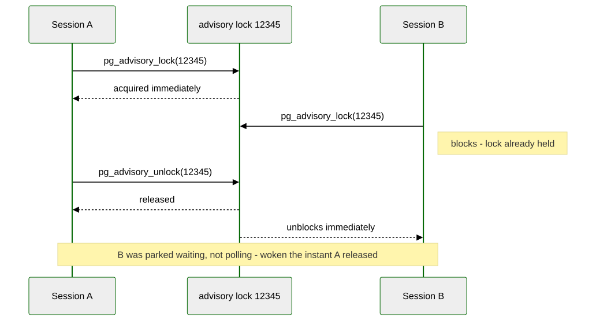
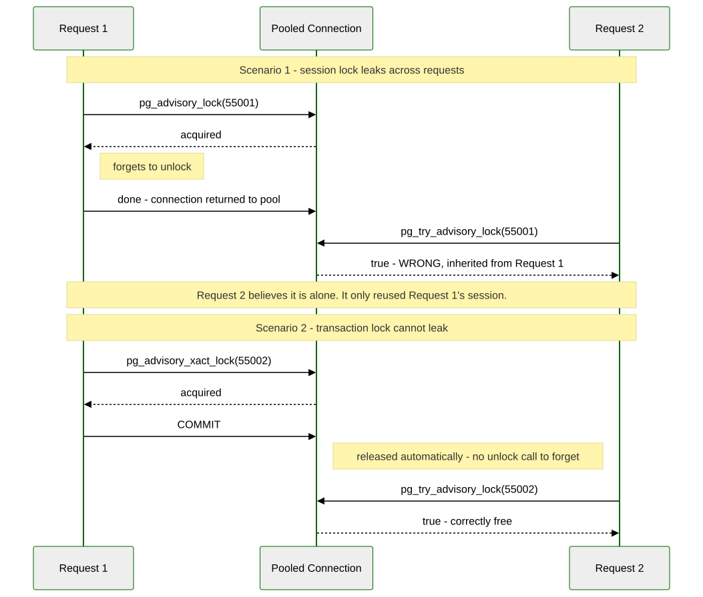

# Chapter 14 — Advisory Locks: Distributed Coordination

> *"Every lock in this book so far has been about a row. This one isn't
> about any row at all."*

---

## Background

`FOR UPDATE`, row locks, `SKIP LOCKED` — every locking mechanism this
book has used up to now exists because two transactions were reaching
for the *same data*. But plenty of real coordination problems have
nothing to do with a specific row: "only one process should run the
nightly reconciliation job, whichever one gets there first," "elect a
single leader among five identical workers," "make sure nobody else is
already doing this whole category of work right now." There's no row to
lock for any of that — the thing you need to coordinate around is an
idea, not a record.

An **advisory lock** is PostgreSQL's answer: a lock on a plain integer
you invent, with no connection to any table, row, or piece of data
whatsoever. You pick the number; PostgreSQL just remembers who's holding
it and makes everyone else wait or ask. It's called "advisory" because
nothing enforces that anyone respects it — unlike a row lock, which
`UPDATE` and `DELETE` are physically bound by, an advisory lock only
means anything to code that deliberately checks it. That's a feature,
not a compromise: it's a general-purpose coordination primitive riding
on a database your whole system probably already talks to, instead of
standing up ZooKeeper or etcd just to answer "am I allowed to do this
right now."

Two choices you make every time you reach for one:

- **How long should it live?** `pg_advisory_lock()` / `pg_advisory_unlock()`
  are **session-level** — held until you explicitly unlock, or your
  connection closes, whichever comes first. `pg_advisory_xact_lock()` is
  **transaction-level** — released automatically at `COMMIT` or
  `ROLLBACK`, with no unlock function to call and no way to release it
  early. Exercise 6 is entirely about a bug that only one of these two
  is actually safe against.
- **Should it wait, or just tell you?** The plain `pg_advisory_lock()`
  blocks until the lock is free. `pg_try_advisory_lock()` returns
  immediately either way — `true` if it got the lock, `false` if someone
  else already holds it — which is what makes "is anyone else already
  doing this?" a single non-blocking query instead of a hang.

One more thing worth knowing before Exercise 1: like Chapter 13's
`NOTIFY`, advisory locks are a primary-only affair. They live in shared
memory on whichever server you're connected to, aren't written to WAL,
and have no meaning at all on a streaming replica.

---

## The Scenario

No new tables this chapter — it reuses Chapter 3's `jobs` queue and
coordinates *processes* around it instead of adding data.

| Object                     | Source        | Purpose                                                       |
|------------------------------|----------------|--------------------------------------------------------------|
| `jobs`                        | Chapter 3      | The permit queue Exercise 4's critical section guards         |
| `data/ch14_leader_election.py` | *(built here)* | N simulated worker processes racing for one advisory lock     |

---

## Exercise Goals

By the end of this chapter you will be able to:

- Acquire and release a session-level advisory lock, and watch a second
  session block on the exact same key until the first releases it.
- Use `pg_try_advisory_lock()` to ask "is anyone else already doing
  this?" without waiting for an answer.
- Implement leader election: N processes race for one lock, exactly one
  wins.
- Wrap a transaction-level advisory lock around a critical section that
  row-level locking alone can't express.
- Read `pg_locks` to see exactly which session holds which advisory
  lock, and for how long.
- Explain why session-level advisory locks are dangerous behind a
  connection pool, and which lock type avoids the problem entirely.

---

## Installation

Nothing to install. Advisory locks are a core PostgreSQL feature — no
extension, no configuration.

---

## Loading the Data

This chapter needs Chapter 3's `jobs` table:

```bash
python data/ch03_seed.py
```

```sql
SELECT COUNT(*) FROM jobs;
```

```
 count
-------
    48
```

---

## Exercises

---

### Exercise 1 — Acquire, Block, Release

**1.1 — Session A takes the lock**

Open two `psql` sessions. In **Session A**, pick an arbitrary key and
lock it:

```sql
SELECT pg_advisory_lock(12345);
```

```
 pg_advisory_lock
------------------

(1 row)
```

Returns immediately — nobody else holds `12345` yet. `12345` is not a
row id, a job id, or a reference to anything; it's just a number this
chapter picked, and every session that agrees to use it for the same
purpose is now coordinating through it.

**1.2 — Session B reaches for the same key**

In **Session B**:

```sql
SELECT pg_advisory_lock(12345);
```

Nothing comes back. The session just hangs — this is a real block, the
same shape as waiting on a row lock, except there's no row anywhere
involved.


**1.3 — Session A releases it**

Back in Session A:

```sql
SELECT pg_advisory_unlock(12345);
```

```
 pg_advisory_unlock
--------------------
 t
```

The instant this runs, Session B's blocked query finally returns:

```
 pg_advisory_lock
------------------

(1 row)
```

Session B wasn't retrying, polling, or checking back — it was
genuinely parked, waiting, and PostgreSQL woke it the moment the lock
freed up. (Session B is now holding `12345` itself; run
`pg_advisory_unlock(12345)` there before moving on.)



---

### Exercise 2 — `pg_try_advisory_lock()`: Ask, Don't Wait

**2.1 — The non-blocking version**

With Session A still holding `pg_advisory_lock(12345)`, run this in
Session B instead of the blocking form:

```sql
SELECT pg_try_advisory_lock(12345);
```

```
 pg_try_advisory_lock
-----------------------
 f
(1 row)

Time: 0.029 ms
```

`false`, back in under a millisecond — no wait, no hang. `false` means
exactly one thing: *someone* currently holds this key. `true` would mean
the lock is now held by you.

**2.2 — Why this matters more than it looks**

This single call is the entire mechanism behind "don't start a second
copy of this job if one's already running." A nightly batch job, a
scheduled report, a background sweep — anything that must never run
twice at once starts with exactly this check: try the lock, and if you
don't get it, exit immediately instead of doing the work. No polling
table, no separate "is this running" flag to keep in sync with reality;
the lock *is* the flag, and PostgreSQL can never let it lie about
whether it's held.

---

### Exercise 3 — Leader Election

**3.1 — Five workers, one leader**

```python
#!/usr/bin/env python3.12
# ch14_leader_election.py
import multiprocessing
import sys
import time

import psycopg

LEADER_LOCK_KEY = 99001


def worker(worker_id: int, dsn: str) -> None:
    with psycopg.connect(dsn, autocommit=True) as conn:
        with conn.cursor() as cur:
            cur.execute("SELECT pg_try_advisory_lock(%s)", (LEADER_LOCK_KEY,))
            (got_lock,) = cur.fetchone()

            if got_lock:
                print(f"[worker-{worker_id}] elected leader — starting work")
                time.sleep(1.5)
                print(f"[worker-{worker_id}] leader work done, releasing")
                cur.execute("SELECT pg_advisory_unlock(%s)", (LEADER_LOCK_KEY,))
            else:
                print(f"[worker-{worker_id}] lost the race — standing by")


def main() -> None:
    n_workers = int(sys.argv[1]) if len(sys.argv) > 1 else 5
    dsn = sys.argv[2] if len(sys.argv) > 2 else "dbname=portsmith"
    procs = [multiprocessing.Process(target=worker, args=(i, dsn)) for i in range(1, n_workers + 1)]
    for p in procs:
        p.start()
    for p in procs:
        p.join()


if __name__ == "__main__":
    main()
```

**3.2 — Run it**

```bash
python data/ch14_leader_election.py 5
```

```
[worker-2] lost the race — standing by
[worker-3] lost the race — standing by
[worker-4] lost the race — standing by
[worker-5] lost the race — standing by
[worker-1] elected leader — starting work
[worker-1] leader work done, releasing
```

Every one of the five processes hits `pg_try_advisory_lock` within
microseconds of each other — genuinely racing, not taking turns — and
exactly one gets `true`. Which worker wins is not deterministic; run it
again and a different number will win. What's guaranteed isn't *who*
becomes leader, only that there's never more than one at a time. That
one guarantee is the entire value of leader election: five identical,
uncoordinated processes, and PostgreSQL — not any of them — is the
single source of truth for which one is in charge.


---

### Exercise 4 — A Transaction-Level Lock Around a Critical Section

**4.1 — A rule `SKIP LOCKED` can't express**

Chapter 3's `FOR UPDATE SKIP LOCKED` lets many workers claim many
different `jobs` rows at once, on purpose — that's the whole point of
it. But suppose Portsmith has exactly one building inspector, and city
policy says only one `demolition_permit` can be under active
inspection at a time, no matter how many workers are running or how
many different demolition jobs are sitting in the queue. Row locking
can't express "only one of *this category*, regardless of which
specific row" — that's not a fact about any one row, it's a fact about
all of them together. This is exactly what an advisory lock, scoped to
the job type rather than any job id, is for:

```sql
SELECT hashtext('demolition_permit');
```

```
   hashtext
--------------
 -1799557343
```

`hashtext()` turns an arbitrary string into a well-distributed integer
— a convenient way to get a lock key out of a category name without
maintaining a lookup table mapping job types to key numbers by hand.

**4.2 — Wrap the claim in it**

```sql
BEGIN;
SELECT pg_advisory_xact_lock(hashtext('demolition_permit'));
-- ... claim and begin working a demolition_permit job here ...
COMMIT;
```

**4.3 — Prove it serializes, even across different rows**

The claim to check: two workers, claiming two *different*
`demolition_permit` jobs — nothing in common at the row level — should
still be forced to run one at a time, because the lock is scoped to the
category, not to either row. Open two `psql` sessions again (same as
Exercise 1) to watch it happen.

In **Session A**, run these three statements one at a time, stopping
after the third — do not run `COMMIT` yet:

```sql
BEGIN;
SELECT pg_advisory_xact_lock(hashtext('demolition_permit'));
SELECT 'worker A: claimed job 1, inspecting site...' AS status;
```

```
 pg_advisory_xact_lock
------------------------

(1 row)

                   status
---------------------------------------------
 worker A: claimed job 1, inspecting site...
(1 row)
```

Both statements return immediately — Session A now holds the lock, and
its transaction is deliberately left open (no `COMMIT` yet) to simulate
a worker still in the middle of an inspection.

Now switch to **Session B** and run this — a *different* job, same
`demolition_permit` category:

```sql
BEGIN;
SELECT pg_advisory_xact_lock(hashtext('demolition_permit'));
SELECT 'worker B: got past the lock' AS status;
COMMIT;
```

Session B hangs after `BEGIN` — the `pg_advisory_xact_lock` call blocks,
and the `status` row never prints. Go back to **Session A** and finally
run:

```sql
COMMIT;
```

The instant Session A's transaction ends, Session B unblocks on its own
and finishes, printing `worker B: got past the lock` followed by its own
`COMMIT`. The lock released automatically the moment Session A's
transaction closed — nothing had to explicitly unlock it. Two entirely
different job ids, no row either session touched in common, and they
were still fully serialized — because the thing being protected was
never a row to begin with.

---

### Exercise 5 — Reading `pg_locks`

**5.1 — The raw view**

With a session holding `pg_advisory_lock(12345)` open elsewhere:

```sql
SELECT locktype, ((classid::bigint << 32) | objid::bigint) AS lock_key,
       mode, granted, pid
FROM   pg_locks
WHERE  locktype = 'advisory';
```

```
 locktype | lock_key |     mode      | granted |   pid
----------+----------+---------------+---------+---------
 advisory |    12345 | ExclusiveLock | t       | 2998844
(1 row)
```

Advisory locks show up in `pg_locks` exactly like row and table locks
do — same catalog, same columns — except `locktype = 'advisory'` and
the "thing being locked" is just a number PostgreSQL reconstructs from
`classid` and `objid` rather than a row identifier. That bit-shift
reassembles the single `bigint` key this chapter has been passing to
`pg_advisory_lock()` — session-level advisory locks internally split a
64-bit key across those two 32-bit catalog columns.

**5.2 — A real diagnostic query**

Raw `pg_locks` never tells you *who* or *why*. Join it to
`pg_stat_activity` for a query worth keeping around:

```sql
SELECT l.pid,
       ((l.classid::bigint << 32) | l.objid::bigint) AS lock_key,
       l.mode, l.granted,
       a.usename, a.application_name,
       now() - a.state_change AS held_for,
       a.query AS last_query
FROM   pg_locks l
JOIN   pg_stat_activity a ON a.pid = l.pid
WHERE  l.locktype = 'advisory';
```

```
   pid   | lock_key |     mode      | granted | usename | application_name |    held_for    |           last_query
---------+----------+---------------+---------+---------+-------------------+-----------------+----------------------------------
 2999823 |    12345 | ExclusiveLock | t       | chris   | psql              | 00:00:00.53227  | SELECT pg_advisory_lock(12345);
(1 row)
```

`held_for` is the question that actually matters in production: a lock
held for 30 milliseconds is a Tuesday; a lock held for 6 hours because
some process crashed without releasing it is an incident. This query is
exactly what you'd point a monitoring check at.

---

### Exercise 6 — The Connection-Pool Pitfall

**6.1 — Session locks assume "session" means what you think it means**

`pg_advisory_lock()`'s session-level lifetime is a promise: the lock
lives exactly as long as your database connection does. That promise
quietly breaks the moment a connection pool sits between your
application and PostgreSQL, because a pooled connection's *physical*
lifetime and any one request's *logical* lifetime are no longer the
same thing. Simulate it directly — one physical connection, reused
across two completely unrelated pieces of work, the way a pool would
hand it out twice:

```python
import psycopg

POOL_KEY = 55001
pooled_conn = psycopg.connect("dbname=portsmith", autocommit=True)

# --- "Request 1": nightly reconciliation job start ---
with pooled_conn.cursor() as cur:
    cur.execute("SELECT pg_advisory_lock(%s)", (POOL_KEY,))
    print("[request 1] acquired session lock", POOL_KEY)
    # BUG: request 1 finishes (or crashes) without calling pg_advisory_unlock.

print("[request 1] done — connection returned to pool (lock still held!)")

# --- "Request 2": unrelated request, later, same physical connection ---
with pooled_conn.cursor() as cur:
    cur.execute("SELECT pg_try_advisory_lock(%s)", (POOL_KEY,))
    (got_lock,) = cur.fetchone()
    print(f"[request 2] pg_try_advisory_lock({POOL_KEY}) -> {got_lock}")
```

```
[request 1] acquired session lock 55001
[request 1] done — connection returned to pool (lock still held!)
[request 2] pg_try_advisory_lock(55001) -> True  (same physical session as request 1!)
```

Request 2 gets `True` and has every reason to believe it's the
exclusive holder of key `55001` — leader, singleton, whatever that key
was supposed to mean — and it's completely wrong. PostgreSQL sees one
session that already held the lock asking for it again, which is
trivially `true` by definition; it has no way to know "request 1" and
"request 2" were ever meant to be different things. This is the bug the
guide warns about, and it is exactly as dangerous as it sounds: two
unrelated requests, coordinating through a lock that was never really
shared between them, both convinced they're safe.

**6.2 — The fix: use the lock type that can't leak**

```python
import psycopg

POOL_KEY = 55002
pooled_conn = psycopg.connect("dbname=portsmith")  # autocommit off

# --- "Request 1", transaction-scoped this time ---
with pooled_conn.cursor() as cur:
    cur.execute("SELECT pg_advisory_xact_lock(%s)", (POOL_KEY,))
    print("[request 1] acquired xact lock", POOL_KEY)
pooled_conn.commit()  # released here, no matter what request 1 does or forgets
print("[request 1] committed — lock released automatically")

# --- "Request 2", same pooled connection ---
with pooled_conn.cursor() as cur:
    cur.execute("SELECT pg_try_advisory_lock(%s)", (POOL_KEY,))
    (got_lock,) = cur.fetchone()
    print(f"[request 2] pg_try_advisory_lock({POOL_KEY}) -> {got_lock}  (correctly free)")
```

```
[request 1] acquired xact lock 55002
[request 1] committed — lock released automatically
[request 2] pg_try_advisory_lock(55002) -> True  (correctly free)
```

Same reused connection, same shape of bug waiting to happen — but this
time `request 2`'s `true` is *correct*, because `pg_advisory_xact_lock`
physically cannot survive past `COMMIT`. There's no unlock call to
forget, no code path where an exception skips the cleanup, because
there's no cleanup step at all: the transaction boundary *is* the
release. **The rule this exercise earns**: reach for
`pg_advisory_xact_lock()`, not `pg_advisory_lock()`, for anything that
might ever run behind a connection pool — which, in most modern
application deployments, is close to everything.



---

## Summary — What You Should Now Know

| Tool | What it does |
|------|---------------|
| `pg_advisory_lock(key)` / `pg_advisory_unlock(key)` | Session-level lock — held until explicitly released or the connection closes |
| `pg_advisory_xact_lock(key)` | Transaction-level lock — released automatically at `COMMIT`/`ROLLBACK`, no unlock function exists |
| `pg_try_advisory_lock(key)` | Non-blocking — `true`/`false` immediately instead of waiting |
| `hashtext('a category name')` | Turn an arbitrary string into a lock key without a lookup table |
| Leader election pattern | N processes `pg_try_advisory_lock` the same key; exactly one gets `true` |
| Critical-section pattern | `pg_advisory_xact_lock` around a category-wide rule row locking can't express |
| `pg_locks WHERE locktype = 'advisory'` | See every held advisory lock, joined to `pg_stat_activity` for who/how long |
| Connection-pool pitfall | A session lock can leak across unrelated pooled requests; a transaction lock structurally cannot |

**The key design insight** from this chapter is that advisory locks
trade specificity for reach: a row lock only ever means "this row," but
an advisory lock can mean anything at all, because the number means
whatever your application agrees it means. That flexibility is also the
whole risk — nothing stops two unrelated parts of a codebase from
picking the same integer by accident, and nothing stops a session-level
lock from outliving the logical operation it was meant to protect the
instant a connection pool gets involved. Every exercise past the first
two was really about earning back the specificity a row lock gets for
free: naming a category clearly (`hashtext`), choosing a lifetime that
matches the actual unit of work (transaction, not session), and knowing
how to ask PostgreSQL, out loud, exactly who's holding what.

---

*Going further: Chapter 19's `pg_cron` is where the singleton-job
pattern from Exercise 2 stops being a hypothetical — a scheduled job
that might occasionally overlap its own next run is the textbook case
for wrapping the job body in `pg_try_advisory_lock` and exiting quietly
if it doesn't get it. Chapter 13's `NOTIFY` and this chapter's advisory
locks share the same primary-only limitation, and for the same
underlying reason: both live in server-local memory rather than WAL, so
neither one is a tool for coordinating across a primary and its
replicas — that requires the data itself to be replicated, which is
Chapter 18's subject. And it's worth holding onto the contrast with
Chapter 3 explicitly: `FOR UPDATE SKIP LOCKED` coordinates access to
*rows that exist*; advisory locks coordinate *processes*, around ideas
that were never going to have a row of their own no matter how the
schema was designed.*
