# Chapter 15 — Custom Types, Domains, and Enums

> *"A `CHECK` constraint says 'reject this if it's wrong.' A type says
> 'wrong isn't a value this column can even hold.'"*

---

## Background

Every table in this book so far has leaned on `CHECK` constraints and
plain base types — `TEXT`, `INTEGER`, `JSONB` — to keep bad data out.
That works, but it puts the rule *next to* the column rather than *in*
it: `jobs.status` has always been a `TEXT` column that happens to carry
a `CHECK (status IN (...))` alongside it, and nothing about the column's
own type tells you that. PostgreSQL's type system lets you go one level
deeper and make the rule part of the type itself.

Three tools, three different jobs:

- **Enums** (`CREATE TYPE ... AS ENUM (...)`) replace "a `TEXT` column
  with a `CHECK` list" with a real type that can *only* hold one of a
  fixed set of labels. The database rejects anything else the moment
  you try to store it — not as a constraint violation, but as a type
  error, the same category of rejection as trying to put text in an
  integer column.
- **Domains** (`CREATE DOMAIN ... AS base_type CHECK (...)`) attach a
  constraint to an *existing* type and give the result a name — a
  `positive_integer` is still an `INTEGER` underneath, but any column
  declared with that domain inherits the check automatically, once,
  instead of you retyping the same `CHECK` clause on every column that
  needs it.
- **Composite types** (`CREATE TYPE ... AS (...)`) bundle several named
  fields into one type, the way a table's row type already works,
  except you can use it as the type of a single *column* — a
  `contact_info` value is one column that internally holds a phone
  number, a postcode, and a preferred contact method together.

All three live in the database's own catalog, which means every tool
that talks to PostgreSQL can discover them — a psycopg client, a
PostgREST endpoint, even `psql`'s own `\d` output — without you writing
a line of validation logic anywhere outside the schema. Exercise 6 is
where that pays off directly.


---

## The Scenario

This chapter adds typed columns to three tables already in the book,
rather than any new ones:

| Table          | New column                    | Type                                     |
|------------------|--------------------------------|---------------------------------------------|
| `jobs` (Ch3)      | `status` *(converted in place)* | `job_status` enum                            |
| `businesses` (Ch1) | `employee_count`               | `positive_integer` domain                    |
| `residents` (Ch5)  | `contact`                      | `contact_info` composite (embeds a `uk_postcode` domain) |
| `residents` (Ch5)  | `email`                        | `email_address` domain                        |

`jobs.status` already existed as `TEXT` with a `CHECK` constraint —
Exercise 1 converts it to a real enum in place, which turns out to be
more interesting than it sounds, because Chapter 10's `api.jobs` view is
still sitting on top of it.

---

## Exercise Goals

By the end of this chapter you will be able to:

- Convert an existing `CHECK`-constrained `TEXT` column into a proper
  `ENUM`, and know every kind of object that can block that conversion
  before it actually works.
- Add a new value to an existing enum, control exactly where it sorts,
  and explain why you can't use a value you just added in the same
  transaction that added it.
- Create a domain and watch PostgreSQL enforce its constraint on every
  column that uses it, everywhere, automatically.
- Build a composite type, store it in a column, and query its
  individual fields.
- Enforce a text format — a postcode, an email address — with a domain
  built on a regular expression `CHECK`.
- See enum values reflected automatically into a Python client and a
  PostgREST API, with no hand-written validation on either side.

---

## Installation

Nothing to install. `CREATE TYPE`, `CREATE DOMAIN`, and enums are all
core SQL, no extension required. Exercise 6 reuses `psycopg` (Chapter 1)
and, optionally, PostgREST (Chapter 10) if you still have it configured.

---

## Loading the Data

This chapter needs Chapters 1, 3, and 5's data:

```bash
python data/ch01_seed.py   # businesses
python data/ch03_seed.py   # jobs
python data/ch05_seed.py   # residents
```

```sql
SELECT 'businesses' AS table, COUNT(*) FROM businesses
UNION ALL SELECT 'jobs', COUNT(*) FROM jobs
UNION ALL SELECT 'residents', COUNT(*) FROM residents;
```

```
     table    | count
---------------+-------
 businesses    |    48
 jobs          |    48
 residents     |    58
```

---

## Exercises

---

### Exercise 1 — Converting `TEXT` + `CHECK` Into a Real Enum

**1.1 — Define the type**

```sql
CREATE TYPE job_status AS ENUM ('queued', 'in_progress', 'completed', 'failed');
```

This creates the type — it doesn't touch `jobs` yet. `jobs.status` is
still `TEXT`, still governed by the original `CHECK` constraint from
Chapter 3.

**1.2 — Three things that block the conversion, in the order you'll hit them**

The obvious next move —
`ALTER TABLE jobs ALTER COLUMN status TYPE job_status USING status::job_status;`
— fails, and it fails for three separate reasons if you fix them one at
a time instead of all at once. Each is worth seeing for real, because
each is a genuinely common shape of dependency in any schema that's
been alive for more than one chapter:

**Blocker 1 — the column's own default:**

```
ERROR:  default for column "status" cannot be cast automatically to type job_status
```

`status DEFAULT 'queued'` was set while the column was `TEXT`; the
default expression has to be dropped before the column type can change,
and re-added afterward.

**Blocker 2 — a dependent view:**

```
ERROR:  cannot alter type of a column used by a view or rule
DETAIL:  rule _RETURN on view api.jobs depends on column "status"
```

Chapter 10's `api.jobs` view selects `status` directly. PostgreSQL
won't silently change a column's type out from under a view built on
top of it — the view has to be dropped and recreated around the change.
This is exactly the kind of cross-chapter dependency a real production
schema accumulates constantly, and exactly why this exercise is worth
doing on the actual multi-chapter database instead of a clean scratch
table.

**Blocker 3 — a dependent partial index:**

```
ERROR:  operator does not exist: job_status = text
HINT:  No operator matches the given name and argument types.
```

`idx_jobs_claim_order` (Chapter 3) is a partial index with
`WHERE status = 'queued'` baked into it. Once `status` is no longer
`TEXT`, PostgreSQL has to rebuild that stored predicate — and a bare
`job_status = text` comparison doesn't exist as an operator; enums don't
implicitly compare against a different type the way a literal
implicitly resolves against a column of a known type. This index has to
be dropped and rebuilt too.



**1.3 — The full sequence, correctly ordered, in one transaction**

Run this as `postgres`, not your regular login role —
`sudo -u postgres psql portsmith`. `api.jobs` is owned by `postgres`
(it was created from that same role back in Chapter 10, Exercise 1.1),
and a normal login role typically has no `USAGE` on the `api` schema at
all, let alone ownership of the view sitting in it. Trying to run this
as your own role fails immediately with `permission denied for schema
api` before it ever gets near the actual type conversion:

```sql
BEGIN;

DROP VIEW IF EXISTS api.jobs;
DROP INDEX IF EXISTS idx_jobs_claim_order;

ALTER TABLE jobs ALTER COLUMN status DROP DEFAULT;
ALTER TABLE jobs DROP CONSTRAINT IF EXISTS jobs_status_check;
ALTER TABLE jobs ALTER COLUMN status TYPE job_status USING status::job_status;
ALTER TABLE jobs ALTER COLUMN status SET DEFAULT 'queued'::job_status;

CREATE INDEX IF NOT EXISTS idx_jobs_claim_order
    ON jobs (priority, created_at, id)
    WHERE status = 'queued';

CREATE VIEW api.jobs AS
SELECT id, job_type, payload, priority, status, created_at
FROM   jobs;

GRANT SELECT ON api.jobs TO web_anon;
GRANT INSERT (job_type, payload, priority) ON api.jobs TO web_anon;

COMMIT;
```

Wrapping the whole thing in `BEGIN`/`COMMIT` matters here specifically
because `psql`'s non-interactive `-f` mode does *not* wrap a script in
one implicit transaction the way a `-c "stmt1; stmt2;"` invocation
does — without the explicit `BEGIN`, a failure partway through a script
like this one leaves the schema in whatever half-converted state the
successful statements got it to, which is exactly what happened during
this chapter's own testing before the transaction wrapper was added.

The `IF EXISTS`/`IF NOT EXISTS` on every `DROP`/`CREATE` above earn
their keep for the same reason: because the whole block is one
transaction, any single failure aborts everything in it, including
statements that already succeeded — so if this script is ever run a
second time (after an earlier run partially failed, or simply to
double-check the result), the objects from a *previous successful* run
are still sitting there. Without `IF EXISTS`, a re-run's `DROP
CONSTRAINT jobs_status_check` would error with "constraint ... does not
exist" the moment `status` is already a `job_status`, aborting the
whole transaction over nothing actually wrong. With it, this script is
safe to run again at any point — fully unconverted, partially
converted, or already done — and either converges to the same end
state or changes nothing at all.

**1.4 — Confirm it, and confirm the rejection**

```sql
\d jobs
```

```
 status | job_status | | not null | 'queued'::job_status
...
Indexes:
    "idx_jobs_claim_order" btree (priority, created_at, id) WHERE status = 'queued'::job_status
```

```sql
UPDATE jobs SET status = 'archived_forever' WHERE id = 1;
```

```
ERROR:  invalid input value for enum job_status: "archived_forever"
```

(Deliberately not `'cancelled'` here — Exercise 2 is about to make that
one a real value, and if you're re-running this exercise on a database
that's already been through Exercise 2, `'cancelled'` would no longer
be rejected. `'archived_forever'` is never added anywhere in this
chapter, so this check stays valid no matter what order you run things
in or how many times you re-run it.)

Compare this to Chapter 3's original `CHECK` violation message — same
outcome, a rejected write, but a completely different category of
error. `'archived_forever'` isn't *disallowed*, from PostgreSQL's point
of view; it simply isn't a `job_status` at all, the same way `'abc'`
isn't an `INTEGER`.

---

### Exercise 2 — Adding a Value: Ordering and Transaction Rules

**2.1 — Add a value**

```sql
ALTER TYPE job_status ADD VALUE 'cancelled';
SELECT enum_range(NULL::job_status);
```

```
                   enum_range
---------------------------------------------------
 {queued,in_progress,completed,failed,cancelled}
```

New values are appended at the end by default. `enum_range` returns
every label in the type's actual sort order — enums order by
*declaration position*, not alphabetically, which is why `'cancelled'`
sorts after `'failed'` here despite the alphabet disagreeing.

**2.2 — Control exactly where it lands**

```sql
ALTER TYPE job_status ADD VALUE 'on_hold' BEFORE 'in_progress';
SELECT enum_range(NULL::job_status);
```

```
                       enum_range
---------------------------------------------------------
 {queued,on_hold,in_progress,completed,failed,cancelled}
```

`BEFORE`/`AFTER` exist precisely because append-only ordering isn't
always what you want — `'on_hold'` belongs conceptually between
`queued` and `in_progress`, and now it sorts there too, which matters
anywhere this column gets used in an `ORDER BY`.

**2.3 — The rule that catches almost everyone once**

```sql
BEGIN;
ALTER TYPE job_status ADD VALUE 'archived';
UPDATE jobs SET status = 'archived' WHERE id = 1;
COMMIT;
```

```
ERROR:  unsafe use of new value "archived" of enum type job_status
HINT:  New enum values must be committed before they can be used.
```

`ADD VALUE` is allowed inside a transaction block — that restriction
was lifted back in PostgreSQL 12 — but the new label still can't be
*used* until the transaction that added it actually commits. PostgreSQL
can't yet guarantee the value will still exist if this transaction rolls
back, so it refuses to let anything reference it in the meantime. (This
transaction did roll back here, which is exactly why `'archived'`
doesn't appear in 2.2's output above — the `ADD VALUE` itself is fully
transactional too.) Add the value and use it in two separate
transactions, and this is a non-issue.

---

### Exercise 3 — A `positive_integer` Domain

**3.1 — Define it once, use it anywhere**

```sql
CREATE DOMAIN positive_integer AS INTEGER CHECK (VALUE > 0);
ALTER TABLE businesses ADD COLUMN employee_count positive_integer;
```

`VALUE` inside a domain's `CHECK` refers to whatever's being validated
— the same role `NEW.column` plays in a trigger, just scoped to a
single value instead of a whole row.

**3.2 — It enforces itself, everywhere, immediately**

```sql
UPDATE businesses SET employee_count = 12 WHERE name = 'The Gilded Clam';
```

```
UPDATE 1
```

```sql
UPDATE businesses SET employee_count = -5 WHERE name = 'Anchor & Oar Tavern';
```

```
ERROR:  value for domain positive_integer violates check constraint "positive_integer_check"
```

```sql
UPDATE businesses SET employee_count = 0 WHERE name = 'Anchor & Oar Tavern';
```

```
ERROR:  value for domain positive_integer violates check constraint "positive_integer_check"
```

Zero fails too — `> 0`, not `>= 0`, meant exactly what it said. Every
future column ever declared `positive_integer` gets this exact rule for
free, with no `CHECK` clause to remember to copy.

---

### Exercise 4 — A `contact_info` Composite Type

**4.1 — A domain nested inside a composite type**

Portsmith's real-world namesake, Portsmouth, England, has postcodes
starting with "PO" — worth getting right rather than reaching for a
generic example:

```sql
CREATE DOMAIN uk_postcode AS TEXT
    CHECK (VALUE ~ '^[A-Z]{1,2}[0-9][A-Z0-9]? [0-9][A-Z]{2}$');

CREATE TYPE contact_info AS (
    phone             TEXT,
    postcode          uk_postcode,
    preferred_contact TEXT
);

ALTER TABLE residents ADD COLUMN contact contact_info;
```

A composite type's fields aren't limited to base types — `postcode`
here is a full domain, constraint included, nested one level inside
another type. Validation composes the same way the types do.

**4.2 — Store and query it**

```sql
UPDATE residents
SET    contact = ROW('023 9281 4477', 'PO1 3AX', 'phone')::contact_info
WHERE  full_name = 'Adrian Foscolo';
```

```sql
SELECT full_name, (contact).phone, (contact).postcode
FROM   residents
WHERE  full_name = 'Adrian Foscolo';
```

```
    full_name    |     phone     | postcode
------------------+---------------+----------
 Adrian Foscolo   | 023 9281 4477 | PO1 3AX
```

`(contact).phone` — the parentheses are required; without them,
`contact.phone` parses as "column `phone` of table `contact`," not
"field `phone` of column `contact`." One column, `\d residents` shows
one `contact_info` entry, but it carries three named, individually
queryable fields.

**4.3 — The nested domain still enforces itself**

```sql
UPDATE residents
SET    contact = ROW('023 9281 0000', 'NOTVALID', 'email')::contact_info
WHERE  full_name = 'Marisol Quintero';
```

```
ERROR:  value for domain uk_postcode violates check constraint "uk_postcode_check"
```

The `CHECK` fires from two levels down — PostgreSQL validates every
domain-typed field of a composite value the same way it would validate
a plain column, whether or not that field happens to be buried inside
something else on its way into the table.

---

### Exercise 5 — An Email Domain

**5.1 — A dedicated, standalone domain**

```sql
CREATE DOMAIN email_address AS TEXT
    CHECK (VALUE ~ '^[A-Za-z0-9._%+-]+@[A-Za-z0-9.-]+\.[A-Za-z]{2,}$');

ALTER TABLE residents ADD COLUMN email email_address;
```

**5.2 — Two different ways to fail**

```sql
UPDATE residents SET email = 'adrian.foscolo@example.com' WHERE full_name = 'Adrian Foscolo';
```

```
UPDATE 1
```

```sql
UPDATE residents SET email = 'not-an-email' WHERE full_name = 'Marisol Quintero';
```

```
ERROR:  value for domain email_address violates check constraint "email_address_check"
```

```sql
UPDATE residents SET email = 'someone@localhost' WHERE full_name = 'Marisol Quintero';
```

```
ERROR:  value for domain email_address violates check constraint "email_address_check"
```

`'someone@localhost'` is a technically-valid email address by the
actual internet standard — real mail servers accept it — and this
regex still rejects it, because it has no `.`-separated top-level
domain. Every regex-based domain like this one is a deliberate,
imperfect trade: strict enough to catch obvious garbage, permissive
enough not to reject real addresses your business actually needs, and
never a substitute for verifying an address by actually sending mail to
it.

---

### Exercise 6 — Automatic Reflection

**6.1 — `psycopg`, by default**

```python
import psycopg

with psycopg.connect("dbname=portsmith") as conn:
    with conn.cursor() as cur:
        cur.execute("SELECT id, status FROM jobs WHERE id = 1;")
        row = cur.fetchone()
        print(f"value: {row[1]!r}")
        print(f"python type: {type(row[1])}")
```

```
value: 'in_progress'
python type: <class 'str'>
```

No configuration, no registration — an enum column just arrives as a
plain Python string, because PostgreSQL's own wire protocol already
tells the driver "this value is text-shaped," and `psycopg` doesn't
need to know anything about `job_status` specifically to hand it back
correctly.

**6.2 — `psycopg`, fully reflected as a real Python enum**

```python
import psycopg
from psycopg.types.enum import register_enum, EnumInfo

with psycopg.connect("dbname=portsmith") as conn:
    info = EnumInfo.fetch(conn, "job_status")
    register_enum(info, conn)

    print("labels from the database:", info.labels)

    with conn.cursor() as cur:
        cur.execute("SELECT id, status FROM jobs WHERE id = 1;")
        row = cur.fetchone()
        print(f"value: {row[1]!r}")
        print(f"python type: {type(row[1])}")
```

```
labels from the database: ['queued', 'on_hold', 'in_progress', 'completed', 'failed', 'cancelled']
value: <Job_Status.in_progress: 3>
python type: <enum 'Job_Status'>
```

`EnumInfo.fetch()` reads the *live* set of labels straight out of
`pg_enum` — all six, including `on_hold` and `cancelled` from Exercise
2 — and `register_enum()` builds and wires up a real Python
`enum.Enum` class from them, on the spot. Change the database's enum
next month and this code doesn't change at all; it reflects whatever
the type currently contains.

**6.3 — PostgREST's OpenAPI document**

With PostgREST running against this database (Chapter 10's setup):

```bash
curl -s http://localhost:3000/ | jq '.definitions.jobs.properties.status'
```

```json
{
  "enum": ["queued", "on_hold", "in_progress", "completed", "failed", "cancelled"],
  "format": "public.job_status",
  "type": "string"
}
```

The exact same six labels, discovered the exact same way — by
introspecting `job_status` directly — and published automatically in
the API's own schema document. No route was written to expose this list
anywhere; it's a side effect of the column's type being what it is.

**6.4 — And the API enforces it too, for free**

```bash
curl -s "http://localhost:3000/jobs?status=eq.bogus"
```

```json
{"code":"22P02","details":null,"hint":null,"message":"invalid input value for enum job_status: \"bogus\""}
```

```bash
curl -s -o /dev/null -w "%{http_code}\n" "http://localhost:3000/jobs?status=eq.bogus"
```

```
400
```

The exact same error PostgreSQL raised back in Exercise 1.4, now
arriving as a `400` over HTTP with PostgreSQL's own error code and
message intact. PostgREST didn't validate this value against a list it
maintains — it never has to. The type validated it, at the one place
that was always going to be authoritative regardless of which client
asked.



---

## Summary — What You Should Now Know

| Tool | What it does |
|------|---------------|
| `CREATE TYPE name AS ENUM (...)` | A type that can only hold one of a fixed set of labels |
| `ALTER TABLE ... ALTER COLUMN ... TYPE enum USING col::enum` | Convert an existing column — after clearing its default and any dependent views/indexes |
| `ALTER TYPE ... ADD VALUE [BEFORE\|AFTER 'x']` | Add a label; position controls sort order, not just membership |
| New enum values in a transaction | Addable, but unusable until that transaction commits |
| `CREATE DOMAIN name AS base_type CHECK (VALUE ...)` | A named, reusable constraint on top of an existing type |
| `CREATE TYPE name AS (field type, ...)` | A composite type — several named fields as one column |
| `(composite_col).field` | Access one field of a composite column — parentheses required |
| A domain nested inside a composite field | Still fully enforced, at whatever depth it's used |
| `EnumInfo.fetch()` + `register_enum()` (psycopg) | Build a live Python `Enum` class from a database enum's current labels |
| PostgREST's `/` OpenAPI document | Lists a column's enum values automatically, from the type, with no route written for it |

**The key design insight** from this chapter is where the rule actually
lives. A `CHECK` constraint and a custom type can enforce the identical
rule — Chapter 3's original `status IN (...)` and this chapter's
`job_status` enum reject exactly the same bad values — but only one of
them is a fact every tool touching the database can discover on its
own, without being told. `psycopg` didn't need to be taught what
`job_status` allows; PostgREST didn't need a hand-written validator for
it either. Both found out by asking PostgreSQL, because the rule was
never bolted onto the column from outside — it was what the column's
type actually *was*.

---

*Going further: Chapter 16's generated columns are this chapter's
natural next step — where a domain or enum constrains what a column can
*hold*, a generated column controls what a column *is*, computed
automatically from the rest of the row. The `positive_integer` and
`email_address` domains built here are deliberately simple; production
schemas often layer several domains and composite types together the
way `contact_info` nested `uk_postcode` in Exercise 4, one constraint
at a time, until the type system is carrying most of what used to live
in application-layer validation code. And Exercise 1's dependency chain
— a default, a view, a partial index, all blocking one column's type
change — is worth remembering the next time any column with a few
chapters of history behind it needs to change shape: `\d` on the table
first, always, before the `ALTER`.*
