# Chapter 16 — Generated Columns

> *"A trigger is a promise that someone wrote the sync logic correctly.
> A generated column is a fact that there was never anything else it
> could have contained."*

---

## Background

Chapter 4's `city_documents.search_vector` and Chapter 13's
`notify_job_status_change()` both solve the same underlying problem —
"keep a derived value in sync with the columns it's computed from" —
the same way: a trigger, hand-written, that fires on `INSERT`/`UPDATE`
and recomputes the value. It works, but it works because someone wrote
it correctly, remembered to fire it on the right columns, and never
introduced a code path that updates the base columns without also
firing the trigger. A **generated column** removes all three of those
"someone remembered to" risks by making the derivation part of the
column's own definition:

```sql
column_name type GENERATED ALWAYS AS (expression) STORED
```

`STORED` isn't optional decoration — as of the PostgreSQL version this
book targets, `STORED` is the *only* kind of generated column
PostgreSQL supports. The expression is computed once, at write time,
and the result is physically written to disk right alongside every
other column, not recomputed on every read. There's no trigger to find,
no function to audit, no risk of an `UPDATE` statement somewhere that
touches the base columns without going through the trigger — because
`GENERATED ALWAYS` means exactly that. PostgreSQL enforces it directly:
Exercise 4 tries to write to one on purpose, just to watch it refuse.

The one requirement that makes this possible, and the thing to hold
onto before Exercise 1's first real surprise: the expression must be
**immutable** — given the same input row, it must always produce the
same output, forever, with no dependency on anything outside that row.
That sounds like a formality until it collides with something this book
has run into more than once already.

---

## The Scenario

| Table                     | Column           | Computed from                     |
|-----------------------------|-------------------|--------------------------------------|
| `sensor_readings` (Ch8)      | `reading_date`     | `recorded_at`, date portion only     |
| `businesses` (Ch1)           | `search_vector`     | `name` + several `details` JSONB fields |
| `city_documents` (Ch4)        | `search_vector`     | `title` + `body` — replaces a hand-written trigger |
| `residents` (Ch15)            | `phone_digits`      | `(contact).phone`, digits only        |

Every one of these already has real data behind it from earlier
chapters — this chapter is entirely about adding computed columns to
tables that already exist, not seeding anything new.

---

## Exercise Goals

By the end of this chapter you will be able to:

- Add a stored generated column, and explain exactly why PostgreSQL's
  immutability requirement rejects some expressions that look
  perfectly reasonable.
- Replace a hand-written trigger that maintains a `tsvector` column
  with a generated column that does the same job declaratively.
- Index a generated column, and know the one thing about partitioned
  tables that indexing one does *not* give you for free.
- Prove, by trying, that a generated column cannot be written to
  directly — only ever recomputed.
- Build a normalized column from a composite type's field, and know
  exactly where "normalize the formatting" stops being enough.
- Compare generated columns to triggers directly, and know which one
  to reach for when.

---

## Installation

Nothing to install. Generated columns are core SQL, available since
PostgreSQL 12.

---

## Loading the Data

This chapter needs Chapters 1, 4, 5, 8, and 15's data already in place:

```bash
python data/ch01_seed.py   # businesses
python data/ch04_seed.py   # city_documents
python data/ch05_seed.py   # residents
python data/ch08_seed.py   # sensors; then Chapter 8's own exercises to build sensor_readings
```

Chapter 15's `contact_info` composite type and `residents.contact`
column need to exist too — see that chapter if you haven't run it yet.

### Verify the prerequisites

```sql
SELECT 'sensor_readings' AS table, COUNT(*) FROM sensor_readings
UNION ALL SELECT 'businesses', COUNT(*) FROM businesses
UNION ALL SELECT 'city_documents', COUNT(*) FROM city_documents
UNION ALL SELECT 'residents', COUNT(*) FROM residents;
```

```
      table       |  count
-------------------+---------
 sensor_readings   | 9648001
 businesses        |      48
 city_documents    |      30
 residents         |      58
```

(9,648,001, not 9,648,000 — Chapter 9, Exercise 5.3's late-arriving
traffic reading is still in there. If you're at an even 9,648,000,
that's fine too; nothing here depends on the exact count.)

---

## Exercises

---

### Exercise 1 — Extracting a Date From a Timestamp

**1.1 — The obvious expression fails**

```sql
ALTER TABLE sensor_readings
    ADD COLUMN reading_date DATE GENERATED ALWAYS AS (recorded_at::date) STORED;
```

```
ERROR:  generation expression is not immutable
```

`recorded_at` is `TIMESTAMPTZ` — an absolute instant, not a calendar
date. Casting it to `DATE` requires picking a timezone to interpret
that instant *in*, and a bare `::date` cast uses whatever the current
session's `timezone` setting happens to be. Two sessions with different
timezone settings would compute two different dates from the identical
`recorded_at` value — which is exactly what "not immutable" means:
PostgreSQL refuses to store a value that isn't guaranteed to be the same
answer forever, computed from the row alone. This is the same class of
bug Chapters 8, 9, and 11 all had to work around by hand with
`SET timezone = 'UTC';` at the top of every session — except here,
PostgreSQL catches it at `CREATE` time instead of letting it silently
produce different numbers depending on who's connected.

**1.2 — Pin the timezone inside the expression itself**

```sql
ALTER TABLE sensor_readings
    ADD COLUMN reading_date DATE
    GENERATED ALWAYS AS ((recorded_at AT TIME ZONE 'UTC')::date) STORED;
```

```
ALTER TABLE
```

`AT TIME ZONE 'UTC'` makes the timezone part of the expression instead
of part of the session — now the result really is a pure function of
`recorded_at` alone, immutable by construction, no session setting
involved anywhere.

**1.3 — Confirm the backfill**

Adding a generated column to a table that already has 9.6 million rows
computes the value for every existing row immediately, not lazily:

```sql
SELECT recorded_at, reading_date FROM sensor_readings LIMIT 3;
```

```
      recorded_at       | reading_date
------------------------+--------------
 2024-01-31 19:00:00-05 | 2024-02-01
 2024-01-31 19:00:00-05 | 2024-02-01
 2024-01-31 19:00:00-05 | 2024-02-01
```

```sql
SELECT COUNT(*) FROM sensor_readings WHERE reading_date IS NULL;
```

```
 count
-------
     0
```

Zero `NULL`s across every one of the 9.6 million existing rows, and
`sensor_readings` is a *partitioned* table — this one `ALTER TABLE` on
the parent applied to, and backfilled, every partition underneath it
automatically. And notice: `2024-01-31 19:00:00-05` — a January 31st
timestamp by its displayed local time — produced `reading_date =
2024-02-01`. That's `AT TIME ZONE 'UTC'` working exactly as intended:
`19:00 -05` is `00:00 UTC` the next calendar day, and the generated
column reflects the UTC date, not whatever date the display happens to
suggest.

---

### Exercise 2 — Replacing a Trigger With a Generated Column

**2.1 — What Chapter 4 built**

```sql
\d city_documents
```

```
Triggers:
    trg_city_documents_search_vector BEFORE INSERT OR UPDATE OF title, body
    ON city_documents FOR EACH ROW EXECUTE FUNCTION city_documents_search_vector_update()
```

```sql
SELECT prosrc FROM pg_proc WHERE proname = 'city_documents_search_vector_update';
```

```
BEGIN
    NEW.search_vector := to_tsvector('english', NEW.title || ' ' || NEW.body);
    RETURN NEW;
END;
```

(That's the query's *output* — the function's raw source text — not a
statement to run. `NEW` only means anything inside a trigger function
body; pasted directly into `psql` it errors immediately.)

A trigger function, a trigger to fire it, and a plain `tsvector` column
with no memory of how it's supposed to stay correct except "whatever
that function currently says."

**2.2 — Tear it out, replace it with a generated column**

```sql
DROP TRIGGER trg_city_documents_search_vector ON city_documents;
DROP FUNCTION city_documents_search_vector_update();
ALTER TABLE city_documents DROP COLUMN search_vector;

ALTER TABLE city_documents ADD COLUMN search_vector tsvector
    GENERATED ALWAYS AS (to_tsvector('english', title || ' ' || body)) STORED;
```

```sql
SELECT COUNT(*) FROM city_documents WHERE search_vector IS NOT NULL;
```

```
 count
-------
    30
```

All 30 rows recomputed correctly in the same `ALTER TABLE` that added
the column — identical expression, identical result, zero lines of
trigger code left anywhere in the schema.

**2.3 — The gotcha: `DROP COLUMN` takes its index with it**

```sql
\d city_documents
```

```
Indexes:
    "city_documents_pkey" PRIMARY KEY, btree (id)
    "idx_city_documents_doc_type" btree (doc_type)
    "idx_city_documents_published_date" btree (published_date)
```

`idx_city_documents_search_vector`, Chapter 4's `GIN` index, is simply
gone — dropping a column drops every index that depends on it, silently,
as part of the same statement. Rebuild it:

```sql
CREATE INDEX idx_city_documents_search_vector ON city_documents USING GIN (search_vector);
```

```sql
SELECT title, ts_rank(search_vector, query) AS rank
FROM   city_documents, to_tsquery('english', 'zoning & permit') query
WHERE  search_vector @@ query
ORDER  BY rank DESC
LIMIT  3;
```

```
                                title                                |     rank
----------------------------------------------------------------------+---------------
 Zoning Ordinance — Citywide Accessory Dwelling Unit Standards        |   0.008959805
 Zoning Ordinance — Industrial Port Rezoning to Mixed-Use             | 0.00015002328
 Zoning Ordinance — University Quarter Storefront Signage Standards   | 7.4692275e-06
```

Same ranked results Chapter 4's trigger-maintained column would have
produced — the search behavior didn't change at all; only how the
`search_vector` column stays correct did.

---

### Exercise 3 — Indexing a Generated Column

**3.1 — A fresh example: full-text search on `businesses`**

```sql
ALTER TABLE businesses ADD COLUMN search_vector tsvector
    GENERATED ALWAYS AS (
        to_tsvector('english',
            name || ' ' ||
            coalesce(details->>'category', '')    || ' ' ||
            coalesce(details->>'subcategory', '')  || ' ' ||
            coalesce(details->>'cuisine', '')      || ' ' ||
            coalesce(details->>'tags', '')
        )
    ) STORED;
```

```sql
SELECT search_vector FROM businesses WHERE name = 'Anchor & Oar Tavern';
```

```
'anchor':1 'dog':10 'friend':11 'live':8 'music':9 'oar':2 'outdoor':12
'pub':5,7 'restaur':4 'seat':13 'tavern':3 'waterfront':6
```

`details->>'tags'` pulls the JSONB tag array out as its raw text
representation — `["waterfront", "pub", "live_music", ...]` — and
`to_tsvector` tokenizes straight through the brackets, quotes, and
underscores, splitting `live_music` into separate `live` and `music`
tokens. That's not a bug to work around; it's what makes a search for
just `music` find this row at all.

**3.2 — Index it, and watch the planner ignore the index anyway**

```sql
CREATE INDEX idx_businesses_search_vector ON businesses USING GIN (search_vector);

EXPLAIN (ANALYZE)
SELECT name FROM businesses
WHERE  search_vector @@ to_tsquery('english', 'waterfront & pub');
```

```
 Seq Scan on businesses  (cost=0.00..8.60 rows=1 width=18) (actual time=0.005..0.024 rows=1 loops=1)
   Filter: (search_vector @@ '''waterfront'' & ''pub'''::tsquery)
   Rows Removed by Filter: 47
 Planning Time: 1.449 ms
 Execution Time: 0.035 ms
```

A brand-new `GIN` index, and PostgreSQL doesn't touch it — 48 rows fits
in a fraction of one disk page, and a sequential scan of the whole
table is cheaper than the overhead of consulting an index at all. The
index isn't broken; the planner is correctly deciding it isn't worth
using yet. Force the comparison to see it work:

```sql
SET enable_seqscan = off;

EXPLAIN (ANALYZE)
SELECT name FROM businesses
WHERE  search_vector @@ to_tsquery('english', 'waterfront & pub');
```

```
 Bitmap Heap Scan on businesses  (cost=12.97..16.98 rows=1 width=18) (actual time=0.014..0.015 rows=1 loops=1)
   Recheck Cond: (search_vector @@ '''waterfront'' & ''pub'''::tsquery)
   Heap Blocks: exact=1
   ->  Bitmap Index Scan on idx_businesses_search_vector  (cost=0.00..12.97 rows=1 width=0) (actual time=0.012..0.012 rows=1 loops=1)
         Index Cond: (search_vector @@ '''waterfront'' & ''pub'''::tsquery)
```

```sql
RESET enable_seqscan;
```

The index is completely ordinary from the planner's point of view — it
just also has completely ordinary opinions about when a 48-row table
is worth indexing at all.

**3.3 — The one thing indexing a generated column does *not* give you**

Chapter 8 spent an entire chapter on partition pruning — the planner
throwing out whole partitions before scanning anything, based on the
partition key. `reading_date` is indexed now, and it's *derived from*
the partition key, but it isn't *itself* the partition key
(`sensor_readings` still partitions by `recorded_at`), so filtering by
it doesn't prune:

```sql
SET timezone = 'UTC';

EXPLAIN (ANALYZE)
SELECT COUNT(*) FROM sensor_readings WHERE reading_date = '2024-06-15';
```

```
 Aggregate  (cost=79814.92..79814.93 rows=1 width=8) (actual time=15.642..15.646 rows=1 loops=1)
   ->  Append  (cost=48.79..79694.32 rows=48240 width=0) (actual time=0.891..14.627 rows=28801 loops=1)
         ->  Bitmap Heap Scan on sensor_readings_2024_02 ...  (actual time=0.049..0.049 rows=0 loops=1)
               ->  Bitmap Index Scan on sensor_readings_2024_02_reading_date_idx ...
         ->  Bitmap Heap Scan on sensor_readings_2024_03 ...  (actual time=0.032..0.032 rows=0 loops=1)
               ->  Bitmap Index Scan on sensor_readings_2024_03_reading_date_idx ...
         -- ... one Bitmap Heap Scan + Bitmap Index Scan pair per partition, all twelve ...
         ->  Bitmap Heap Scan on sensor_readings_2024_06 ...  (actual time=0.753..13.204 rows=28801 loops=1)
               ->  Bitmap Index Scan on sensor_readings_2024_06_reading_date_idx ... rows=28801
 Planning Time: 2.255 ms
 Execution Time: 15.832 ms
```

Every one of the twelve partitions gets its own `Bitmap Index Scan` —
cheap ones, since each partition's local index quickly finds "zero
rows here," but *every partition still gets asked*. Compare that to
Chapter 8, Exercise 3.1, where filtering on `recorded_at` (the actual
partition key) made eleven of twelve partitions disappear from the plan
entirely, before execution ever started. An index on a generated column
makes searching that column fast; it does nothing at all for pruning,
because pruning only ever looks at the partition key itself. 15.8 ms
across 9.6 million rows is still fast — this is a real cost, just a
much smaller one than the difference would be without any index at all.


---

### Exercise 4 — Generated Columns Reject Direct Writes

**4.1 — Try to `UPDATE` one**

```sql
UPDATE sensor_readings SET reading_date = '2020-01-01' WHERE id = 1;
```

```
ERROR:  column "reading_date" can only be updated to DEFAULT
DETAIL:  Column "reading_date" is a generated column.
```

**4.2 — Try to `INSERT` one explicitly**

```sql
INSERT INTO sensor_readings (sensor_id, sensor_type, reading_value, recorded_at, reading_date)
VALUES (1, 'temperature', 50.0, now(), '2020-01-01');
```

```
ERROR:  cannot insert a non-DEFAULT value into column "reading_date"
DETAIL:  Column "reading_date" is a generated column.
```

Both rejected, for the same reason: there is no path in PostgreSQL that
lets application code — or a typo, or a well-meaning bulk import script
— set a generated column to anything other than what its expression
computes. This is the guarantee a trigger-maintained column can never
quite make: a trigger stops a *normal* write path from getting out of
sync, but nothing stops a different write path — a bulk `COPY`, a
migration script, a DBA fixing something by hand at 2 a.m. — from
writing directly to the column and skipping the trigger entirely. A
generated column has no other write path to skip.

---

### Exercise 5 — Normalizing a Phone Number

**5.1 — Real messy data, on purpose**

Chapter 15's `contact_info` composite type stores `phone` as free-form
text, and five Portsmith residents now have it filled in with five
different formatting conventions — exactly the mess a real "phone
number" field accumulates over time:

```sql
SELECT full_name, (contact).phone FROM residents WHERE id BETWEEN 1 AND 5;
```

```
     full_name     |      phone
--------------------+------------------
 Adrian Foscolo     | 023 9281 4477
 Marisol Quintero   | 023-9281-5522
 Bennett Okoye      | (023) 9281 6633
 Wilhelmina Strand  | +44 23 9281 7744
 Tobias Renner      | 02392818855
```

**5.2 — Strip everything but the digits**

```sql
ALTER TABLE residents ADD COLUMN phone_digits TEXT
    GENERATED ALWAYS AS (regexp_replace((contact).phone, '[^0-9]', '', 'g')) STORED;
```

```sql
SELECT full_name, (contact).phone, phone_digits FROM residents WHERE id BETWEEN 1 AND 5;
```

```
     full_name     |      phone       | phone_digits
--------------------+------------------+---------------
 Adrian Foscolo     | 023 9281 4477    | 02392814477
 Marisol Quintero   | 023-9281-5522    | 02392815522
 Bennett Okoye      | (023) 9281 6633  | 02392816633
 Wilhelmina Strand  | +44 23 9281 7744 | 442392817744
 Tobias Renner      | 02392818855      | 02392818855
```

`(contact).phone` — a field pulled out of Chapter 15's composite
type — works inside a generated expression exactly like any other
column reference. Four of the five now agree, digit-for-digit, despite
arriving in four visibly different formats.

**5.3 — Search with a fifth, still-different format**

```sql
SELECT full_name FROM residents
WHERE  phone_digits = regexp_replace('023.9281.5522', '[^0-9]', '', 'g');
```

```
    full_name
------------------
 Marisol Quintero
```

A caller can type the number with dots, dashes, spaces, or nothing at
all, run it through the identical normalization, and get a match —
that's the entire point of normalizing at write time instead of
comparing raw, differently-formatted text.

**5.4 — Where this normalization actually stops working**

Look at Wilhelmina Strand's row again: `442392817744`, not
`02392817744` like everyone else's. `+44` is the UK's country code, and
`023...` is the same number in domestic format with a leading `0` —
the same real phone number, and this normalization treats them as two
different ones, because stripping non-digit characters has no idea
that `+44` and a leading `0` mean the same thing. Real phone number
normalization needs an actual phone-numbering-plan library (Python's
`phonenumbers`, for instance) that understands country codes,
domestic-format leading digits, and valid-length rules per country —
this exercise's `regexp_replace` is the honest, simple version of the
idea, not the production-grade one, the same caution Chapter 15 gave
the email-format domain.

---

### Exercise 6 — Generated Columns vs. Triggers

Exercise 2 tore out a trigger and replaced it with a generated column
doing the identical job. The comparison worth internalizing, now that
you've built both:

| | Trigger | Generated column |
|---|---|---|
| Can reference other rows/tables | Yes | No — same row only |
| Can have side effects (`NOTIFY`, logging) | Yes | No — pure expression only |
| Extra write path can bypass it | Yes — anything that skips the trigger | No — enforced at the column itself |
| Shows up in `\d` as part of the column | No — hidden in a separate function | Yes — visible in the column definition |
| Recomputed automatically on backfill for existing rows | Only if you remember to run an `UPDATE` | Yes — happens as part of `ALTER TABLE ADD COLUMN` |

A generated column isn't a strictly better trigger — it's a *narrower*
tool that happens to fully cover a specific, common case: "this column
is a pure function of other columns in the same row, with no side
effects." Chapter 13's `notify_job_status_change()` could never be a
generated column — `pg_notify()` is a side effect, and the whole point
of that trigger is to reach outside the row it fired on. `search_vector`
and `reading_date` never needed to reach outside their own row at all,
which is exactly what made them convertible. The question worth asking
before reaching for either one: does this derived value ever need to
know about anything other than the row it lives on? If yes, it's a
trigger. If no, it's a generated column, and a generated column is
simpler in every way that matters once the answer really is no.



---

## Summary — What You Should Now Know

| Tool | What it does |
|------|---------------|
| `col type GENERATED ALWAYS AS (expr) STORED` | Computed once at write time, physically stored — the only kind PostgreSQL supports |
| Immutability requirement | The expression can't depend on session state (timezone, locale) — only on the row's own columns |
| `AT TIME ZONE 'UTC'` inside the expression | Fixes the classic `::date` immutability failure by pinning the zone into the expression itself |
| Adding a generated column to an existing table | Backfills every existing row immediately, including every partition of a partitioned table |
| `DROP COLUMN` on a generated column | Also drops every index that depended on it — rebuild them after |
| Index on a generated column | Used like any other index, subject to the same planner cost decisions (including "seq scan is cheaper on a small table") |
| Generated column vs. partition key | Indexing a derived column speeds up filtering on it; it does not enable partition pruning, which only ever looks at the actual partition key |
| Writing directly to a generated column | Always rejected — `INSERT` and `UPDATE` both |
| A domain/composite field inside a generated expression | Fully supported — `(contact).phone` works exactly like any column reference |

**The key design insight** from this chapter is the same one Chapter 15
ended on, aimed at a different part of the schema: a generated column
is a fact about what a value *is*, not a rule about what it's allowed
to become after the fact. Chapter 4's trigger and this chapter's
`search_vector` compute the identical `tsvector` — but only one of them
is structurally incapable of drifting out of sync, because only one of
them removed every write path except the one that recomputes it
correctly. That guarantee has a real, narrow boundary — no other rows,
no side effects, nothing beyond the current row — and staying inside
that boundary is the whole trade.

---

*Going further: Chapter 17's foreign data wrappers occasionally
interact with generated columns in an interesting way — a generated
column can't be added to a foreign table the way it can to a local one,
since PostgreSQL doesn't control how the remote side actually stores
data. Chapter 20's `pg_stat_statements` work is a natural place to
revisit Exercise 3's planner decision — watching real, measured query
cost is how you'd actually confirm "the planner correctly avoided the
index" rather than taking `EXPLAIN`'s cost estimate on faith. And it's
worth remembering Exercise 6's dividing line the next time a derived
column is on the table at all: reach for a generated column first,
purely for the guarantee it makes, and only fall back to a trigger once
the derivation genuinely needs to see past the row it lives on.*
