# Chapter 17 — Foreign Data Wrappers: PostgreSQL as a Data Hub

> *"A foreign table looks exactly like a table. Everything a DBA would
> ask before letting you near someone else's data — do you have the
> extension, do you have a credential, can you actually reach the file
> — still has to be answered. It just gets asked in `CREATE SERVER`
> instead of a ticket queue."*

---

## Background

Every table in this book so far has lived inside `portsmith`. A
**foreign data wrapper (FDW)** lets a table live somewhere else
entirely — another PostgreSQL database, a CSV file on disk, an S3
bucket — while still being queried with ordinary `SELECT`, `JOIN`, and
`WHERE`, exactly like a local one. No ETL job copies the data in first;
the query reaches out and reads it at query time, through whichever FDW
you've told it to use.

The shape is always the same, four pieces:

- **The extension** (`postgres_fdw`, `file_fdw`, ...) — the driver that
  knows how to actually talk to one kind of remote source.
- **A server** — one specific remote endpoint: a hostname and database,
  or a directory of files, registered under a name.
- **A user mapping** — which local role authenticates as which remote
  identity, since "you're logged into `portsmith`" says nothing about
  who you are anywhere else.
- **A foreign table** — the local name for a remote shape of data,
  declared once (by hand, or generated wholesale with `IMPORT FOREIGN
  SCHEMA` in Exercise 4).



What makes this chapter worth doing hands-on rather than reading about
is that almost none of it works on the first try, and every wall you
hit is a real, deliberate security boundary rather than a bug —
extensions need a privileged role to install, foreign-data wrappers
need explicit `USAGE` before anyone else can touch them, and a remote
connection needs a real credential even when the same connection would
succeed instantly without one. This chapter hits all three, in order,
exactly where a first-time setup actually hits them.

---

## The Scenario

| Object                         | Lives in                          | Purpose                                             |
|-----------------------------------|--------------------------------------|--------------------------------------------------------|
| `businesses_archive`               | `portsmith_legacy` (a second database) | Closed Portsmith businesses, pre-migration records     |
| `census_2020.csv`                   | Server filesystem                    | 2020 population/household figures, one row per neighbourhood |
| `legacy_import.businesses_archive`   | *(built here, via `IMPORT FOREIGN SCHEMA`)* | The same archive, imported wholesale instead of hand-declared |
| `sensor_readings/*.parquet`          | MinIO bucket `portsmith-bucket`        | Chapter 8's full 9.6M-row table, exported one file per month |

`portsmith_legacy` is a genuinely separate PostgreSQL database — not a
schema inside `portsmith` — created specifically to give `postgres_fdw`
something real to reach across to. Everything in this chapter is a real
network round-trip (over `localhost`) or a real file read, not a
simulation.

---

## Exercise Goals

By the end of this chapter you will be able to:

- Install `postgres_fdw`, register a remote PostgreSQL database as a
  server, and query one of its tables as if it were local — and know
  every privilege that has to be granted along the way, and why.
- Confirm, with `EXPLAIN`, that a `WHERE` clause against a foreign table
  actually executes on the remote server instead of being pulled over
  the wire in full.
- Query a CSV file as a table with `file_fdw`, join it against local
  data, and know exactly whose filesystem permissions actually govern
  whether that works.
- Import an entire remote schema in one statement instead of
  hand-declaring every foreign table.
- Write through a foreign table with a plain `INSERT`, and verify the
  row actually landed on the remote server.
- Export real PostgreSQL data to Parquet and upload it to S3-compatible
  storage, and describe the `parquet_s3_fdw` architecture for querying
  it straight back — what problem it solves, and what the one genuinely
  hard-to-install piece still involves.

---

## Installation

### 1 — A second database

```bash
createdb portsmith_legacy
```

If this fails with `permission denied to create database`, your role
needs `CREATEDB`:

```sql
-- as postgres
ALTER ROLE your_role CREATEDB;
```

### 2 — The extensions

```sql
-- as postgres — CREATE EXTENSION requires a privileged role
CREATE EXTENSION postgres_fdw;
CREATE EXTENSION file_fdw;
```

Both ship with core PostgreSQL — no separate package to install, but
creating them requires a role with sufficient privilege, almost always
`postgres` itself in a development setup like this one.

### 3 — Exercise 6's Python packages (optional)

Only needed if you're doing the hands-on half of Exercise 6:

```bash
source .venv/bin/activate
pip install pyarrow boto3 duckdb
```

---

## Loading the Data

**In `portsmith_legacy`** — the "legacy" archive:

```sql
CREATE TABLE businesses_archive (
    biz_id        INTEGER PRIMARY KEY,
    biz_name      TEXT NOT NULL,
    addr          TEXT NOT NULL,
    neighbourhood TEXT NOT NULL,
    closed_date   DATE NOT NULL,
    reason        TEXT
);

INSERT INTO businesses_archive (biz_id, biz_name, addr, neighbourhood, closed_date, reason) VALUES
    (1001, 'Portsmith Cannery Co.',        '2 Dock Road',          'Industrial Port',     '2011-03-15', 'relocated out of city'),
    (1002, 'The Anchor & Rope',            '18 Wharf Street',      'Harbour District',    '2014-07-01', 'owner retired'),
    (1003, 'Old Town Print Shop',          '9 Market Street',      'Old Town',            '2016-11-30', 'business closed'),
    (1004, 'Northgate Ironworks',          '44 Bay Street',        'Northgate',           '2009-05-20', 'relocated out of city'),
    (1005, 'Riverside Boat Repair',        '3 Quay Street',        'Riverside',           '2018-02-14', 'owner retired'),
    (1006, 'University Quarter Bindery',   '61 Lighthouse Avenue', 'University Quarter',  '2013-09-01', 'business closed'),
    (1007, 'Portsmith Rope & Sail',        '7 Anchor Lane',        'Harbour District',    '2007-01-10', 'merged with another business'),
    (1008, 'Dockside Chandlery',           '15 Fisherman''s Row',  'Industrial Port',     '2019-06-25', 'business closed');
```

**On the server filesystem** — `data/ch17_census.csv`:

```csv
neighbourhood,population_2020,households_2020,median_age
Harbour District,8420,3610,41.2
Old Town,6150,2890,44.7
Northgate,11730,4920,36.5
Riverside,9280,3945,39.8
University Quarter,7460,2210,24.3
Industrial Port,5340,2280,45.1
```

### Verify

```sql
-- in portsmith_legacy
SELECT COUNT(*) FROM businesses_archive;
```

```
 count
-------
     8
```

---

## Exercises

---

### Exercise 1 — `postgres_fdw`: Server, User Mapping, Foreign Table

**1.1 — Register the remote server**

Back in `portsmith`:

```sql
CREATE SERVER portsmith_legacy_srv
    FOREIGN DATA WRAPPER postgres_fdw
    OPTIONS (host 'localhost', port '5432', dbname 'portsmith_legacy');
```

If this fails with `permission denied for foreign-data wrapper
postgres_fdw`, the role creating the server needs `USAGE` on the FDW
itself — creating the *extension* doesn't automatically hand every
other role the right to use it:

```sql
-- as postgres
GRANT USAGE ON FOREIGN DATA WRAPPER postgres_fdw TO your_role;
```

**1.2 — Map your local role to a remote identity**

```sql
CREATE USER MAPPING FOR CURRENT_USER
    SERVER portsmith_legacy_srv
    OPTIONS (user 'chris');
```

**1.3 — Declare the foreign table**

```sql
CREATE FOREIGN TABLE businesses_archive (
    biz_id        INTEGER,
    biz_name      TEXT,
    addr          TEXT,
    neighbourhood TEXT,
    closed_date   DATE,
    reason        TEXT
) SERVER portsmith_legacy_srv OPTIONS (schema_name 'public', table_name 'businesses_archive');
```

**1.4 — Query it, and hit the gotcha that catches almost everyone**

```sql
SELECT * FROM businesses_archive ORDER BY biz_id;
```

```
ERROR:  password or GSSAPI delegated credentials required
DETAIL:  Non-superusers must delegate GSSAPI credentials or provide a password in the user mapping.
```

This is surprising the first time: the exact same role, over the exact
same `localhost` connection, can already reach `portsmith_legacy`
directly with no password prompt at all — but `postgres_fdw` refuses to
let a *non-superuser*'s user mapping ride on that trust. The reasoning
is a real security concern, not bureaucracy: without this check, any
role could create a user mapping claiming to be a powerful remote user
and inherit that user's privileges on the remote side with nothing to
prove it. The fix is to give the mapping an actual credential:

```sql
ALTER ROLE chris PASSWORD 'fdw-demo-password';

ALTER USER MAPPING FOR CURRENT_USER
    SERVER portsmith_legacy_srv
    OPTIONS (ADD password 'fdw-demo-password');
```

```sql
SELECT * FROM businesses_archive ORDER BY biz_id;
```

```
 biz_id |          biz_name          |         addr         |   neighbourhood    | closed_date |            reason
--------+-----------------------------+-----------------------+---------------------+-------------+-------------------------------
   1001 | Portsmith Cannery Co.       | 2 Dock Road           | Industrial Port     | 2011-03-15  | relocated out of city
   1002 | The Anchor & Rope           | 18 Wharf Street       | Harbour District    | 2014-07-01  | owner retired
   1003 | Old Town Print Shop         | 9 Market Street       | Old Town            | 2016-11-30  | business closed
   1004 | Northgate Ironworks         | 44 Bay Street         | Northgate           | 2009-05-20  | relocated out of city
   1005 | Riverside Boat Repair       | 3 Quay Street         | Riverside           | 2018-02-14  | owner retired
   1006 | University Quarter Bindery  | 61 Lighthouse Avenue  | University Quarter  | 2013-09-01  | business closed
   1007 | Portsmith Rope & Sail       | 7 Anchor Lane         | Harbour District    | 2007-01-10  | merged with another business
   1008 | Dockside Chandlery          | 15 Fisherman's Row    | Industrial Port     | 2019-06-25  | business closed
(8 rows)
```

Eight rows, physically stored in a different database, returned by a
plain `SELECT` with no hint anywhere in the syntax that they came from
anywhere else.

---

### Exercise 2 — Confirming Filters Push Down

```sql
EXPLAIN (VERBOSE)
SELECT biz_name, closed_date FROM businesses_archive WHERE neighbourhood = 'Harbour District';
```

```
 Foreign Scan on public.businesses_archive  (cost=100.00..127.20 rows=7 width=36)
   Output: biz_name, closed_date
   Remote SQL: SELECT biz_name, closed_date FROM public.businesses_archive WHERE ((neighbourhood = 'Harbour District'))
```

`Remote SQL` is the whole point: `postgres_fdw` didn't pull all eight
rows to `portsmith` and filter them here. It translated the query —
`WHERE`, and only the two selected columns — into real SQL, sent it to
`portsmith_legacy`, and let that server do the filtering with its own
planner and its own (in a real deployment) indexes. Every row that
doesn't match Harbour District never crosses the network at all.

---

### Exercise 3 — `file_fdw`: a CSV as a Table

**3.1 — Server and foreign table**

```sql
CREATE SERVER census_files FOREIGN DATA WRAPPER file_fdw;

CREATE FOREIGN TABLE census_2020 (
    neighbourhood    TEXT,
    population_2020   INTEGER,
    households_2020   INTEGER,
    median_age        NUMERIC
) SERVER census_files OPTIONS (
    filename '/home/you/book/data/ch17_census.csv',   -- your actual checkout path
    format 'csv',
    header 'true'
);
```

If this fails with `permission denied to set the "filename" option`,
`file_fdw` restricts which roles can point a foreign table at an
arbitrary local file — for good reason, since it would otherwise let
any role read anything the PostgreSQL server process itself can read:

```sql
-- as postgres
GRANT pg_read_server_files TO your_role;
```

**3.2 — The gotcha that actually matters: whose filesystem is this?**

```sql
SELECT * FROM census_2020;
```

```
ERROR:  could not open file "/home/you/book/data/ch17_census.csv" for reading: Permission denied
```

The client running `psql` can read this file fine — but `file_fdw`
doesn't read the file from the client. It reads it from the *server
process*, running as its own OS user (`postgres`, typically), and that
user has to have its own filesystem path to the file, readable by
*it*, independent of who's connected. A file sitting inside a user's
home directory — mode `700` by default on most systems — is invisible
to every other OS user no matter what the file's own permissions say,
because the *directory* blocks entry before the file's permissions ever
get checked. The fix isn't to loosen a home directory's permissions;
it's to put the file somewhere server-readable in the first place —
`/tmp` for a throwaway demo like this one, a dedicated data directory
with the right ownership for anything real:

```bash
cp data/ch17_census.csv /tmp/ch17_census.csv
chmod 644 /tmp/ch17_census.csv
```

```sql
ALTER FOREIGN TABLE census_2020 OPTIONS (SET filename '/tmp/ch17_census.csv');

SELECT * FROM census_2020;
```

```
    neighbourhood    | population_2020 | households_2020 | median_age
----------------------+------------------+------------------+------------
 Harbour District     |             8420 |             3610 |       41.2
 Old Town             |             6150 |             2890 |       44.7
 Northgate            |            11730 |             4920 |       36.5
 Riverside            |             9280 |             3945 |       39.8
 University Quarter   |             7460 |             2210 |       24.3
 Industrial Port      |             5340 |             2280 |       45.1
(6 rows)
```

**3.3 — Join it against local data**

```sql
SELECT c.neighbourhood, c.population_2020, COUNT(b.id) AS business_count
FROM   census_2020 c
JOIN   businesses b ON b.neighbourhood = c.neighbourhood
GROUP  BY c.neighbourhood, c.population_2020
ORDER  BY c.population_2020 DESC;
```

```
    neighbourhood    | population_2020 | business_count
----------------------+------------------+-----------------
 Northgate            |            11730 |               9
 Riverside            |            9280  |               9
 Harbour District     |            8420  |               9
 University Quarter   |            7460  |               5
 Old Town             |            6150  |               9
 Industrial Port      |            5340  |               7
(6 rows)
```

A flat file and a real table, joined with ordinary SQL — nothing about
the query syntax distinguishes `census_2020` (a CSV) from `businesses`
(an actual table).

**3.4 — The contrast with Exercise 2: no pushdown here**

```sql
EXPLAIN SELECT * FROM census_2020 WHERE neighbourhood = 'Northgate';
```

```
 Foreign Scan on census_2020  (cost=0.00..1.21 rows=1 width=72)
   Filter: (neighbourhood = 'Northgate'::text)
   Foreign File: /tmp/ch17_census.csv
```

`Filter:`, not `Remote SQL:`. A flat file has no query engine of its
own to push anything down *to* — `file_fdw` has no choice but to read
every row of the file into PostgreSQL and filter locally, every time.
For a six-row census file that's irrelevant; for a multi-gigabyte CSV
it's the entire performance story, and it's the exact gap Exercise 6's
`parquet_s3_fdw` pattern exists to close.


---

### Exercise 4 — Importing a Whole Schema at Once

Exercise 1 declared `businesses_archive` by hand, column by column —
fine for one table, tedious for a real legacy database with dozens.
`IMPORT FOREIGN SCHEMA` asks the remote server for its own schema and
generates matching foreign tables automatically:

```sql
CREATE SCHEMA legacy_import;

IMPORT FOREIGN SCHEMA public
    FROM SERVER portsmith_legacy_srv
    INTO legacy_import;
```

```sql
\d legacy_import.businesses_archive
```

```
                    Foreign table "legacy_import.businesses_archive"
    Column     |  Type   | Collation | Nullable | Default |          FDW options
----------------+---------+-----------+----------+---------+--------------------------------
 biz_id         | integer |           | not null |         | (column_name 'biz_id')
 biz_name       | text    |           | not null |         | (column_name 'biz_name')
 addr           | text    |           | not null |         | (column_name 'addr')
 neighbourhood  | text    |           | not null |         | (column_name 'neighbourhood')
 closed_date    | date    |           | not null |         | (column_name 'closed_date')
 reason         | text    |           |          |         | (column_name 'reason')
Server: portsmith_legacy_srv
```

Every column, every type, matched exactly — not retyped by hand, read
directly off the remote catalog. `IMPORT FOREIGN SCHEMA` also accepts
`LIMIT TO (...)` or `EXCEPT (...)` clauses to import only part of a
schema, worth knowing the moment a real legacy database has hundreds of
tables and you need eight of them.

---

### Exercise 5 — Writing Through a Foreign Table

```sql
INSERT INTO businesses_archive (biz_id, biz_name, addr, neighbourhood, closed_date, reason)
VALUES (1009, 'Old Brewery Annex', '12 Ring Road', 'Industrial Port', '2021-08-30', 'demolished for redevelopment');
```

```
INSERT 0 1
```

Verify it landed on the actual remote database, not just in a local
cache:

```sql
-- connect directly to portsmith_legacy
SELECT biz_id, biz_name FROM businesses_archive WHERE biz_id = 1009;
```

```
 biz_id |     biz_name
--------+--------------------
   1009 | Old Brewery Annex
```

A plain `INSERT` against `portsmith`, and the row is sitting in
`portsmith_legacy` — `postgres_fdw` supports writes as well as reads,
translated into a real `INSERT` on the remote side, subject to every
constraint that database enforces on its own table (a duplicate
`biz_id` would fail here exactly as it would connecting directly).
`file_fdw` cannot do this — a CSV file has no transactional write
protocol to translate an `INSERT` into, and Chapter 17's file-based
foreign tables are read-only for exactly that reason.

---

### Exercise 6 — The `parquet_s3_fdw` Pattern

**6.1 — The problem this solves**

`sensor_readings` (Chapter 8) is 9.6 million rows and only grows. Most
of it, most of the time, is cold — nobody's actively querying January's
readings in November. Keeping years of it in PostgreSQL forever is
possible but not free: it's backed up on every backup, it's vacuumed on
every autovacuum pass, it occupies disk that costs money whether or not
anyone reads it. A common real-world answer is to export aging
partitions out of PostgreSQL entirely into **Parquet** — a columnar file
format built for exactly this: cheap object storage (S3 or, for local
development, an S3-compatible server like **MinIO**), with per-column
compression and the ability to skip whole chunks of a file that can't
possibly match a filter, without reading them.

The catch that would normally follow: exporting the data means it's no
longer queryable with plain SQL, from the same connection, joined
against whatever's still live in PostgreSQL. `parquet_s3_fdw` closes
that gap — a foreign data wrapper that reads Parquet files sitting in
S3-compatible storage as ordinary foreign tables, pushing down both
column selection and predicate filtering into the Parquet reader itself
(Parquet's own format stores per-column statistics, min/max values per
row group, that let a reader skip entire chunks without decompressing
them — a real analog to `postgres_fdw`'s `Remote SQL` pushdown from
Exercise 2, just implemented against a file format instead of a second
database).

**6.2 — The half of this that's completely real: export and upload**

Getting data *into* Parquet, in S3-compatible storage, needs nothing
exotic — `pyarrow` to write the files, `boto3` (or any S3-compatible
client) to upload them, and MinIO running locally in Docker to receive
them:

```bash
docker run -p 9000:9000 -p 9001:9001 minio/minio server /data --console-address ":9001"
```

```python
#!/usr/bin/env python3.12
# ch17_export_to_parquet.py — one Parquet file per monthly partition
import io
from datetime import date, timedelta

import boto3
import psycopg
import pyarrow as pa
import pyarrow.parquet as pq

MINIO_ENDPOINT, MINIO_ACCESS_KEY, MINIO_SECRET_KEY = "http://localhost:9000", "minioadmin", "minioadmin"
BUCKET = "portsmith-bucket"

QUERY = """
SELECT sensor_id, sensor_type, reading_value, recorded_at, reading_date
FROM   sensor_readings
WHERE  reading_date >= %(start)s AND reading_date < %(end)s
ORDER  BY recorded_at
"""

def export_month(conn, year_month: str) -> pa.Table:
    year, month = (int(p) for p in year_month.split("-"))
    start = date(year, month, 1)
    end = (date(year, month + 1, 1) if month < 12 else date(year + 1, 1, 1))
    with conn.cursor() as cur:
        cur.execute(QUERY, {"start": start, "end": end})
        rows = cur.fetchall()
    cols = ["sensor_id", "sensor_type", "reading_value", "recorded_at", "reading_date"]
    return pa.table({c: [r[i] for r in rows] for i, c in enumerate(cols)})

# ... build an S3 client pointed at MINIO_ENDPOINT, create the bucket if
# needed, then for each month: export_month(), pq.write_table() into an
# in-memory buffer, s3.upload_fileobj() to sensor_readings/{month}.parquet
```

Run against all of `sensor_readings`' eleven populated months:

```
  2024-02: 835,200 rows -> s3://portsmith-bucket/sensor_readings/2024-02.parquet (1,420,131 bytes)
  2024-03: 892,800 rows -> s3://portsmith-bucket/sensor_readings/2024-03.parquet (1,540,196 bytes)
  ...
  2024-12: 891,648 rows -> s3://portsmith-bucket/sensor_readings/2024-12.parquet (1,527,345 bytes)
done — 9,646,849 rows, 16,673,067 bytes across 11 files
```

9.6 million real rows, genuinely uploaded to genuinely running
S3-compatible storage, in under three minutes. And the number worth
sitting with: `sensor_readings` occupies **772 MB** in PostgreSQL
(table plus every index, summed across all its partitions); the same
data, as Parquet with Snappy compression, is **16.7 MB** — about **46
times smaller**. That gap is column-oriented storage and per-column
compression doing exactly what they're for: `sensor_readings` has five
columns, several of them low-cardinality (`sensor_type` is one of three
values, repeated 9.6 million times) or smoothly-changing
(`recorded_at`, `reading_date`), and a columnar format compresses runs
of similar values far more efficiently than a row-oriented table ever
will.

**6.3 — The half of this chapter that stays a sketch: the FDW itself**

Querying these files back from PostgreSQL — the actual
`parquet_s3_fdw` part — is where this exercise stops being fully
hands-on. It isn't a core PostgreSQL extension the way `postgres_fdw`
and `file_fdw` are; it's a third-party project built against Apache
Arrow's C++ libraries, compiled from source in most environments rather
than installed with `apt`. Getting a working build means matching
Arrow/Parquet library versions to your exact PostgreSQL version, a
real, multi-step undertaking well outside what a single exercise can
responsibly walk through. What follows is the setup this chapter would
ask you to do if it did — worth understanding piece by piece, and worth
treating as a genuine follow-on project now that the data is actually
sitting in MinIO waiting for it:

1. **Build and install `parquet_s3_fdw`** against your PostgreSQL
   version's server headers.
2. **`CREATE SERVER`**, pointing at the MinIO endpoint instead of a
   PostgreSQL host — an access key and secret in place of a username
   and password, the S3 analog of Exercise 1's user mapping.
3. **`CREATE FOREIGN TABLE`** (or `IMPORT FOREIGN SCHEMA`, if the
   extension supports inferring the Parquet schema — implementations
   vary), mapping Parquet columns the same way Exercise 4 mapped a
   remote PostgreSQL table's columns.
4. **Query it** — a `WHERE reading_date = '2024-06-15'` against all
   eleven exported files should skip most of their row groups
   entirely, the same shape of win Exercise 2's `Remote SQL` pushdown
   demonstrated, just decided by Parquet's own per-column statistics
   instead of a remote query planner.

The architecture, end to end: PostgreSQL stays the single query
interface for both hot data (still in `sensor_readings`) and cold data
(exported to Parquet in MinIO/S3, exactly as Exercise 6.2 just did for
real), joinable in the same query, without standing up a separate query
engine like Trino or Presto just to read files a data lake already has
sitting in object storage.

**6.4 — Verifying the pruning story independently, with DuckDB**

`parquet_s3_fdw` isn't the only thing that can read Parquet off
S3-compatible storage — **DuckDB** can too, natively, and installing it
is one `pip install duckdb` rather than a source build. It's a useful
second opinion here: query the exported files directly, with no
PostgreSQL involved at all, and confirm the row-group pruning story
Exercise 6.1 promised is actually true.

```python
#!/usr/bin/env python3.12
# ch17_query_parquet.py
import duckdb

con = duckdb.connect()
con.execute("INSTALL httpfs; LOAD httpfs;")
con.execute("""
    SET s3_endpoint = 'localhost:9000';
    SET s3_access_key_id = 'minioadmin';
    SET s3_secret_access_key = 'minioadmin';
    SET s3_use_ssl = false;
    SET s3_url_style = 'path';
""")

GLOB = "s3://portsmith-bucket/sensor_readings/*.parquet"

print(con.execute(f"SELECT COUNT(*) FROM read_parquet('{GLOB}')").fetchone())

con.execute(f"""
    EXPLAIN ANALYZE SELECT COUNT(*) FROM read_parquet('{GLOB}')
    WHERE reading_date = DATE '2024-06-15'
""")
for row in con.fetchall():
    print(row[1])
```

```
(9646849,)
```

Nine million, six hundred forty-six thousand, eight hundred forty-nine
— matching Exercise 6.2's own upload total exactly, confirming nothing
was lost or duplicated across eleven separate uploads. Then the
pruning check:

```
HTTPFS HTTP Stats
  in: 2.7 KiB
  out: 0 bytes
  #GET: 1
Total Time: 0.0048s

TABLE_SCAN (READ_PARQUET)
  Filters: reading_date='2024-06-15':DATE
  Total Files Read: 11
  28,801 rows
```

**2.7 KiB** of actual data transferred, one HTTP `GET`, to answer a
query that matched 28,801 rows — out of 16.7 MB and 9.6 million rows
total. `Total Files Read: 11` looks like it contradicts that at first —
DuckDB *did* open every file — but opening a Parquet file only costs
reading its footer, a small block of per-row-group statistics; the
actual column data for row groups that can't contain `2024-06-15`
never gets requested at all. (This number reflects the two queries
that ran before it in the same session already having warmed DuckDB's
metadata cache for these files — a cold connection running only the
`EXPLAIN ANALYZE` query would transfer somewhat more, closer to 180 KiB,
still a small fraction of the total.) Either way, this is Exercise 2's
`Remote SQL` pushdown story again, a third time in one chapter: a
system that understands the shape of its own storage well enough to
answer "which parts of this can I skip" before reading them.

Every wall this chapter actually hit, in the order it hit them:


---

## Summary — What You Should Now Know

| Tool | What it does |
|------|---------------|
| `CREATE EXTENSION postgres_fdw` / `file_fdw` | Installs the driver — requires a privileged role |
| `GRANT USAGE ON FOREIGN DATA WRAPPER ... TO role` | Required before a non-privileged role can create a server with that FDW |
| `CREATE SERVER` | Registers one remote endpoint under a name |
| `CREATE USER MAPPING` | Maps a local role to a remote identity — non-superusers must supply a real password |
| `CREATE FOREIGN TABLE` | Declares a local name for a remote shape of data, column by column |
| `IMPORT FOREIGN SCHEMA ... INTO schema` | Generates foreign tables for an entire remote schema automatically |
| `EXPLAIN` on a foreign table (`postgres_fdw`) | `Remote SQL:` — confirms filtering happened on the remote server, not locally |
| `EXPLAIN` on a foreign table (`file_fdw`) | `Filter:` — confirms the whole file was read and filtered locally instead |
| `pg_read_server_files` | The role membership `file_fdw` requires before pointing at an arbitrary local file |
| File permissions for `file_fdw` | Governed by the PostgreSQL *server process's* OS user, not the connecting client |
| `INSERT` through a `postgres_fdw` foreign table | A real write, translated and executed on the remote server |
| `parquet_s3_fdw` | Same pattern as `postgres_fdw`, aimed at columnar files in S3-compatible storage instead of another database |

**The key design insight** from this chapter is that a foreign data
wrapper's job is to make remote data *look* exactly like local data —
and it succeeds completely at that, right up until you touch something
that was never really local to begin with: a credential, a filesystem
permission, a network round-trip. Every gotcha this chapter walked
through was one of those seams showing through the illusion on purpose,
not by accident — PostgreSQL enforcing, at each layer, that querying
someone else's data still has to answer the same questions it always
would have, just inside `CREATE SERVER` and `CREATE USER MAPPING`
instead of a separate integration layer you'd otherwise have to build
and maintain by hand.

---

*Going further: Chapter 18's logical replication solves a related but
genuinely different problem — where this chapter queries remote data
live, at read time, replication *copies* it, continuously, so a second
database has its own independent, current copy to query locally. Reach
for an FDW when the data should stay in one place and be reached
across; reach for replication when a second copy, kept in sync, is
what you actually need. And Exercise 6's `parquet_s3_fdw` sketch is
worth revisiting once Chapter 19's `pg_cron` is in hand — a scheduled
job that exports aging `sensor_readings` partitions to Parquet and
drops them locally, the same way Chapter 8's own "going further" note
imagined `pg_partman` automating partition lifecycle management, is
exactly the kind of recurring maintenance `pg_cron` is suited to run
unattended.*
