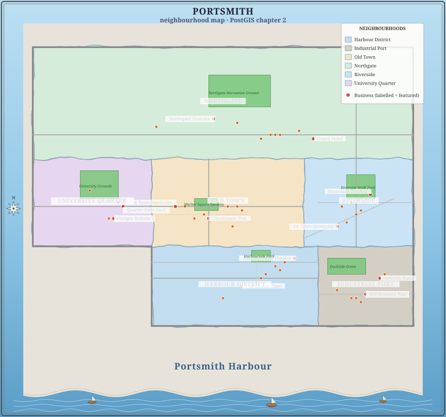
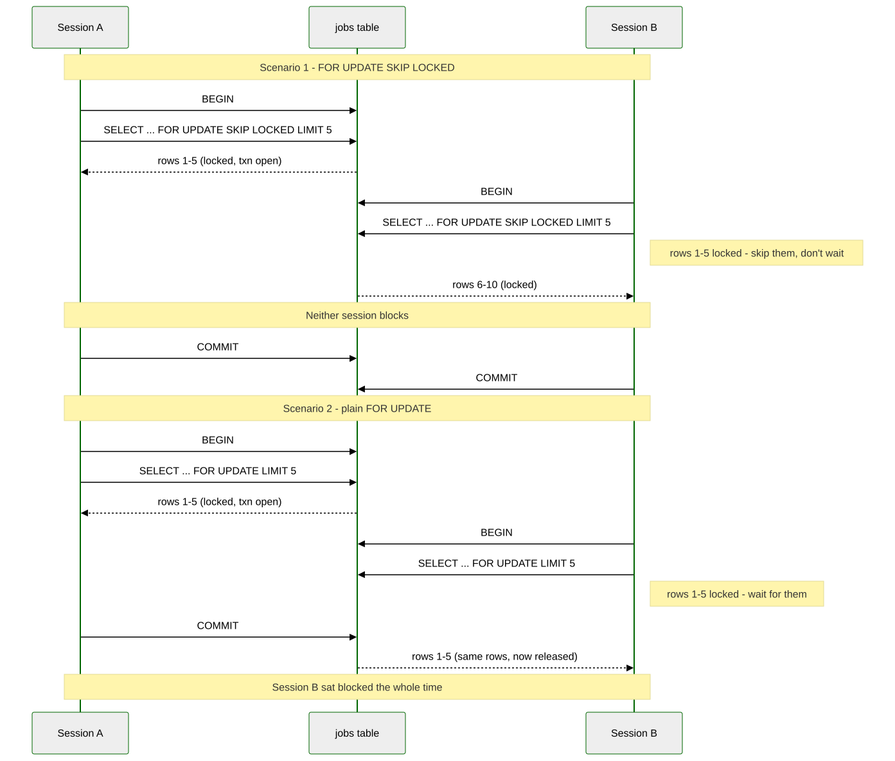
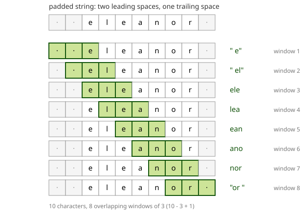
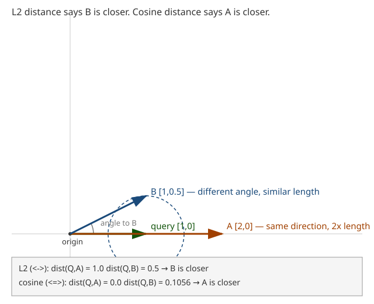
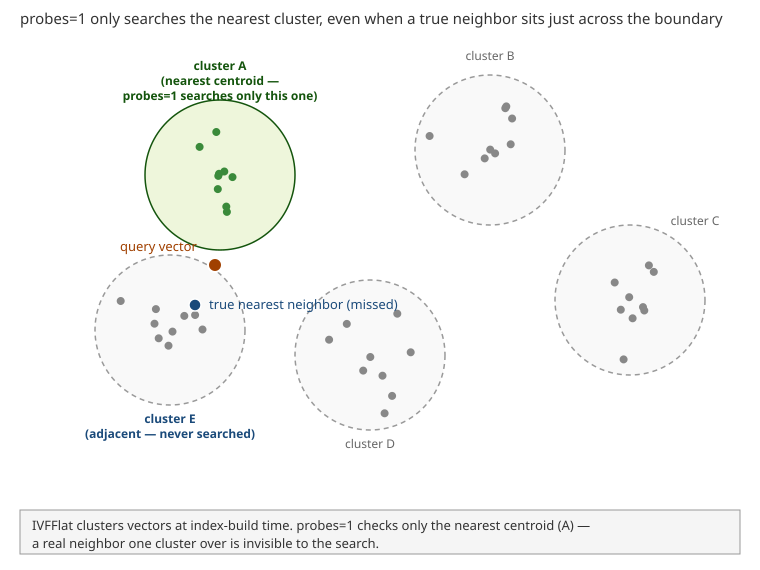

# The Portsmith Papers
## A Hands-On Tour of PostgreSQL Beyond the Relational Model


---

> *"PostgreSQL is not a database with extensions.  
> It is an extensible data platform that happens to speak SQL."*

---

### About This Book

Most PostgreSQL tutorials end where the interesting work begins.

Once you know how to `SELECT`, `JOIN`, and `GROUP BY`, you have mastered perhaps twenty percent of what PostgreSQL can do. The remaining eighty percent — geospatial queries, semantic search, real-time notifications, fuzzy matching, vector embeddings, distributed coordination, and more — lives in a ecosystem of extensions, index types, and language features that most practitioners never discover.

This book is a guided tour of that other eighty percent.

Each chapter is built around a concrete engineering problem faced by the fictional city of **Portsmith** and its data platform team. We store business directories as semi-structured JSON documents. We route emergency services using geospatial proximity queries. We build a job queue with no message broker. We search municipal records with fuzzy matching that survives typos and OCR errors. We expose the entire platform as a REST API with zero application code.

Every chapter follows the same structure: synthetic data is generated first, giving you a realistic dataset to work against, and then a series of exercises walks you from first principles to production-ready technique. The exercises are written to be done — not just read.

By the end, you will see PostgreSQL not as a place to store rows, but as a programmable data infrastructure layer capable of doing work that most teams reach for separate specialized systems to handle.

**What you will need:**

- A working PostgreSQL 16 installation (setup covered in Appendix A)
- Python 3.12+
- A Debian-based Linux environment
- Familiarity with basic SQL (`SELECT`, `INSERT`, `JOIN`, `GROUP BY`)
- Curiosity about what else is in there

---

### Author

**Chris Lee**  

---

*Edition 1.0 — Portsmith, 2026*
<div style="page-break-before: always;"></div>
# Chapter 1 — JSONB: Semi-Structured Data Without a Schema Tax

> *"A schema is a prediction about the future. JSONB lets you hedge."*

---

## Background

Relational databases enforce a contract: every row in a table has exactly the
same columns. That contract is usually a feature — it catches mistakes and
makes queries predictable. But sometimes you genuinely don't know what columns
you'll need until the data arrives. A business directory is a good example.
A restaurant has hours, cuisine, and a reservations policy. A hardware shop has
trade accounts and parking. A hotel has star ratings and room types. Forcing
them all into the same set of columns means drowning in NULLs or building a
rats' nest of one-to-many extension tables.

PostgreSQL's `JSONB` type lets you store arbitrary JSON documents in a column
while keeping the rest of your row fully relational. It is not a NoSQL escape
hatch — it is an indexed, queryable, patchable document field that sits inside
a SQL table. You can `WHERE` on it, join against it, aggregate over it, and
update individual keys without rewriting the whole document.

This chapter works through all the operators and patterns you'll reach for most
often. The exercises are short. Run every one, then try a variation of your own.

---

## The Scenario

Portsmith's city council maintains a public business directory. Every business
gets a short relational record — an ID, a name, an address, and a
neighbourhood — but the supplementary detail varies so widely by business type
that a single fixed schema would be unworkable.

The `businesses` table therefore stores all of that variable metadata in a
`details` JSONB column. Each business category contributes its own keys:

| Category        | JSONB keys present                                                   |
|-----------------|----------------------------------------------------------------------|
| `restaurant`    | `cuisine`, `price_range`, `rating`, `hours`, `tags`, `accepts_reservations`, `outdoor_seating` |
| `retail`        | `subcategory`, `rating`, `hours`, `tags`, `payment_methods`, `has_parking` |
| `service`       | `subcategory`, `rating`, `hours`, `tags`, `appointment_required`, `specialties` |
| `accommodation` | `subcategory`, `star_rating`, `rating`, `hours`, `amenities`, `room_types`, `price_per_night` |
| `entertainment` | `subcategory`, `rating`, `hours`, `tags`, `live_music`, `age_restriction` |

The `hours` value is itself a nested object keyed by day of week (`mon`–`sun`).
Each day is either `null` (closed) or `{"open": "HH:MM", "close": "HH:MM"}`.
Several businesses also carry optional keys that appear only for their category,
like `social` (social media handles), `happy_hour`, or `approved_brands`.

This heterogeneity is intentional — it is what makes the data a good vehicle
for learning JSONB operators.

---

## Exercise Goals

By the end of this chapter you will be able to:

- Extract values from a JSONB document using `->`, `->>`, and `#>>`, and
  explain why the operator choice changes the result type.
- Filter rows using the containment operator `@>` and the key-existence
  operators `?`, `?|`, and `?&`.
- Create a GIN index on a JSONB column and confirm that PostgreSQL uses it.
- Update a document in place with `jsonb_set` and the `||` merge operator
  without rewriting the whole column.
- Expand a JSONB array into a set of rows with `jsonb_array_elements` and
  aggregate the results.
- Write `jsonb_path_query` expressions to filter on nested values.

---

## Installation

### 1 — PostgreSQL

If PostgreSQL 16 is not already installed:

```bash
sudo apt update
sudo apt install -y postgresql-16 postgresql-client-16
```

Confirm the server is running:

```bash
pg_lsclusters
```

You should see a cluster at version 16 in the `online` state.

### 2 — Python 3.12 and psycopg

```bash
sudo apt install -y python3.12 python3.12-venv
```

Create a virtual environment in the book's working directory and install the
PostgreSQL driver:

```bash
python3.12 -m venv .venv
source .venv/bin/activate
pip install "psycopg[binary]"
```

> **Note:** `psycopg` (version 3) is the modern Python driver for PostgreSQL.
> It is not available as an `apt` package for Python 3.12, so we install it
> via pip into the virtual environment. The `[binary]` extra bundles a
> pre-compiled C extension so you don't need `libpq-dev`.

---

## Loading the Data

### Create the database

```bash
# Create a role matching your OS user (skip if it already exists)
sudo -u postgres createuser --createdb "$(whoami)"

# Create the portsmith database
createdb portsmith
```

### Run the seed script

From the `book/` directory, with the virtual environment active:

```bash
python data/ch01_seed.py
```

Expected output:

```
Connecting to: dbname=portsmith
Creating schema …
Inserting 48 businesses …
Done — 48 rows in businesses.
```

### Verify the load

Open a `psql` session:

```bash
psql portsmith
```

Run these checks. If all three pass, the data is correct.

**Check 1 — Row count and column types:**

```sql
\d businesses
```

```
                                   Table "public.businesses"
    Column     |  Type   | Collation | Nullable |              Default
---------------+---------+-----------+----------+------------------------------------
 id            | integer |           | not null | nextval('businesses_id_seq'::regclass)
 name          | text    |           | not null |
 address       | text    |           | not null |
 neighbourhood | text    |           | not null |
 details       | jsonb   |           | not null |
```

**Check 2 — Counts by neighbourhood:**

```sql
SELECT neighbourhood, COUNT(*) AS businesses
FROM   businesses
GROUP  BY neighbourhood
ORDER  BY neighbourhood;
```

```
   neighbourhood    | businesses
--------------------+------------
 Harbour District   |          9
 Industrial Port    |          7
 Northgate          |          9
 Old Town           |          9
 Riverside          |          9
 University Quarter |          5
(6 rows)
```

**Check 3 — Counts by category:**

```sql
SELECT details->>'category' AS category, COUNT(*) AS businesses
FROM   businesses
GROUP  BY category
ORDER  BY category;
```

```
    category     | businesses
-----------------+------------
 accommodation   |          5
 entertainment   |          6
 restaurant      |         15
 retail          |         12
 service         |         10
(5 rows)
```

If all three match, proceed to the exercises.

---

## Exercises

---

### Exercise 1 — The Three Extraction Operators

JSONB has two families of accessor. The arrow operators (`->` and `->>`)
navigate one key at a time. The path operator (`#>>`) jumps straight to a
deeply nested value. The difference between them is the **type they return**.

**1.1 — Arrow operators**

Run these two queries and compare the result types:

```sql
-- -> returns JSONB
SELECT name,
       details -> 'rating' AS rating_jsonb
FROM   businesses
LIMIT  5;
```

```sql
-- ->> returns TEXT
SELECT name,
       details ->> 'rating' AS rating_text
FROM   businesses
LIMIT  5;
```

Look carefully at the column headings in `psql` — one will show `jsonb`, the
other `text`. This distinction matters the moment you try to do arithmetic:

```sql
-- This works: cast text to numeric
SELECT name,
       (details ->> 'rating')::numeric AS rating
FROM   businesses
ORDER  BY rating DESC
LIMIT  5;
```

```
          name           | rating
-------------------------+--------
 Lighthouse Bookshop     |    4.9
 Finch & Sons Barbers    |    4.9
 Portsmith Vet. Clinic   |    4.8
 River Bend Bakery       |    4.8
 Quarter Note Jazz Club  |    4.8
(5 rows)
```

> **Key point:** Use `->` when you want to keep working with JSONB (e.g., to
> navigate deeper). Use `->>` when you need the final value as text for
> comparisons, casting, or display.

---

**1.2 — The path operator `#>>`**

Navigating nested keys with chained `->` quickly becomes unreadable. The path
operator takes an array of keys and returns the leaf as text in one step.

```sql
-- Chained arrows (verbose)
SELECT name,
       details -> 'hours' -> 'fri' ->> 'close' AS friday_close
FROM   businesses
WHERE  details ->> 'category' = 'restaurant'
LIMIT  8;
```

```sql
-- Path operator (equivalent, cleaner)
SELECT name,
       details #>> '{hours,fri,close}' AS friday_close
FROM   businesses
WHERE  details ->> 'category' = 'restaurant'
LIMIT  8;
```

Both produce the same result. Notice that some rows return `NULL` — those
restaurants are closed on Fridays (the `fri` key is JSON `null`).

```
        name         | friday_close 
---------------------+--------------
 The Gilded Clam     | 22:30
 Anchor & Oar Tavern | 01:00
 Bella Napoli        | 23:00
 Le Petit Bistro     | 14:30
 Dragon Palace       | 23:00
 Spice Garden        | 23:00
 Sol y Mar           | 23:00
 Mango Bay Caribbean | 22:30
(8 rows)
```

---

### Exercise 2 — Filtering with Containment and Key Existence

**2.1 — Containment: `@>`**

The containment operator checks whether the left JSONB document contains all
the key-value pairs in the right document. It is the most common way to filter
on JSONB values.

Find all waterfront businesses:

```sql
SELECT name, neighbourhood
FROM   businesses
WHERE  details @> '{"tags": ["waterfront"]}'
ORDER  BY neighbourhood, name;
```

```
          name           |  neighbourhood
-------------------------+------------------
 Anchor & Oar Tavern     | Harbour District
 Harbour Inn             | Harbour District
 Harbour View Theater    | Harbour District
 Mariners Rest B&B       | Harbour District
 Portsmith Fish Market   | Harbour District
 Saltbox Gallery         | Harbour District
 The Gilded Clam         | Harbour District
 Tidal Wave Surf Shop    | Harbour District
 Old Brewery Tap         | Industrial Port
 The Rusty Anchor        | Industrial Port
(10 rows)
```

> **Why this works:** The `@>` operator checks whether the tags *array* on the
> left contains the tags array `["waterfront"]` on the right — array
> containment is supported natively.

---

**2.2 — Key existence: `?`**

The `?` operator tests whether a key exists in a JSONB object (or a value
exists in a JSONB array). Unlike `@>`, it does not check the value — only
presence.

Find all businesses that publish social media handles:

```sql
SELECT name,
       details -> 'social' AS social_links
FROM   businesses
WHERE  details ? 'social'
ORDER  BY name;
```

```
          name          |                       social_links                        
------------------------+-----------------------------------------------------------
 Bella Napoli           | {"instagram": "@bellanapoli_portsmith"}
 Le Petit Bistro        | {"instagram": "@lepetitbistro"}
 Quarter Note Jazz Club | {"instagram": "@quarternote_portsmith"}
 Spice Garden           | {"instagram": "@spicegarden_portsmith"}
 The Gilded Clam        | {"facebook": "thegildedclam", "instagram": "@gildedclam"}
 The Riverside Vegan    | {"instagram": "@riverside_vegan"}
(6 rows)
```

---

**2.3 — Any-key and all-key existence: `?|` and `?&`**

`?|` returns true if *at least one* of the listed keys exists.
`?&` returns true only if *all* listed keys exist.

```sql
-- Businesses that offer either delivery OR takeaway
SELECT name
FROM   businesses
WHERE  details ?| ARRAY['delivery', 'takeaway']
ORDER  BY name;
```

```sql
-- Businesses that offer BOTH delivery AND takeaway
SELECT name
FROM   businesses
WHERE  details ?& ARRAY['delivery', 'takeaway']
ORDER  BY name;
```

Run both and note the difference in result count. The `?&` set is a strict
subset of the `?|` set.

---

### Exercise 3 — Missing Keys vs. NULL Values

JSONB has two distinct ways to represent "no value": a JSON `null` and a
**missing key**. They behave differently in queries.

In our data, a business closed on Monday can be represented two ways:

- `"mon": null` — the key exists, the value is JSON null
- the `mon` key is absent entirely

The seed data uses `"mon": null` for closures, so we can observe this.

**3.1 — The difference matters for `?`**

```sql
-- ? checks key EXISTENCE, not value
SELECT name
FROM   businesses
WHERE  (details -> 'hours') ? 'sun'   -- key exists (even if null)
ORDER  BY name;
```

Run it. You should get **43 rows** — every business that uses a day-keyed
hours object. The five accommodation businesses are excluded because their
hours look like `{"reception": "07:00-23:00"}` and have no `sun` key.

Now try what seems like a natural follow-up:

```sql
-- ⚠ This does NOT do what you might expect
SELECT name
FROM   businesses
WHERE  (details -> 'hours' -> 'sun') IS NOT NULL
ORDER  BY name;
```

Run it. You still get **43 rows** — identical to the first query.

**Why?** This is one of JSONB's most important gotchas:

> **JSONB `null` is not SQL `NULL`.**

When the seed script stores `"sun": None` in Python, `json.dumps` produces
`"sun": null` — a JSON null *value* under an existing key. When PostgreSQL
evaluates `details -> 'hours' -> 'sun'` on such a row, it returns the JSONB
value `null`. That is a real value — not the absence of a value — so
`IS NOT NULL` evaluates to `TRUE`.

SQL `NULL` only appears when the key itself is **missing** from the object.
That is what happens for the five accommodation businesses: `details ->
'hours'` returns `{"reception": "..."}`, and then `-> 'sun'` on that object
finds no such key and returns SQL `NULL`, so `IS NOT NULL` is `FALSE`.

The same logic, traced as a flowchart instead of read as prose:



To correctly distinguish the three states, use `jsonb_typeof()`:

| State | `details -> 'hours' -> 'sun'` | `jsonb_typeof(...)` | `IS NOT NULL` |
|-------|-------------------------------|----------------------|---------------|
| Key missing (accommodation) | SQL `NULL` | SQL `NULL` | `FALSE` |
| Key present, closed (`null`) | JSONB `null` | `'null'` | **`TRUE`** ← gotcha |
| Key present, open (object) | JSONB object | `'object'` | `TRUE` |

The correct query for "businesses actually open on Sunday":

```sql
SELECT name
FROM   businesses
WHERE  jsonb_typeof(details -> 'hours' -> 'sun') = 'object'
ORDER  BY name;
```

This returns **25 rows** — only the businesses with a real hours object for
Sunday. `jsonb_typeof` returns `'object'` only for JSON objects, `'null'`
for JSON null, and SQL `NULL` for a missing key (which then fails the `=`
test).

> **Rule of thumb:** Never use `IS NOT NULL` to test whether a JSONB
> navigation result is a "real" value. Use `jsonb_typeof(...)` to check
> the actual JSON type, or navigate one level deeper (e.g., check
> `details #>> '{hours,sun,open}'`) — the `#>>` operator converts JSON null
> to SQL NULL, so a deeper path naturally filters it out.

---

**3.2 — Handling accommodation differently**

Hotels and hostels store hours as a single `"reception": "HH:MM-HH:MM"` string
rather than a day-keyed object. This means the `? 'sun'` test returns false for
them even though they may be open 24/7. Write a query that finds all businesses
that are either:

- Open on Sunday (day-keyed hours with a non-null `sun`), **or**
- An accommodation with 24/7 reception

```sql
SELECT name, neighbourhood,
       CASE
           WHEN jsonb_typeof(details -> 'hours' -> 'sun') = 'object'
               THEN (details #>> '{hours,sun,open}') || '–' ||
                    (details #>> '{hours,sun,close}')
           WHEN details #>> '{hours,reception}' = '24/7'
               THEN '24/7'
           ELSE details #>> '{hours,reception}'
       END AS sunday_availability
FROM   businesses
WHERE  jsonb_typeof(details -> 'hours' -> 'sun') = 'object'
   OR  (details -> 'hours') ? 'reception'
ORDER  BY neighbourhood, name;
```

---

### Exercise 4 — GIN Indexes

Without an index, every JSONB query is a sequential scan — PostgreSQL reads
every row and evaluates the expression. For a 48-row toy dataset that is
unnoticeable, but with millions of rows it becomes a bottleneck.

A **GIN** (Generalised Inverted Index) index over a JSONB column indexes every
key and value inside every document. It accelerates `@>`, `?`, `?|`, and `?&`
queries.

**4.1 — Observe the plan before indexing**

```sql
EXPLAIN (ANALYZE, BUFFERS)
SELECT name
FROM   businesses
WHERE  details @> '{"tags": ["waterfront"]}';
```

With 48 rows you will see `Seq Scan` (sequential scan, i.e. reading every row) — that is expected. On a larger table
this would say `Seq Scan` with a high cost estimate.

**4.2 — Create the GIN index**

```sql
CREATE INDEX idx_businesses_details_gin
    ON businesses
    USING GIN (details);
```

**4.3 — Observe the plan after indexing**

```sql
EXPLAIN (ANALYZE, BUFFERS)
SELECT name
FROM   businesses
WHERE  details @> '{"tags": ["waterfront"]}';
```

On a small table PostgreSQL may still choose a sequential scan (the planner
knows the table fits in memory). Force it to use the index to see the
mechanism:

```sql
SET enable_seqscan = off;

EXPLAIN (ANALYZE, BUFFERS)
SELECT name
FROM   businesses
WHERE  details @> '{"tags": ["waterfront"]}';

SET enable_seqscan = on;   -- always restore this
```

You should now see `Bitmap Index Scan on idx_businesses_details_gin` in the
plan. The GIN index will pay for itself in production as the table grows.

> **What GIN indexes:** The default `jsonb_ops` operator class indexes every
> key and value in the document, supporting `@>`, `?`, `?|`, `?&`. A
> `jsonb_path_ops` class indexes only values (not keys), producing a smaller
> index that is faster for `@>` but cannot accelerate `?` queries. Use
> `jsonb_path_ops` when you only ever query by value containment and index
> size matters.

```sql
-- Alternative: value-only index (smaller, faster @>, no ? support)
CREATE INDEX idx_businesses_details_pathops
    ON businesses
    USING GIN (details jsonb_path_ops);
```

---

### Exercise 5 — Updating Documents in Place

JSONB columns are immutable at the document level — you cannot change a single
key without rewriting the whole value. PostgreSQL gives you two tools to do
that rewrite concisely.

**5.1 — `jsonb_set`: replace or add one value**

The Lighthouse Bookshop just received a flood of five-star reviews. Update its
rating to 5.0:

```sql
UPDATE businesses
SET    details = jsonb_set(details, '{rating}', '5.0')
WHERE  name = 'Lighthouse Bookshop';
```

Verify:

```sql
SELECT name, details ->> 'rating' AS rating
FROM   businesses
WHERE  name = 'Lighthouse Bookshop';
```

`jsonb_set(target, path, new_value)` — the path is a text array of keys. If
the key already exists it is replaced; if it does not exist it is added (by
default — there is a fourth parameter to suppress creation).

**5.2 — `jsonb_set` on a nested key**

The Gilded Clam is now closing an hour later on Sundays:

```sql
UPDATE businesses
SET    details = jsonb_set(
                    details,
                    '{hours,sun,close}',
                    '"21:00"'     -- note: a JSON string must be double-quoted
                )
WHERE  name = 'The Gilded Clam';
```

```sql
SELECT name,
       details #>> '{hours,sun,close}' AS new_sunday_close
FROM   businesses
WHERE  name = 'The Gilded Clam';
```

**5.3 — `||` merge operator: add or overwrite multiple keys at once**

The `||` operator merges two JSONB objects, with the right side winning on
conflicts. Use it to add a `verified` flag and update `review_count` in a
single statement:

```sql
UPDATE businesses
SET    details = details || '{"verified": true, "review_count": 999}'
WHERE  name = 'Anchor & Oar Tavern';
```

```sql
SELECT name,
       details ->> 'verified'     AS verified,
       details ->> 'review_count' AS reviews
FROM   businesses
WHERE  name = 'Anchor & Oar Tavern';
```

> **Caution:** `||` does a *shallow* merge. If `details` contains a nested
> object like `hours` and you merge another object that also has `hours`, the
> entire `hours` value is replaced — not deep-merged. Use `jsonb_set` for
> targeted nested updates.

---

### Exercise 6 — Expanding Arrays with `jsonb_array_elements`

The `tags` key in most business documents is a JSON array. To query across
tags — for example, to find the most common ones across the whole directory —
you need to expand the array into individual rows.

**6.1 — Expand one business's tags**

```sql
SELECT name,
       jsonb_array_elements_text(details -> 'tags') AS tag
FROM   businesses
WHERE  name = 'The Gilded Clam';
```

```
       name       |      tag
------------------+---------------
 The Gilded Clam  | waterfront
 The Gilded Clam  | seafood
 The Gilded Clam  | romantic
 The Gilded Clam  | outdoor_seating
(4 rows)
```

> `jsonb_array_elements_text` is a set-returning function: each element of the
> array becomes its own row. The result has more rows than the input.

**6.2 — Count tags across all businesses**

```sql
SELECT tag, COUNT(*) AS occurrences
FROM   businesses,
       jsonb_array_elements_text(details -> 'tags') AS tag
GROUP  BY tag
ORDER  BY occurrences DESC
LIMIT  15;
```

```
       tag        | occurrences 
------------------+-------------
 waterfront       |          10
 takeaway         |           5
 family_friendly  |           4
 family_owned     |           4
 organic          |           3
 ...
(15 rows)
```

Your exact numbers will differ — this shows the query pattern. The comma
between `businesses` and the `jsonb_array_elements_text(...)` call is a
**lateral join** (PostgreSQL expands the function for each input row
automatically when used in the `FROM` clause this way).

**6.3 — Only businesses with multiple specific tags**

Find restaurants that are both `vegan_options` and `takeaway`:

```sql
SELECT name, details ->> 'cuisine' AS cuisine
FROM   businesses
WHERE  details @> '{"tags": ["vegan_options"]}'
  AND  details @> '{"tags": ["takeaway"]}';
```

Because each `@>` call is independent, both conditions must hold. This is more
efficient than expanding the array when the GIN index is in place.

---

### Exercise 7 — Path Queries with `jsonb_path_query`

The `@?` operator and `jsonb_path_query()` function implement **SQL/JSON path
language** — a mini-query language for navigating and filtering within a JSONB
document. It is more expressive than chained arrow operators for conditional
navigation.

**7.1 — Simple path existence**

Find businesses where the social links include Instagram:

```sql
SELECT name
FROM   businesses
WHERE  details @? '$.social.instagram';
```

`$.social.instagram` means: start at the root (`$`), descend to `social`,
then to `instagram`. `@?` returns true if the path resolves to at least one
value.

**7.2 — Filter on a nested value**

Find restaurants with a rating above 4.5:

```sql
SELECT name,
       details ->> 'rating' AS rating
FROM   businesses
WHERE  details @? '$ ? (@.category == "restaurant" && @.rating > 4.5)';
```

```
         name          | rating
-----------------------+--------
 Bella Napoli          | 4.6
 Le Petit Bistro       | 4.7
 River Bend Bakery     | 4.8
 Spice Garden          | 4.6
 The Gilded Clam       | 4.5
(5 rows)
```

The `? (filter)` syntax inside a path expression is equivalent to a `WHERE`
clause inside the document.

**7.3 — Find businesses open late on Friday**

Businesses that close at or after 21:00 on Friday (using string comparison,
which works correctly for 24-hour `HH:MM` strings):

```sql
SELECT name,
       details #>> '{hours,fri,close}' AS friday_close
FROM   businesses
WHERE  details @? '$.hours.fri.close ? (@ >= "21:00")'
ORDER  BY friday_close DESC, name;
```

```
           name           | friday_close
--------------------------+--------------
 Bella Napoli             | 23:00
 Dragon Palace            | 23:00
 Harbour View Theater     | 23:00
 The Hungry Scholar       | 23:00
 Spice Garden             | 23:00
 Sol y Mar                | 23:00
 Mango Bay Caribbean      | 22:30
 The Gilded Clam          | 22:30
 Thai Orchid              | 22:00
 The Riverside Vegan      | 22:00
 Northgate Grocers        | 21:00
 Lotus Spa & Wellness     | 20:00
(12 rows)
```

> **Limitation to notice:** Businesses that close *after midnight* — Anchor &
> Oar, The Clocktower Pub, The Rusty Anchor, and others — show a `close` of
> `"01:00"` or `"02:00"`. Lexicographically, `"02:00" < "21:00"`, so these
> businesses are *excluded* from the above results even though they are open
> very late. This is a design trade-off of storing times as plain strings.
> One solution is to store closing times past midnight as `"25:00"`, `"26:00"`,
> etc. — an unusual but practical convention for 24-hour time arithmetic.

**7.4 — Extract values with `jsonb_path_query`**

`@?` is a boolean test. `jsonb_path_query()` returns the actual matched values:

```sql
SELECT name,
       jsonb_path_query(details, '$.hours.fri.close') AS friday_close_json
FROM   businesses
WHERE  details @? '$.hours.fri'
ORDER  BY name
LIMIT  8;
```

The returned values are JSONB (note the quotes around the time strings). Use
`jsonb_path_query_first(...) #>> '{}'` to extract a single scalar as text
without the surrounding quotes.

---

## Summary — What You Should Now Know

You have worked through the core JSONB toolkit. Here is what each operator
and function you used actually does:

| Tool | What it does |
|------|-------------|
| `-> 'key'` | Navigate one level; returns **JSONB** |
| `->> 'key'` | Navigate one level; returns **text** |
| `#>> '{a,b,c}'` | Navigate a path; returns **text**; JSON null becomes SQL NULL |
| `@> '{"k":"v"}'` | Containment test; accelerated by GIN |
| `? 'key'` | Key exists test (regardless of value); accelerated by GIN |
| `?|` / `?&` | Any-key / all-keys exist; accelerated by GIN |
| `jsonb_typeof(val)` | Returns `'object'`, `'array'`, `'string'`, `'number'`, `'boolean'`, or `'null'`; SQL NULL for a missing key |
| `jsonb_set(col, path, val)` | Replace or insert a nested value |
| `col \|\| '{"k":"v"}'` | Shallow-merge a document |
| `jsonb_array_elements_text(col)` | Expand a JSON array into rows |
| `@? 'path'` | SQL/JSON path existence test |
| `jsonb_path_query(col, 'path')` | SQL/JSON path — return matched values |

> **Remember:** JSONB `null` ≠ SQL `NULL`. Use `jsonb_typeof()` — not
> `IS NOT NULL` — when you need to distinguish a missing key from a key
> that exists but holds a JSON null value.

**The key design insight** from this chapter is that JSONB lets you keep a
relational spine — the columns your queries always need (`id`, `name`,
`neighbourhood`) — while storing everything else in a document whose shape
can vary row by row. The GIN index means you do not pay a query performance
penalty for that flexibility.

In the next chapter you will add point geometry to the `businesses` table and
use PostGIS to answer spatial questions: which businesses are within 500 metres
of the harbour, and which neighbourhood does each one belong to.

---

*Going further: PostgreSQL 14+ supports the `jsonpath` type natively. The
`jsonb_path_query_array` and `jsonb_path_query_first` variants are useful for
pagination and single-value extraction. For write-heavy workloads, profile
whether `JSONB` or a computed stored column (Chapter 16) gives better
`INSERT`/`UPDATE` throughput on your hardware.*
<div style="page-break-before: always;"></div>
# Chapter 2 — PostGIS: Geospatial Queries on Real Geometry

> *"A city is not a list of rows. It is a shape on the ground."*

---

## Background

Every interesting question about a city is ultimately a spatial question. Which
businesses are near the harbour? Which neighbourhood is this address in? How
large is the industrial waterfront? Relational databases answer these badly when
location is stored as a text field or a pair of float columns — there is no
native concept of "within", "contains", or "distance".

PostGIS is a PostgreSQL extension that adds first-class geometry and geography
types, plus several hundred spatial functions and operators. It turns PostgreSQL
into a full spatial database: you can store points, lines, and polygons;
index them with GIST; and answer proximity, containment, and area queries in
SQL without an external GIS system.

This matters in practice far beyond mapping applications. Address geocoding,
logistics routing, fraud detection (is this login coming from the expected
region?), real estate valuation, and urban planning all reach for spatial
queries. PostGIS is the standard tool for all of them in the PostgreSQL
ecosystem.

---

## The Scenario

The Portsmith business directory from Chapter 1 stores each business's
neighbourhood as a plain text column. That works for simple filtering, but it
cannot answer *where* questions: it cannot find businesses near a given
coordinate, cannot verify that a business address actually falls inside its
declared neighbourhood, and cannot measure distances.

This chapter adds a point geometry to every business record, then introduces
three new spatial tables:



*Portsmith's six neighbourhoods, parks, and featured businesses — rendered
directly from this chapter's own `neighborhoods`, `parks`, and `businesses`
tables via `utils/render_map.py`. Every shape and dot on this map is a row
you're about to query.*

| Table                  | Geometry type | What it holds                              |
|------------------------|---------------|--------------------------------------------|
| `neighborhoods`        | `POLYGON`     | Boundary polygons for Portsmith's six neighbourhoods |
| `parks`                | `POLYGON`     | Six public parks and green spaces          |
| `city_infrastructure`  | `LINESTRING`  | Twelve named road segments                 |

All coordinates are in WGS-84 (SRID 4326), the same coordinate system used by
GPS and most web mapping APIs.

---

## Exercise Goals

By the end of this chapter you will be able to:

- Store and inspect `POLYGON` geometry using WKT (Well-Known Text) and
  `ST_GeomFromText`.
- Run proximity searches with `ST_DWithin`, and understand why the
  `::geography` cast matters for distance accuracy.
- Perform spatial joins using `ST_Within` and `ST_Contains`, and explain
  the difference between them.
- Compute polygon areas in square kilometres using `ST_Area` with the
  geography type.
- Find the nearest feature for every row using `ST_Distance` and a
  `CROSS JOIN LATERAL`.
- Create a GIST spatial index and confirm that PostgreSQL uses it.

---

## Installation

### 1 — PostGIS server package

PostGIS is a separate package from PostgreSQL. On Debian/Ubuntu:

```bash
sudo apt install -y postgresql-16-postgis-3
```

### 2 — Enable PostGIS in the database

Connect to the `portsmith` database and enable the extension:

```bash
psql portsmith
```

```sql
CREATE EXTENSION IF NOT EXISTS postgis;
```

Verify it loaded:

```sql
SELECT postgis_full_version();
```

You should see a long string beginning with `POSTGIS="3.x.x"`. If you see an
error about the extension not existing, the server package is not installed.

---

## Loading the Data

### Prerequisites

Chapter 1's seed script must have been run first — the `businesses` table must
exist. If it does not:

```bash
python data/ch01_seed.py
```

### Run the Chapter 2 seed

```bash
python data/ch02_seed.py
```

Expected output:

```
Connecting to: dbname=portsmith
Enabling PostGIS extension …
Applying DDL …
Inserting 6 neighbourhoods …
Inserting 6 parks …
Inserting 12 road segments …
Updating 48 business locations …

Done:
  businesses with geometry : 48
  neighbourhoods           : 6
  parks                    : 6
  road segments            : 12
```

### Verify the load

Open `psql portsmith` and run these four checks.

**Check 1 — businesses now has a geometry column:**

```sql
\d businesses
```

You should see a new `geom` column of type `geometry(Point,4326)`.

**Check 2 — neighbourhood table structure and row count:**

```sql
SELECT name, population,
       ST_AsText(geom) AS wkt_preview
FROM   neighborhoods
ORDER  BY name;
```

```
       name         | population |            wkt_preview
--------------------+------------+------------------------------------
 Harbour District   |       4200 | POLYGON((-1.805 50.69,...))
 Industrial Port    |       2100 | POLYGON((-1.77 50.69,...))
 Northgate          |      18500 | POLYGON((-1.83 50.732,...))
 Old Town           |       6800 | POLYGON((-1.805 50.71,...))
 Riverside          |       9300 | POLYGON((-1.773 50.71,...))
 University Quarter |      11200 | POLYGON((-1.83 50.71,...))
(6 rows)
```

**Check 3 — parks and roads:**

```sql
SELECT COUNT(*) FROM parks;
SELECT COUNT(*) FROM city_infrastructure;
```

Both should return 6 and 12 respectively.

**Check 4 — SRID on all tables:**

```sql
SELECT f_table_name, f_geometry_column, srid, type
FROM   geometry_columns
WHERE  f_table_schema = 'public'
ORDER  BY f_table_name;
```

```
      f_table_name      | f_geometry_column | srid |    type
------------------------+-------------------+------+------------
 businesses             | geom              | 4326 | POINT
 city_infrastructure    | geom              | 4326 | LINESTRING
 neighborhoods          | geom              | 4326 | POLYGON
 parks                  | geom              | 4326 | POLYGON
(4 rows)
```

If all four pass, proceed to the exercises.

---

## Exercises

---

### Exercise 1 — Neighbourhood Polygons and WKT

Geometry in PostGIS is often loaded from **Well-Known Text** (WKT), a
human-readable representation of shapes. Understanding WKT lets you read
geometry from SQL output, write it in queries, and reason about what you stored.

**1.1 — Read a polygon in WKT**

```sql
SELECT name, ST_AsText(geom) AS wkt
FROM   neighborhoods
WHERE  name = 'Harbour District';
```

```
       name        |                          wkt
-------------------+------------------------------------------------------
 Harbour District  | POLYGON((-1.805 50.69,-1.77 50.69,-1.77 50.71,...))
```

WKT for a polygon is `POLYGON((x1 y1, x2 y2, ...))`. In geographic coordinates
the convention is *longitude latitude* (x then y), matching the X/Y convention
in maths. The ring must **close** — the last coordinate must equal the first.

**1.2 — Inspect the bounding box**

`ST_Envelope` returns the minimum bounding rectangle for any geometry:

```sql
SELECT name,
       ST_XMin(ST_Envelope(geom)) AS west,
       ST_XMax(ST_Envelope(geom)) AS east,
       ST_YMin(ST_Envelope(geom)) AS south,
       ST_YMax(ST_Envelope(geom)) AS north
FROM   neighborhoods
ORDER  BY name;
```

Use this output to confirm each polygon sits in the right part of the
coordinate space (longitudes around −1.75 to −1.83, latitudes around 50.69
to 50.76).

**1.3 — Count vertices**

```sql
SELECT name,
       ST_NPoints(geom) AS vertex_count
FROM   neighborhoods
ORDER  BY name;
```

Each neighbourhood polygon has five vertices (four corners plus the closing
duplicate). A real city boundary imported from an OS/census shapefile might
have thousands.

**1.4 — Understand the SRID**

`ST_SRID` returns the spatial reference identifier stored with the geometry:

```sql
SELECT name, ST_SRID(geom) AS srid
FROM   neighborhoods
LIMIT  3;
```

SRID 4326 is the WGS-84 system used by GPS. Every geometry in these tables
carries the same SRID, which means they can be compared and joined directly.
If SRIDs differ, PostGIS will return an error — a deliberate safety check.

> **The geometry/geography distinction:** In PostGIS, `geometry` stores
> coordinates in whatever units the SRS defines. For SRID 4326 that means
> degrees. When you ask for a distance between two `geometry` points in 4326,
> you get a value in *degrees* — nearly useless for human-scale distances.
> The `geography` type, by contrast, always works on a spheroid and returns
> distances in *metres*. You can cast any SRID-4326 geometry to geography
> with `::geography` to get metre-based calculations. The exercises use this
> cast throughout.

---

### Exercise 2 — Proximity Search with `ST_DWithin`

`ST_DWithin(a, b, distance)` returns true when the distance between `a` and `b`
is at most `distance`. With geography inputs the distance is in metres.

**2.1 — Find businesses within 500 m of Portsmith Pier**

Portsmith's main pier entrance sits at approximately (−1.785, 50.700). Find
every business within 500 metres of it:

```sql
SELECT b.name,
       b.neighbourhood,
       ROUND(
           ST_Distance(b.geom::geography,
                       ST_Point(-1.785, 50.700)::geography)::numeric
       ) AS distance_m
FROM   businesses b
WHERE  ST_DWithin(b.geom::geography,
                  ST_Point(-1.785, 50.700)::geography,
                  500)
ORDER  BY distance_m;
```

```
          name           |  neighbourhood   | distance_m
-------------------------+------------------+------------
 The Gilded Clam         | Harbour District |         70
 Anchor & Oar Tavern     | Harbour District |        179
 Tidal Wave Surf Shop    | Harbour District |        307
 Harbour Inn             | Harbour District |        437
 Portsmith Fish Market   | Harbour District |        484
(5 rows)
```

All five results are in the Harbour District — exactly what you would expect
for a search centred on the pier.

**2.2 — Why `::geography` matters**

Try the same query without the cast. Note that `ST_Point(...)` without an
explicit SRID gets SRID 0, which PostGIS refuses to compare against SRID-4326
geometry — so you must use `ST_SetSRID`:

```sql
SELECT b.name,
       ROUND(ST_Distance(b.geom,
                         ST_SetSRID(ST_Point(-1.785, 50.700), 4326))::numeric,
             6)                AS distance_degrees
FROM   businesses b
WHERE  ST_DWithin(b.geom,
                  ST_SetSRID(ST_Point(-1.785, 50.700), 4326),
                  500)
ORDER  BY distance_degrees;
```

The `WHERE` clause now has a threshold of `500` — but in *degrees*. One degree
of latitude is about 111 km, so this matches businesses within roughly
55,000 km: all 48 of them, from the whole city. The `distance_degrees` values
in the output are tiny fractions like `0.001000`, not useful numbers.

```
 rows returned: 48  (the entire city, not 5)
```

> **Rule:** For any distance query on SRID-4326 data, always cast to
> `::geography` in `ST_DWithin` and `ST_Distance`. The cast has negligible
> performance cost at the scales used in city-level data.

**2.3 — Try different radii**

How many businesses fall within 1 km of the pier? 2 km?

```sql
SELECT radius_m,
       COUNT(*) AS business_count
FROM   (VALUES (500), (1000), (2000)) AS radii(radius_m)
CROSS JOIN LATERAL (
    SELECT 1
    FROM   businesses b
    WHERE  ST_DWithin(b.geom::geography,
                      ST_Point(-1.785, 50.700)::geography,
                      radius_m)
) AS matches
GROUP  BY radius_m
ORDER  BY radius_m;
```

```
 radius_m | business_count
----------+----------------
      500 |              5
     1000 |              8
     2000 |             17
(3 rows)
```

The pier sits in the southern Harbour District. Doubling the radius to 2 km
pulls in more of the central neighbourhoods, but the northern Northgate
businesses are nearly 5 km away — a reminder that Portsmith stretches a
significant distance north from the waterfront.

---

### Exercise 3 — Spatial Joins with `ST_Within` and `ST_Contains`

A **spatial join** links rows from two tables based on a geometric relationship
rather than a key match. The most common are containment tests: does point A
fall inside polygon B?

**3.1 — Which neighbourhood is each business in?**

```sql
SELECT b.name,
       b.neighbourhood          AS declared_neighbourhood,
       n.name                   AS postgis_neighbourhood
FROM   businesses  b
JOIN   neighborhoods n ON ST_Within(b.geom, n.geom)
ORDER  BY n.name, b.name;
```

`ST_Within(a, b)` returns true when geometry `a` lies completely inside
geometry `b`. The query should return all 48 businesses, each matched to its
neighbourhood.

Confirm the declared `neighbourhood` column always matches `postgis_neighbourhood`:

```sql
SELECT COUNT(*) AS mismatches
FROM   businesses  b
JOIN   neighborhoods n ON ST_Within(b.geom, n.geom)
WHERE  b.neighbourhood <> n.name;
```

```
 mismatches
------------
          0
(1 row)
```

Zero mismatches: the text column from Chapter 1 and the geometry are
consistent.

**3.2 — `ST_Contains` is the inverse**

`ST_Contains(a, b)` returns true when polygon `a` contains geometry `b` —
it is the mirror of `ST_Within`. These two queries produce identical results:

```sql
-- Point inside polygon
SELECT b.name FROM businesses b
JOIN   neighborhoods n ON ST_Within(b.geom, n.geom)
WHERE  n.name = 'Old Town'
ORDER  BY b.name;

-- Polygon contains point
SELECT b.name FROM businesses b
JOIN   neighborhoods n ON ST_Contains(n.geom, b.geom)
WHERE  n.name = 'Old Town'
ORDER  BY b.name;
```

```
          name
--------------------------
 Bella Napoli
 Finch & Sons Barbers
 Le Petit Bistro
 Old Town Hardware
 Portsmith Accountancy Ltd.
 Portsmith Arms Hotel
 Portsmith Legal Group
 Portsmith Tailors
 The Clocktower Pub
(9 rows)
```

Both return the same 9 Old Town businesses.

> **The subtle difference:** `ST_Contains(A, B)` requires that no point of B
> lies on the boundary of A. A point sitting exactly *on* a polygon edge would
> fail `ST_Contains` but pass `ST_Covers`. In practice, coordinates rarely land
> precisely on a boundary, so the two functions behave identically for most
> point-in-polygon work. Reach for `ST_Covers` if you need to include
> boundary-touching cases explicitly.

**3.3 — Check for gaps: businesses in no neighbourhood**

This query finds any businesses whose geometry falls outside every neighbourhood
polygon — useful for catching data quality problems:

```sql
SELECT b.name, b.neighbourhood
FROM   businesses b
WHERE  NOT EXISTS (
    SELECT 1
    FROM   neighborhoods n
    WHERE  ST_Within(b.geom, n.geom)
);
```

```
 name | neighbourhood
------+---------------
(0 rows)
```

All 48 businesses are inside a neighbourhood polygon.

---

### Exercise 4 — Computing Area in Square Kilometres

`ST_Area` returns the area of a polygon. Called on `geometry` (degrees), it
returns a value in square degrees — meaningless to most people. Called on `geography`, it
returns square metres.

**4.1 — Incorrect: area in square degrees**

```sql
SELECT name,
       ROUND(ST_Area(geom)::numeric, 6) AS area_sq_degrees
FROM   neighborhoods
ORDER  BY area_sq_degrees DESC;
```

The numbers look tiny (around `0.0007`). They are geometrically correct but
impossible to interpret as real-world area because degrees are not uniform
units.

**4.2 — Correct: area in square metres, then kilometres**

```sql
SELECT name,
       ROUND((ST_Area(geom::geography) / 1e6)::numeric, 2) AS area_km2
FROM   neighborhoods
ORDER  BY area_km2 DESC;
```

```
        name        | area_km2
--------------------+----------
 Northgate          |    17.59
 Old Town           |     5.53
 Harbour District   |     5.50
 University Quarter |     4.32
 Riverside          |     3.98
 Industrial Port    |     3.14
(6 rows)
```

Northgate is by far the largest neighbourhood — it spans the entire northern
width of the city. Industrial Port is the smallest, a tight strip of dockside
land. Old Town and Harbour District are almost identical in area despite having
very different characters.

> **Why the numbers differ slightly from manual estimates:** `ST_Area` on
> geography uses the WGS-84 spheroid, which accounts for the fact that the
> Earth is not a perfect sphere. At latitude 50.7° the correction is small
> (under 0.3%) but present.

**4.3 — Population density**

Combine the computed area with the `population` column:

```sql
SELECT name,
       population,
       ROUND((ST_Area(geom::geography) / 1e6)::numeric, 2) AS area_km2,
       ROUND(
           (population / (ST_Area(geom::geography) / 1e6))::numeric
       ) AS pop_per_km2
FROM   neighborhoods
ORDER  BY pop_per_km2 DESC;
```

```
        name        | population | area_km2 | pop_per_km2
--------------------+------------+----------+-------------
 University Quarter |      11200 |     4.32 |        2592
 Riverside          |       9300 |     3.98 |        2340
 Old Town           |       6800 |     5.53 |        1230
 Northgate          |      18500 |    17.59 |        1052
 Harbour District   |       4200 |     5.50 |         763
 Industrial Port    |       2100 |     3.14 |         668
(6 rows)
```

The University Quarter and Riverside are the most densely populated
neighbourhoods — student housing and riverside apartments pack a lot of people
into compact areas. The Industrial Port is the least dense despite its small
size; much of it is warehouse and dock rather than residential.

---

### Exercise 5 — Nearest Park Using `ST_Distance` and a Lateral Join

Finding the nearest feature from another table requires a **lateral join** — a
subquery that can reference columns from the outer query row by row.

**5.1 — Distance from one business to one park**

`ST_Distance` between two geography values returns metres:

```sql
SELECT b.name                          AS business,
       p.name                          AS park,
       ROUND(ST_Distance(b.geom::geography,
                         p.geom::geography)::numeric) AS distance_m
FROM   businesses b,
       parks p
WHERE  b.name = 'The Gilded Clam'
ORDER  BY distance_m;
```

```
     business     |            park             | distance_m
------------------+-----------------------------+------------
 The Gilded Clam  | Harbourside Park            |        682
 The Gilded Clam  | Dockside Green              |       1315
 The Gilded Clam  | Market Square Gardens       |       2143
 The Gilded Clam  | Riverside Walk Park         |       2899
 The Gilded Clam  | University Grounds          |       3060
 The Gilded Clam  | Northgate Recreation Ground |       5006
(6 rows)
```

The nearest park to The Gilded Clam is Harbourside Park, 682 m away. The
`ST_Distance` to a polygon returns the distance from the point to the nearest
point on the polygon's boundary — zero when the point is inside the polygon.

**5.2 — Nearest park for a single business (lateral pattern)**

The canonical pattern for "nearest one thing" is `ORDER BY ... LIMIT 1` inside
a lateral subquery:

```sql
SELECT b.name,
       nearest.park_name,
       nearest.distance_m
FROM   businesses b
CROSS JOIN LATERAL (
    SELECT p.name                                               AS park_name,
           ROUND(ST_Distance(b.geom::geography,
                             p.geom::geography)::numeric)      AS distance_m
    FROM   parks p
    ORDER  BY b.geom::geography <-> p.geom::geography
    LIMIT  1
) AS nearest
WHERE  b.name = 'Quarter Note Jazz Club';
```

```
         name          |    park_name       | distance_m
-----------------------+--------------------+------------
 Quarter Note Jazz Club | University Grounds |        233
(1 row)
```

The `<->` operator is the KNN (k-nearest-neighbour) distance operator. When
used in an `ORDER BY` clause inside a lateral join, PostGIS can accelerate it
with the GIST index (which you will create in Exercise 6). Using `<->` in
`ORDER BY` is preferred over `ORDER BY ST_Distance(...)` for this reason.

**5.3 — Nearest park for every business**

Remove the `WHERE` filter to run across all 48 businesses:

```sql
SELECT b.name                          AS business,
       b.neighbourhood,
       nearest.park_name,
       nearest.distance_m
FROM   businesses b
CROSS JOIN LATERAL (
    SELECT p.name                                               AS park_name,
           ROUND(ST_Distance(b.geom::geography,
                             p.geom::geography)::numeric)      AS distance_m
    FROM   parks p
    ORDER  BY b.geom::geography <-> p.geom::geography
    LIMIT  1
) AS nearest
ORDER  BY b.neighbourhood, b.name;
```

Scan the results. You should see a clean pattern: each neighbourhood's
businesses point to the park in that same neighbourhood. Notice that three
Riverside businesses (Portsmith Pharmacy, Portsmith Veterinary Clinic, Riverside
Cinema) and University Bookshop all show `distance_m = 0` — their coordinates
fall *inside* the park polygon. `ST_Distance` to a polygon returns zero when
the point is contained within it.

**5.4 — Aggregate: average walking distance to a park, by neighbourhood**

```sql
SELECT b.neighbourhood,
       ROUND(AVG(nearest.distance_m)::numeric) AS avg_distance_m
FROM   businesses b
CROSS JOIN LATERAL (
    SELECT ROUND(ST_Distance(b.geom::geography,
                             p.geom::geography)::numeric) AS distance_m
    FROM   parks p
    ORDER  BY b.geom::geography <-> p.geom::geography
    LIMIT  1
) AS nearest
GROUP  BY b.neighbourhood
ORDER  BY avg_distance_m;
```

This gives a rough "walkability to green space" metric per neighbourhood. Old
Town ranks first — Market Square Gardens sits centrally within the neighbourhood.
Northgate comes last despite having the largest park, because the park is in
the far north of the district while businesses cluster near the southern edge.

---

### Exercise 6 — GIST Indexes and Spatial Query Plans

Without an index, every spatial query is a sequential scan: PostgreSQL reads
every row, applies the geometry function, and discards non-matching rows. For
a 48-row dataset that is instant, but at 48 million rows it is not.

PostGIS spatial queries are accelerated by **GIST** (Generalised Search Tree)
indexes. A GIST index on a geometry column builds a tree of bounding boxes,
allowing the planner to quickly eliminate large portions of the table.

**6.1 — Observe the plan before indexing**

```sql
EXPLAIN (ANALYZE, BUFFERS)
SELECT name
FROM   businesses
WHERE  ST_DWithin(geom::geography,
                  ST_Point(-1.785, 50.700)::geography,
                  500);
```

On the 48-row `businesses` table you will see something like:

```
Seq Scan on businesses  (cost=0.00..4.60 rows=1 width=...) ...
  Filter: (st_dwithin(...))
  Rows Removed by Filter: 43
```

A sequential scan is expected on a tiny table — the planner knows the overhead
of an index lookup exceeds the cost of reading all 48 rows.

**6.2 — Create GIST indexes on the geometry columns**

```sql
CREATE INDEX idx_businesses_geom
    ON businesses USING GIST (geom);

CREATE INDEX idx_neighborhoods_geom
    ON neighborhoods USING GIST (geom);

CREATE INDEX idx_parks_geom
    ON parks USING GIST (geom);

CREATE INDEX idx_city_infrastructure_geom
    ON city_infrastructure USING GIST (geom);
```

**6.3 — The geometry/geography index split**

With `enable_seqscan` off, verify which plan the proximity query uses:

```sql
SET enable_seqscan = off;

EXPLAIN (ANALYZE, BUFFERS)
SELECT name
FROM   businesses
WHERE  ST_DWithin(geom::geography,
                  ST_Point(-1.785, 50.700)::geography,
                  500);

SET enable_seqscan = on;
```

You will see — perhaps surprisingly — that the planner *still* uses a sequential
scan, even though `idx_businesses_geom` exists:

```
Seq Scan on businesses  (cost=10000000000.00...) ...
  Filter: st_dwithin((geom)::geography, ...)
```

**Why?** The GIST index was built on `geom` (type `geometry`). The query
filters on `geom::geography` (type `geography`). These are different types —
the index is not usable for geography operations.

To accelerate geography-based distance queries you need a **functional index**
on the cast:

```sql
CREATE INDEX idx_businesses_geom_geography
    ON businesses USING GIST (CAST(geom AS geography));
```

Now with `enable_seqscan` off:

```sql
SET enable_seqscan = off;

EXPLAIN (ANALYZE, BUFFERS)
SELECT name
FROM   businesses
WHERE  ST_DWithin(geom::geography,
                  ST_Point(-1.785, 50.700)::geography,
                  500);

SET enable_seqscan = on;
```

```
Index Scan using idx_businesses_geom_geography on businesses
  Index Cond: ((geom)::geography &&
               _st_expand('...', '500'))
  Filter: st_dwithin((geom)::geography, ...)
  Rows Removed by Filter: 2
```

The index is now used. The index condition uses `&&` (bounding-box overlap on
the spheroid) to quickly discard most rows, then `st_dwithin` rechecks the
exact distance for the survivors.

**6.4 — Verify the spatial join plan**

The containment join uses geometry-to-geometry operations, so
`idx_businesses_geom` (the plain geometry index) *is* used there:

```sql
SET enable_seqscan = off;

EXPLAIN (ANALYZE, BUFFERS)
SELECT b.name, n.name AS neighbourhood
FROM   businesses b
JOIN   neighborhoods n ON ST_Within(b.geom, n.geom);

SET enable_seqscan = on;
```

```
Nested Loop ...
  ->  Seq Scan on neighborhoods n  (6 rows — tiny table)
  ->  Index Scan using idx_businesses_geom on businesses b
        Index Cond: (geom @ n.geom)
        Filter: st_within(geom, n.geom)
```

For each neighbourhood polygon, `idx_businesses_geom` is used to find
businesses whose bounding box falls inside the neighbourhood's bounding box
(`geom @ n.geom`), then `st_within` rechecks the exact containment.

> **The index rule:** A GIST index on `geom geometry` accelerates
> geometry-to-geometry operations (`ST_Within`, `ST_Contains`, `ST_Intersects`,
> `&&`). A GIST index on `CAST(geom AS geography)` accelerates geography
> operations (`ST_DWithin(...::geography, ...)`, `<->` on geography). If you
> query both ways, create both indexes — they coexist happily on the same
> table.

---

## Summary — What You Should Now Know

You have worked through the core PostGIS toolkit for points, polygons, and
linear features. Here is a reference for everything used:

| Function / operator | What it does |
|---------------------|-------------|
| `ST_GeomFromText(wkt, srid)` | Parse WKT into a geometry with the given SRID |
| `ST_AsText(geom)` | Format geometry as WKT for display |
| `ST_SetSRID(ST_MakePoint(lon, lat), srid)` | Construct a point geometry |
| `ST_Point(lon, lat)::geography` | Construct a point and cast to geography |
| `geom::geography` | Cast a 4326 geometry to geography (distances now in metres) |
| `ST_SRID(geom)` | Return the SRID stored with a geometry |
| `ST_NPoints(geom)` | Count vertices in a geometry |
| `ST_Envelope(geom)` | Return the bounding-box rectangle |
| `ST_XMin/XMax/YMin/YMax(geom)` | Extract bounding-box extents |
| `ST_DWithin(a, b, d)` | True when the distance between a and b is ≤ d |
| `ST_Distance(a, b)` | Distance between two geometries (metres for geography) |
| `a::geography <-> b::geography` | KNN distance operator; use in ORDER BY for index acceleration |
| `ST_Within(a, b)` | True when a lies completely inside b |
| `ST_Contains(a, b)` | True when a contains b (inverse of ST_Within) |
| `ST_Area(geom::geography)` | Area in square metres on the spheroid |
| `CROSS JOIN LATERAL (... LIMIT 1)` | Nearest-neighbour join pattern |
| `USING GIST (geom)` | Create a GIST spatial index |

> **Geometry vs geography in one sentence:** Use `geometry` for storage and
> when working with projected coordinate systems where units are already metres
> or feet. Cast to `geography` any time you need distance, area, or proximity
> results in real-world units from SRID-4326 data.

The coordinates added in this chapter will carry forward. Chapter 12 extends
the `city_infrastructure` road network into a graph and uses a recursive CTE
to find the shortest path between two intersections.

---

*Going further: PostGIS supports many more geometry types — `MULTIPOLYGON`
for areas with holes, `GEOMETRYCOLLECTION` for mixed types, and 3D geometries
with a Z coordinate for elevation data. For routing specifically, `pgRouting`
builds on PostGIS to provide Dijkstra, A\*, and turn-restriction-aware
shortest-path algorithms over road network graphs. For importing real boundary
data, `shp2pgsql` converts ESRI Shapefiles directly into PostGIS-compatible
`INSERT` statements, and `ogr2ogr` handles GeoJSON, KML, GeoPackage, and dozens
of other formats.*
<div style="page-break-before: always;"></div>
# Chapter 3 — Job Queues: `FOR UPDATE SKIP LOCKED`

> *"A queue is just a table that everyone is racing to read."*

---

## Background

Sooner or later almost every application needs a queue: a list of work
items that a pool of workers processes one at a time, safely, without two
workers ever grabbing the same item. The reflexive answer is to reach for a
message broker — Redis, RabbitMQ, SQS, Kafka. Those tools earn their keep at
serious scale. But if your data already lives in PostgreSQL, running a
second system just to hand out rows to workers is often unnecessary
complexity: another service to deploy, monitor, and keep consistent with
the database.

PostgreSQL can do this job itself. The `FOR UPDATE SKIP LOCKED` row-locking
clause, combined with an ordinary table, gives you an atomic "claim the next
item and don't let anyone else touch it" primitive — the same guarantee a
dedicated queue product sells you, built out of two SQL keywords. This
chapter builds a job queue from scratch: the schema, the atomic claim query,
concurrent worker behaviour, stalled-job recovery, and a dead-letter path
for jobs that keep failing.

This is not a toy exercise. This exact pattern — a status column, a claim
query, a heartbeat, a dead-letter table — is what libraries like [`river`](https://riverqueue.com/),
[`oban`](https://oban.hexdocs.pm/Oban.html) (Elixir), and countless in-house job runners implement on top of
PostgreSQL in production.

---

## The Scenario

Portsmith's permitting office processes a steady stream of permit
applications: building work, business licenses, public events, signage, and
demolitions. Each application needs to move through a review pipeline, and
the office wants that processing to happen asynchronously and reliably —
work should never be lost, never double-processed, and a crashed reviewer
process shouldn't leave an application stuck in limbo forever.

The `jobs` table models this as a queue. Every row is one permit
application awaiting review. A `status` column tracks its life cycle, a
`priority` column lets safety-critical work (demolitions) jump ahead of
routine work (sign permits), and a retry counter with a companion
`dead_letter_jobs` table handles applications whose processing keeps
failing.

| Column         | Purpose                                                        |
|----------------|-----------------------------------------------------------------|
| `status`       | `queued` → `in_progress` → `completed` (or back to `queued`, or dead-lettered) |
| `priority`     | 1 (most urgent — demolitions) to 5 (least urgent — sign permits) |
| `payload`      | JSONB — the permit application details                         |
| `attempts` / `max_attempts` | Retry bookkeeping                                 |
| `claimed_by` / `claimed_at` | Which worker has the job, and since when          |
| `heartbeat_at` | Updated periodically by the worker while it holds the job       |

The `status` column's life cycle, drawn out — this is what Exercises 2
through 5 each implement one piece of:



Every arrow here is a specific query you'll write by hand later in this
chapter — there's no hidden state machine enforcing this, just the
`status` column, the claim query, and the reclaim sweep agreeing on what
each value means.

No extensions are required for this chapter — everything here is built on
core PostgreSQL locking semantics.

---

## Exercise Goals

By the end of this chapter you will be able to:

- Design a queue table schema, including a partial index tuned for the
  claim query's access pattern.
- Write the atomic `UPDATE ... FROM (SELECT ... FOR UPDATE SKIP LOCKED)`
  claim query, and explain why naive two-step approaches race.
- Observe, with two concurrent `psql` sessions, that `SKIP LOCKED` lets
  workers proceed past rows another worker is holding — and contrast that
  with the blocking behaviour of plain `FOR UPDATE`.
- Implement a heartbeat/timeout mechanism that reclaims jobs abandoned by a
  crashed worker.
- Route jobs that exhaust their retries into a dead-letter table.
- Benchmark claim throughput at different concurrency levels with
  `pgbench`.

---

## Installation

This chapter needs nothing beyond what Chapter 1 already set up: PostgreSQL
16 and a Python 3.12 virtual environment with `psycopg`. If you skipped
Chapter 1, see its Installation section. You will also use `pgbench` for
Exercise 6, which ships with the standard PostgreSQL client tools
(`postgresql-client-16` on Debian/Ubuntu).

---

## Loading the Data

### Run the seed script

From the `book/` directory, with the virtual environment active:

```bash
python data/ch03_seed.py
```

Expected output:

```
Connecting to: dbname=portsmith
Creating schema …
Inserting 45 jobs …
Done — 45 rows in jobs, all queued.
```

The seed script is self-contained — it does not depend on Chapter 1 or 2's
data.

### Verify the load

Open `psql portsmith` and run these checks.

**Check 1 — table structure:**

```sql
\d jobs
```

```
                                        Table "public.jobs"
    Column    |           Type           | Collation | Nullable |             Default
--------------+--------------------------+-----------+----------+----------------------------------
 id           | bigint                   |           | not null | nextval('jobs_id_seq'::regclass)
 job_type     | text                     |           | not null |
 payload      | jsonb                    |           | not null |
 status       | text                     |           | not null | 'queued'::text
 priority     | smallint                 |           | not null | 5
 attempts     | integer                  |           | not null | 0
 max_attempts | integer                  |           | not null | 3
 created_at   | timestamp with time zone |           | not null | clock_timestamp()
 claimed_at   | timestamp with time zone |           |          |
 claimed_by   | text                     |           |          |
 heartbeat_at | timestamp with time zone |           |          |
 completed_at | timestamp with time zone |           |          |
 last_error   | text                     |           |          |
Indexes:
    "jobs_pkey" PRIMARY KEY, btree (id)
    "idx_jobs_claim_order" btree (priority, created_at, id) WHERE status = 'queued'::text
    "idx_jobs_status" btree (status)
Check constraints:
    "jobs_status_check" CHECK (status = ANY (ARRAY['queued'::text, 'in_progress'::text, 'completed'::text, 'failed'::text]))
```

**Check 2 — job counts by type and priority:**

```sql
SELECT job_type, priority, COUNT(*) AS jobs
FROM   jobs
GROUP  BY job_type, priority
ORDER  BY priority;
```

```
     job_type      | priority | jobs
-------------------+----------+------
 demolition_permit |        1 |    4
 business_license  |        2 |   12
 building_permit   |        3 |   15
 event_permit      |        4 |    8
 sign_permit       |        5 |    6
(5 rows)
```

**Check 3 — everything starts queued:**

```sql
SELECT status, COUNT(*) FROM jobs GROUP BY status;
```

```
 status | count
--------+-------
 queued |    45
(1 row)
```

If all three match, proceed to the exercises.

> **Note:** If you re-run `ch03_seed.py` at any point during the exercises
> to reset to a clean state, it drops and recreates both `jobs` and
> `dead_letter_jobs`.

---

## Exercises

---

### Exercise 1 — Designing the Queue Schema

**1.1 — Why a partial index**

The claim query (which you'll write in Exercise 2) only ever looks at rows
where `status = 'queued'`, ordered by `priority` then `created_at`. As the
queue runs, the vast majority of rows will end up `completed` — a normal
B-tree index on `(priority, created_at, id)` would faithfully index every
one of those settled rows even though the claim query never looks at them.

`idx_jobs_claim_order` is a **partial index** — it only indexes rows
matching `WHERE status = 'queued'`:

```sql
CREATE INDEX idx_jobs_claim_order
    ON jobs (priority, created_at, id)
    WHERE status = 'queued';
```

This keeps the index small regardless of how many historical jobs pile up
in `completed` or `failed` state, because settled rows are never in it.

**1.2 — Why `id` is part of the sort key, not just `created_at`**

You might expect `ORDER BY priority, created_at` to be enough — oldest job
in the highest-priority bucket goes first. But timestamps are not always
unique. If two jobs are inserted in the same transaction, both can get an
identical `created_at` (more on this below), and `ORDER BY` over tied
values has no defined order. Appending the primary key, `id`, as a final
tiebreaker guarantees a deterministic order even when timestamps collide:

```sql
ORDER BY priority ASC, created_at ASC, id ASC
```

> **A gotcha worth knowing:** `now()` returns the **transaction's** start
> time, not the current wall-clock time — every call to `now()` inside the
> same transaction returns the same value. The seed script originally used
> `created_at TIMESTAMPTZ DEFAULT now()`, and because all 45 rows were
> inserted in one transaction, every single row ended up with an *identical*
> `created_at`. The fix is `clock_timestamp()`, which returns the actual
> current time at the moment it's evaluated, differing row to row even
> within one transaction. `jobs.created_at` uses `clock_timestamp()` for
> exactly this reason. This is the same family of surprise as the JSONB
> `null` vs. SQL `NULL` gotcha from Chapter 1: a function name that looks
> interchangeable with another is not.

**1.3 — Confirm the index is used**

```sql
EXPLAIN (ANALYZE, BUFFERS)
SELECT id
FROM   jobs
WHERE  status = 'queued'
ORDER  BY priority ASC, created_at ASC, id ASC
FOR UPDATE SKIP LOCKED
LIMIT  1;
```

```
 Limit  (cost=0.14..6.17 rows=1 width=24) (actual time=0.022..0.022 rows=1 loops=1)
   Buffers: shared hit=3
   ->  LockRows  (cost=0.14..12.20 rows=2 width=24) (actual time=0.021..0.021 rows=1 loops=1)
         Buffers: shared hit=3
         ->  Index Scan using idx_jobs_claim_order on jobs  (cost=0.14..12.18 rows=2 width=24) (actual time=0.010..0.010 rows=1 loops=1)
               Filter: (status = 'queued'::text)
               Buffers: shared hit=2
```

Now drop the index and run the identical query again inside a transaction
you roll back (so the drop doesn't stick):

```sql
BEGIN;
DROP INDEX idx_jobs_claim_order;

EXPLAIN (ANALYZE, BUFFERS)
SELECT id
FROM   jobs
WHERE  status = 'queued'
ORDER  BY priority ASC, created_at ASC, id ASC
FOR UPDATE SKIP LOCKED
LIMIT  1;

ROLLBACK;
```

```
 Limit  (cost=9.51..9.53 rows=1 width=24) (actual time=0.071..0.072 rows=1 loops=1)
   ->  LockRows  (cost=9.51..9.54 rows=2 width=24) (actual time=0.070..0.071 rows=1 loops=1)
         ->  Sort  (cost=9.51..9.52 rows=2 width=24) (actual time=0.067..0.068 rows=1 loops=1)
               Sort Key: priority, created_at, id
               Sort Method: quicksort  Memory: 27kB
               ->  Bitmap Heap Scan on jobs  (cost=4.16..9.50 rows=2 width=24) (actual time=0.018..0.027 rows=45 loops=1)
                     Recheck Cond: (status = 'queued'::text)
                     ->  Bitmap Index Scan on idx_jobs_status  (cost=0.00..4.16 rows=2 width=0) (actual time=0.013..0.013 rows=45 loops=1)
                           Index Cond: (status = 'queued'::text)
```

Without `idx_jobs_claim_order`, PostgreSQL still finds the queued rows
(via `idx_jobs_status`), but it must then **sort all of them** to find the
one with the lowest `(priority, created_at, id)` — an extra `Sort` node.
With the tailored partial index, the rows are already stored in claim
order, so PostgreSQL walks the index and stops at the first match. On a
45-row table the difference is invisible; on a busy production queue with
a deep backlog, eliminating the sort on every single claim matters a
great deal.

---

### Exercise 2 — The Atomic Claim Query

**2.1 — Why a naive two-step claim races**

The tempting first approach is to `SELECT` a candidate row, then `UPDATE`
it in a second statement:

```sql
-- ⚠ Do not do this — it has a race condition
SELECT id FROM jobs WHERE status = 'queued' ORDER BY priority, created_at, id LIMIT 1;
-- ... application reads id = 7 ...
UPDATE jobs SET status = 'in_progress' WHERE id = 7;
```

Between the `SELECT` and the `UPDATE`, nothing stops a second worker from
running the exact same `SELECT`, reading the same `id = 7`, and also
issuing the `UPDATE`. Both workers now believe they own job 7. This is a
classic **check-then-act race condition** — the gap between reading and
acting is exactly where two workers can interleave.

**2.2 — `FOR UPDATE` closes the gap, but blocks**

Locking the row as part of the `SELECT` closes the race:

```sql
SELECT id FROM jobs WHERE status = 'queued' ORDER BY priority, created_at, id
FOR UPDATE LIMIT 1;
```

Now a second worker running the same query, in a separate transaction,
**blocks** until the first worker's transaction commits or rolls back —
correct, but it means every worker but one sits idle waiting for a lock
instead of moving on to a different job. Section 3.1 demonstrates this.

**2.3 — `SKIP LOCKED` lets workers move past each other**

Adding `SKIP LOCKED` tells PostgreSQL: if the next candidate row is already
locked by another transaction, don't wait for it — skip it and consider the
row after it.

```sql
SELECT id FROM jobs WHERE status = 'queued' ORDER BY priority, created_at, id
FOR UPDATE SKIP LOCKED LIMIT 1;
```

This is the piece that makes PostgreSQL usable as a concurrent queue: N
workers can run this query at the same instant and each will walk away
with a *different* row, with no blocking and no double-claims.

**2.4 — The full atomic claim: lock, update, and return in one statement**

Locking the row is only half the job — you still need to mark it
`in_progress` before releasing the lock, and you want the whole thing to
happen as a single round trip. Combine the `SELECT ... FOR UPDATE SKIP
LOCKED` with the `UPDATE` using a CTE:

```sql
WITH next_job AS (
    SELECT id
    FROM   jobs
    WHERE  status = 'queued'
    ORDER  BY priority ASC, created_at ASC, id ASC
    FOR UPDATE SKIP LOCKED
    LIMIT  1
)
UPDATE jobs
SET    status       = 'in_progress',
       claimed_at   = now(),
       claimed_by   = 'demo-worker',
       heartbeat_at = now(),
       attempts     = attempts + 1
FROM   next_job
WHERE  jobs.id = next_job.id
RETURNING jobs.id, jobs.job_type, jobs.payload ->> 'application_id' AS application_id,
          jobs.priority, jobs.attempts, jobs.status;
```

```
 id |     job_type      | application_id | priority | attempts |   status
----+-------------------+----------------+----------+----------+-------------
  1 | demolition_permit | DP-2024-0001   |        1 |        1 | in_progress
(1 row)
```

This single statement is the entire claim operation: find the best
candidate, skip anything locked, mark it claimed, and hand back its data —
atomically, with no window for a race. This is exactly the query
`data/ch03_worker.py` runs (see `CLAIM_SQL`). Run it again and the
demolition permit at `id = 2` comes back next — `id = 1` is now
`in_progress`, so it's no longer a candidate.

> Roll this back if you ran it directly in `psql` and want to keep the
> queue clean for later exercises: wrap it in `BEGIN; ... ROLLBACK;`.

---

### Exercise 3 — Simulating Concurrent Workers

**3.1 — `SKIP LOCKED` vs. plain `FOR UPDATE`, in two `psql` sessions**

Open two terminals with `psql portsmith` in each. In **Session A**, start a
transaction, claim 5 rows, and hold the transaction open (don't commit
yet):

```sql
-- Session A
BEGIN;
SELECT id, job_type FROM jobs WHERE status = 'queued'
ORDER BY priority, created_at, id
FOR UPDATE SKIP LOCKED LIMIT 5;
```

```
 id |     job_type
----+-------------------
  1 | demolition_permit
  2 | demolition_permit
  3 | demolition_permit
  4 | demolition_permit
  5 | business_license
(5 rows)
```

Leave that transaction open. In **Session B**, run the identical query:

```sql
-- Session B (Session A is still open, holding locks on ids 1-5)
BEGIN;
SELECT id, job_type FROM jobs WHERE status = 'queued'
ORDER BY priority, created_at, id
FOR UPDATE SKIP LOCKED LIMIT 5;
```

```
 id |    job_type
----+------------------
  6 | business_license
  7 | business_license
  8 | business_license
  9 | business_license
 10 | business_license
(5 rows)
```

Session B returns immediately with a **different** set of rows — it
silently skipped `1`–`5` because they were locked, and moved on to the next
five unlocked candidates. Commit or roll back both sessions to release the
locks:

```sql
COMMIT;   -- run in both sessions
```

**3.2 — Now try it with plain `FOR UPDATE` (no `SKIP LOCKED`)**

Repeat the same two-session experiment, but drop `SKIP LOCKED`:

```sql
-- Session A
BEGIN;
SELECT id, job_type FROM jobs WHERE status = 'queued'
ORDER BY priority, created_at, id
FOR UPDATE LIMIT 5;
-- (leave this transaction open)
```

```sql
-- Session B — this will hang
BEGIN;
SELECT id, job_type FROM jobs WHERE status = 'queued'
ORDER BY priority, created_at, id
FOR UPDATE LIMIT 5;
```

Session B does not return. It is blocked, waiting for Session A's row
locks to be released. Only once Session A runs `COMMIT` (or `ROLLBACK`)
does Session B's query complete — and when it does, it returns the *same*
five rows Session A had, now that they're unlocked again:

```
-- (Session B, after Session A commits)
 id |     job_type
----+-------------------
  1 | demolition_permit
  2 | demolition_permit
  3 | demolition_permit
  4 | demolition_permit
  5 | business_license
(5 rows)
```

This is the difference in one sentence: **plain `FOR UPDATE` serializes
workers through the lock; `SKIP LOCKED` lets them fan out across the
table.** For a job queue, you always want the latter — a blocked worker is
a wasted worker. Both runs side by side, as a timeline:



**3.3 — Real concurrent workers with `ch03_worker.py`**

Reset the data (`python data/ch03_seed.py`) if you ran the manual claim in
Exercise 2.4 without rolling it back. Then launch two workers in the
background, each capped to 10 jobs so they finish quickly:

```bash
python data/ch03_worker.py --worker-id w1 --max-jobs 10 --fail-rate 0 &
python data/ch03_worker.py --worker-id w2 --max-jobs 10 --fail-rate 0 &
wait
```

Each prints a running log as it claims and completes jobs, e.g.:

```
[w1] claimed job 2 (demolition_permit, attempt 1/3): DP-2024-0002 — processing for 0.09s
[w1] job 2 completed
[w2] claimed job 1 (demolition_permit, attempt 1/3): DP-2024-0001 — processing for 0.12s
[w2] job 1 completed
```

Once both finish, confirm the split was clean — 20 jobs completed total,
no job claimed by both workers:

```sql
SELECT claimed_by, COUNT(*) FROM jobs WHERE status = 'completed'
GROUP BY claimed_by ORDER BY claimed_by;
```

```
 claimed_by | count
------------+-------
 w1         |    10
 w2         |    10
(2 rows)
```

```sql
SELECT status, COUNT(*) FROM jobs GROUP BY status;
```

```
  status   | count
-----------+-------
 completed |    20
 queued    |    25
(2 rows)
```

10 + 10 = 20, matching exactly the `--max-jobs 10` cap on each worker — no
overlaps, no double-processing, no lost jobs.

---

### Exercise 4 — Heartbeat and Stalled-Job Recovery

Claiming a job is only half the reliability story. What happens if the
worker that claimed a job crashes, gets OOM-killed, or loses its network
connection halfway through? The row is stuck at `status = 'in_progress'`
forever unless something notices and puts it back.

**4.1 — The heartbeat column**

`heartbeat_at` exists for exactly this. A well-behaved worker updates it
periodically while it holds a job (see the `while` loop in
`process_job()` in `ch03_worker.py`, which sends a heartbeat roughly every
2 seconds during simulated processing). If a job has been `in_progress`
for a long time *and* its heartbeat has gone stale, that's a strong signal
the worker holding it is dead — a live worker would have updated it.

**4.2 — Simulate a crashed worker**

Pick any queued job and manually walk it through what a real claim would
do, then simulate a crash by never sending a heartbeat again:

```sql
UPDATE jobs
SET    status = 'in_progress', claimed_at = now(),
       claimed_by = 'worker-crashed', heartbeat_at = now(),
       attempts = attempts + 1
WHERE  id = 21;

-- Simulate 5 minutes of silence from the "crashed" worker
UPDATE jobs SET heartbeat_at = now() - interval '5 minutes' WHERE id = 21;
```

**4.3 — Run the reclaim sweep**

```bash
python data/ch03_reclaim.py --timeout 30
```

```
Connecting to: dbname=portsmith
  job 21 (building_permit) stalled — requeued (attempt 1)

Done: 1 requeued, 0 dead-lettered.
```

The sweep looks for `in_progress` rows whose `heartbeat_at` is older than
`--timeout` seconds (`FIND_STALLED_SQL` in `ch03_reclaim.py`), and since
this job's `attempts` (1) is still below `max_attempts` (3), it goes back
to `queued`:

```sql
SELECT id, status, attempts, claimed_by, heartbeat_at, last_error
FROM   jobs WHERE id = 21;
```

```
 id | status | attempts | claimed_by | heartbeat_at |                     last_error
----+--------+----------+------------+--------------+----------------------------------------------------
 21 | queued |        1 |            |              | stalled: no heartbeat since ... (last claimed by worker-crashed)
```

Notice `attempts` stayed at `1` — the reclaim did not reset it. The
attempt the crashed worker used is still counted; the job doesn't get a
free retry just because the worker that lost it never got to report
failure honestly.

**4.4 — Why the timeout, not an outright deadline**

A fixed timeout on the *last heartbeat* (rather than on total processing
time) lets jobs run arbitrarily long as long as they keep proving they're
alive. A 10-minute report-generation job with a 30-second heartbeat
interval will never be mistaken for stalled, while a worker that dies
mid-task is detected within one missed heartbeat window. Run
`ch03_reclaim.py` again immediately — it correctly finds nothing to do,
since the reclaimed job now has a fresh `queued` state and no stale
`in_progress` row exists:

```
No jobs stalled beyond 30s — nothing to do.
```

---

### Exercise 5 — Dead-Lettering Exhausted Jobs

Some jobs will never succeed no matter how many times you retry them — a
malformed application, a permanently invalid address, a bug that only
triggers on one particular payload. Retrying forever wastes worker time and
can mask a real problem. Once a job has used its last attempt, it belongs
in `dead_letter_jobs`: out of the active queue, but preserved for a human
to inspect.

**5.1 — The `dead_letter_jobs` schema**

```sql
\d dead_letter_jobs
```

```
                     Table "public.dead_letter_jobs"
    Column    |           Type           | Collation | Nullable | Default
--------------+--------------------------+-----------+----------+---------
 id           | bigint                   |           | not null |
 job_type     | text                     |           | not null |
 payload      | jsonb                    |           | not null |
 priority     | smallint                 |           | not null |
 attempts     | integer                  |           | not null |
 max_attempts | integer                  |           | not null |
 created_at   | timestamp with time zone |           | not null |
 last_error   | text                     |           |          |
 failed_at    | timestamp with time zone |           | not null | now()
```

It mirrors `jobs` but adds `failed_at` and drops the in-flight columns
(`status`, `claimed_by`, `heartbeat_at`) that no longer mean anything once
a job is out of the active queue.

**5.2 — Push a job past its retry limit**

Continuing with job 21 from Exercise 4 (now back to `queued` with
`attempts = 1`), fast-forward it to its last attempt and let it stall
again:

```sql
UPDATE jobs
SET    status = 'in_progress', claimed_at = now(),
       claimed_by = 'worker-crashed-2', heartbeat_at = now() - interval '5 minutes',
       attempts = max_attempts
WHERE  id = 21;
```

```bash
python data/ch03_reclaim.py --timeout 30
```

```
Connecting to: dbname=portsmith
  job 21 (building_permit) exhausted retries — dead-lettered

Done: 0 requeued, 1 dead-lettered.
```

This time `attempts` (3) is no longer less than `max_attempts` (3), so the
sweep's `DEAD_LETTER_SQL` runs instead: it `DELETE`s the row from `jobs`
and `INSERT`s it into `dead_letter_jobs` in one CTE, so the row is never
visible in neither-place or both-places, even under concurrent access.

```sql
SELECT id FROM jobs WHERE id = 21;
```

```
 id
----
(0 rows)
```

```sql
SELECT id, job_type, payload ->> 'application_id' AS application_id,
       attempts, max_attempts, last_error, failed_at
FROM   dead_letter_jobs WHERE id = 21;
```

```
 id |    job_type     | application_id | attempts | max_attempts |                     last_error                     |          failed_at
----+-----------------+----------------+----------+--------------+-----------------------------------------------------+-------------------------------
 21 | building_permit | BP-2024-0005   |        3 |            3 | stalled: no heartbeat since ... (last claimed ...)  | 2026-07-12 22:15:45.613583-04
(1 row)
```

The exact same dead-lettering logic runs inline inside `ch03_worker.py`
when a job fails organically (not via a stall) on its last attempt — see
`DEAD_LETTER_SQL` in that script. Whether a job dies from an explicit
failure or from going silent, it ends up in the same place, with a record
of why.

---

### Exercise 6 — Benchmarking Claim Throughput with `pgbench`

**6.1 — A benchmark script that doesn't drain the queue**

`pgbench` repeatedly runs a SQL script against the database for a fixed
duration, from any number of concurrent client connections — exactly the
tool for measuring how the claim query holds up under contention. The
catch: if the script just claims a job and leaves it claimed, 45 rows
disappear from the pool in well under a second and every worker after that
finds nothing to do. `data/ch03_claim_bench.sql` works around this by
claiming a job and then **immediately releasing it back to `queued`** in
the same transaction:

```sql
BEGIN;

WITH next_job AS (
    SELECT id
    FROM   jobs
    WHERE  status = 'queued'
    ORDER  BY priority ASC, created_at ASC, id ASC
    FOR UPDATE SKIP LOCKED
    LIMIT  1
)
UPDATE jobs
SET    status       = 'in_progress',
       claimed_at   = now(),
       claimed_by   = 'bench-' || :client_id,
       heartbeat_at = now()
FROM   next_job
WHERE  jobs.id = next_job.id
RETURNING jobs.id AS claimed_id \gset

UPDATE jobs
SET    status = 'queued', claimed_at = NULL, claimed_by = NULL, heartbeat_at = NULL
WHERE  id = :claimed_id;

COMMIT;
```

`:client_id` is a `pgbench` built-in variable — the number of the
simulated client running this script. `\gset` captures the claimed row's
`id` into a `pgbench` variable (`:claimed_id`) so the release step can
target it. This keeps the pool at a constant 45 claimable rows for the
whole benchmark run, so throughput reflects lock contention rather than
the queue running dry.

**6.2 — Run at increasing concurrency**

```bash
pgbench -n -c 1  -j 1  -T 5 -f data/ch03_claim_bench.sql portsmith
pgbench -n -c 4  -j 4  -T 5 -f data/ch03_claim_bench.sql portsmith
pgbench -n -c 16 -j 16 -T 5 -f data/ch03_claim_bench.sql portsmith
```

`-c` is the number of simulated concurrent workers (clients), `-j` the
number of `pgbench` threads driving them, and `-T 5` runs each test for 5
seconds. Results on the machine used to write this chapter:

| Clients (`-c`) | tps       | Avg. latency |
|-----------------|-----------|--------------|
| 1               |   799     | 1.25 ms      |
| 4               | 1,202     | 3.33 ms      |
| 16              | 2,570     | 6.23 ms      |

Your numbers will differ with your hardware — the shape of the result is
what matters. Throughput climbs with concurrency because `SKIP LOCKED`
lets additional workers keep finding unlocked rows to claim instead of
queueing up behind each other; latency per transaction also climbs
because more workers are contending for the same 45-row table and for
CPU. Try dropping `idx_jobs_claim_order` (inside a `BEGIN; ... ROLLBACK;`
block, as in Exercise 1.3) and rerunning the `-c 16` case — you should see
tps fall, since every claim now pays for a `Sort` over all queued rows
instead of an index walk.

**6.3 — Where this stops being enough**

`pgbench` here is exercising claim contention on 45 rows — a stand-in for
"the working set the claim query actually scans." A real permitting-office
queue might hold a very different shape of data (thousands of queued rows,
heavy skew toward one `priority` bucket), and the honest way to benchmark
your own workload is to seed a table that resembles it, not a 45-row toy.
Chapter 20 (`pg_stat_statements` and Query Performance) picks this thread
back up: rather than a synthetic benchmark, it measures and fixes real
slow queries observed in production traffic.

---

## Summary — What You Should Now Know

You built a working, concurrency-safe job queue entirely out of core
PostgreSQL features. Here is a reference for the pieces:

| Tool | What it does |
|------|-------------|
| `FOR UPDATE` | Locks selected rows; other transactions selecting the same rows **block** until released |
| `FOR UPDATE SKIP LOCKED` | Locks selected rows; other transactions **skip** already-locked rows instead of blocking |
| `WITH next_job AS (... FOR UPDATE SKIP LOCKED LIMIT 1) UPDATE ... FROM next_job` | The atomic claim pattern: find, lock, and mark a row in one round trip |
| Partial index `WHERE status = 'queued'` | Keeps the claim-path index small regardless of how many settled rows accumulate |
| `clock_timestamp()` vs. `now()` | `now()` freezes at transaction start; `clock_timestamp()` reflects real wall-clock time on every call |
| `heartbeat_at` + timeout sweep | Detects and recovers jobs abandoned by a crashed worker |
| `dead_letter_jobs` | Removes permanently-failing jobs from the active queue while preserving them for inspection |
| `pgbench -f script.sql` | Benchmarks a custom SQL workload at a chosen concurrency level |

**The key design insight** from this chapter is that a reliable queue is
not one clever query — it's the combination of an atomic claim, a way to
detect workers that go silent, and a place for work that genuinely cannot
succeed. PostgreSQL's row-locking primitives give you the first two almost
for free; the dead-letter table is just a normal table.

The `jobs` table you built here is reused directly in later chapters:
Chapter 13 adds a trigger that fires `NOTIFY` on status changes so
listeners can react to queue activity in real time, Chapter 14 uses
advisory locks alongside it for leader-election patterns, and Chapter 19
schedules the reclaim sweep you wrote by hand in Exercise 4 to run
automatically with `pg_cron`.

---

*Going further: the pattern in this chapter — status column, atomic claim,
heartbeat, dead-letter — is exactly what PostgreSQL-backed job-queue
libraries like `river` (Go) and `oban` (Elixir) implement, with more
polish around scheduling, uniqueness constraints, and observability. If you
outgrow a single-database queue — cross-database work distribution,
guaranteed ordering at very high throughput, or consumer groups — that's
the point at which a dedicated broker starts to earn its operational cost.
For most applications below that scale, the table you just built is
enough.*
<div style="page-break-before: always;"></div>
# Chapter 4 — Full-Text Search: `tsvector`, Stopwords, and Ranking

> *"Grep finds characters. Full-text search finds meaning — or at least gets
> a lot closer."*

---

## Background

`LIKE '%harbour%'` finds the literal substring "harbour". It will not find
"Harbour", "harbours", or a document about "the harbor" (different spelling)
unless you handle every variation yourself, and it cannot tell you whether a
match in the title is more relevant than a match buried in paragraph six. As
soon as an application needs to search prose — meeting minutes, support
tickets, product descriptions, articles — substring matching stops being
enough. The usual reflex is to reach for Elasticsearch or a similar dedicated
search engine.

PostgreSQL has had a full-text search engine built in since version 8.3. It
tokenizes text into words, reduces those words to normalized root forms
(*stemming*), discards low-information words like "the" and "of"
(*stopwords*), and stores the result in a specialized `tsvector` type that a
GIN index can search in milliseconds. A companion `tsquery` type lets you
express boolean and phrase searches, and a family of ranking functions score
how well each match fits the query. None of this requires an extension —
it is core PostgreSQL, the same engine `websearch_to_tsquery`-powered search
boxes on production sites are built on.

This chapter builds a search feature over a small document archive: how text
becomes a `tsvector`, what stopword removal actually throws away, how to keep
the vector in sync as rows change, how query syntax differs between a
developer-facing boolean query language and a plain-text search box, and how
to rank and highlight results. The final exercise customizes the stopword
list itself — because in a *city* government's document archive, the words
"city" and "council" appear so often they stop being useful signals, exactly
the kind of domain-specific tuning full-text search is designed to support.

---

## The Scenario

Portsmith's city clerk publishes an archive of public records: council
meeting minutes, zoning ordinances, and public notices. Residents need to
search this archive by keyword — "what happened with the Riverside dog
park?", "which ordinances mention Canal Road?" — and get back the most
relevant documents first, with a highlighted snippet showing why each one
matched.

The `city_documents` table holds all three document types in one place, with
a `body` column of plain prose text and a few relational columns for
filtering:

| Column           | Purpose                                                              |
|------------------|-----------------------------------------------------------------------|
| `doc_type`       | `council_minutes`, `zoning_ordinance`, or `public_notice`             |
| `department`     | Which city department published it (City Council, Public Works, …)   |
| `title`          | Short document title                                                  |
| `body`           | Full plain-text document body — the field full-text search runs over |
| `published_date` | When the document was published                                       |

The documents share recurring topics on purpose — the Riverside dog park,
the Harbour District waterfront rezoning, the Canal Road bike lane — so that
searches in the exercises return more than one hit, and ranking has
something real to sort between. No extensions are required for this
chapter: `tsvector`, `tsquery`, and every function used below are core
PostgreSQL.

---

## Exercise Goals

By the end of this chapter you will be able to:

- Convert text to a `tsvector` and read the lexeme:position notation it
  produces.
- Explain exactly what stopword removal and stemming do to a document, using
  `ts_debug` to see PostgreSQL's tokenizer classify each word.
- Maintain a `tsvector` column automatically with a trigger, and index it
  with GIN for sub-millisecond searches.
- Write boolean queries with `to_tsquery` and understand why
  `plainto_tsquery` is the safer choice for a plain search box.
- Rank results with `ts_rank` and `ts_rank_cd`, and generate highlighted
  snippets with `ts_headline`.
- Build a custom text search configuration that treats domain-specific words
  as stopwords, and see it change real search results.

---

## Installation

This chapter needs nothing beyond what Chapter 1 already set up: PostgreSQL
16 and a Python 3.12 virtual environment with `psycopg`. If you skipped
Chapter 1, see its Installation section. Full-text search is core
PostgreSQL — there is no extension to enable.

---

## Loading the Data

### Run the seed script

From the `book/` directory, with the virtual environment active:

```bash
python data/ch04_seed.py
```

Expected output:

```
Connecting to: dbname=portsmith
Creating schema …
Inserting 30 documents …
Done — 30 rows in city_documents.
```

The seed script is self-contained — it does not depend on any earlier
chapter's data. Note that it deliberately does **not** create a `tsvector`
column or index; you build both by hand in Exercise 3, which is the point of
the chapter.

### Verify the load

Open `psql portsmith` and run these checks.

**Check 1 — table structure:**

```sql
\d city_documents
```

```
                                Table "public.city_documents"
     Column     |  Type   | Collation | Nullable |                  Default
----------------+---------+-----------+----------+--------------------------------------------
 id             | integer |           | not null | nextval('city_documents_id_seq'::regclass)
 doc_type       | text    |           | not null |
 department     | text    |           | not null |
 title          | text    |           | not null |
 body           | text    |           | not null |
 published_date | date    |           | not null |
Indexes:
    "city_documents_pkey" PRIMARY KEY, btree (id)
    "idx_city_documents_doc_type" btree (doc_type)
    "idx_city_documents_published_date" btree (published_date)
Check constraints:
    "city_documents_doc_type_check" CHECK (doc_type = ANY (ARRAY['council_minutes'::text, 'zoning_ordinance'::text, 'public_notice'::text]))
```

**Check 2 — counts by document type:**

```sql
SELECT doc_type, COUNT(*) AS documents
FROM   city_documents
GROUP  BY doc_type
ORDER  BY doc_type;
```

```
     doc_type     | documents
------------------+-----------
 council_minutes  |        10
 public_notice    |        10
 zoning_ordinance |        10
(3 rows)
```

**Check 3 — counts by department:**

```sql
SELECT department, COUNT(*) AS documents
FROM   city_documents
GROUP  BY department
ORDER  BY department;
```

```
     department     | documents
--------------------+-----------
 City Council       |         9
 Finance            |         1
 Parks & Recreation |         3
 Planning & Zoning  |        12
 Public Works       |         5
(5 rows)
```

If all three match, proceed to the exercises.

---

## Exercises

---

### Exercise 1 — Converting Text to `tsvector`

**1.1 — A basic conversion**

`to_tsvector` is the function that turns plain text into PostgreSQL's
searchable representation. Try it on one document's body:

```sql
SELECT title FROM city_documents WHERE id = 1;
```

```
               title
------------------------------------
 Council Minutes — Harbour District Waterfront Renovation Budget
```

```sql
SELECT to_tsvector('english', body) FROM city_documents WHERE id = 1;
```

```
'along':38 'approv':67 'begin':79 'boardwalk':34 'bond':53 'budget':10 'citi':3
'construct':76 'conven':5 'council':4,41,61 'cover':28 'debat':56 'director':18
'discuss':43 'district':14 'expect':77 'fall':82 'first':69 'fund':44,74
'grant':50 'harbour':13,40,72 'includ':46 'infrastructur':49 'light':36
'measur':54 'member':42 'new':32 'one':65 'pedestrian':33 'phase':26,70
'plan':27 'portsmith':2 'present':22 'propos':9 'public':20 'renov':16,73
'repair':30 'review':7 'seawal':29 'six':63 'sourc':45 'state':48
'three':25 'three-phas':24 'timelin':59 'upgrad':37 'vote':62
'waterfront':15 'work':21
```

**1.2 — Reading the format**

Each entry is `'lexeme':position,position,…`. A **lexeme** is a normalized
word form, not the literal text — notice `'vote':62` even though the source
text says "voted", `'approv':67` for "approve", and `'renov':16,73` for both
"renovation" (position 16) and "renovation" again later (position 73, from
"harbour **renovation** funding"). PostgreSQL stems words to their root so
that a search for "vote" also matches documents containing "voted",
"votes", or "voting" — you don't have to enumerate every inflection
yourself.

The **positions** are the word's ordinal location in the original text (1st
word, 2nd word, …). They exist for two reasons: `ts_rank` uses them to
compute how spread out or clustered a document's matches are, and phrase
search (`<->`, used in Exercise 4) uses them to require words to appear
adjacent to each other, not just anywhere in the document.

**1.3 — Case and punctuation are already handled**

Note that "Council" (capitalized, position 4) and "council" (lowercase,
positions 41 and 61) both collapsed into the single lexeme `'council'` with
three positions — `to_tsvector` lowercases everything and strips punctuation
as part of tokenization, before stemming ever runs.

---

### Exercise 2 — What Stopword Removal Actually Throws Away

**2.1 — Compare `simple` and `english` configurations**

PostgreSQL ships several **text search configurations** — named bundles of
tokenizer + dictionary rules. `simple` lowercases and tokenizes but does
*no* stemming and drops *no* stopwords; `english` does both. Run the same
body through each and count the resulting lexemes:

```sql
SELECT array_length(regexp_split_to_array(body, '\s+'), 1) AS raw_words
FROM   city_documents WHERE id = 1;
```

```
 raw_words
-----------
        80
```

```sql
SELECT array_length(tsvector_to_array(to_tsvector('simple', body)), 1) AS lexemes_simple,
       array_length(tsvector_to_array(to_tsvector('english', body)), 1) AS lexemes_english
FROM   city_documents WHERE id = 1;
```

```
 lexemes_simple | lexemes_english
-----------------+------------------
              59 |               49
```

80 raw whitespace-separated words collapse to 59 distinct lexemes under
`simple` (repeated words like "the" and "council" count once each, but
nothing is removed or stemmed) and to 49 under `english` — ten fewer,
because `english` additionally discards stopwords like "the", "a", "of",
"to", "in", and "and" entirely. They carry no search-relevant meaning on
their own, and indexing them would only bloat the index with entries that
match nearly every document.

**2.2 — Watch the tokenizer classify each word with `ts_debug`**

`ts_debug` is the diagnostic function for seeing exactly what a
configuration does to a piece of text, word by word — useful whenever a
search isn't matching what you expect and you need to know why. Run it on a
short sentence:

```sql
SELECT alias, token, dictionaries, lexemes
FROM   ts_debug('english', 'The council voted to approve the budget for the harbour renovation.')
WHERE  alias <> 'blank';
```

```
   alias   |   token    |  dictionaries  |  lexemes
-----------+------------+----------------+-----------
 asciiword | The        | {english_stem} | {}
 asciiword | council    | {english_stem} | {council}
 asciiword | voted      | {english_stem} | {vote}
 asciiword | to         | {english_stem} | {}
 asciiword | approve    | {english_stem} | {approv}
 asciiword | the        | {english_stem} | {}
 asciiword | budget     | {english_stem} | {budget}
 asciiword | for        | {english_stem} | {}
 asciiword | the        | {english_stem} | {}
 asciiword | harbour    | {english_stem} | {harbour}
 asciiword | renovation | {english_stem} | {renov}
```

Every token gets classified (`asciiword` here — a plain word) and routed to
the `english_stem` dictionary. Content words come back with a stemmed
lexeme; stopwords ("The", "to", "the", "for", "the") come back with an
**empty** `lexemes` array — recognized, looked up, and explicitly discarded.
That empty array is the entire mechanism: a word is a stopword precisely
when its dictionary entry maps it to nothing.

**2.3 — When you'd reach for `simple` instead**

`english` is the right default for prose. `simple` is useful for columns
where stemming would be actively wrong — product SKUs, tag lists, or
anything where "waterfront" and "waterfronts" should *not* be treated as the
same token. `city_documents.body` is prose, so the rest of this chapter uses
`english`.

---

### Exercise 3 — A Maintained Column and a GIN Index

Computing `to_tsvector(body)` at query time works, but it means recomputing
the same tokenization on every single search, over every row, every time.
The standard pattern is to store the vector in its own column, keep it
current as rows change, and index it.

**3.1 — Add the column and backfill it**

```sql
ALTER TABLE city_documents ADD COLUMN search_vector tsvector;

UPDATE city_documents
SET    search_vector = to_tsvector('english', title || ' ' || body);
```

Indexing `title` alongside `body` means a search for a word that only
appears in the title (not repeated in the body text) still matches.

**3.2 — Keep it current with a trigger**

A column populated once goes stale the moment anyone edits `title` or
`body`. A `BEFORE` trigger recomputes it on every write:

```sql
CREATE FUNCTION city_documents_search_vector_update() RETURNS trigger AS $$
BEGIN
    NEW.search_vector := to_tsvector('english', NEW.title || ' ' || NEW.body);
    RETURN NEW;
END;
$$ LANGUAGE plpgsql;

CREATE TRIGGER trg_city_documents_search_vector
    BEFORE INSERT OR UPDATE OF title, body ON city_documents
    FOR EACH ROW
    EXECUTE FUNCTION city_documents_search_vector_update();
```

`OF title, body` scopes the trigger so it only fires when one of the two
source columns actually changes — an `UPDATE` that only touches
`published_date` doesn't pay for a needless re-tokenization.

> **Note — the manual way vs. the modern way:** This trigger pattern is how
> every PostgreSQL version has supported derived `tsvector` columns, and
> it's still exactly right when the derived value depends on more than one
> column, as it does here (`title` **and** `body`). PostgreSQL 12 added
> **generated columns** (`GENERATED ALWAYS AS (...) STORED`), which handle
> the common case — a `tsvector` derived from a single column — with less
> boilerplate and no trigger function to maintain by hand. Chapter 16
> revisits this exact table and replaces this trigger with a generated
> column once `body` alone is the source. Both approaches produce an
> identical `tsvector`; the trigger is simply the general-purpose tool that
> works whenever the derivation is more than one column deep.

**3.3 — Index it with GIN**

```sql
CREATE INDEX idx_city_documents_search_vector
    ON city_documents USING GIN (search_vector);
```

```sql
\d city_documents
```

```
                                Table "public.city_documents"
     Column     |   Type   | Collation | Nullable |                  Default
----------------+----------+-----------+----------+--------------------------------------------
 id             | integer  |           | not null | nextval('city_documents_id_seq'::regclass)
 doc_type       | text     |           | not null |
 department     | text     |           | not null |
 title          | text     |           | not null |
 body           | text     |           | not null |
 published_date | date     |           | not null |
 search_vector  | tsvector |           |          |
Indexes:
    "city_documents_pkey" PRIMARY KEY, btree (id)
    "idx_city_documents_doc_type" btree (doc_type)
    "idx_city_documents_published_date" btree (published_date)
    "idx_city_documents_search_vector" gin (search_vector)
Check constraints:
    "city_documents_doc_type_check" CHECK (doc_type = ANY (ARRAY['council_minutes'::text, 'zoning_ordinance'::text, 'public_notice'::text]))
Triggers:
    trg_city_documents_search_vector BEFORE INSERT OR UPDATE OF title, body ON city_documents FOR EACH ROW EXECUTE FUNCTION city_documents_search_vector_update()
```

**3.4 — Confirm the index is used**

The `@@` operator tests whether a `tsvector` matches a `tsquery`:

```sql
EXPLAIN (ANALYZE, BUFFERS)
SELECT id, title
FROM   city_documents
WHERE  search_vector @@ to_tsquery('english', 'harbour & waterfront');
```

```
                                               QUERY PLAN
---------------------------------------------------------------------------------------------------------
 Seq Scan on city_documents  (cost=0.00..8.38 rows=1 width=36) (actual time=0.025..0.047 rows=5 loops=1)
   Filter: (search_vector @@ '''harbour'' & ''waterfront'''::tsquery)
   Rows Removed by Filter: 25
   Buffers: shared hit=8
```

On 30 rows the planner reasonably decides a sequential scan is cheaper than
an index lookup — same behaviour you saw with the JSONB GIN index in
Chapter 1. Force the index to confirm it works, exactly as in that chapter:

```sql
SET enable_seqscan = off;

EXPLAIN (ANALYZE, BUFFERS)
SELECT id, title
FROM   city_documents
WHERE  search_vector @@ to_tsquery('english', 'harbour & waterfront');

SET enable_seqscan = on;   -- always restore this
```

```
                                                                Query Plan
------------------------------------------------------------------------------------------------------------------------------------------
 Bitmap Heap Scan on city_documents  (cost=12.98..16.99 rows=1 width=36) (actual time=0.024..0.033 rows=5 loops=1)
   Recheck Cond: (search_vector @@ '''harbour'' & ''waterfront'''::tsquery)
   Heap Blocks: exact=5
   Buffers: shared hit=10
   ->  Bitmap Index Scan on idx_city_documents_search_vector  (cost=0.00..12.98 rows=1 width=0) (actual time=0.014..0.014 rows=5 loops=1)
         Index Cond: (search_vector @@ '''harbour'' & ''waterfront'''::tsquery)
         Buffers: shared hit=5
```

`Bitmap Index Scan on idx_city_documents_search_vector` confirms the GIN
index is doing the work. This is what makes full-text search viable at
scale: instead of tokenizing every row's text on every query, PostgreSQL
looks up each query lexeme directly in the index.

---

### Exercise 4 — `to_tsquery` vs. `plainto_tsquery`

**4.1 — `to_tsquery`: a boolean query language**

`to_tsquery` expects an expression using explicit operators: `&` (AND),
`|` (OR), `!` (NOT), and `<->` (phrase — "immediately followed by"):

```sql
SELECT id, title
FROM   city_documents
WHERE  search_vector @@ to_tsquery('english', 'harbour & waterfront')
ORDER  BY id;
```

```
 id |                                 title
----+--------------------------------------------------------------------------
  1 | Council Minutes — Harbour District Waterfront Renovation Budget
  8 | Council Minutes — Harbour District Food Truck Permits
 12 | Zoning Ordinance — Harbour District Waterfront Height Variance
 22 | Public Notice — Public Hearing on Harbour District Waterfront Rezoning
 30 | Public Notice — Annual Fireworks Display and Street Closures
(5 rows)
```

`!` excludes a term. This finds documents about flooding that are *not*
about the flood-mitigation infrastructure program specifically:

```sql
SELECT id, title
FROM   city_documents
WHERE  search_vector @@ to_tsquery('english', 'flood & !mitigation')
ORDER  BY id;
```

```
 id |                        title
----+--------------------------------------------------------
  5 | Council Minutes — Riverside Road Resurfacing Program
(1 row)
```

That single hit mentions "flooding" (which stems to `flood`) while
discussing drainage damage, but never says "mitigation" — exactly what the
query asked for.

**4.2 — `to_tsquery` has no forgiveness for plain text**

Feed it a raw phrase with no operator between the words, and it errors
instead of guessing what you meant:

```sql
SELECT id, title
FROM   city_documents
WHERE  search_vector @@ to_tsquery('english', 'flood mitigation');
```

```
ERROR:  syntax error in tsquery: "flood mitigation"
```

This is `to_tsquery`'s defining trade-off: it is a precise query language
for code that constructs queries deliberately, and it is the wrong function
to hand raw user input from a search box — a user typing "flood mitigation"
with no operators will get an error page instead of results.

**4.3 — `plainto_tsquery`: safe for a search box**

`plainto_tsquery` takes plain text, tokenizes and stems it exactly like
`to_tsvector` does, drops stopwords, and **ANDs** everything that survives.
Feed it the same two words that made `to_tsquery` error out in 4.2, but
typed the way an actual user would type them — with a stray "the" in front:

```sql
SELECT plainto_tsquery('english', 'the flood mitigation');
```

```
  plainto_tsquery
--------------------
 'flood' & 'mitig'
```

"the" never makes it into the query — `plainto_tsquery` drops it as a
stopword, exactly the way `to_tsvector` would drop it from a document, and
ANDs together whatever content words are left. Run it against the table:

```sql
SELECT id, title
FROM   city_documents
WHERE  search_vector @@ plainto_tsquery('english', 'the flood mitigation')
ORDER  BY id;
```

```
 id |                                 title
----+------------------------------------------------------------------------
 10 | Council Minutes — Special Session on Flood Mitigation Infrastructure
 25 | Public Notice — City Council Special Session on Flood Mitigation
(2 rows)
```

No error this time, and no operators to get wrong — `plainto_tsquery` took
a sentence fragment with a stopword in it and produced exactly the query
4.2 had to write by hand. The trade-off runs the other way from
`to_tsquery`: you get safety and stopword handling for free, but you lose
the ability to express OR, NOT, or phrase search — `plainto_tsquery` always
ANDs every surviving word together.

**4.4 — `|` for OR searches**

```sql
SELECT to_tsquery('english', 'dog | bike');
```

```
   to_tsquery
----------------
 'dog' | 'bike'
```

```sql
SELECT id, title
FROM   city_documents
WHERE  search_vector @@ to_tsquery('english', 'dog | bike')
ORDER  BY id;
```

```
 id |                               title
----+---------------------------------------------------------------------
  5 | Council Minutes — Riverside Road Resurfacing Program
  6 | Council Minutes — Riverside Dog Park Funding
  9 | Council Minutes — Canal Road Bike Lane Expansion
 15 | Zoning Ordinance — Reduced Parking Minimums Near Transit Corridors
 24 | Public Notice — Riverside Dog Park Ribbon-Cutting Event
 28 | Public Notice — Canal Road Bike Lane Construction Schedule
 30 | Public Notice — Annual Fireworks Display and Street Closures
(7 rows)
```

Document 5 (road resurfacing) and 15 (parking minimums) show up because
each mentions "bike" in passing — the resurfacing minutes note the work
being coordinated with "the planned Canal Road bike lane construction," and
the parking ordinance references "the city's ongoing bike lane expansion."
`OR` genuinely means *either*, which is exactly why it's useful and why it
returns more, looser matches than `AND`.

---

### Exercise 5 — Ranking with `ts_rank` and `ts_rank_cd`, and `ts_headline` Snippets

`@@` tells you whether a document matches — it says nothing about *how
well*. A user searching a 30-document archive can eyeball every hit, but a
user searching 30,000 documents needs the best matches first.

**5.1 — `ts_rank`: weight by term frequency**

```sql
SELECT id, title, round(ts_rank(search_vector, query)::numeric, 4) AS rank
FROM   city_documents, to_tsquery('english', 'harbour & waterfront') AS query
WHERE  search_vector @@ query
ORDER  BY rank DESC;
```

```
 id |                                 title                                  |  rank
----+------------------------------------------------------------------------+--------
 12 | Zoning Ordinance — Harbour District Waterfront Height Variance         | 0.1986
  1 | Council Minutes — Harbour District Waterfront Renovation Budget        | 0.1959
 22 | Public Notice — Public Hearing on Harbour District Waterfront Rezoning | 0.1895
  8 | Council Minutes — Harbour District Food Truck Permits                  | 0.0999
 30 | Public Notice — Annual Fireworks Display and Street Closures           | 0.0992
(5 rows)
```

`ts_rank` scores primarily on how often the query terms appear relative to
the document's overall length — it does not care where in the document they
appear or how close together they are. Documents 12, 1, and 22 rank
highest because "harbour" and "waterfront" are central, repeated themes in
short documents; 8 and 30 rank lower because each mentions the harbour only
in passing within a longer document about something else.

**5.2 — `ts_rank_cd`: weight by proximity too ("cover density")**

```sql
SELECT id, title,
       round(ts_rank(search_vector, query)::numeric, 4) AS rank,
       round(ts_rank_cd(search_vector, query)::numeric, 4) AS rank_cd
FROM   city_documents, to_tsquery('english', 'harbour & waterfront') AS query
WHERE  search_vector @@ query
ORDER  BY rank_cd DESC;
```

```
 id |                                 title                                  |  rank  | rank_cd
----+------------------------------------------------------------------------+--------+---------
  1 | Council Minutes — Harbour District Waterfront Renovation Budget        | 0.1959 |  0.1107
 22 | Public Notice — Public Hearing on Harbour District Waterfront Rezoning | 0.1895 |  0.1053
 12 | Zoning Ordinance — Harbour District Waterfront Height Variance         | 0.1986 |  0.0700
 30 | Public Notice — Annual Fireworks Display and Street Closures           | 0.0992 |  0.0545
  8 | Council Minutes — Harbour District Food Truck Permits                  | 0.0999 |  0.0542
(5 rows)
```

The order changes: document 12 had the *highest* `ts_rank` but drops to
third under `ts_rank_cd`. `ts_rank_cd` additionally rewards matched terms
that cluster close together in the text ("cover density") — in documents 1
and 22, "harbour" and "waterfront" appear right next to each other
("Harbour District **Waterfront** Renovation…"); in document 12 they occur
further apart. Neither function is universally "more correct" — `ts_rank`
is the standard choice; `ts_rank_cd` is worth trying when word proximity
itself signals relevance, as it often does for short phrase-like queries.

**5.3 — Highlighted snippets with `ts_headline`**

A ranked list of titles is useful; showing *why* a document matched, with
the query terms highlighted in context, is what users actually expect from
a search results page:

```sql
SELECT ts_headline('english', body, to_tsquery('english', 'harbour & waterfront'),
                    'StartSel=**, StopSel=**, MaxWords=25, MinWords=10')
FROM   city_documents
WHERE  id = 1;
```

```
 **Harbour** District **waterfront** renovation. The Director of Public Works presented
```

`ts_headline` re-scans the original text (not the `tsvector`) looking for
the query terms, extracts a window around the best-matching fragment
bounded by `MinWords`/`MaxWords`, and wraps each match in `StartSel`/
`StopSel` markers — `**…**` here, but in a web application you'd use
`<mark>…</mark>` or similar. This is genuinely expensive compared to a
`tsvector` lookup (it re-tokenizes the source text on every call), so use
it only on the page of results you're actually displaying, never inside a
`WHERE` clause.

---

### Exercise 6 — A Custom Text Search Configuration for Domain Stopwords

**6.1 — The problem: some "content" words carry no information here**

This is a city document archive. The words "Portsmith", "city", and
"council" appear constantly — they are structurally present in almost every
record, the way "the" is present in almost every English sentence. Standard
`english` stopword removal has no way to know that, because it is tuned for
general English, not this specific corpus:

```sql
SELECT count(*) FROM city_documents
WHERE  search_vector @@ to_tsquery('english', 'city & council');
```

```
 count
-------
     8
```

Eight of thirty documents — over a quarter of the entire archive — "match"
a query on words that describe almost nothing about what makes any one of
them relevant. Left alone, these words dilute ranking scores and inflate
plain-text queries with noise terms the searcher didn't mean to require.

**6.2 — Build a stopword file that extends the standard list**

A text search configuration's stopword list is a plain text file, one word
per line, that PostgreSQL reads from its `tsearch_data` directory. Start
from the existing `english.stop` file so you keep every standard English
stopword, then append the domain-specific ones:

```bash
PG_SHAREDIR=$(pg_config --sharedir)
sudo bash -c "cat '$PG_SHAREDIR/tsearch_data/english.stop' > '$PG_SHAREDIR/tsearch_data/portsmith_english.stop'"
sudo bash -c "printf 'portsmith\ncity\ncouncil\n' >> '$PG_SHAREDIR/tsearch_data/portsmith_english.stop'"
```

> Placing files here requires root, since `tsearch_data` lives under
> PostgreSQL's shared install directory rather than anything database-owned.
> If your platform's PostgreSQL package stores it elsewhere, `pg_config
> --sharedir` will always point at the right location.

**6.3 — Wire the file into a dictionary and a configuration**

A stopword file alone does nothing — it has to be attached to a **text
search dictionary**, and that dictionary mapped into a **text search
configuration** that queries can actually reference:

```sql
CREATE TEXT SEARCH DICTIONARY portsmith_stem (
    TEMPLATE = snowball,
    LANGUAGE = english,
    STOPWORDS = portsmith_english
);

CREATE TEXT SEARCH CONFIGURATION public.portsmith_english (COPY = pg_catalog.english);

ALTER TEXT SEARCH CONFIGURATION portsmith_english
    ALTER MAPPING FOR asciiword, asciihword, hword_asciipart, word, hword, hword_part
    WITH portsmith_stem;
```

`TEMPLATE = snowball` reuses PostgreSQL's standard English stemming
algorithm — only the stopword list changes, not the stemming rules.
`COPY = pg_catalog.english` starts the new configuration as an exact clone
of `english` (same tokenizer, same handling of numbers, emails, URLs, …),
and the `ALTER MAPPING` line is the one substitution: word tokens now route
through `portsmith_stem` instead of the stock `english_stem` dictionary.

**6.4 — Confirm the noise words are gone**

```sql
SELECT to_tsvector('portsmith_english', body) FROM city_documents WHERE id = 25;
```

```
'affect':37 'area':27 'attend':44 'basin':59 'comment':47 'conven':11 'develop':61
'discuss':16 'drain':56 'encourag':42 'engin':53 'flood':17,40,68 'given':4
'herebi':3 'infrastructur':19 'last':65 'mitig':18 'northgat':24 'notic':1
'open':31 'present':50 'propos':60 'provid':46 'public':34 'resid':36
'respons':63 'retain':25 'retent':58 'riversid':21 'session':14,29 'special':13
'spring':39 'staff':48 'storm':55 'wall':26 'year':66
```

Compare to `to_tsvector('english', body)` on the same row, which still
carries `'citi':8,52`, `'council':9`, and `'portsmith':7` — three entries
present under `english` and absent under `portsmith_english`. Everything
else is untouched, because only the stopword list changed.

**6.5 — Watch a noise-only query collapse to nothing**

```sql
SELECT to_tsquery('portsmith_english', 'city & council');
```

```
NOTICE:  text-search query contains only stop words or doesn't contain lexemes, ignored
 to_tsquery
------------

(1 row)
```

Under `portsmith_english`, "city" and "council" are *both* stopwords, so a
query built from nothing else has nothing left to search for — PostgreSQL
says so explicitly instead of silently matching everything (or nothing) for
an unclear reason.

**6.6 — See it fix a real plain-text search**

This is the exercise's payoff: a resident searching for "Portsmith dog park
council" — a completely natural way to phrase it — under `english`:

```sql
SELECT plainto_tsquery('english', 'Portsmith dog park council');
```

```
             plainto_tsquery
-------------------------------------------
 'portsmith' & 'dog' & 'park' & 'council'
```

```sql
SELECT id, title FROM city_documents
WHERE  search_vector @@ plainto_tsquery('english', 'Portsmith dog park council')
ORDER  BY id;
```

```
 id |                          title
----+-----------------------------------------------------------
 24 | Public Notice — Riverside Dog Park Ribbon-Cutting Event
(1 row)
```

Only one hit. The council minutes that actually approved funding for the
same dog park (document 6) never happens to use the literal word
"Portsmith," so requiring it as an AND term silently excludes the single
most relevant record. Under `portsmith_english`:

```sql
SELECT plainto_tsquery('portsmith_english', 'Portsmith dog park council');
```

```
 plainto_tsquery
-----------------
 'dog' & 'park'
```

```sql
SELECT id, title FROM city_documents
WHERE  search_vector @@ plainto_tsquery('portsmith_english', 'Portsmith dog park council')
ORDER  BY id;
```

```
 id |                          title
----+-----------------------------------------------------------
  6 | Council Minutes — Riverside Dog Park Funding
 24 | Public Notice — Riverside Dog Park Ribbon-Cutting Event
(2 rows)
```

Stripped down to the two words that actually distinguish this search —
`dog` and `park` — both relevant documents come back. This is the concrete
argument for a custom configuration: it is not a cosmetic tweak, it changes
which documents a real user actually finds.

> **Note:** the `search_vector` column built in Exercise 3 was populated
> with the stock `english` configuration, so it still contains `'citi'`,
> `'council'`, and `'portsmith'` lexemes. The comparisons above work because
> `@@` only needs the *query's* surviving lexemes to be a subset of the
> document's — extra lexemes in the document that the query no longer asks
> for are simply irrelevant. To fully adopt `portsmith_english` as the
> table's search configuration going forward, you would update the trigger
> from Exercise 3 to call `to_tsvector('portsmith_english', …)` and rebuild
> `search_vector` for existing rows.

---

## Summary — What You Should Now Know

| Tool | What it does |
|------|-------------|
| `to_tsvector(config, text)` | Tokenizes, lowercases, stems, and removes stopwords, producing a searchable `lexeme:position` vector |
| `to_tsquery(config, expr)` | Parses a boolean query language (`&`, `\|`, `!`, `<->`); errors on plain text with no operators |
| `plainto_tsquery(config, text)` | Tokenizes plain text the same way as `to_tsvector`, then ANDs every surviving lexeme — safe for a search box |
| `@@` | Tests whether a `tsvector` matches a `tsquery` |
| `ts_debug(config, text)` | Shows exactly how each token was classified and which lexeme (if any) it produced — the tool for "why didn't this match?" |
| GIN index on a `tsvector` column | Turns `@@` from a sequential scan into an index lookup |
| `ts_rank` / `ts_rank_cd` | Score match quality by term frequency, or by term frequency **and** proximity ("cover density") |
| `ts_headline(config, text, query, options)` | Re-scans the source text and returns a highlighted snippet — expensive; use only on displayed results |
| `CREATE TEXT SEARCH DICTIONARY ... (STOPWORDS = ...)` + `CREATE TEXT SEARCH CONFIGURATION` | Build a custom configuration with domain-specific stopwords |

**The key design insight** from this chapter is that full-text search is not
one function call — it's a pipeline:


You can inspect every stage of that pipeline with `ts_debug`, store its
output with a maintained column and a GIN index, query against it with two very
different trade-offs (`to_tsquery` for precision, `plainto_tsquery` for
safety), and tune for your specific corpus by swapping the stopword list —
exactly the kind of tuning a generic search engine bolted on top of your
database can't do without shipping your schema knowledge to it.

The `city_documents` table you built here is reused directly in later
chapters: Chapter 6 (`pgvector`) adds embeddings to the same table for
semantic search and builds a hybrid search combining `ts_rank` with cosine
distance, and Chapter 16 (Generated Columns) replaces the hand-written
trigger from Exercise 3 with a `GENERATED ALWAYS AS (...) STORED` column.

---

*Going further: `websearch_to_tsquery` (PostgreSQL 11+) is worth knowing
about even though this chapter didn't use it — it accepts the same
quoted-phrase and `-exclude` syntax as a typical web search box (e.g.
`"flood mitigation" -infrastructure`) while remaining as forgiving as
`plainto_tsquery`, making it the best default for a real user-facing search
field. For very large document sets, look into PostgreSQL's built-in
support for weighted vectors (`setweight()`, ranking title matches above
body matches) and consider whether a dedicated search engine becomes
worthwhile once ranking quality and query latency requirements outgrow what
a GIN index over a single table can deliver — the honest answer, for most
applications, is later than you'd expect.*
<div style="page-break-before: always;"></div>
# Chapter 5 — Fuzzy Matching: `pg_trgm`

> *"Every registry that outlives a year of real data entry ends up with the
> same person in it twice, spelled two different ways."*

---

## Background

Full-text search, from the last chapter, is built for a specific kind of
imprecision: the same *word*, inflected differently ("vote", "voted",
"voting"). It does nothing for a different, equally common kind of
imprecision — the same word, **spelled** differently. "Portsmith" typed as
"Portsmith" versus "Portsmyth". "McAllister" versus "MacAllister". A
resident registry filled in by hand, twice, by two different clerks, on two
different days. Stemming cannot fix a typo, because a typo isn't a
grammatical variant of the correct word — it's a different string that a
human reader recognizes as "close enough" and a computer, by default, does
not.

`pg_trgm` is PostgreSQL's answer: it breaks strings into overlapping
three-character sequences (**trigrams**) and measures how many trigrams two
strings share. Two spellings of the same name share most of their trigrams
even when several letters differ; two unrelated strings usually share
almost none. That single idea — measured, thresholded, and indexed — is
enough to power "did you mean?" search boxes, deduplicate messy records, and
accelerate substring `LIKE` queries that would otherwise force a sequential
scan.

This chapter builds a small deduplication and search tool around that idea:
what a trigram actually is, how `similarity()` scores a pair of strings, how
to turn that into an index instead of an O(n²) scan, and — the harder,
more honest part — where trigram matching's judgment calls are, because no
similarity threshold gets every case right.

---

## The Scenario

Portsmith's resident registry has been filled in over years by different
staff at different counters, and it shows: the same person appears twice
under two spellings of their name often enough that nobody trusts a raw
`COUNT(*)` on it anymore. Separately, the city's 311 line fields phone
searches for local businesses, and callers rarely spell a business name
correctly on the first try.

Two tables model this:

| Table            | Purpose                                                                 |
|-------------------|--------------------------------------------------------------------------|
| `residents`       | Synthetic residents, including intentional near-duplicate entries — the same person, typed twice, with a typo, transposition, or variant spelling the second time |
| `business_names`  | A flat `(business_id, name)` lookup extending the `businesses` table from Chapter 1, used for "did you mean?" search |

`residents` includes a `true_duplicate_of` column that a real registry would
**not** have — you would not know in advance which rows are duplicates; that
is the entire problem fuzzy matching exists to solve. It's here purely so
the exercises can check whether your queries found the right answers. The
dataset also includes two pairs that are deliberately *not* marked as
duplicates, on purpose — more on those in Exercise 2.

---

## Exercise Goals

By the end of this chapter you will be able to:

- Explain what a trigram is and compute `similarity()` between two strings
  by hand for a short example.
- Use the `%` operator to find near-matches at a configurable similarity
  threshold, and explain why no single threshold is perfectly correct.
- Use `word_similarity()` to find a short query as a strong partial match
  inside a longer string, and explain how it differs from `similarity()`.
- Create a GIN trigram index and confirm it accelerates both `%` and
  `LIKE '%term%'` queries that would otherwise force a sequential scan.
- Build a "did you mean?" query using a GiST trigram index and `ORDER BY
  ... <->`, and explain why GiST — not GIN — is the right index for that
  access pattern.
- Compare trigram matching against full-text search on the same kind of
  short, keyword-style query, and know which one to reach for.

---

## Installation

`pg_trgm` ships as part of the standard `postgresql-16` package on
Debian/Ubuntu — unlike PostGIS in Chapter 2, there is no separate package to
install. Enable it in the database:

```sql
CREATE EXTENSION IF NOT EXISTS pg_trgm;
```

---

## Loading the Data

### Prerequisites

Chapter 1's seed script must have been run first — `business_names` is
populated directly from the `businesses` table:

```bash
python data/ch01_seed.py
```

### Run the Chapter 5 seed

```bash
python data/ch05_seed.py
```

Expected output:

```
Connecting to: dbname=portsmith
Creating schema …
Inserting 58 residents …
Populating business_names from businesses …
Done — 58 rows in residents, 48 rows in business_names.
```

### Verify the load

Open `psql portsmith` and run these checks.

**Check 1 — table structure:**

```sql
\d residents
```

```
                                  Table "public.residents"
      Column       |  Type   | Collation | Nullable |                Default
-------------------+---------+-----------+----------+---------------------------------------
 id                | integer |           | not null | nextval('residents_id_seq'::regclass)
 full_name         | text    |           | not null |
 neighbourhood     | text    |           | not null |
 true_duplicate_of | integer |           |          |
Indexes:
    "residents_pkey" PRIMARY KEY, btree (id)
Foreign-key constraints:
    "residents_true_duplicate_of_fkey" FOREIGN KEY (true_duplicate_of) REFERENCES residents(id)
Referenced by:
    TABLE "residents" CONSTRAINT "residents_true_duplicate_of_fkey" FOREIGN KEY (true_duplicate_of) REFERENCES residents(id)
```

**Check 2 — every marked duplicate points at a real canonical row:**

```sql
SELECT COUNT(*) AS duplicate_pairs
FROM   residents
WHERE  true_duplicate_of IS NOT NULL;
```

```
 duplicate_pairs
-----------------
              12
```

**Check 3 — `business_names` mirrors `businesses` 1:1:**

```sql
SELECT COUNT(*) FROM business_names;
```

```
 count
-------
    48
```

If all three match, proceed to the exercises.

---

## Exercises

---

### Exercise 1 — What a Trigram Is, and `similarity()`

**1.1 — Break a string into trigrams**

`show_trgm()` returns the actual set of trigrams PostgreSQL generates for a
string:

```sql
SELECT show_trgm('Eleanor');
```

```
                show_trgm
-------------------------------------------
 {"  e"," el",ano,ean,ele,lea,nor,"or "}
```

Before splitting, PostgreSQL pads the string with two leading spaces and one
trailing space — `"  eleanor "` — then takes every overlapping run of three
characters: `"  e"`, `" el"`, `"ele"`, `"lea"`, `"ean"`, `"ano"`, `"nor"`,
`"or "`. The padding matters: it means the first and last letters of a word
each get their own distinguishing trigram (`"  e"` marks "starts with e";
`"or "` marks "ends with or"), so two strings that only differ at the very
start or end still register as different rather than accidentally looking
identical in the middle.



**1.2 — `similarity()`: how much overlap, as a fraction**

```sql
SELECT similarity('Eleanor Whitmore', 'Elenor Whitmore');
```

```
 similarity
------------
  0.7368421
```

`similarity()` compares the trigram sets of both strings and returns
roughly the fraction that overlap — mostly shared trigrams (both names are
16-17 characters, differing by one dropped letter) means a high score close
to 1. Two unrelated strings — "Eleanor Whitmore" and, say, "Ironside Auto"
— share almost no trigrams and score close to 0. The scale is intuitive by
construction: 1.0 is identical, 0.0 is nothing alike.

**1.3 — All twelve duplicate pairs, scored**

```sql
SELECT a.full_name AS canonical, b.full_name AS duplicate_entry,
       round(similarity(a.full_name, b.full_name)::numeric, 3) AS sim
FROM   residents a
JOIN   residents b ON b.true_duplicate_of = a.id
ORDER  BY a.id;
```

```
      canonical        |    duplicate_entry     |  sim
------------------------+------------------------+-------
 Eleanor Whitmore       | Elenor Whitmore        | 0.737
 Jonathan Castellano    | Jonathon Castellano    | 0.739
 Priyanka Deshmukh      | Priyanka Deshmuk       | 0.842
 Bartholomew Okonkwo    | Bartholemew Okonkwo    | 0.739
 Marguerite Delacroix   | Marguerite Delacroiux  | 0.792
 Siobhan McAllister     | Siobhan MacAllister    | 0.773
 Theodore Vance         | Theodor Vance          | 0.813
 Anastasia Volkov       | Anastassia Volkov      | 0.842
 Desmond Okafor         | Desmund Okafor         | 0.667
 Genevieve Laurent      | Genevieve Lorent       | 0.667
 Mikhail Petrenko       | Mikail Petrenko        | 0.737
 Fitzgerald Osei        | Fitzgerld Osei         | 0.722
```

Every genuine duplicate in this dataset scores well above 0.6, regardless
of whether the typo was a dropped letter, a swapped letter, or a spelling
variant. That range is the working intuition Exercise 2 turns into an
actual threshold.

---

### Exercise 2 — The `%` Operator, and Why One Threshold Isn't Enough

**2.1 — `%`: "similar enough," using a session-wide threshold**

Computing `similarity()` for every pair by hand doesn't scale. The `%`
operator wraps it into a boolean test against a configurable cutoff:

```sql
SHOW pg_trgm.similarity_threshold;
```

```
 pg_trgm.similarity_threshold
-------------------------------
 0.3
```

`0.3` is the default. Self-join `residents` against itself to find every
pair of *different* rows that clears it — this is the actual "find likely
duplicates" query:

```sql
SELECT a.id, a.full_name, b.id, b.full_name,
       round(similarity(a.full_name, b.full_name)::numeric, 3) AS sim
FROM   residents a
JOIN   residents b ON a.id < b.id
WHERE  a.full_name % b.full_name
ORDER  BY sim DESC, a.id;
```

```
 id |      full_name       | id |       full_name       |  sim
----+-----------------------+----+------------------------+-------
 35 | Priyanka Deshmukh     | 36 | Priyanka Deshmuk       | 0.842
 45 | Anastasia Volkov      | 46 | Anastassia Volkov      | 0.842
 43 | Theodore Vance        | 44 | Theodor Vance          | 0.813
 39 | Marguerite Delacroix  | 40 | Marguerite Delacroiux  | 0.792
 41 | Siobhan McAllister    | 42 | Siobhan MacAllister    | 0.773
 57 | Nadia Kowalski        | 58 | Nadia Kowalska         | 0.765
 33 | Jonathan Castellano   | 34 | Jonathon Castellano    | 0.739
 37 | Bartholomew Okonkwo   | 38 | Bartholemew Okonkwo    | 0.739
 31 | Eleanor Whitmore      | 32 | Elenor Whitmore        | 0.737
 51 | Mikhail Petrenko      | 52 | Mikail Petrenko        | 0.737
 53 | Fitzgerald Osei       | 54 | Fitzgerld Osei         | 0.722
 47 | Desmond Okafor        | 48 | Desmund Okafor         | 0.667
 49 | Genevieve Laurent     | 50 | Genevieve Lorent       | 0.667
 55 | Robert Ashworth       | 56 | Bobby Ashworth         | 0.409
(14 rows)
```

`a.id < b.id` keeps each pair once instead of twice (A-vs-B and B-vs-A are
the same comparison). Notice: **fourteen** rows came back, not twelve. Check
`true_duplicate_of` on every row involved and you'll find twelve of these
pairs marked as genuine duplicates and two that are not — "Nadia Kowalski"
/ "Nadia Kowalska" and "Robert Ashworth" / "Bobby Ashworth". They're in
this dataset on purpose, and — this is the point of the exercise — look at
*where* they landed in the ranking.

**2.2 — A false positive sitting in the middle of the true positives**

"Nadia Kowalski" and "Nadia Kowalska" are two unrelated Riverside
residents who happen to share a first name and a Polish surname that
differs only in its masculine/feminine ending. Their similarity, `0.765`,
isn't an edge case at the bottom of the list — it sits **between** "Siobhan
McAllister"/"Siobhan MacAllister" (`0.773`) and "Bartholomew Okonkwo"/
"Bartholemew Okonkwo" (`0.739`), two genuine duplicates. `similarity()` is
doing exactly what it's designed to do: these two strings really are that
close. Whether that means "probably the same person" is a judgment call
the function cannot make on its own — the central limitation of fuzzy
matching. It finds **candidates**, not verified duplicates. A production
dedup pipeline treats a `%` match as "flag for review" or "compare a
second field too" (a shared phone number or address), never as "merge
automatically."

**2.3 — Prove no threshold fixes it**

Try to set a threshold that excludes the Kowalski pair:

```sql
SET pg_trgm.similarity_threshold = 0.77;
```

Re-run the query from 2.1. "Nadia Kowalski"/"Nadia Kowalska" (`0.765`) is
gone — but so are seven of the twelve genuine duplicates, everything
scoring below `0.77`. There is no number you can put in that `SET`
statement that keeps all twelve real duplicates and excludes the Kowalski
pair, because a real duplicate ("Bartholomew Okonkwo"/"Bartholemew
Okonkwo", `0.739`) scores *lower* than the false positive you're trying to
exclude. Put the threshold back before continuing:

```sql
SET pg_trgm.similarity_threshold = 0.3;
```

**2.4 — A different failure: the false negative you'd never even see**

"Robert Ashworth" and "Bobby Ashworth" are, in this dataset's backstory,
the same person — entered once with a nickname. Notice they only made the
results list at all (`0.409`) because of the shared surname "Ashworth"; as
given names alone, "Robert" and "Bobby" share nothing:

```sql
SELECT similarity('Robert', 'Bobby');
```

```
 similarity
------------
          0
```

A resident with a *less* distinctive shared surname and a nicknamed given
name would score near zero overall and never appear in a `%` results list
at any threshold — not a borderline case to review, just silently absent.
`similarity()` measures string closeness, not identity; it has no way to
know "Bobby" is short for "Robert" unless something else tells it, such as
a synonym table consulted alongside it.

**2.5 — The honest takeaway**

Between the Kowalski pair and the Ashworth pair, this dataset has one
false positive that no threshold can cleanly exclude without also losing
real duplicates, and one true duplicate that scores so low it would never
surface as a candidate in the first place. Tune
`pg_trgm.similarity_threshold` to trade recall against precision for your
own data — but go in expecting a trade-off, not a number that gets both
sides to zero.

---

### Exercise 3 — `word_similarity()` for Partial Matches

`similarity()` compares two whole strings — it penalizes a short query
against a long target just for being different lengths, which makes it a
poor fit for "does this short input appear as a strong match somewhere
inside this longer string?"

**3.1 — Compare the two functions on the same query**

```sql
SELECT name, round(similarity('bake', name)::numeric, 3) AS full_sim
FROM   business_names
ORDER  BY full_sim DESC, name
LIMIT  3;
```

```
          name          | full_sim
-------------------------+----------
 River Bend Bakery       |    0.222
 Campus Bike & Sports    |    0.091
 Finch & Sons Barbers    |    0.091
```

```sql
SELECT name, round(word_similarity('bake', name)::numeric, 3) AS word_sim
FROM   business_names
ORDER  BY word_sim DESC, name
LIMIT  3;
```

```
          name          | word_sim
-------------------------+----------
 River Bend Bakery       |    0.800
 Bay Street Electronics  |    0.400
 Finch & Sons Barbers    |    0.400
```

Same query, same top result, very different score: `0.222` versus `0.800`.
`word_similarity()` finds the best-matching *substring extent* inside the
target — effectively "if I could crop this longer string down to the part
that best matches my query, how similar would that piece be?" — rather than
scoring the query against the target's full length. "bake" against "River
Bend **Bake**ry" scores high because "Bake" is a near-perfect fragment
match, even though "bake" is a small fraction of the full business name.

**3.2 — When to reach for which**

Use `similarity()` when you're comparing two values that *should* represent
the same whole thing — two spellings of one name, as in Exercises 1 and 2.
Use `word_similarity()` when a short query is expected to be a fragment of
a longer field — autocomplete-style search-as-you-type, or matching a
partial business name a caller remembers.

---

### Exercise 4 — GIN Trigram Indexes

**4.1 — Without an index**

```sql
EXPLAIN (ANALYZE, BUFFERS)
SELECT name FROM business_names WHERE name LIKE '%Bakery%';
```

```
                                                QUERY PLAN
------------------------------------------------------------------------------------------------------
 Seq Scan on business_names  (cost=0.00..25.88 rows=1 width=32) (actual time=0.008..0.009 rows=1 loops=1)
   Filter: (name ~~ '%Bakery%'::text)
   Rows Removed by Filter: 47
   Buffers: shared hit=1
```

A plain B-tree index cannot help here — `%Bakery%` has no fixed prefix, so
there's nothing for a B-tree to seek to. This is exactly the case `pg_trgm`
was built for: it indexes every trigram in every row, so a `LIKE` pattern
(itself broken into trigrams) can be looked up directly.

**4.2 — Create the index**

```sql
CREATE INDEX idx_business_names_trgm
    ON business_names
    USING GIN (name gin_trgm_ops);
```

**4.3 — Confirm it's used**

As in earlier chapters, force the index on a table this small to see the
mechanism:

```sql
SET enable_seqscan = off;

EXPLAIN (ANALYZE, BUFFERS)
SELECT name FROM business_names WHERE name LIKE '%Bakery%';

SET enable_seqscan = on;   -- always restore this
```

```
                                                           QUERY PLAN
-----------------------------------------------------------------------------------------------------------------------------
 Bitmap Heap Scan on business_names  (cost=21.82..25.83 rows=1 width=32) (actual time=0.024..0.025 rows=1 loops=1)
   Recheck Cond: (name ~~ '%Bakery%'::text)
   Heap Blocks: exact=1
   Buffers: shared hit=10
   ->  Bitmap Index Scan on idx_business_names_trgm  (cost=0.00..21.82 rows=1 width=0) (actual time=0.016..0.017 rows=1 loops=1)
         Index Cond: (name ~~ '%Bakery%'::text)
         Buffers: shared hit=9
```

`Bitmap Index Scan on idx_business_names_trgm` — the same GIN index also
accelerates `%`, `word_similarity() %>`, and both `LIKE` and `ILIKE` with
leading wildcards, all from one index.

---

### Exercise 5 — A "Did You Mean?" Query with GiST

**5.1 — The pattern: order by trigram distance, take the top few**

`pg_trgm` defines a distance operator, `<->` — the complement of
similarity (smaller means more alike) — which makes "closest matches
first" a plain `ORDER BY ... LIMIT`:

```sql
SELECT name, round(similarity(name, 'Ironsyde Auto')::numeric, 3) AS sim
FROM   business_names
ORDER  BY name <-> 'Ironsyde Auto', name
LIMIT  5;
```

```
        name         |  sim
----------------------+-------
 Ironside Auto        | 0.647
 AutoFix Portsmith    | 0.143
 Harbour Inn          | 0.040
 The Art Depot        | 0.037
 Riverside Cinema     | 0.033
```

A caller who typed "Ironsyde Auto" (transposed letters) gets "Ironside
Auto" back as the clear top match, well clear of the noise below it — this
is the entire "did you mean?" feature.

**5.2 — Why the GIN index from Exercise 4 doesn't help here**

```sql
EXPLAIN (ANALYZE)
SELECT name FROM business_names
ORDER BY name <-> 'Ironsyde Auto'
LIMIT  5;
```

```
                                                      QUERY PLAN
-----------------------------------------------------------------------------------------------------------------------
 Limit  (cost=2.40..2.41 rows=5 width=36) (actual time=0.182..0.183 rows=5 loops=1)
   ->  Sort  (cost=2.40..2.52 rows=48 width=36) (actual time=0.181..0.182 rows=5 loops=1)
         Sort Key: ((name <-> 'Ironsyde Auto'::text))
         Sort Method: top-N heapsort  Memory: 25kB
         ->  Seq Scan on business_names  (cost=0.00..1.60 rows=48 width=36) (actual time=0.040..0.157 rows=48 loops=1)
```

Even with `idx_business_names_trgm` in place, this plan is a full scan plus
a sort — GIN accelerates *lookups* ("which rows contain trigrams matching
this pattern") but has no notion of a distance ordering. Nearest-neighbor
queries need an index that natively understands "closest," which is what
**GiST** provides:

```sql
CREATE INDEX idx_business_names_trgm_gist
    ON business_names
    USING GIST (name gist_trgm_ops);
```

```sql
EXPLAIN (ANALYZE)
SELECT name FROM business_names
ORDER BY name <-> 'Ironsyde Auto'
LIMIT  5;
```

```
                                                                     QUERY PLAN
-------------------------------------------------------------------------------------------------------------------------------------------------------
 Limit  (cost=0.14..1.07 rows=5 width=36) (actual time=0.130..0.143 rows=5 loops=1)
   ->  Index Scan using idx_business_names_trgm_gist on business_names  (cost=0.14..9.09 rows=48 width=36) (actual time=0.129..0.141 rows=5 loops=1)
         Order By: (name <-> 'Ironsyde Auto'::text)
```

`Order By: (name <-> 'Ironsyde Auto'::text)` inside an `Index Scan` — the
GiST index walks straight to the nearest rows instead of scoring and
sorting every row in the table. **Rule of thumb: GIN for `%`/`LIKE`
membership lookups, GiST for `ORDER BY ... <-> ... LIMIT n` nearest-match
queries.** It's common to keep both, as this table now does, if an
application needs both access patterns.

**5.3 — One more example**

```sql
SELECT name, round(similarity(name, 'Portsmith Vetrinary Clinic')::numeric, 3) AS sim
FROM   business_names
ORDER  BY name <-> 'Portsmith Vetrinary Clinic', name
LIMIT  5;
```

```
            name              |  sim
-------------------------------+-------
 Portsmith Veterinary Clinic   | 0.833
 AutoFix Portsmith             | 0.286
 Portsmith Pharmacy            | 0.286
 Portsmith Tailors             | 0.286
 Portsmith Arms Hotel          | 0.263
```

---

### Exercise 6 — Trigram Matching vs. Full-Text Search, Head to Head

Chapter 4 built full-text search over `city_documents`; this chapter built
trigram matching over `business_names`. Both can answer "find rows
matching this word" — they are good at it for different, almost opposite,
reasons.

**6.1 — A spelling variant: trigram wins**

Portsmith's own documents consistently use the British spelling
"harbour." A caller who types the American spelling "harbor" gets nothing
from full-text search — stemming normalizes *inflection* ("harbors" →
"harbor"), not *spelling*:

```sql
SELECT to_tsvector('english', 'Harbour View Theater') @@ to_tsquery('english', 'harbor');
```

```
 ?column?
----------
 f
```

Trigram similarity doesn't care that they're "different words" — it only
sees how many three-letter fragments overlap, and "harbor"/"harbour" share
almost all of theirs:

```sql
SELECT similarity('harbor', 'harbour');
```

```
 similarity
------------
        0.5
```

**6.2 — A short, correctly-spelled keyword: full-text search wins**

Run a short, exact keyword against `business_names` both ways:

```sql
SELECT name, round(similarity(name, 'bay')::numeric, 3) AS sim
FROM   business_names
ORDER  BY sim DESC, name
LIMIT  6;
```

```
          name           |  sim
--------------------------+-------
 Mango Bay Caribbean      | 0.200
 Bay Street Electronics   | 0.174
 River Bend Bakery        | 0.105
 Finch & Sons Barbers     | 0.095
 Bella Napoli             | 0.063
 Le Petit Bistro          | 0.053
```

A three-letter query like "bay" barely produces any trigrams of its own,
so the scores are all low and close together — "River Bend Bakery" and
"Finch & Sons Barbers" show up with real, if small, similarity despite
having nothing to do with "bay." There's no clean gap between signal and
noise. Full-text search, which matches on whole tokens rather than
character fragments, has no such problem:

```sql
SELECT name FROM business_names
WHERE  to_tsvector('english', name) @@ plainto_tsquery('english', 'bay')
ORDER  BY name;
```

```
          name
------------------------
 Bay Street Electronics
 Mango Bay Caribbean
(2 rows)
```

Exactly the two relevant matches, no noise, no threshold to tune.

**6.3 — The rule of thumb**

Short queries made of correctly-spelled whole words belong to full-text
search — it was built to match tokens precisely and cheaply via a GIN
index over lexemes. Queries that might be misspelled, transposed, or
OCR-damaged belong to trigram matching — it was built to tolerate exactly
that kind of noise, at the cost of weaker signal on very short inputs. Many
real search boxes run both: try full-text search first, and fall back to a
trigram "did you mean?" only when it returns nothing.

---

## Summary — What You Should Now Know

| Tool | What it does |
|------|-------------|
| `show_trgm(text)` | Shows the padded, overlapping 3-character sequences a string breaks into |
| `similarity(a, b)` | Fraction of shared trigrams between two whole strings — best for "are these two values the same thing, spelled differently?" |
| `word_similarity(a, b)` | Best-matching substring extent of `a` inside `b` — best for "is `a` a fragment somewhere inside `b`?" |
| `a % b` | Boolean test: does `similarity(a, b)` clear `pg_trgm.similarity_threshold` (default `0.3`)? |
| `a <-> b` | Trigram distance (`1 - similarity`) — sort by this for nearest-match-first results |
| `GIN (col gin_trgm_ops)` | Accelerates `%` and `LIKE`/`ILIKE` membership-style lookups |
| `GIST (col gist_trgm_ops)` | Accelerates `ORDER BY col <-> query LIMIT n` nearest-neighbor lookups |
| `pg_trgm.similarity_threshold` | Session-level cutoff for `%`; tune it, but expect trade-offs, not a perfect split |

**The key design insight** from this chapter is that fuzzy matching
produces *candidates*, not verdicts. The `%` operator surfaced all twelve
real duplicate pairs in the `residents` table — and two pairs of genuinely
different, or differently-named, people right alongside them, at every
threshold tried. That isn't a shortcoming to engineer away; it's the
nature of measuring string similarity instead of identity. Build fuzzy
matching into a review queue or a secondary confirmation step, not an
automatic merge.

The `business_names` table you built here is reused in Chapter 10
(PostgREST), which exposes the "did you mean?" query from Exercise 5 as a
public RPC endpoint.

---

*Going further: `pg_trgm` also provides `%>` and `<->>` variants tuned for
`word_similarity()` rather than `similarity()`, useful for indexing
substring-style "did you mean?" search the same way Exercise 5 indexed
whole-string search. For very large tables, GiST trigram indexes are
typically smaller and faster to build than GIN but slower for pure
membership lookups — benchmark both on your actual data distribution
rather than assuming one is strictly better. And if deduplication is a
recurring, business-critical process rather than an occasional query,
look at dedicated record-linkage tools (e.g. the `dedupe` Python library),
which combine trigram-style string similarity with other fields — address,
phone number, date of birth — and a trained classifier, instead of a single
threshold on a single column.*
<div style="page-break-before: always;"></div>
# Chapter 6 — Vector Search: `pgvector` for Embeddings

> *"Full-text search finds documents that use your words. Vector search
> finds documents that share your meaning, whether or not they share a
> single word with you."*

---

## Background

Chapter 4 matched documents by shared vocabulary. Chapter 5 matched strings
by shared spelling. Neither technique can find a document about "the city's
dog park" when a resident searches "somewhere my pet can run off-leash" —
there isn't a misspelling to correct or a stemmed word in common; the two
phrases are simply *about the same thing*, expressed in unrelated words. No
amount of stemming, stopword tuning, or trigram threshold-adjusting closes
that gap, because all three earlier techniques operate on the text itself.
Closing it requires a representation of what the text *means*.

That representation is an **embedding**: a machine learning model reads a
piece of text and outputs a vector — literally an array of a few hundred
floating-point numbers — positioned in a high-dimensional space such that
texts with similar meaning end up as nearby points and unrelated texts end
up far apart. "Somewhere my pet can run off-leash" and "the city's dog park"
land close together in that space even though they share zero words. This
chapter never trains such a model — it uses a small, well-established,
freely available one (`all-MiniLM-L6-v2`) to turn text into 384-number
vectors, and PostgreSQL's `pgvector` extension to store, index, and search
them.

The two hard problems `pgvector` solves are storage (a native `vector` type,
instead of smuggling floats through a JSONB array or a comma-separated
text column) and **search at scale**. Finding the closest vector to a query
by brute force means comparing it against every single row — fine for the
thirty documents in Chapter 4's table, hopeless for a million-row photo
library. This chapter builds up to two different **approximate nearest
neighbor (ANN)** index types, IVFFlat and HNSW, that trade a small amount
of accuracy for a large amount of speed, and it's honest about exactly how
much accuracy each one actually costs you at its defaults, because the
answer is more surprising than most introductions let on.

---

## The Scenario

Two tables carry this chapter, and they get their vectors two very
different ways, on purpose.

`city_documents` — the council minutes, zoning ordinances, and public
notices from Chapter 4 — gets a real `embedding` column computed by
actually running `all-MiniLM-L6-v2` over each document's title and body.
These are genuine embeddings: semantic search over them in Exercise 5 finds
real conceptual matches, not a scripted demo.

`city_photos` is different, and says so in its own name: it's a synthetic
stand-in for a photo library's image embeddings (the kind a real vision
model like CLIP would produce for actual photographs), used purely to give
Exercises 3 and 4 a table large enough — 5,000 rows across ten categories —
for approximate indexing to be worth doing at all. Thirty rows, like
`city_documents` has, will never be large enough to make an ANN index pay
for itself; a sequential scan over thirty rows is already about as fast as
computation gets. There is no real photo behind any row in `city_photos` —
each one is a random point clustered around one of ten category "anchors"
in 384-dimensional space, which reproduces the *shape* of a real embedding
space (similar things cluster; different things don't) without needing a
single actual image.

| Table            | Vectors                                                                 | Used for |
|-------------------|--------------------------------------------------------------------------|----------|
| `city_documents`  | Real — `all-MiniLM-L6-v2` embeddings of each document's title + body    | Semantic search, hybrid search (Exercises 5-6) |
| `city_photos`     | Synthetic — 5,000 rows, 10 clustered categories, no real images         | ANN indexing at scale (Exercises 3-4) |

---

## Exercise Goals

By the end of this chapter you will be able to:

- Store embeddings in a native `vector` column and understand what the
  numbers in it actually represent.
- Compute exact nearest neighbors with `<->` (L2), `<#>` (negative inner
  product), and `<=>` (cosine distance), and know when the choice between
  them actually changes your results.
- Build an IVFFlat index, and correctly interpret its `lists` and `probes`
  parameters instead of trusting the defaults.
- Build an HNSW index, and make an informed build-time-vs-recall trade-off
  between it and IVFFlat instead of guessing.
- Run real semantic search: find documents by meaning even when they share
  no vocabulary with the query.
- Build hybrid search that blends a keyword score (`ts_rank`, from
  Chapter 4) with a semantic score into one ranking.

---

## Installation

This chapter has two dependencies, and they're independent of each other —
you need both, but you're installing two unrelated things for two unrelated
reasons.

### 1 — `pgvector`

```bash
sudo apt install -y postgresql-16-pgvector
```

Enable the extension. **Unlike `pg_trgm` in Chapter 5, `pgvector` 0.6.x is
not a "trusted" extension** — its control file doesn't set `trusted = true`,
so a regular database-owning role cannot enable it with a plain `CREATE
EXTENSION`. It has to be done once, by a superuser:

```bash
sudo -u postgres psql portsmith -c "CREATE EXTENSION vector;"
```

Confirm it's there:

```sql
SELECT extversion FROM pg_extension WHERE extname = 'vector';
```

```
 extversion
------------
 0.6.0
```

### 2 — `sentence-transformers`, CPU-only

The embedding model runs locally, in Python, via the `sentence-transformers`
library — no API key, no network calls at query time. It depends on
PyTorch, and installing PyTorch's default package pulls in a full NVIDIA
CUDA toolkit (several gigabytes) even on a machine with no GPU, which is
pure waste for embedding a few dozen short documents on CPU. Install the
CPU-only build explicitly, then `sentence-transformers` on top of it:

```bash
python3.12 -m venv .venv   # if you haven't already, from earlier chapters
source .venv/bin/activate
pip install torch --index-url https://download.pytorch.org/whl/cpu
pip install sentence-transformers pgvector
```

> **Note:** this installs roughly 3GB into your virtual environment
> (PyTorch and its numerical dependencies are not small, even CPU-only) and
> the first time any script loads `all-MiniLM-L6-v2`, it downloads about
> 90MB of model weights from Hugging Face and caches them in
> `~/.cache/huggingface`. Every run after that is fully offline. If you see
> a `Warning: You are sending unauthenticated requests to the HF Hub` line
> the first time, that's expected and harmless — it's just Hugging Face
> reminding you that an account would raise your download rate limit.

---

## Loading the Data

### Prerequisites

Chapter 4's seed script must have been run first:

```bash
python data/ch04_seed.py
```

`ch04_seed.py` alone is **not** enough, though — this chapter's hybrid
search (Exercise 6) needs `city_documents.search_vector`, and that column
only gets created by hand-running Chapter 4's **Exercise 3** SQL; it is not
part of `ch04_seed.py`'s schema. (If you re-run `ch04_seed.py` after
already having done Exercise 3 — say, to reset the document data — it
drops `city_documents` and rebuilds it *without* `search_vector`, silently
undoing that exercise.) `ch06_seed.py` (below) checks for the column and
will stop with the exact fix if it's missing; if you'd rather do it now,
here it is verbatim from Chapter 4:

```sql
ALTER TABLE city_documents ADD COLUMN search_vector tsvector;

UPDATE city_documents
SET    search_vector = to_tsvector('english', title || ' ' || body);

CREATE OR REPLACE FUNCTION city_documents_search_vector_update() RETURNS trigger AS $$
BEGIN
    NEW.search_vector := to_tsvector('english', NEW.title || ' ' || NEW.body);
    RETURN NEW;
END;
$$ LANGUAGE plpgsql;

CREATE TRIGGER trg_city_documents_search_vector
    BEFORE INSERT OR UPDATE OF title, body ON city_documents
    FOR EACH ROW
    EXECUTE FUNCTION city_documents_search_vector_update();

CREATE INDEX idx_city_documents_search_vector
    ON city_documents USING GIN (search_vector);
```

### Run the Chapter 6 seed

This adds the (initially empty) `embedding` column to `city_documents` and
creates and populates `city_photos`. It needs only `psycopg`, `numpy`, and
`pgvector` — not `sentence-transformers` — since `city_photos`'s vectors are
synthetic:

```bash
python data/ch06_seed.py
```

Expected output:

```
Connecting to: dbname=portsmith
Applying DDL …
Generating 5000 synthetic photo embeddings …
Done — 5000 rows in city_photos across 10 categories.
city_documents.embedding added but left NULL — run `python data/ch06_embed_documents.py` next.
```

### Compute real embeddings for `city_documents`

This is the step that actually loads and runs the model:

```bash
python data/ch06_embed_documents.py
```

Expected output:

```
Connecting to: dbname=portsmith
Loading all-MiniLM-L6-v2 (first run downloads ~90MB of model weights) …
Embedding 30 documents …
Done — 30 rows in city_documents now have an embedding.
```

### Verify the load

Open `psql portsmith` and run these checks.

**Check 1 — `city_photos` structure:**

```sql
\d city_photos
```

```
                                  Table "public.city_photos"
    Column     |    Type     | Collation | Nullable |                 Default
---------------+-------------+-----------+----------+-----------------------------------------
 id            | integer     |           | not null | nextval('city_photos_id_seq'::regclass)
 category      | text        |           | not null |
 neighbourhood | text        |           | not null |
 caption       | text        |           | not null |
 embedding     | vector(384) |           | not null |
Indexes:
    "city_photos_pkey" PRIMARY KEY, btree (id)
```

**Check 2 — 500 photos per category:**

```sql
SELECT category, COUNT(*) FROM city_photos GROUP BY category ORDER BY category;
```

```
          category           | count
-----------------------------+-------
 community_event             |   500
 harbour_waterfront          |   500
 historic_architecture       |   500
 industrial_dock             |   500
 infrastructure_construction |   500
 municipal_building          |   500
 public_park                 |   500
 residential_street          |   500
 street_market               |   500
 wildlife_nature             |   500
(10 rows)
```

**Check 3 — every `city_documents` row has an embedding:**

```sql
SELECT COUNT(*) AS total, COUNT(embedding) AS with_embedding FROM city_documents;
```

```
 total | with_embedding
-------+-----------------
    30 |              30
```

If all three match, proceed to the exercises.

---

## Exercises

---

### Exercise 1 — The `vector` Type

**1.1 — Literals and dimensions**

A `vector` literal is a bracketed list of numbers:

```sql
SELECT '[1,2,3]'::vector;
```

```
 vector
---------
 [1,2,3]
```

A `vector(384)` column, like `city_documents.embedding`, enforces its
dimension count at write time — every row's vector must have exactly 384
numbers. There is no meaningful way to compare a 384-dimensional embedding
to a 3-dimensional one, so PostgreSQL simply won't let a mismatched value
in:

```sql
SELECT '[1,2,3]'::vector(384);
```

```
ERROR:  expected 384 dimensions, not 3
```

**1.2 — What's actually in the column**

`city_documents.embedding` isn't hand-written — it came from
`ch06_embed_documents.py` calling `all-MiniLM-L6-v2` on each document's
title and body. Look at a real one:

```sql
SELECT id, title, embedding FROM city_documents WHERE id = 1;
```

The `embedding` value prints as 384 comma-separated floating-point numbers
between roughly -1 and 1 — not something a human reads directly, but
exactly what every operator and index in this chapter operates on. What
those particular 384 numbers *mean* isn't individually interpretable (no
single dimension corresponds to a concept like "is about harbours"); what
matters is only their *position relative to other documents' vectors*,
which is what the distance operators in Exercise 2 measure.

---

### Exercise 2 — Exact Nearest Neighbors: `<->`, `<#>`, `<=>`

`pgvector` gives you three distance operators. They agree more often than
you'd expect, and the case where they disagree is worth understanding
before it surprises you in production.

**2.1 — Three tiny vectors, three operators**

```sql
SELECT '[1,0,0]'::vector <-> '[0,1,0]'::vector AS l2_distance;
```

```
     l2_distance
--------------------
 1.4142135623730951
```

`<->` is **Euclidean (L2) distance** — straight-line distance between the
two points, exactly like distance in ordinary geometry. Two orthogonal unit
vectors are `√2` apart.

```sql
SELECT '[1,0,0]'::vector <#> '[0,1,0]'::vector AS neg_inner_product;
```

```
 neg_inner_product
--------------------
                 -0
```

`<#>` is the **negative inner product** — the dot product of the two
vectors, negated (pgvector negates it so that, consistent with the other
two operators, *smaller means closer*). Orthogonal vectors have a dot
product of zero.

```sql
SELECT '[1,0,0]'::vector <=> '[0,1,0]'::vector AS cosine_distance;
```

```
 cosine_distance
------------------
                1
```

`<=>` is **cosine distance** (`1 - cosine similarity`) — the angle between
the two vectors, completely ignoring their length. Orthogonal vectors have
maximum cosine distance, `1`.

**2.2 — Where they disagree: magnitude**

The three operators can rank the *same* pair of candidates in a *different*
order the moment the vectors involved aren't the same length. Compare a
query vector against two candidates — one that points in exactly the same
direction but is twice as long, and one that points in a slightly different
direction but is almost the same length:

```sql
SELECT
  '[1,0]'::vector <-> '[2,0]'::vector   AS l2_to_a,
  '[1,0]'::vector <-> '[1,0.5]'::vector AS l2_to_b,
  round(('[1,0]'::vector <=> '[2,0]'::vector)::numeric, 4)   AS cos_to_a,
  round(('[1,0]'::vector <=> '[1,0.5]'::vector)::numeric, 4) AS cos_to_b;
```

```
 l2_to_a | l2_to_b | cos_to_a | cos_to_b
---------+---------+----------+----------
       1 |     0.5 |   0.0000 |   0.1056
```

**The ranking flips.** By `<->` (L2), candidate B (`[1,0.5]`, distance
`0.5`) is closer than candidate A (`[2,0]`, distance `1`). By `<=>`
(cosine), it's the reverse — A is distance `0` (identical direction) while
B is `0.1056` away. Neither operator is "wrong"; they're answering
different questions. L2 asks "how far apart are these points." Cosine asks
"how similarly are these vectors oriented, regardless of scale."



A sits exactly on the query's own line (the overlap in the diagram above
*is* "same direction, twice the length"), which is why its cosine distance
is zero. The dashed circle is centered on the query with radius equal to
B's L2 distance — B sits right on that boundary, while A sits well outside
it, which is the straight-line sense in which B is "closer."

**2.3 — Why this chapter normalizes, and what that buys you**

`ch06_embed_documents.py` calls `model.encode(texts,
normalize_embeddings=True)` — every stored embedding is scaled to unit
length before it's written. Once every vector in a comparison has the same
length, the magnitude difference that caused Exercise 2.2's disagreement
simply can't occur, and all three operators produce the *same ranking*
(just on different numeric scales). Embedding the query "waterfront
redevelopment funding" (Exercise 5 shows how) and checking the top 3
`city_documents` rows by each operator confirms it:

| | `<->` (L2) | `<#>` (neg. inner product) | `<=>` (cosine) |
|---|---|---|---|
| Rank 1 | doc 1 — `0.8605` | doc 1 — `-0.6298` | doc 1 — `0.3702` |
| Rank 2 | doc 22 — `1.0546` | doc 22 — `-0.4439` | doc 22 — `0.5561` |
| Rank 3 | doc 5 — `1.0646` | doc 5 — `-0.4333` | doc 5 — `0.5667` |

Same three documents, same order, every time — only the numbers' scale
differs between columns. The practical rule: **normalize your embeddings,
and pick whichever operator has an index you can build** — for normalized
vectors it stops being a search-quality decision and becomes a performance
one, covered next.

---

### Exercise 3 — IVFFlat: Approximate Search with `lists` and `probes`

**3.1 — Exact search doesn't scale**

`city_photos` has 5,000 rows — small by real standards, but already enough
to feel the cost of brute-force search. Find the 10 nearest neighbors of
photo `id = 1` by comparing it against every other row:

```sql
EXPLAIN (ANALYZE, BUFFERS)
SELECT id, category, embedding <-> (SELECT embedding FROM city_photos WHERE id = 1) AS dist
FROM   city_photos
WHERE  id != 1
ORDER  BY embedding <-> (SELECT embedding FROM city_photos WHERE id = 1)
LIMIT  10;
```

```
                                                     QUERY PLAN
---------------------------------------------------------------------------------------------------------------------
 Limit  (cost=1439.32..1439.35 rows=10 width=30) (actual time=4.164..4.167 rows=10 loops=1)
   ->  Sort  (cost=1431.02..1443.52 rows=4999 width=30) (actual time=4.163..4.164 rows=10 loops=1)
         Sort Key: ((city_photos.embedding <-> $0))
         Sort Method: top-N heapsort  Memory: 26kB
         ->  Seq Scan on city_photos  (cost=0.00..1323.00 rows=4999 width=30) (actual time=0.024..3.381 rows=4999 loops=1)
```

Every one of the 4,999 other rows gets its distance computed and sorted —
about 4.6ms here. That cost grows linearly with table size; at real photo
library scale (millions of rows) it stops being viable.

**3.2 — Build the index**

```sql
CREATE INDEX idx_city_photos_ivfflat
    ON city_photos
    USING ivfflat (embedding vector_l2_ops)
    WITH (lists = 50);
```

```
CREATE INDEX
Time: 152.129 ms
```

`lists = 50` partitions the 5,000 vectors into 50 clusters (via k-means at
index-build time) and stores each vector under its nearest cluster
centroid. A rule of thumb from the pgvector docs: `lists ≈ rows / 1000` for
up to roughly a million rows.

**3.3 — The planner picks it up on its own**

```sql
EXPLAIN (ANALYZE, BUFFERS)
SELECT id, category, embedding <-> (SELECT embedding FROM city_photos WHERE id = 1) AS dist
FROM   city_photos
WHERE  id != 1
ORDER  BY embedding <-> (SELECT embedding FROM city_photos WHERE id = 1)
LIMIT  10;
```

```
                                                             QUERY PLAN
-------------------------------------------------------------------------------------------------------------------------------------
 Limit  (cost=61.55..62.35 rows=10 width=30) (actual time=0.145..0.168 rows=10 loops=1)
   ->  Index Scan using idx_city_photos_ivfflat on city_photos  (cost=53.25..455.00 rows=4999 width=30) (actual time=0.145..0.166 rows=10 loops=1)
         Order By: (embedding <-> $0)
```

No `enable_seqscan = off` trick needed this time, unlike the small tables
in earlier chapters — at 5,000 rows the planner's own cost estimate already
favors the index: **4.6ms down to about 0.2ms.**

**3.4 — The catch: default `probes` gives up a lot of accuracy**

An IVFFlat search only examines the clusters nearest the query vector, not
all 50 — controlled by `ivfflat.probes`, which **defaults to 1**. Compare
the approximate top-10 against the true exact top-10:

```sql
-- Exact (force a sequential scan to get true ground truth):
SET enable_indexscan = off;
SELECT array_agg(id) FROM (
    SELECT id FROM city_photos WHERE id != 1
    ORDER BY embedding <-> (SELECT embedding FROM city_photos WHERE id = 1) LIMIT 10
) t;
```

```
                 array_agg
--------------------------------------------
 {146,357,485,468,500,261,384,397,185,226}
```

```sql
-- Approximate, default probes = 1:
RESET enable_indexscan;
SELECT array_agg(id) FROM (
    SELECT id FROM city_photos WHERE id != 1
    ORDER BY embedding <-> (SELECT embedding FROM city_photos WHERE id = 1) LIMIT 10
) t;
```

```
                 array_agg
--------------------------------------------
 {485,261,185,226,385,22,274,433,56,327}
```

Only **4 of the 10** results match (`485`, `261`, `185`, `226`) — **40%
recall**, at the default setting, on a real query. This is not a contrived
worst case; it's what `ivfflat.probes = 1` actually does: it searches only
the single cluster closest to the query and simply never looks at the
other 49, even though some of the true nearest neighbors live in a
different cluster.



> **A note on reproducing these exact numbers:** IVFFlat's clustering step
> uses k-means with a random initialization at *index build* time — even
> against `city_photos`'s fixed, seeded synthetic data, rebuilding the same
> `CREATE INDEX ... USING ivfflat` statement can shift which photos land in
> which of the 50 clusters, and therefore which specific IDs and exact
> recall percentage `probes = 1` produces. Rerunning this exercise on your
> own machine will very likely show different IDs and a different
> percentage than the ones printed here. The pattern that reproduces
> reliably is the *shape*: `probes = 1` is measurably, often substantially,
> incomplete.

**3.5 — Raise `probes`, watch recall recover**

```sql
SET ivfflat.probes = 2;
```

```
                 array_agg
--------------------------------------------
 {146,357,485,468,500,261,384,397,185,226}
```

At `probes = 2` the result already matches the exact set exactly —
**100% recall** on this query. Timing at a slightly more conservative
`probes = 5`, and at `probes = 50` (every list — the most exhaustive an
IVFFlat search can be):

| `probes` | Recall (this query) | Query time |
|----------|---------------------|------------|
| 1 (default) | 40% | ~0.4ms |
| 5           | 100% | ~0.6ms |
| 50 (all lists) | 100% | ~0.6ms |

Timings vary run to run more than the recall figures do (expect noise in
the tenths of a millisecond on a table this size) — the shape that
matters is that `probes = 1` is consistently fastest *and* the least
reliable, while anything from `probes = 5` up delivers full recall on
this query without a further, proportional cost from probing still more
lists; the IVFFlat index structure keeps even an "examine every list"
search meaningfully faster than the 4.6ms plain sequential scan from
Exercise 3.1. Reset before continuing:

```sql
SET ivfflat.probes = 1;
```

Two probes happened to be enough for this particular query; it isn't a
guarantee for every query, which is why a small safety margin (a
starting point of `probes ≈ √lists`, so `√50 ≈ 7`) is the honest
recommendation rather than the bare minimum that worked once. The overall
lesson: **IVFFlat's out-of-the-box defaults are fast and unreliable at the
same time** — `lists` and `probes` are not optional tuning, they're the
whole feature.

---

### Exercise 4 — HNSW: A Different Trade-off

**4.1 — Build it, and time the build**

```sql
CREATE INDEX idx_city_photos_hnsw
    ON city_photos
    USING hnsw (embedding vector_l2_ops);
```

```
CREATE INDEX
Time: 513.963 ms
```

Compare against IVFFlat's build time from Exercise 3.2: **152ms.** HNSW
(Hierarchical Navigable Small World) builds a multi-layer graph structure
connecting each vector to its approximate neighbors, which costs roughly
**3x longer to build** than IVFFlat's k-means clustering, on this table.

**4.2 — Recall at HNSW's default settings**

Drop (or temporarily disable) the IVFFlat index so the planner has no
choice but to use HNSW, then repeat the exact same top-10 query from
Exercise 3.4:

```sql
BEGIN;
DROP INDEX idx_city_photos_ivfflat;

SELECT array_agg(id) FROM (
    SELECT id FROM city_photos WHERE id != 1
    ORDER BY embedding <-> (SELECT embedding FROM city_photos WHERE id = 1) LIMIT 10
) t;

ROLLBACK;  -- put idx_city_photos_ivfflat back
```

```
                 array_agg
--------------------------------------------
 {146,357,485,468,500,261,384,397,185,226}
```

**Exact match with the true top-10 — 100% recall, at HNSW's default
settings**, no tuning required. Query time for this was about 0.63ms.
Repeating the comparison against a second, independent query point
(`id = 1001`, a `public_park` photo) confirms it isn't a fluke: HNSW again
returned the exact top-10, while IVFFlat at default `probes = 1` again
recovered only 3 of 10 (30% recall — as Exercise 3.4 noted, the exact
percentage shifts between index rebuilds; what doesn't shift is that it's
consistently well short of complete). HNSW's default, across every test in
this chapter, has not missed a single true neighbor.

**4.3 — The trade-off, stated plainly**

| | IVFFlat | HNSW |
|---|---------|------|
| Build time (5,000 rows) | 152ms | 514ms (~3x) |
| Recall at defaults | 30-40% in this chapter's tests, varies by build (needs `probes` tuned up) | ~100% (no tuning needed) |
| Query time (well-tuned) | Comparable | Comparable |
| Tuning burden | On you, every session (`probes` is a session-level `SET`) | Minimal |

This matches the general guidance in the pgvector documentation: **HNSW is
the better default choice for most workloads** — better recall out of the
box, no per-session parameter to remember to set. IVFFlat's advantages are
real but narrower: faster to build (relevant if you rebuild the index
often, e.g. after large bulk loads) and somewhat lower memory overhead at
very large scale. Choose IVFFlat deliberately for those reasons, not by
default.

---

### Exercise 5 — Semantic Search: Finding Meaning, Not Words

**5.1 — A query with no vocabulary overlap**

`data/ch06_semantic_search.py` embeds a query string with the same model
used to build the column, and searches `city_documents` by cosine
similarity:

```bash
python data/ch06_semantic_search.py "stray dogs and pet-friendly spaces"
```

```
  id      sim  title
   6   0.4447  Council Minutes — Riverside Dog Park Funding
  24   0.3927  Public Notice — Riverside Dog Park Ribbon-Cutting Event
  16   0.2683  Zoning Ordinance — Riverside Short-Term Rental Restrictions
  ...
```

Not one word of the query — "stray," "dogs," "pet-friendly," "spaces" —
appears in document 6's title, and full-text search (Chapter 4) would
return zero rows for it; there's no shared lexeme to match on, misspelled
or otherwise, so Chapter 5's trigram matching wouldn't help either. The
embedding model has no notion of exact words at all — it read "the city's
dog park" and "somewhere my pet can run off-leash" as *about the same
thing*, which is precisely the gap described in this chapter's Background.

**5.2 — A stronger example**

```bash
python data/ch06_semantic_search.py "waterfront redevelopment funding"
```

```
  id      sim  title
   1   0.6298  Council Minutes — Harbour District Waterfront Renovation Budget
  22   0.4439  Public Notice — Public Hearing on Harbour District Waterfront Rezoning
   5   0.4333  Council Minutes — Riverside Road Resurfacing Program
  12   0.4207  Zoning Ordinance — Harbour District Waterfront Height Variance
   9   0.4101  Council Minutes — Canal Road Bike Lane Expansion
  ...
```

**5.3 — Reading the gap, not just the ranking**

Look at the jump between rank 1 (`0.6298`) and rank 2 (`0.4439`) — a much
bigger drop than between ranks 2 through 5. That gap is meaningful: it
says document 1 isn't merely the *best available* match, it's a
*genuinely strong* one, while the rest are progressively looser
associations. Semantic search has a property full-text search doesn't:
**it never returns zero results.** Every document has *some* cosine
similarity to any query — the model will confidently rank all thirty
documents even for a nonsense query, it just won't find any of them close.
A real application needs a similarity-score cutoff (or a "confidence" gap
check like this one) to distinguish "found it" from "here's our least-bad
guess," a problem keyword search's honest zero-rows sidesteps entirely.

---

### Exercise 6 — Hybrid Search: Blending Keyword and Semantic Signals

Semantic search and keyword search fail differently. Semantic search
misses exact terms that matter — a specific ordinance number, a street
name — treating them as just more words to average into a general
impression of meaning. Keyword search misses paraphrases entirely, as
Exercise 5 just showed. Hybrid search runs both and blends the scores.

**6.1 — Keyword-only ranking**

```sql
SELECT id, title, round(ts_rank(search_vector, plainto_tsquery('english','bike lane'))::numeric,4) AS kw_rank
FROM   city_documents
WHERE  search_vector @@ plainto_tsquery('english','bike lane')
ORDER  BY kw_rank DESC;
```

```
 id |                               title                                | kw_rank
----+----------------------------------------------------------------------+---------
  9 | Council Minutes — Canal Road Bike Lane Expansion                   |  0.2928
 28 | Public Notice — Canal Road Bike Lane Construction Schedule         |  0.1960
 30 | Public Notice — Annual Fireworks Display and Street Closures       |  0.1759
  5 | Council Minutes — Riverside Road Resurfacing Program               |  0.0992
 15 | Zoning Ordinance — Reduced Parking Minimums Near Transit Corridors |  0.0991
```

**6.2 — Semantic-only ranking, same query**

```bash
python data/ch06_semantic_search.py "bike lane" --top 8
```

```
  id      sim  title
   9   0.5513  Council Minutes — Canal Road Bike Lane Expansion
  28   0.4433  Public Notice — Canal Road Bike Lane Construction Schedule
  15   0.4117  Zoning Ordinance — Reduced Parking Minimums Near Transit Corridors
   5   0.3965  Council Minutes — Riverside Road Resurfacing Program
  21   0.2754  Public Notice — Bay Street Water Main Repair Road Closure
   6   0.2688  Council Minutes — Riverside Dog Park Funding
  30   0.2653  Public Notice — Annual Fireworks Display and Street Closures
  10   0.2359  Council Minutes — Special Session on Flood Mitigation Infrastructure
```

Both agree on the top 2 (documents 9 and 28 — a real, strong signal either
way finds them). They disagree further down: document 30 ranks **3rd** by
keyword (it happens to use the phrase "biking along the Canal Road bike
lane" once, in passing) but only **7th** by semantic similarity, while
document 15 ranks **5th** by keyword but **3rd** semantically (it's
substantively about bike-lane-adjacent parking policy, using different
phrasing throughout).

**6.3 — Blend both into one score**

```bash
python data/ch06_semantic_search.py "bike lane" --hybrid --top 8
```

```
  id       kw      sem   hybrid  title
   9   0.2928   0.5513   0.4479  Council Minutes — Canal Road Bike Lane Expansion
  28   0.1960   0.4433   0.3444  Public Notice — Canal Road Bike Lane Construction Schedule
  15   0.0991   0.4117   0.2867  Zoning Ordinance — Reduced Parking Minimums Near Transit Corridors
   5   0.0992   0.3965   0.2776  Council Minutes — Riverside Road Resurfacing Program
  30   0.1759   0.2653   0.2295  Public Notice — Annual Fireworks Display and Street Closures
  21   0.0000   0.2754   0.1652  Public Notice — Bay Street Water Main Repair Road Closure
   6   0.0000   0.2688   0.1613  Council Minutes — Riverside Dog Park Funding
  10   0.0000   0.2359   0.1415  Council Minutes — Special Session on Flood Mitigation Infrastructure
```

The underlying SQL (`HYBRID_SQL` in `ch06_semantic_search.py`) is a `LEFT
JOIN` between a keyword-matched candidate set and a semantic top-10
candidate set, so documents 21, 6, and 10 — never matched by the keyword
query at all (`kw = 0.0000`) — still appear, carried in purely by semantic
similarity:

```sql
hybrid_score = 0.4 * COALESCE(kw_score, 0) + 0.6 * COALESCE(sem_score, 0)
```

Document 15 moves from 5th (keyword) up to 3rd (hybrid); document 30 moves
from 3rd (keyword) down to 5th (hybrid) — the blend genuinely changes the
ranking, not just the score.

**6.4 — The honest caveat about the weights**

`0.4` and `0.6` here are fixed constants chosen because `ts_rank` and
cosine similarity happen to land in roughly comparable numeric ranges on
*this* dataset — they are not principled, and they are not portable to a
different corpus or a different embedding model without re-checking that
assumption. A production hybrid-search system typically normalizes each
signal (min-max or z-score, over the actual candidate set returned) before
blending, rather than trusting that two arbitrary scoring functions happen
to land in the same numeric neighborhood. Treat the weights here as a
teaching simplification, not a formula to copy into production untested.

---

## Summary — What You Should Now Know

| Tool | What it does |
|------|-------------|
| `vector(N)` | A fixed-dimension floating-point array column type; enforces `N` at write time |
| `<->` | L2 (Euclidean) distance — straight-line distance between points |
| `<#>` | Negative inner product — dot product, negated so smaller means closer |
| `<=>` | Cosine distance — angle between vectors, ignoring magnitude |
| `normalize_embeddings=True` | Makes all three operators agree on ranking; without it, they can disagree |
| `USING ivfflat (col vector_l2_ops) WITH (lists = N)` | Clusters vectors into `N` buckets; fast to build, needs `probes` tuned up from its default to get usable recall |
| `SET ivfflat.probes = N` | How many clusters an IVFFlat search actually examines — defaults to `1`, often too low |
| `USING hnsw (col vector_l2_ops)` | Graph-based ANN index; ~3x slower to build than IVFFlat here, but near-exact recall by default |
| `ts_rank(...) + (1 - cosine_distance)` weighted blend | Hybrid search — keyword precision plus semantic recall in one ranking |

**The key design insight** from this chapter is that "approximate" in
"approximate nearest neighbor" is not a rounding error — at IVFFlat's
default settings, this chapter repeatedly measured 30-40% recall on real
queries, which means 6-7 of the top 10 *true* nearest neighbors were
silently missing from the results, with no error, no warning, nothing to
indicate anything was wrong. Every ANN index trades recall for speed on a
dial you control (`probes`, `ef_search`); the failure mode to avoid is not
knowing where that dial is set.

The `city_documents` table's `embedding` column is reused in Chapter 10
(PostgREST), which exposes the semantic search query from Exercise 5 as a
public RPC endpoint alongside the fuzzy "did you mean?" search from
Chapter 5.

---

*Going further: this chapter used `all-MiniLM-L6-v2` (384 dimensions)
because it's small, fast on CPU, and good enough to teach with — production
systems often use larger models (OpenAI's `text-embedding-3-small` at 1536
dimensions, or similar) for better semantic quality, at proportionally
higher storage and compute cost per vector. For tables much larger than
`city_photos`'s 5,000 rows, revisit `lists` (scale roughly with row count)
and consider `hnsw`'s `m` and `ef_construction` build-time parameters,
which trade index size and build time for recall the same way `probes`
trades query time for it. And if your embeddings change meaning over time
— a newer, better model version — remember that a `vector` column has no
built-in versioning; re-embedding the whole table and rebuilding the index
is a full migration, not an in-place update.*

---
---

## Bonus Section — Build a Local RAG System

*This section is optional and sits outside the numbered exercises — nothing
later in the book depends on it. It exists because semantic search
(Exercise 5) is one step short of the thing most people actually mean when
they say "AI search": a system that doesn't just return matching documents,
but reads them and answers the question directly. That's **Retrieval-
Augmented Generation (RAG)**, and you already built the hard half of it —
retrieval — in Exercises 1 through 5. This section adds the other half.*

### What RAG actually is

Every large language model has a knowledge cutoff and no idea what's in
your `city_documents` table. Ask one directly "what are the rules for
Portsmith's dog park?" and it will either say it doesn't know or, worse,
confidently invent something plausible-sounding and wrong — a
**hallucination**. RAG sidesteps this without retraining or fine-tuning
anything: before asking the model the question, retrieve the most relevant
real text from your own database and paste it directly into the prompt,
instructing the model to answer *only* from that text. The model isn't
recalling facts from training anymore; it's reading comprehension over
text you handed it seconds ago.

This means RAG is two independent systems wired together, and it's worth
keeping them mentally separate:

1. **Retrieval** — PostgreSQL, `pgvector`, and everything from Exercises 1-5
   of this chapter. Given a question, find the most relevant chunks of text.
2. **Generation** — a large language model that turns "here are some
   relevant facts, here is a question" into a fluent, direct answer.

Nothing about retrieval changes when you add generation on top of it — the
`<=>` cosine-distance query from Exercise 5 is exactly what runs here too.
What's new is chunking (documents are usually too long and too
topically mixed to embed as a single vector) and the LLM call itself,
which this section runs locally through **Ollama** rather than a paid API,
for the same reason Chapter 6 as a whole runs its embedding model locally:
no API key, no per-query cost, nothing leaves your machine.

### Installation — Ollama

```bash
curl -fsSL https://ollama.com/install.sh | sh
```

This installs Ollama as a systemd service listening on `localhost:11434`.
Pull a chat model — this section uses `llama3.1:8b` (about 4.9GB):

```bash
ollama pull llama3.1:8b
```

If disk space or RAM is tight, `ollama pull phi` gets you a much smaller
(~1.6GB) model at a real quality cost; every example below works with
either, since the model name is a plain argument to the RAG script, not
something hardcoded.

> **Note:** the *first* request to any given model incurs a one-time load
> delay (10-15 seconds isn't unusual) while Ollama loads its weights into
> memory. Every request after that, to the same model, is fast — Ollama
> keeps recently used models resident for a while. Don't judge a model's
> real latency by its very first response.

### Ingest: chunk and embed a directory of documents

`data/rag_docs/` contains four new, longer, informational documents — a
business licensing guide, a parks and recreation guide, a utilities guide,
and a newcomer's guide — distinct from `city_documents`'s formal council
records, written in the plain-prose register an actual city help-desk
handout would use. `ch06_rag_ingest.py` splits each file into overlapping
word-count chunks, embeds every chunk with `all-MiniLM-L6-v2` (the same
model used everywhere else in this chapter — retrieval only works if the
same model embeds both the documents and the questions), and loads them
into a table you name on the command line:

```bash
python data/ch06_rag_ingest.py data/rag_docs --table portsmith_rag --recreate
```

```
Connecting to: dbname=portsmith
Loading all-MiniLM-L6-v2 …
  getting_a_business_license.txt: 4 chunks
  newcomer_guide.txt: 4 chunks
  parks_and_recreation.txt: 4 chunks
  utilities_and_public_works.txt: 4 chunks
Done — 16 chunks from 4 files loaded into 'portsmith_rag'.
```

Each ~700-word document became 4 chunks of 180 words with a 40-word
overlap between consecutive chunks (both configurable via `--chunk-size`
and `--chunk-overlap`). The overlap matters: without it, a sentence that
happens to fall right at a chunk boundary gets split across two chunks,
and neither half alone may retrieve well for a question about it.

The table it creates is deliberately the same generic shape regardless of
what you point it at:

```sql
\d portsmith_rag
```

```
                                 Table "public.portsmith_rag"
   Column    |    Type     | Collation | Nullable |                  Default
-------------+-------------+-----------+----------+-------------------------------------------
 id          | integer     |           | not null | nextval('portsmith_rag_id_seq'::regclass)
 source      | text        |           | not null |
 chunk_index | integer     |           | not null |
 content     | text        |           | not null |
 embedding   | vector(384) |           | not null |
Indexes:
    "portsmith_rag_pkey" PRIMARY KEY, btree (id)
    "idx_portsmith_rag_embedding" hnsw (embedding vector_cosine_ops)
```

`--table` is a plain identifier you choose — point the same script at a
different directory with `--table` set to something else, and you have a
second, independent knowledge base in the same database. Run it against
your own notes, a project's documentation, anything in `.txt` or `.md`
files.

> **Why the table name is validated, not just interpolated:** `--table`
> comes from the command line and flows into `CREATE TABLE`, `INSERT`, and
> `CREATE INDEX` statements. SQL identifiers (table names) can't be passed
> as query parameters the way values can — `cur.execute("... WHERE id =
> %s", (table_name,))` only works for *values*. `ch06_rag_ingest.py` and
> `ch06_rag_chat.py` both reject anything that isn't a plain lowercase
> identifier before it touches SQL, and use `psycopg.sql.Identifier` to
> quote it correctly rather than dropping it into an f-string. For a
> script you run yourself against your own database this is a small
> concern; the habit is worth keeping anyway, because the same shortcut in
> a script that takes a table name from a web form is a real SQL injection
> hole.

### Ask a question

`ch06_rag_chat.py` takes three required arguments — `model`, `table`,
`question`, in that order — plus `--host` and `--port` for Ollama (both
default to `localhost` and `11434`, so you only need them if Ollama runs
elsewhere):

```bash
python data/ch06_rag_chat.py llama3.1:8b portsmith_rag \
    "How do I get a business license in Portsmith?" --show-context
```

```
--- retrieved context ---
[getting_a_business_license.txt#0  dist=0.2743] Getting a Business License in Portsmith Anyone opening a business within city limits needs a busines...
[getting_a_business_license.txt#3  dist=0.5796] to change their registered category — a retail shop adding a small cafe counter, for example — need ...
[getting_a_business_license.txt#2  dist=0.6149] scratch rather than simply renewing, which means a new round of inspections for categories that requ...
[newcomer_guide.txt#0  dist=0.6176] A Newcomer's Guide to Portsmith Welcome to Portsmith. This guide covers the basics every new residen...

To get a business license in Portsmith, you need to start online through the city's permitting portal, where you choose a business category since it determines which inspections and follow-up permits apply. Most applications are processed within two to three weeks, but those involving food service or alcohol take longer because they require scheduled in-person inspections.
```

`--show-context` prints exactly what got retrieved before the model ever
saw the question — the same top-K cosine-distance query from Exercise 5,
just with `content` instead of `title` as the payload. The answer isn't
copied from any single chunk; it's the model synthesizing across the top
few, which is the actual value RAG adds over raw semantic search: Exercise
5 would have handed a person four ranked chunks to read themselves, this
hands them one sentence that already did the reading.

> **Reproducibility, honestly:** the retrieved chunks and their `dist`
> values above are fully deterministic — rerun the exact query and you'll
> get the exact same four chunks in the exact same order, because
> embedding and cosine distance are pure math. The generated *answer*
> is not — Ollama samples from the model's output distribution, so
> wording will differ run to run (sometimes prose, sometimes a bulleted
> list) even against identical context. That's a property of the
> generation half of RAG, not the retrieval half; don't expect to
> reproduce this exact paragraph verbatim.

### What happens when the answer isn't in the documents

This is the case that actually matters for trusting a RAG system — ask
something the ingested documents have no way of answering:

```bash
python data/ch06_rag_chat.py llama3.1:8b portsmith_rag \
    "What is the capital of France?" --show-context
```

```
--- retrieved context ---
[newcomer_guide.txt#1  dist=0.9228] river on the city's western edge and is primarily residential, with the new dog park, several parks ...
[utilities_and_public_works.txt#1  dist=0.9272] requires temporarily shutting off service to a section of a neighbourhood, Public Works issues a boi...
[newcomer_guide.txt#0  dist=0.9361] A Newcomer's Guide to Portsmith Welcome to Portsmith. This guide covers the basics every new residen...
[newcomer_guide.txt#2  dist=0.9475] alike. Noise ordinance enforcement is more actively watched here than in other neighbourhoods given ...

I don't know. The context only provides information about the city of Portsmith, its neighbourhoods, and various services offered by the city, but does not mention the capital of France.
```

Two things to notice. First, retrieval **still returned four chunks** —
exactly as Exercise 5 described, cosine similarity search never returns
"no results," it returns the *least bad* matches available, and here
they're genuinely irrelevant. Second, look at the distances: `0.92-0.95`,
versus `0.27-0.61` for the business license question. That gap is the
signal a production system would actually act on — this script's prompt
template happens to lean on the model's own judgment to say "I don't
know," but a more defensive design would check the top distance against a
threshold *before* even calling the LLM, and skip generation entirely for
a question this poorly matched. Relying on the model to notice the
context is irrelevant works here because `llama3.1:8b` is reasonably
well-behaved about it — it is not a guarantee every model or every prompt
will get right, and it's the single biggest reliability risk in any RAG
system: nothing stops a language model from answering confidently from
weak or irrelevant context if the prompt doesn't insist otherwise.

### The prompt: the actual glue between the two systems

`ask_ollama()` in `ch06_rag_chat.py` sends the model one plain-text prompt
via Ollama's `/api/generate` endpoint — no special "RAG mode" exists in
Ollama or in the model itself, it's just a string:

```
You are a help-desk assistant for the city of Portsmith. Answer the question using ONLY the context below. If the context doesn't contain the answer, say you don't know rather than guessing.

Context:
(getting_a_business_license.txt) Getting a Business License in Portsmith Anyone opening a business ...
(getting_a_business_license.txt) to change their registered category — a retail shop adding a small ...
...

Question: How do I get a business license in Portsmith?

Answer:
```

This is the entire mechanism. There is no fine-tuning, no special API,
nothing model-specific — "retrieval-augmented generation" is a prompt
template plus a database query, which is exactly why it was worth showing
you the whole thing at this level rather than reaching for a framework.
The whole chapter, end to end:



---

*Going further: this section's retrieval is intentionally the simplest
version that works — top-K by raw cosine distance, no re-ranking, no
distance-threshold cutoff before generation, no limit on how many tokens
of context get sent to the model regardless of length. Production RAG
systems typically add a **re-ranking** step (retrieve a wider candidate
set cheaply, then re-score the top candidates with a slower, more accurate
model before picking the final context), **hybrid retrieval** (blend
`ts_rank` back in, exactly as Exercise 6 did, since keyword precision and
semantic recall are just as complementary here as they were there), and
explicit **citations** in the generated answer so a user can verify a
claim against the source chunk rather than trusting the model's summary
outright. None of that changes the shape of what you built here — it's
still retrieval, then generation, with more care taken at each step.*
<div style="page-break-before: always;"></div>
# Chapter 7 — IP and Network Filtering: `ip4r`

> *"An IP address is a number. A CIDR block is a range. PostgreSQL's
> built-in types treat the first well and the second as an afterthought —
> `ip4r` treats the range as the whole point."*

---

## Background

PostgreSQL already ships `inet` and `cidr` — you don't strictly need an
extension to store an IP address. So why does one exist? Because `inet`
and `cidr` were designed for storing addresses and networks, not for
answering the question a security team actually asks all day: *"is this
address inside any of these ranges?"* — over and over, at high volume,
fast. `cidr` is also stricter than it looks: it rejects a value with any
host bits set relative to its mask (`192.168.1.5/24` is refused outright —
more on that in Exercise 1), and neither built-in type ships a
purpose-built index structure for "find every range containing this point"
or "find every point inside this range" at scale. Every containment check
against a large blocklist falls back to a sequential scan unless you reach
for something else.

`ip4r` is that something else: a dedicated `ip4` type for single IPv4
addresses, an `ip4r` type for arbitrary IPv4 ranges (CIDR-aligned or not —
also unlike `cidr`), a GiST opclass built specifically for fast range
containment, and — despite the name — full IPv6 equivalents (`ip6`,
`ip6r`) plus polymorphic `ipaddress`/`iprange` types that work with either
family. This chapter builds a small network security monitoring setup
around it: logging access attempts, maintaining block and allow lists,
indexing them properly, and — because real blocklists and allowlists
eventually disagree with each other — finding and resolving the conflicts
that creates.

---

## The Scenario

Portsmith's online services — the resident portal, the business licensing
API from Chapter 5, the permit dashboard — all sit behind the same
logging and access-control layer. Every login attempt and API call gets
recorded, and a security team maintains two lists: a **blocklist** of
ranges observed doing something hostile (brute-force login attempts, known
Tor exit nodes, botnet activity), and an **allowlist** of ranges that
should never be blocked regardless — the city's own VPN, a trusted
vendor's office network.

| Table            | Purpose                                                             |
|-------------------|-----------------------------------------------------------------------|
| `network_events`  | One row per login attempt or API call — type, source IP, timestamp   |
| `blocklists`      | CIDR ranges flagged as malicious, with a category and description    |
| `allowlists`      | CIDR ranges that should never be blocked, regardless of blocklist entries |

Every range in this chapter's data uses IANA-reserved, non-routable
address space (the RFC 5737 documentation blocks `192.0.2.0/24`,
`198.51.100.0/24`, `203.0.113.0/24`, and the reserved `240.0.0.0/4` block)
— synthetic security data, not a real blocklist, using addresses that were
never going to belong to anyone.

---

## Exercise Goals

By the end of this chapter you will be able to:

- Explain what `ip4r` gets you over the built-in `inet`/`cidr` types, in
  storage and in what values each type actually accepts.
- Use the containment operators `>>` and `<<=` to check whether an address
  falls inside a range, and handle the case where it matches more than
  one.
- Build a GiST index for network containment queries — and know why it
  can't go directly on an `ip4` column, only an `ip4r` one.
- Aggregate events by subnet using both `ip4r`-native functions and the
  built-in `network()`/`masklen()` functions via a cast.
- Detect real conflicts between an allowlist and a blocklist using the
  overlap operator `&&`.
- Build a GiST-indexed function that resolves those conflicts and answers
  "is this IP blocked?" in one call.
- *(Additional)* Implement a token-bucket rate limiter keyed on `ip4r`,
  applied at both the host and `/24` netblock level, and explain why
  distributed abuse needs the second bucket to be caught at all.

---

## Installation

```bash
sudo apt install -y postgresql-16-ip4r
```

Enable it. Like `pgvector` in Chapter 6, `ip4r`'s control file does not
set `trusted = true`, so a regular database-owning role can't self-serve
this one either — it has to be done once, by a superuser:

```bash
sudo -u postgres psql portsmith -c "CREATE EXTENSION ip4r;"
```

Confirm it:

```sql
SELECT extversion FROM pg_extension WHERE extname = 'ip4r';
```

```
 extversion
------------
 2.4
```

> **If it doesn't show up:** double-check which database you ran the
> `CREATE EXTENSION` against. `psql -l` lists every database on the
> cluster — it's worth a glance if an extension you just enabled doesn't
> appear where you expect it.

---

## Loading the Data

### Run the seed script

```bash
python data/ch07_seed.py
```

Expected output:

```
Connecting to: dbname=portsmith
Creating schema …
Inserting 4 blocklist entries …
Inserting 3 allowlist entries …
Inserting 116 network events …
Done — 116 rows in network_events, 4 blocklist entries, 3 allowlist entries.
```

### Verify the load

Open `psql portsmith` and run these checks.

**Check 1 — table structure:**

```sql
\d network_events
```

```
                                      Table "public.network_events"
   Column    |           Type           | Collation | Nullable |                  Default
-------------+--------------------------+-----------+----------+--------------------------------------------
 id          | bigint                   |           | not null | nextval('network_events_id_seq'::regclass)
 event_type  | text                     |           | not null |
 source_ip   | ip4                      |           | not null |
 occurred_at | timestamp with time zone |           | not null |
 detail      | text                     |           | not null |
Indexes:
    "network_events_pkey" PRIMARY KEY, btree (id)
Check constraints:
    "network_events_event_type_check" CHECK (event_type = ANY (ARRAY['login_success'::text, 'login_failure'::text, 'api_call'::text, 'api_error'::text]))
```

**Check 2 — event counts by type:**

```sql
SELECT event_type, COUNT(*) FROM network_events GROUP BY event_type ORDER BY event_type;
```

```
  event_type   | count
---------------+-------
 api_call      |    47
 api_error     |     9
 login_failure |    41
 login_success |    19
(4 rows)
```

**Check 3 — list counts:**

```sql
SELECT COUNT(*) FROM blocklists;   -- 4
SELECT COUNT(*) FROM allowlists;   -- 3
```

If all three match, proceed to the exercises.

---

## Exercises

---

### Exercise 1 — `ip4r` vs. the Built-in `inet`/`cidr`

**1.1 — Storage**

```sql
SELECT pg_column_size('203.0.113.5'::ip4)      AS ip4_size,
       pg_column_size('203.0.113.5'::inet)     AS inet_size,
       pg_column_size('203.0.113.0/24'::ip4r)  AS ip4r_size,
       pg_column_size('203.0.113.0/24'::cidr)  AS cidr_size;
```

```
 ip4_size | inet_size | ip4r_size | cidr_size
----------+-----------+-----------+-----------
        4 |        10 |         8 |        10
```

`ip4` is a fixed 4-byte integer — nothing but the address. `inet` costs
10 bytes because it's a varlena type carrying an address family byte and a
netmask alongside the 4 address bytes, general enough to also hold IPv6.
`ip4r` stores a range as two 4-byte bounds (8 bytes) rather than a
network+prefix pair, and `cidr` costs the same 10 bytes as `inet` for the
same reason. At one row this is noise; at hundreds of millions of rows in
a real event log, 4 bytes versus 10 is not.

**1.2 — `cidr` is stricter than you might expect**

```sql
SELECT '192.168.1.5/24'::cidr;
```

```
ERROR:  invalid cidr value: "192.168.1.5/24"
DETAIL:  Value has bits set to right of mask.
```

`cidr` refuses any value where the host portion isn't all zero for the
given mask — it only accepts genuine network addresses. `inet` is more
permissive and keeps the host bits as part of the value:

```sql
SELECT '192.168.1.5/24'::inet;
```

```
    inet
----------------
 192.168.1.5/24
```

**1.3 — `ip4r` doesn't require CIDR alignment at all**

```sql
SELECT '203.0.113.5-203.0.113.20'::ip4r;
```

```
          ip4r
--------------------------
 203.0.113.5-203.0.113.20
```

```sql
SELECT '203.0.113.5-203.0.113.20'::cidr;
```

```
ERROR:  invalid input syntax for type cidr: "203.0.113.5-203.0.113.20"
```

This is the real semantic difference, not just performance: `cidr` and
`inet` can only represent power-of-two, mask-aligned networks. `ip4r` is a
genuine range type — a start and an end bound, no requirement that they
correspond to any CIDR block at all. A DHCP pool spanning
`.5` through `.20` is a completely ordinary `ip4r` value and simply not
expressible as a single `cidr`.

**1.4 — The wider family**

`ip4r` (the extension) is not limited to IPv4 despite the name:

```sql
\dx+ ip4r
```

lists casts and functions for `ip4`, `ip4r`, `ip6`, `ip6r`, and two
polymorphic types, `ipaddress` and `iprange`, that accept either address
family. This chapter sticks to IPv4 to match `network_events` and keep
the examples concrete, but everything here has a direct IPv6 equivalent.

---

### Exercise 2 — Containment: `>>` and `<<=`

**2.1 — "Does any blocklist entry contain this address?"**

```sql
SELECT id, category, description
FROM   blocklists
WHERE  cidr >> '203.0.113.150'::ip4;
```

```
 id |    category     |                                          description
----+-----------------+-----------------------------------------------------------------------------------------------
  1 | known_malicious | Repeated brute-force login attempts against the resident portal, flagged by the security team
  2 | botnet          | Subrange within 203.0.113.0/24 attributed to a specific credential-stuffing botnet
(2 rows)
```

`>>` means "left range contains right value." Two rows come back, not
one — `203.0.113.150` falls inside both the broad `203.0.113.0/24` entry
*and* the narrower `203.0.113.128/26` botnet subrange nested inside it.
Real blocklists routinely have this shape: a wide, low-confidence range
alongside a narrow, high-confidence one carved out of it.


**2.2 — The same check, written the other way around**

```sql
SELECT id, category, description
FROM   blocklists
WHERE  '203.0.113.150'::ip4 <<= cidr;
```

Identical result set. `<<=` means "left value is contained by (or equal
to) right range" — `a >> b` and `b <<= a` are the same test from opposite
sides. Which one reads more naturally depends on which value you think of
as the "subject" of the query; both compile to the same containment
check.

**2.3 — Handle the multi-match case deliberately**

Since Exercise 2.1 showed a single address can match more than one
blocklist entry, any real lookup needs to decide what to do with that —
return every match for an audit trail, or the most specific one for a
quick yes/no. Exercise 6 builds the second.

---

### Exercise 3 — GiST Indexing (and a Real Gotcha)

**3.1 — The unindexed cost**

```sql
EXPLAIN (ANALYZE, BUFFERS)
SELECT id, event_type, source_ip
FROM   network_events
WHERE  source_ip <<= '203.0.113.0/24'::ip4r;
```

```
                                                QUERY PLAN
----------------------------------------------------------------------------------------------------------
 Seq Scan on network_events  (cost=0.00..3.74 rows=1 width=44) (actual time=0.006..0.016 rows=38 loops=1)
   Filter: ((source_ip)::ip4r <<= '203.0.113.0/24'::ip4r)
   Rows Removed by Filter: 78
```

38 of 116 events fall inside that /24. At 116 rows this costs nothing; at
production log volume, a sequential scan per lookup is exactly the
bottleneck `ip4r` exists to remove.

**3.2 — The naive index fails**

```sql
CREATE INDEX idx_network_events_source_ip
    ON network_events USING GIST (source_ip);
```

```
ERROR:  data type ip4 has no default operator class for access method "gist"
HINT:  You must specify an operator class for the index or define a default operator class for the data type.
```

This is worth sitting with rather than working around blindly: `ip4r` (the
extension) ships a GiST operator class for `ip4r` (the **range** type)
only.

```sql
SELECT opcname, amname
FROM   pg_opclass oc JOIN pg_am am ON am.oid = oc.opcmethod
WHERE  opcname ILIKE '%ip4%';
```

```
    opcname     | amname
----------------+--------
 btree_ip4_ops  | btree
 btree_ip4r_ops | btree
 hash_ip4_ops   | hash
 hash_ip4r_ops  | hash
 gist_ip4r_ops  | gist
```

`ip4` (a single address) has B-tree and hash opclasses for equality and
ordering, but no GiST opclass at all — GiST is for indexing *containment
and overlap*, which only makes sense for a range. `network_events.source_ip`
is declared `ip4`, a plain address column, so there's nothing there for
GiST to build against directly.

**3.3 — The fix: index the range-cast expression**

```sql
CREATE INDEX idx_network_events_source_ip
    ON network_events USING GIST ((source_ip::ip4r));
```

Every `ip4` value casts losslessly to a single-address `ip4r` (a range
whose start and end are the same address), which does have a GiST
opclass. This is an **expression index** — it indexes the result of
`source_ip::ip4r`, not the raw column — so queries have to use the same
cast for the planner to recognize a match:

```sql
SET enable_seqscan = off;

EXPLAIN (ANALYZE, BUFFERS)
SELECT id, event_type, source_ip
FROM   network_events
WHERE  source_ip::ip4r <<= '203.0.113.0/24'::ip4r;

SET enable_seqscan = on;
```

```
                                                                  QUERY PLAN
-----------------------------------------------------------------------------------------------------------------------------------------------
 Index Scan using idx_network_events_source_ip on network_events  (cost=0.14..8.15 rows=1 width=44) (actual time=0.105..0.110 rows=38 loops=1)
   Index Cond: ((source_ip)::ip4r <<= '203.0.113.0/24'::ip4r)
```

Same 38 rows, now via `Index Scan`. The lesson generalizes beyond `ip4r`:
when a GiST opclass exists for a *range* type but your column stores
*points*, an expression index bridges the gap — cast to the range type in
both the index definition and every query that should use it.

---

### Exercise 4 — Aggregating by Subnet

**4.1 — The `ip4r`-native way**

```sql
SELECT ip4r_net_prefix(source_ip, 24) AS subnet_24, COUNT(*) AS events
FROM   network_events
GROUP  BY subnet_24
ORDER  BY events DESC, subnet_24;
```

```
    subnet_24    | events
-----------------+--------
 203.0.113.0/24  |     38
 192.0.2.0/24    |     31
 198.51.100.0/24 |     28
 240.1.2.0/24    |     11
 100.64.5.0/24   |      4
 100.64.9.0/24   |      4
(6 rows)
```

`ip4r_net_prefix(address, prefix_length)` computes the containing network
for an address directly, staying entirely within `ip4r`'s own types — no
cast round-trip needed.

**4.2 — The same result via the built-in `network()`/`set_masklen()`**

`ip4` casts directly to `cidr`, so the standard PostgreSQL network
functions work too, if you'd rather not learn `ip4r`-specific function
names:

```sql
SELECT network(set_masklen(source_ip::cidr, 24)) AS subnet_24, COUNT(*) AS events
FROM   network_events
GROUP  BY subnet_24
ORDER  BY events DESC, subnet_24;
```

Identical results. `set_masklen()` overrides the prefix length on a
`cidr`/`inet` value, and `network()` zeroes out the host bits to return
the network address — two built-in functions doing in two steps what
`ip4r_net_prefix()` does in one.

**4.3 — `masklen()` on the blocklist itself**

```sql
SELECT cidr, masklen(cidr::cidr) AS prefix_length, category
FROM   blocklists ORDER BY id;
```

```
       cidr       | prefix_length |      category
------------------+---------------+--------------------
 203.0.113.0/24   |            24 | known_malicious
 203.0.113.128/26 |            26 | botnet
 240.1.2.0/25     |            25 | tor_exit_node
 198.51.100.0/28  |            28 | brute_force_source
```

Worth noticing as a pattern, not just a query result: the narrower the
prefix (higher number, smaller range), the more specific and
higher-confidence the category tends to be here — `/24` for a broad
"something's wrong in this range" flag, `/26` and `/28` for a
credential-stuffing botnet and an automated feed's specific finding. Range
size is itself a signal about how much to trust an entry.

---

### Exercise 5 — Overlap Detection Between Allow and Block Lists

**5.1 — Find every conflict with `&&`**

```sql
SELECT b.id AS block_id, b.cidr AS blocked_range, b.category,
       a.id AS allow_id, a.cidr AS allowed_range, a.description
FROM   blocklists b
JOIN   allowlists a ON b.cidr && a.cidr
ORDER  BY b.id, a.id;
```

```
 block_id |  blocked_range  |      category      | allow_id |  allowed_range  |                    description
----------+-----------------+--------------------+----------+-----------------+----------------------------------------------------
        4 | 198.51.100.0/28 | brute_force_source |        1 | 198.51.100.0/24 | Portsmith City Hall internal network and staff VPN
(1 row)
```

`&&` is the general overlap test — true if the two ranges share *any*
address, regardless of which contains which. One real conflict: an
automated brute-force detection feed flagged `198.51.100.0/28`, a
sub-range that sits entirely inside the city's own allowlisted VPN block.
This is exactly the failure mode automated blocklist feeds produce in
practice — someone's VPN concentrator fails logins at a rate that looks
like an attack from outside, and gets flagged from inside a range that was
explicitly trusted.

**5.2 — Confirm it isn't hypothetical**

```sql
SELECT DISTINCT source_ip
FROM   network_events
WHERE  source_ip::ip4r <<= '198.51.100.0/28'::ip4r
ORDER  BY source_ip;
```

```
   source_ip
---------------
 198.51.100.5
 198.51.100.7
 198.51.100.12
```

Three real addresses in `network_events` sit inside the disputed range —
this isn't an edge case sitting unused in the blocklist table, it's
actively affecting real logged traffic from the city's own network.

---

### Exercise 6 — A Real-Time "Is This IP Blocked?" Function

**6.1 — Index the lookup tables themselves**

Exercise 3 needed an expression index because `network_events.source_ip`
is `ip4` (a point). `blocklists.cidr` and `allowlists.cidr` are already
`ip4r`, so they index directly, no casting required:

```sql
CREATE INDEX idx_blocklists_cidr ON blocklists USING GIST (cidr);
CREATE INDEX idx_allowlists_cidr ON allowlists USING GIST (cidr);
```

```sql
SET enable_seqscan = off;

EXPLAIN (ANALYZE, BUFFERS)
SELECT category, description FROM blocklists WHERE cidr >> '203.0.113.150'::ip4;

SET enable_seqscan = on;
```

```
                                                           QUERY PLAN
---------------------------------------------------------------------------------------------------------------------------------
 Index Scan using idx_blocklists_cidr on blocklists  (cost=0.13..8.15 rows=1 width=64) (actual time=0.073..0.074 rows=2 loops=1)
   Index Cond: (cidr >> '203.0.113.150'::ip4r)
```

**6.2 — The function: allowlist wins**

Exercise 5 found a real conflict. A production "is this blocked?" check
has to resolve it one way, consistently — this function checks the
allowlist *first* and short-circuits if it matches, so a trusted range is
never blocked no matter what an automated feed says about a sub-range of
it:

```sql
CREATE OR REPLACE FUNCTION is_blocked(check_ip ip4)
RETURNS TABLE (blocked BOOLEAN, reason TEXT) AS $$
BEGIN
    IF EXISTS (SELECT 1 FROM allowlists WHERE cidr >> check_ip) THEN
        RETURN QUERY SELECT FALSE, 'allowlisted'::TEXT;
        RETURN;
    END IF;

    RETURN QUERY
    SELECT TRUE, b.category || ': ' || b.description
    FROM   blocklists b
    WHERE  b.cidr >> check_ip
    LIMIT  1;

    IF NOT FOUND THEN
        RETURN QUERY SELECT FALSE, 'not listed'::TEXT;
    END IF;
END;
$$ LANGUAGE plpgsql STABLE;
```

`LIMIT 1` on the blocklist branch is deliberate — Exercise 2 showed an
address can match multiple blocklist entries, and for a yes/no gate one
matching reason is enough; an audit tool would drop the `LIMIT` and return
every match instead.

**6.3 — Test it against every case this chapter built**

```sql
SELECT * FROM is_blocked('203.0.113.150');  -- plain blocklist match
```

```
 blocked |                                                     reason
---------+----------------------------------------------------------------------------------------------------------------
 t       | known_malicious: Repeated brute-force login attempts against the resident portal, flagged by the security team
```

```sql
SELECT * FROM is_blocked('198.51.100.7');   -- the Exercise 5 conflict
```

```
 blocked |   reason
---------+-------------
 f       | allowlisted
```

Blocklisted *and* allowlisted, and the function correctly refuses to
block it — exactly the resolution Exercise 5's conflict needed.

```sql
SELECT * FROM is_blocked('192.0.2.10');     -- vendor allowlist, no conflict
SELECT * FROM is_blocked('8.8.8.8');        -- not on any list
```

```
 blocked |   reason
---------+-------------
 f       | allowlisted

 blocked |   reason
---------+------------
 f       | not listed
```

Four calls, four distinct real outcomes, all backed by GiST-indexed
lookups against tables that would scale to millions of blocklist entries
without changing a line of this function.

---

### Exercise 7 (Additional) — Rate Limiting by Host *and* `/24` with a Token Bucket

Blocklists are a permanent, deliberate verdict — someone reviewed a range
and decided it's hostile. Rate limiting is different: it's a *temporary*
throttle applied to traffic that isn't necessarily malicious, just too
frequent, and it needs to make that decision on every single request,
fast. This exercise builds one of the most common shapes for it — a
**token bucket** — and applies it at two levels at once: per individual
host, and per `/24` netblock, because some abuse only shows up when you
stop looking at hosts one at a time.

**7.1 — The token bucket model**

Each bucket has a **capacity** (the size of a burst it can absorb all at
once) and a **refill rate** (tokens added per second, up to capacity).
Every request tries to consume one token: if at least one is available,
the request is allowed and a token is spent; if not, it's denied. Tokens
refill continuously based on real elapsed time, not on a fixed clock tick
— a bucket that's been idle for ten seconds has ten seconds' worth of
refill waiting, whether or not anything asked.

**7.2 — Why two buckets, not one**

A per-host limit alone has a blind spot: ten different addresses in the
same `/24`, each individually staying just under the limit, add up to ten
times the traffic that netblock was ever supposed to send — a classic
shape for a botnet spread across one compromised network, or NAT'd traffic
from behind a single gateway. A per-host bucket alone never trips.
Checking a *second*, looser bucket keyed to the containing `/24` catches
exactly that pattern, without needing to lower the per-host limit enough
to hurt legitimate single users.


`check_rate_limit()`, built below, is exactly this diagram: the host
bucket is checked — and consumed — first, and only a request that clears
it goes on to spend a netblock token too.

**7.3 — Schema: bucket keyed by `ip4r`, not `ip4`**

```sql
CREATE TABLE rate_limit_buckets (
    bucket      ip4r PRIMARY KEY,
    capacity    NUMERIC NOT NULL,
    refill_rate NUMERIC NOT NULL,
    tokens      NUMERIC NOT NULL,
    updated_at  TIMESTAMPTZ NOT NULL DEFAULT clock_timestamp()
);
```

Using `ip4r` as the key, rather than `ip4` plus a separate "is this a host
or a netblock" flag, means a host bucket and a netblock bucket are just
two different-sized ranges sharing one table and one lookup path — a host
is stored as its `/32`, a netblock as its `/24`.

**7.4 — The atomic refill-and-consume function**

The refill math and the allow/deny decision have to happen as one atomic
operation — two concurrent requests against the same bucket must not both
read "4 tokens available" and both proceed, the same race Chapter 3 built
`FOR UPDATE SKIP LOCKED` to avoid in the job queue. Here the fix is
simpler — plain `FOR UPDATE`, no `SKIP LOCKED` — because a rate limit
*should* make the second concurrent request wait its turn for the lock
rather than skip ahead to a different row; there's only one row per
bucket, not a queue of interchangeable ones:

```sql
CREATE OR REPLACE FUNCTION try_consume_bucket(
    target_bucket ip4r,
    p_capacity    NUMERIC,
    p_refill_rate NUMERIC
) RETURNS TABLE (allowed BOOLEAN, tokens_remaining NUMERIC) AS $$
BEGIN
    INSERT INTO rate_limit_buckets (bucket, capacity, refill_rate, tokens, updated_at)
    VALUES (target_bucket, p_capacity, p_refill_rate, p_capacity, clock_timestamp())
    ON CONFLICT (bucket) DO NOTHING;

    RETURN QUERY
    WITH refilled AS (
        SELECT b.bucket,
               LEAST(b.capacity, b.tokens + b.refill_rate *
                     EXTRACT(EPOCH FROM (clock_timestamp() - b.updated_at))) AS available
        FROM   rate_limit_buckets b
        WHERE  b.bucket = target_bucket
        FOR UPDATE
    )
    UPDATE rate_limit_buckets u
    SET    tokens     = CASE WHEN r.available >= 1 THEN r.available - 1 ELSE r.available END,
           updated_at = clock_timestamp()
    FROM   refilled r
    WHERE  u.bucket = r.bucket
    RETURNING (r.available >= 1), u.tokens;
END;
$$ LANGUAGE plpgsql;
```

The `INSERT ... ON CONFLICT DO NOTHING` lazily creates a bucket at full
capacity the first time an address is ever seen — no separate
provisioning step. Note `clock_timestamp()`, not `now()`: this is the same
gotcha from Chapter 3 — `now()` freezes at transaction start, which would
make every refill calculation inside one transaction compute against the
same frozen instant instead of real elapsed wall-clock time.

**7.5 — Combine host and netblock into one check**

```sql
CREATE OR REPLACE FUNCTION check_rate_limit(check_ip ip4)
RETURNS TABLE (allowed BOOLEAN, reason TEXT, host_tokens NUMERIC, netblock_tokens NUMERIC) AS $$
DECLARE
    host_result     RECORD;
    netblock_result RECORD;
BEGIN
    -- Host bucket: tight limit, catches a single misbehaving address.
    SELECT * INTO host_result
    FROM   try_consume_bucket(check_ip::ip4r, 5, 1);

    IF NOT host_result.allowed THEN
        RETURN QUERY SELECT FALSE, 'host limit exceeded'::TEXT, host_result.tokens_remaining, NULL::NUMERIC;
        RETURN;
    END IF;

    -- Netblock bucket: looser limit, catches abuse spread across many
    -- hosts in the same /24, each individually within their own budget.
    SELECT * INTO netblock_result
    FROM   try_consume_bucket(ip4r_net_prefix(check_ip, 24), 20, 5);

    IF NOT netblock_result.allowed THEN
        RETURN QUERY SELECT FALSE, 'netblock limit exceeded'::TEXT, host_result.tokens_remaining, netblock_result.tokens_remaining;
        RETURN;
    END IF;

    RETURN QUERY SELECT TRUE, 'ok'::TEXT, host_result.tokens_remaining, netblock_result.tokens_remaining;
END;
$$ LANGUAGE plpgsql;
```

The host bucket (capacity 5, refills 1/sec) is checked — and, critically,
*consumed* — first. Only if the host bucket allows the request does the
function go on to check the netblock bucket (capacity 20, refills 5/sec).
This ordering is a real design decision, not an accident: it means a
request that the netblock bucket ultimately rejects still spent a host
token on the way there. The alternative — check both before consuming
either — avoids that, at the cost of two extra reads per request. For a
security throttle, spending a token on a request you were going to reject
anyway is a rounding error; use whichever trade-off matches what you're
actually optimizing for.

**7.6 — A single host bursting past its own limit**

```sql
SELECT allowed, reason, round(host_tokens, 2), round(netblock_tokens, 2)
FROM   check_rate_limit('203.0.113.5');
-- run six times in a row
```

```
 allowed |       reason         | host_tokens | netblock_tokens
---------+----------------------+-------------+------------------
 t       | ok                   |        4.00 |            19.00
 t       | ok                   |        3.05 |            18.27
 t       | ok                   |        2.09 |            17.45
 t       | ok                   |        1.13 |            16.63
 t       | ok                   |        0.17 |            15.83
 f       | host limit exceeded  |        0.20 |
```

Five rapid calls spend the host bucket's burst capacity of 5 (with a
sliver of refill accumulating between each real request — these were
genuinely separate round trips, not a batch); the sixth is denied, purely
on the host bucket. The netblock bucket barely moved. (Your own numbers
will differ in the small decimals — they depend on the exact wall-clock
gap between your requests — but the allow/allow/allow/allow/allow/deny
pattern will not.)

**7.7 — Distributed abuse across a `/24`: the case this whole exercise exists for**

Five different hosts in the same netblock, each making five rapid
requests — each individually within its own host budget:

```sql
-- for host in 203.0.113.10 .. 203.0.113.14, 5 calls each:
SELECT allowed, reason, round(host_tokens, 2), round(netblock_tokens, 2)
FROM   check_rate_limit(:host);
```

```
     host       | allowed |         reason           | host_tokens | netblock_tokens
-----------------+---------+--------------------------+-------------+------------------
 203.0.113.10   | t       | ok                       |        4.00 |            19.00
 203.0.113.10   | t       | ok                       |        3.04 |            18.19
 203.0.113.10   | t       | ok                       |        2.08 |            17.38
 203.0.113.10   | t       | ok                       |        1.11 |            16.57
 203.0.113.10   | t       | ok                       |        0.15 |            15.76
 203.0.113.11   | t       | ok                       |        4.00 |            14.94
 203.0.113.11   | t       | ok                       |        3.04 |            14.13
 203.0.113.11   | t       | ok                       |        2.07 |            13.32
 203.0.113.11   | t       | ok                       |        1.11 |            12.51
 203.0.113.11   | t       | ok                       |        0.15 |            11.70
 203.0.113.12   | t       | ok                       |        4.00 |            10.88
 203.0.113.12   | t       | ok                       |        3.04 |            10.07
 203.0.113.12   | t       | ok                       |        2.08 |             9.27
 203.0.113.12   | t       | ok                       |        1.11 |             8.46
 203.0.113.12   | t       | ok                       |        0.15 |             7.64
 203.0.113.13   | t       | ok                       |        4.00 |             6.82
 203.0.113.13   | t       | ok                       |        3.04 |             6.03
 203.0.113.13   | t       | ok                       |        2.08 |             5.23
 203.0.113.13   | t       | ok                       |        1.12 |             4.42
 203.0.113.13   | t       | ok                       |        0.16 |             3.62
 203.0.113.14   | t       | ok                       |        4.00 |             2.81
 203.0.113.14   | t       | ok                       |        3.04 |             2.02
 203.0.113.14   | t       | ok                       |        2.08 |             1.20
 203.0.113.14   | t       | ok                       |        1.11 |             0.38
 203.0.113.14   | f       | netblock limit exceeded  |        0.15 |             0.56
```

Read the `host_tokens` column top to bottom: **every single request
succeeds at the host level** — no address ever exhausts its own bucket,
each one's burst-of-5 fits comfortably within its own limit every time.
And yet the 25th request, from the fifth host, is denied — for
`netblock limit exceeded`, not a host limit. Twenty-five individually
reasonable requests from five individually well-behaved addresses added up
to more than the `/24` as a whole was ever budgeted for, and the second
bucket caught it. This is precisely the pattern a per-host-only rate
limiter is structurally blind to.

---

## Summary — What You Should Now Know

| Tool | What it does |
|------|-------------|
| `ip4` / `ip4r` | Dedicated address and range types — 4 and 8 bytes, versus 10 for `inet`/`cidr` |
| `ip6` / `ip6r` / `ipaddress` / `iprange` | The same machinery for IPv6, and family-agnostic polymorphic types |
| `cidr` | Stricter than `inet` — rejects any value with host bits set past the mask |
| `'a-b'::ip4r` | An arbitrary range, not required to be CIDR-aligned — something `cidr` cannot express at all |
| `a >> b` / `b <<= a` | Containment, read from either direction — "does `a` contain `b`?" / "is `b` contained by `a`?" |
| `a && b` | Overlap — true if two ranges share any address, regardless of which contains which |
| `GIST (col)` on `ip4r` | Fast containment/overlap lookups — but only for `ip4r`, `ip4` has no GiST opclass |
| `GIST ((col::ip4r))` on `ip4` | The expression-index fix when your column stores points, not ranges |
| `ip4r_net_prefix(ip, n)` | Native way to compute the containing /n network for an address |
| `network(set_masklen(col::cidr, n))` | The same computation via built-in `inet`/`cidr` functions |
| Token bucket, keyed by `ip4r` | Rate limiting at both host (`/32`) and netblock (`/24`) scope from one table, catching distributed abuse a per-host limit alone can't see |

**The key design insight** from this chapter is that a blocklist and an
allowlist are not just two tables you check in some order — they are two
sources of truth that *will* disagree, and Exercise 5 found a real
disagreement in four hand-written rows almost by accident. A security
system that doesn't actively check for that disagreement is trusting
whichever list happens to get consulted first, silently. `&&` makes
finding every such conflict a single query; `is_blocked()` makes resolving
it a permanent, enforced policy instead of a hope.

---

*Going further: this chapter's `is_blocked()` resolves conflicts with a
fixed rule — allowlist always wins. A more nuanced system might weight
by range specificity (Exercise 4's observation that narrower ranges tend
to be higher-confidence) or by how recently an entry was added. For very
large blocklists — commercial threat-intelligence feeds run to millions of
entries — also benchmark GiST against `ip4r`'s B-tree and hash opclasses
for the access patterns that are pure equality or pure sorting rather than
containment, since GiST is the right tool specifically for range queries,
not a strictly faster B-tree replacement. And if this system needs to
block traffic in real time rather than just log a verdict, the natural
next step is exposing `is_blocked()` at the application's edge — a
reverse proxy or API gateway calling it per request — which is exactly
the kind of function Chapter 10's PostgREST chapter would expose as an
RPC endpoint. The same is true of `check_rate_limit()` from Exercise 7 —
a real deployment calls it once per incoming request, before any other
work happens, and a single `rate_limit_buckets` table means every
application server sees the same limits regardless of which one handled
the last request, something an in-process rate limiter can't offer
without a shared store of its own. If per-request PL/pgSQL round trips
ever become the bottleneck rather than the safeguard, that's the point at
which a dedicated in-memory limiter (Redis and similar) starts to earn
its keep — but plenty of systems never reach the traffic level where that
trade-off is worth the added moving part.*
<div style="page-break-before: always;"></div>
# Chapter 8 — Declarative Partitioning and BRIN Indexes

> *"A table doesn't get slow because it's big. It gets slow because every
> query has to consider all of it — partitioning doesn't shrink the table,
> it shrinks the part any single query has to look at."*

---

## Background

Every chapter so far has reached for an extension — `pg_trgm`, `pgvector`,
`ip4r` — to get a data type or index PostgreSQL doesn't ship with. This
chapter is different: declarative partitioning (since PostgreSQL 10) and
BRIN indexes (since PostgreSQL 9.5) are both built-in core features. No
`CREATE EXTENSION` anywhere in this chapter. What they solve isn't "how do
I store this," it's "how do I keep a table that never stops growing from
turning every query, every index, and every maintenance operation into a
scan of everything that has ever happened."

**Partitioning** splits one logical table into many physical ones, each
holding a slice of the rows — by date range, by category, by hash — while
every query still just says `SELECT ... FROM sensor_readings`. The
planner decides, before it reads a single row, which physical partitions
could possibly contain a match and skips the rest entirely. That's
**partition pruning**, and it's the entire value proposition: a query
asking for one month of data out of a year doesn't pay for the other
eleven months, not even to rule them out.

**BRIN** (Block Range INdex) is a different kind of index for a specific
shape of data: values that are large in volume but naturally correlated
with physical storage order. A B-tree index stores an entry for every
single row and costs roughly proportional to the row count. A BRIN index
stores one small summary — just a min and max — per range of physical
disk pages (128 pages by default), and costs almost nothing regardless of
how many rows are in the table. The catch, and it's a real one: BRIN only
helps if physical order and value order actually correlate. For a table
where rows are inserted in timestamp order and essentially never updated
— exactly what an append-only sensor log looks like — the correlation is
close to perfect, and that's the case this chapter builds.

---

## The Scenario

Portsmith has quietly wired up 120 sensors across the city — temperature
sensors, traffic counters, and air quality monitors — all reporting on a
schedule, all day, every day. A year of this is over ten million rows,
and it only grows. The data starts life the way most time-series data
actually starts: as one plain, unpartitioned table, because nobody
provisions a partitioning scheme before they have a problem. This chapter
is that problem arriving, and fixing it.

| Table                       | Purpose                                                                 |
|------------------------------|--------------------------------------------------------------------------|
| `sensors`                    | Metadata for all 120 sensors — type, label, neighborhood/street          |
| `sensor_readings_staging`    | ~10.5 million raw readings for 2024, as one unpartitioned table          |
| `sensor_readings`            | *(built in this chapter)* the same data, partitioned by month            |
| `sensor_readings_by_type`    | *(built in this chapter)* a second copy, partitioned by type *and* month |

`sensor_readings_staging` is the state the data starts in. Building
`sensor_readings` from it — deciding the scheme, creating the partitions,
backfilling — is the exercise, not something handed to you already done.

---

## Exercise Goals

By the end of this chapter you will be able to:

- Design and create a range-partitioned table, and understand why the
  partition key has to be chosen before the first row is loaded, not
  after.
- Backfill a partitioned table from an existing unpartitioned one and
  confirm that PostgreSQL routes every row to the correct partition
  automatically.
- Read an `EXPLAIN` plan well enough to tell the difference between a
  query that touches one partition and one that touches all of them.
- Build a BRIN index and explain, using real numbers, why it can be
  hundreds of times smaller than a B-tree on the same column — and what
  it gives up to get there.
- Drop a month of data in milliseconds via `DROP TABLE` on a partition,
  and see exactly what that avoids compared to `DELETE` on an
  unpartitioned table.
- Combine two partitioning strategies — `LIST` over `RANGE` — into one
  table, and confirm the planner prunes on *both* dimensions at once.

---

## Installation

Nothing to install. `PARTITION BY` and `USING BRIN` are both part of core
PostgreSQL — if `psql --version` says 10 or later for partitioning, or
9.5 or later for BRIN, you already have everything this chapter uses.
(The Portsmith cluster is PostgreSQL 16, well past both.)

---

## Loading the Data

### Run the seed script

```bash
python data/ch08_seed.py
```

Expected output (the exact seconds will vary with your machine; the row
counts will not):

```
Connecting to: dbname=portsmith
Creating schema …
Inserting 120 sensors …
Generating and loading readings (this takes a few minutes) …
  generated January 2024 — 892,800 rows
  generated February 2024 — 835,200 rows
  generated March 2024 — 892,800 rows
  generated April 2024 — 864,000 rows
  generated May 2024 — 892,800 rows
  generated June 2024 — 864,000 rows
  generated July 2024 — 892,800 rows
  generated August 2024 — 892,800 rows
  generated September 2024 — 864,000 rows
  generated October 2024 — 892,800 rows
  generated November 2024 — 864,000 rows
  generated December 2024 — 892,800 rows
Indexing staging table on recorded_at (mirrors a typical pre-partitioning table) …
Done — 10,540,800 rows in sensor_readings_staging (131.3s to generate + load), 120 sensors.
```

Months vary in row count because February is shorter and because
temperature/traffic sensors report every 5 minutes while air quality
sensors report every 15 — not a bug, just three sensor types on three
different schedules, same as a real deployment would have.

### Pin the session timezone before you do anything else

```sql
SET timezone = 'UTC';
```

This matters more than it looks like it should. `TIMESTAMPTZ` values are
stored as absolute instants, but a bound like `'2024-01-01'` in a
`CREATE TABLE ... PARTITION OF ... FOR VALUES FROM (...)` clause gets
interpreted relative to the session's timezone *at the moment the
partition is created*. Two people creating "the same" January partition
in two different session timezones will get two different absolute
boundaries. Run every example in this chapter in a UTC session — this
`SET` at the top of each `psql` session is enough — and the partition
boundaries and the displayed timestamps will both match what's printed
below exactly.

### Verify the load

**Check 1 — the metadata table:**

```sql
\d sensors
```

```
                 Table "public.sensors"
    Column    |  Type   | Collation | Nullable | Default
--------------+---------+-----------+----------+---------
 id           | integer |           | not null |
 sensor_type  | text    |           | not null |
 label        | text    |           | not null |
 neighborhood | text    |           | not null |
Indexes:
    "sensors_pkey" PRIMARY KEY, btree (id)
Check constraints:
    "sensors_sensor_type_check" CHECK (sensor_type = ANY (ARRAY['temperature'::text, 'traffic'::text, 'air_quality'::text]))
Referenced by:
    TABLE "sensor_readings_staging" CONSTRAINT "sensor_readings_staging_sensor_id_fkey" FOREIGN KEY (sensor_id) REFERENCES sensors(id)
```

**Check 2 — the staging table structure:**

```sql
\d sensor_readings_staging
```

```
                             Table "public.sensor_readings_staging"
    Column     |           Type           | Collation | Nullable |           Default
---------------+--------------------------+-----------+----------+------------------------------
 id            | bigint                   |           | not null | generated always as identity
 sensor_id     | integer                  |           | not null |
 sensor_type   | text                     |           | not null |
 reading_value | double precision         |           | not null |
 recorded_at   | timestamp with time zone |           | not null |
Indexes:
    "idx_sensor_readings_staging_recorded_at" btree (recorded_at)
Check constraints:
    "sensor_readings_staging_sensor_type_check" CHECK (sensor_type = ANY (ARRAY['temperature'::text, 'traffic'::text, 'air_quality'::text]))
Foreign-key constraints:
    "sensor_readings_staging_sensor_id_fkey" FOREIGN KEY (sensor_id) REFERENCES sensors(id)
```

Note this table already has a B-tree index on `recorded_at` — a
perfectly ordinary choice for "the column I filter on," and exactly what
a lot of real unpartitioned time-series tables look like right up until
someone asks why disk usage keeps climbing.

**Check 3 — sensor and reading counts by type:**

```sql
SELECT sensor_type, COUNT(*) FROM sensors GROUP BY sensor_type ORDER BY sensor_type;
```

```
 sensor_type | count
-------------+-------
 air_quality |    30
 temperature |    50
 traffic     |    40
(3 rows)
```

```sql
SELECT sensor_type, COUNT(*) FROM sensor_readings_staging GROUP BY sensor_type ORDER BY sensor_type;
```

```
 sensor_type |  count
-------------+---------
 air_quality | 1054080
 temperature | 5270400
 traffic     | 4216320
(3 rows)
```

If these match, proceed to the exercises.

---

## Exercises

---

### Exercise 1 — Designing and Creating the Partitioned Table

**1.1 — Choose the partition key up front**

Partitioning isn't something you bolt onto an existing table — `PARTITION
BY` is part of `CREATE TABLE` and can't be added with `ALTER TABLE`
afterward. That means the decision has to be made before a single row is
loaded into the partitioned structure, based on how the table will
actually be queried. `sensor_readings` is queried almost exclusively by
time range ("show me last week," "roll up by month"), so `RANGE
(recorded_at)`, monthly, is the natural key — coarse enough to keep the
partition count manageable, fine enough that most queries touch only one
or two partitions.

**1.2 — Create the partitioned table and its monthly partitions**

```sql
CREATE TABLE sensor_readings (
    id            BIGINT GENERATED ALWAYS AS IDENTITY,
    sensor_id     INTEGER NOT NULL REFERENCES sensors(id),
    sensor_type   TEXT NOT NULL
                      CHECK (sensor_type IN ('temperature', 'traffic', 'air_quality')),
    reading_value DOUBLE PRECISION NOT NULL,
    recorded_at   TIMESTAMPTZ NOT NULL
) PARTITION BY RANGE (recorded_at);

CREATE TABLE sensor_readings_2024_01 PARTITION OF sensor_readings FOR VALUES FROM ('2024-01-01') TO ('2024-02-01');
CREATE TABLE sensor_readings_2024_02 PARTITION OF sensor_readings FOR VALUES FROM ('2024-02-01') TO ('2024-03-01');
CREATE TABLE sensor_readings_2024_03 PARTITION OF sensor_readings FOR VALUES FROM ('2024-03-01') TO ('2024-04-01');
CREATE TABLE sensor_readings_2024_04 PARTITION OF sensor_readings FOR VALUES FROM ('2024-04-01') TO ('2024-05-01');
CREATE TABLE sensor_readings_2024_05 PARTITION OF sensor_readings FOR VALUES FROM ('2024-05-01') TO ('2024-06-01');
CREATE TABLE sensor_readings_2024_06 PARTITION OF sensor_readings FOR VALUES FROM ('2024-06-01') TO ('2024-07-01');
CREATE TABLE sensor_readings_2024_07 PARTITION OF sensor_readings FOR VALUES FROM ('2024-07-01') TO ('2024-08-01');
CREATE TABLE sensor_readings_2024_08 PARTITION OF sensor_readings FOR VALUES FROM ('2024-08-01') TO ('2024-09-01');
CREATE TABLE sensor_readings_2024_09 PARTITION OF sensor_readings FOR VALUES FROM ('2024-09-01') TO ('2024-10-01');
CREATE TABLE sensor_readings_2024_10 PARTITION OF sensor_readings FOR VALUES FROM ('2024-10-01') TO ('2024-11-01');
CREATE TABLE sensor_readings_2024_11 PARTITION OF sensor_readings FOR VALUES FROM ('2024-11-01') TO ('2024-12-01');
CREATE TABLE sensor_readings_2024_12 PARTITION OF sensor_readings FOR VALUES FROM ('2024-12-01') TO ('2025-01-01');
CREATE TABLE sensor_readings_default PARTITION OF sensor_readings DEFAULT;
```

Each `FOR VALUES FROM (...) TO (...)` is a half-open interval — inclusive
of the lower bound, exclusive of the upper — so consecutive months tile
the year with no gap and no overlap. The last one,
`sensor_readings_default`, is not optional in any meaningful sense: without
it, any row whose `recorded_at` doesn't fall in one of the twelve defined
ranges is simply rejected at insert time. With it, such a row is accepted
and routed there instead — silently, unless you go looking. Exercise 2
finds a case where that's exactly what happens.

**1.3 — Confirm the structure**

```sql
\d sensor_readings
```

```
                           Partitioned table "public.sensor_readings"
    Column     |           Type           | Collation | Nullable |           Default
---------------+--------------------------+-----------+----------+------------------------------
 id            | bigint                   |           | not null | generated always as identity
 sensor_id     | integer                  |           | not null |
 sensor_type   | text                     |           | not null |
 reading_value | double precision         |           | not null |
 recorded_at   | timestamp with time zone |           | not null |
Partition key: RANGE (recorded_at)
Check constraints:
    "sensor_readings_sensor_type_check" CHECK (sensor_type = ANY (ARRAY['temperature'::text, 'traffic'::text, 'air_quality'::text]))
Foreign-key constraints:
    "sensor_readings_sensor_id_fkey" FOREIGN KEY (sensor_id) REFERENCES sensors(id)
Number of partitions: 13 (Use \d+ to list them.)
```

`sensor_readings` itself has no storage of its own — it's a routing
target. Every row you insert into it physically lands in exactly one of
the thirteen tables underneath.

---

### Exercise 2 — Backfilling and Watching Automatic Partition Routing

**2.1 — Backfill from staging**

```sql
INSERT INTO sensor_readings (sensor_id, sensor_type, reading_value, recorded_at)
SELECT sensor_id, sensor_type, reading_value, recorded_at
FROM   sensor_readings_staging;
```

```
INSERT 0 10540800
Time: 87814.162 ms (01:27.814)
```

One `INSERT ... SELECT`, no destination named beyond `sensor_readings`
itself — PostgreSQL evaluates each row's `recorded_at` against the
partition bounds and routes it to the matching child table. Nothing in
this statement says which of the thirteen tables any given row ends up
in.

**2.2 — Confirm the routing, per partition**

```sql
SELECT tableoid::regclass AS partition, COUNT(*)
FROM   sensor_readings
GROUP  BY tableoid
ORDER  BY 1;
```

```
        partition        | count
--------------------------+--------
 sensor_readings_2024_01 | 892800
 sensor_readings_2024_02 | 835200
 sensor_readings_2024_03 | 892800
 sensor_readings_2024_04 | 864000
 sensor_readings_2024_05 | 892800
 sensor_readings_2024_06 | 864000
 sensor_readings_2024_07 | 892800
 sensor_readings_2024_08 | 892800
 sensor_readings_2024_09 | 864000
 sensor_readings_2024_10 | 892800
 sensor_readings_2024_11 | 864000
 sensor_readings_2024_12 | 891648
 sensor_readings_default |   1152
(13 rows)
```

`tableoid` is a hidden system column every table has, and on a
partitioned table it tells you which physical partition a given row
actually lives in — the only reliable way to ask "where did this row
end up?" after the fact.

**2.3 — The row count that should stop you**

Every month has the row count you'd expect from Exercise 0's per-type
counts — except December, which is short exactly 1,152 rows, and
`sensor_readings_default`, which has exactly 1,152 rows in it. That's not
a coincidence:

```sql
SELECT sensor_id, MIN(recorded_at), MAX(recorded_at), COUNT(*)
FROM   sensor_readings
WHERE  tableoid = 'sensor_readings_default'::regclass
GROUP  BY sensor_id;
```

```
 sensor_id |          min           |          max           | count
-----------+-------------------------+-------------------------+-------
        17 | 2025-12-27 00:00:00+00 | 2025-12-31 23:55:00+00 |  1152
```

Sensor 17 — a temperature sensor — has a clock bug: for its last four
days of reporting, it stamped its readings a full year fast. Nothing
about the `INSERT` failed or warned; the rows are sitting exactly where
the schema said out-of-range data should go. This is precisely the
scenario a `DEFAULT` partition exists for, and precisely why "does the
default partition have anything in it?" is worth checking after any real
backfill, not just this synthetic one — it's the difference between a
sensor firmware bug you catch in five minutes and one you catch when
someone asks why a report is missing a device.

---

### Exercise 3 — Partition Pruning, Seen in `EXPLAIN`

**3.1 — A date-filtered query touches one partition**

```sql
EXPLAIN (ANALYZE, BUFFERS)
SELECT sensor_type, COUNT(*), round(AVG(reading_value)::numeric, 2)
FROM   sensor_readings
WHERE  recorded_at >= '2024-06-01' AND recorded_at < '2024-07-01'
GROUP  BY sensor_type
ORDER  BY sensor_type;
```

```
 Finalize GroupAggregate  (cost=12411.99..12480.46 rows=200 width=72) (actual time=182.595..203.871 rows=3 loops=1)
   Group Key: sensor_readings.sensor_type
   Buffers: shared hit=106 read=7168, temp read=3264 written=3276
   ->  Gather Merge  (cost=12411.99..12473.96 rows=400 width=72) (actual time=152.757..203.835 rows=9 loops=1)
         Workers Planned: 2
         Workers Launched: 2
         ->  Partial GroupAggregate  (cost=11411.97..11427.77 rows=200 width=72) (actual time=98.794..149.785 rows=3 loops=3)
               Group Key: sensor_readings.sensor_type
               ->  Sort  (cost=11411.97..11415.42 rows=1380 width=40) (actual time=93.166..120.544 rows=288000 loops=3)
                     Sort Key: sensor_readings.sensor_type
                     Sort Method: external merge  Disk: 8720kB
                     ->  Parallel Seq Scan on sensor_readings_2024_06 sensor_readings  (cost=0.00..11340.00 rows=1380 width=40) (actual time=0.034..37.199 rows=288000 loops=3)
                           Filter: ((recorded_at >= '2024-06-01 00:00:00+00'::timestamp with time zone) AND (recorded_at < '2024-07-01 00:00:00+00'::timestamp with time zone))
 Planning Time: 6.417 ms
 Execution Time: 205.458 ms
```

The `GROUP BY sensor_type` on top adds a sort and some parallel-worker
bookkeeping that isn't the point here — the line that matters is
`Parallel Seq Scan on sensor_readings_2024_06`, singular. Eleven other
monthly partitions and the default partition exist; none of them appear
anywhere in this plan. The planner threw them out during planning, before
execution ever started, based purely on the `WHERE` clause matching only
June's range.



**3.2 — The same query, no date filter, for contrast**

```sql
EXPLAIN
SELECT sensor_type, COUNT(*)
FROM   sensor_readings
GROUP  BY sensor_type;
```

```
 Finalize GroupAggregate  (cost=156197.01..156247.68 rows=200 width=40)
   ->  Gather Merge  (cost=156197.01..156243.68 rows=400 width=40)
         ->  Sort  (cost=155196.99..155197.49 rows=200 width=40)
               ->  Partial HashAggregate  (cost=155187.34..155189.34 rows=200 width=40)
                     ->  Parallel Append  (cost=0.00..138351.15 rows=3367238 width=32)
                           ->  Parallel Seq Scan on sensor_readings_2024_01 sensor_readings_1  ...
                           ->  Parallel Seq Scan on sensor_readings_2024_03 sensor_readings_3  ...
                           ->  Parallel Seq Scan on sensor_readings_2024_05 sensor_readings_5  ...
                           ->  Parallel Seq Scan on sensor_readings_2024_07 sensor_readings_7  ...
                           ->  Parallel Seq Scan on sensor_readings_2024_08 sensor_readings_8  ...
                           ->  Parallel Seq Scan on sensor_readings_2024_10 sensor_readings_10 ...
                           ->  Parallel Seq Scan on sensor_readings_2024_12 sensor_readings_12 ...
                           ->  Parallel Seq Scan on sensor_readings_2024_04 sensor_readings_4  ...
                           ->  Parallel Seq Scan on sensor_readings_2024_06 sensor_readings_6  ...
                           ->  Parallel Seq Scan on sensor_readings_2024_09 sensor_readings_9  ...
                           ->  Parallel Seq Scan on sensor_readings_2024_11 sensor_readings_11 ...
                           ->  Parallel Seq Scan on sensor_readings_2024_02 sensor_readings_2  ...
                           ->  Parallel Seq Scan on sensor_readings_default sensor_readings_13 ...
```

With nothing to prune on, every one of the thirteen partitions shows up
as its own `Parallel Seq Scan` under a `Parallel Append`. This is the
direct, visible contrast: pruning isn't a performance optimization
happening invisibly under the hood, it's a specific number of `Seq Scan`
lines disappearing from the plan, and you can watch it happen by adding
or removing a date filter on the exact same query.

---

### Exercise 4 — BRIN vs. B-tree, With Real Numbers

**4.1 — Why this data is a good fit for BRIN**

BRIN's usefulness rests entirely on physical/value correlation — do rows
with nearby `recorded_at` values actually sit near each other on disk?
Since this data was generated and loaded in chronological order and never
updated, it should be close to perfectly correlated:

```sql
ANALYZE sensor_readings;

SELECT tablename, attname, correlation, n_distinct
FROM   pg_stats
WHERE  tablename = 'sensor_readings_2024_09' AND attname = 'recorded_at';
```

```
        tablename        |   attname   | correlation | n_distinct
--------------------------+-------------+-------------+------------
 sensor_readings_2024_09 | recorded_at |  0.99979776 |       8622
```

`correlation` ranges from -1 to 1; `0.9998` is as close to "physically
sorted by this column" as real data gets. This is the number that decides
whether BRIN is a good idea here — not the row count, not the table size.

**4.2 — Build both indexes on one partition, compare cost to build and size**

```sql
CREATE INDEX idx_sr_2024_09_brin  ON sensor_readings_2024_09 USING BRIN (recorded_at);
CREATE INDEX idx_sr_2024_09_btree ON sensor_readings_2024_09 USING BTREE (recorded_at);
```

```
CREATE INDEX
Time: 122.619 ms
CREATE INDEX
Time: 249.923 ms
```

```sql
SELECT relname, pg_size_pretty(pg_relation_size(oid)) AS index_size
FROM   pg_class
WHERE  relname IN ('idx_sr_2024_09_brin', 'idx_sr_2024_09_btree');
```

```
       relname        | index_size
-----------------------+------------
 idx_sr_2024_09_brin  | 24 kB
 idx_sr_2024_09_btree | 5800 kB
```

864,000 rows in this partition. The B-tree costs 5.8 MB — one entry per
row, roughly what you'd expect. The BRIN index costs 24 KB: **about 240
times smaller**, because it isn't storing one entry per row, it's storing
one min/max pair per 128-page block range — a few thousand summaries
instead of 864,000 index entries. It also built about twice as fast.
Neither number changes much if the table has a hundred million rows
instead of 864,000; a B-tree's cost scales with row count, BRIN's scales
with table *pages*, and pages-per-block-range is fixed.

**4.3 — What that size difference costs you at query time**

Force each index in turn and run the same narrow range query — one day
out of the month:

```sql
SET enable_seqscan = off;
DROP INDEX idx_sr_2024_09_btree;  -- isolate the BRIN index

EXPLAIN (ANALYZE, BUFFERS)
SELECT COUNT(*), round(AVG(reading_value)::numeric, 2)
FROM   sensor_readings_2024_09
WHERE  recorded_at >= '2024-09-15' AND recorded_at < '2024-09-16';
```

```
 Aggregate  (cost=7818.29..7818.30 rows=1 width=40) (actual time=7.350..7.351 rows=1 loops=1)
   Buffers: shared hit=9 read=384
   ->  Bitmap Heap Scan on sensor_readings_2024_09  (cost=19.27..7674.10 rows=28836 width=8) (actual time=0.635..5.708 rows=28800 loops=1)
         Recheck Cond: ((recorded_at >= '2024-09-15 00:00:00+00'::timestamp with time zone) AND (recorded_at < '2024-09-16 00:00:00+00'::timestamp with time zone))
         Rows Removed by Index Recheck: 17280
         Heap Blocks: lossy=384
         Buffers: shared hit=9 read=384
         ->  Bitmap Index Scan on idx_sr_2024_09_brin  (cost=0.00..12.06 rows=30322 width=0) (actual time=0.060..0.060 rows=3840 loops=1)
               Index Cond: ((recorded_at >= '2024-09-15 00:00:00+00'::timestamp with time zone) AND (recorded_at < '2024-09-16 00:00:00+00'::timestamp with time zone))
 Execution Time: 7.493 ms
```

`Heap Blocks: lossy=384` and `Rows Removed by Index Recheck: 17280` are
BRIN being honest about what it is: a **lossy** index. It doesn't know
which rows in a matching block range satisfy the condition, only that the
range's min/max *could* contain a match — so it hands back every block in
range and PostgreSQL rechecks the actual condition row by row once the
blocks are read. That recheck cost is real, and it's the trade for the
240x smaller index.

Now the B-tree, same query:

```sql
DROP INDEX idx_sr_2024_09_brin;
CREATE INDEX idx_sr_2024_09_btree ON sensor_readings_2024_09 USING BTREE (recorded_at);

EXPLAIN (ANALYZE, BUFFERS)
SELECT COUNT(*), round(AVG(reading_value)::numeric, 2)
FROM   sensor_readings_2024_09
WHERE  recorded_at >= '2024-09-15' AND recorded_at < '2024-09-16';
```

```
 Aggregate  (cost=1076.88..1076.89 rows=1 width=40) (actual time=5.781..5.782 rows=1 loops=1)
   Buffers: shared hit=384 read=27
   ->  Index Scan using idx_sr_2024_09_btree on sensor_readings_2024_09  (cost=0.42..932.69 rows=28836 width=8) (actual time=0.055..3.552 rows=28800 loops=1)
         Index Cond: ((recorded_at >= '2024-09-15 00:00:00+00'::timestamp with time zone) AND (recorded_at < '2024-09-16 00:00:00+00'::timestamp with time zone))
 Execution Time: 5.850 ms
```

5.85 ms for the B-tree against 7.49 ms for BRIN — the B-tree is
genuinely a bit faster here, exact and recheck-free by construction. But
look at what each one costs to get that: 5.8 MB of index versus 24 KB, on
*one month* of *one partition*. At the scale this chapter's title implies
— many partitions, much more than a year of data — a B-tree on every
partition's timestamp column stops being "a bit more disk" and starts
being a meaningful fraction of the table's own size, while BRIN stays
essentially free. For an append-only, time-correlated column like this
one, that trade is rarely close.

**4.4 — Keep the BRIN index, drop the comparison B-tree**

```sql
DROP INDEX idx_sr_2024_09_btree;
CREATE INDEX idx_sr_2024_09_brin ON sensor_readings_2024_09 USING BRIN (recorded_at);
RESET enable_seqscan;
```

Recreate this same `USING BRIN (recorded_at)` index on every other
monthly partition before moving on — Exercise 5 will drop one of them
whole, and Exercise 6 revisits the size question at the whole-table
level.

---

### Exercise 5 — Dropping a Partition vs. `DELETE`

**5.1 — Time the unpartitioned way: `DELETE`**

`sensor_readings_staging` is still sitting there, unpartitioned, exactly
as it was before this chapter touched anything. Delete a month's worth of
rows from it the only way an unpartitioned table allows:

```sql
DELETE FROM sensor_readings_staging
WHERE recorded_at >= '2024-01-01' AND recorded_at < '2024-02-01';
```

```
DELETE 892800
Time: 815.293 ms
```

**5.2 — Time the partitioned way: `DROP TABLE`**

```sql
DROP TABLE sensor_readings_2024_01;
```

```
DROP TABLE
Time: 17.489 ms
```

Same amount of data — the January 2024 slice, 892,800 rows either way —
and dropping the partition is roughly **47 times faster** than deleting
the equivalent rows. That gap isn't a fluke of this particular run: it's
two operations of fundamentally different cost. `DELETE` is an MVCC
operation — PostgreSQL has to visit every matching row, mark each one
dead, and write a WAL record for each one, transaction-safely, one row at
a time. `DROP TABLE` on a partition is a catalog operation — it removes
one entry saying "this table is part of that partition set" and unlinks
the file. No row is individually touched because no row was individually
anything; the whole partition was always one physical object.

**5.3 — The part `DELETE` doesn't finish**

```sql
SELECT n_live_tup, n_dead_tup, pg_size_pretty(pg_relation_size('sensor_readings_staging'))
FROM   pg_stat_user_tables
WHERE  relname = 'sensor_readings_staging';
```

```
 n_live_tup | n_dead_tup | pg_size_pretty
------------+------------+----------------
    9648230 |     892800 | 687 MB
```

892,800 dead tuples, exactly matching what was just deleted — and the
table is still 687 MB, unchanged, because `DELETE` doesn't reclaim disk
space, it just marks rows as no-longer-visible. Getting that space back
needs a `VACUUM` (or `VACUUM FULL` to actually shrink the file), which is
its own I/O-heavy pass over the table, usually running sometime later via
autovacuum rather than as part of the `DELETE` itself. `DROP TABLE`
skipped all of this — there is no bloat to vacuum, because there's no
table left to have any.

**5.4 — A gotcha worth knowing about before it surprises you**

```sql
SELECT pg_size_pretty(pg_total_relation_size('sensor_readings'));
```

```
 pg_size_pretty
----------------
 0 bytes
```

That's not an error and the data is not gone — `pg_total_relation_size()`
on a *partitioned* table reports only the parent's own storage, and a
partitioned table's parent has none; all the bytes live in the child
partitions. To get the real total, sum across the children:

```sql
SELECT pg_size_pretty(SUM(pg_total_relation_size(inhrelid))) AS total_size
FROM   pg_inherits
WHERE  inhparent = 'sensor_readings'::regclass;
```

```
 total_size
------------
 629 MB
```

**5.5 — Clean up the staging table**

It's done its job — everything from here on works from `sensor_readings`:

```sql
DROP TABLE sensor_readings_staging;
```

---

### Exercise 6 — Combining `LIST` and `RANGE`: Subpartitioning

**6.1 — Why one partition key isn't always enough**

`sensor_readings` prunes beautifully on date, but a query that also
filters on `sensor_type` — "just the traffic sensors" — still has to
scan a whole month's worth of every sensor type, because `sensor_type`
isn't part of the partition key at all. PostgreSQL allows a second level:
partition by `LIST (sensor_type)` at the top, then partition *each of
those* by `RANGE (recorded_at)` underneath — a partition of a partition,
usually called subpartitioning. Two routing decisions, made independently,
before a row ever reaches physical storage:



The root and the three type branches hold no data of their own — they
exist purely to route a row one level further down. Only the nine boxes
at the bottom are real tables with real storage, and every one of this
chapter's rows lives in exactly one of them, decided first by
`sensor_type`, then by which month `recorded_at` falls in.

**6.2 — Build the two-level hierarchy**

```sql
CREATE TABLE sensor_readings_by_type (
    id            BIGINT GENERATED ALWAYS AS IDENTITY,
    sensor_id     INTEGER NOT NULL,
    sensor_type   TEXT NOT NULL
                      CHECK (sensor_type IN ('temperature', 'traffic', 'air_quality')),
    reading_value DOUBLE PRECISION NOT NULL,
    recorded_at   TIMESTAMPTZ NOT NULL
) PARTITION BY LIST (sensor_type);

CREATE TABLE srbt_temperature PARTITION OF sensor_readings_by_type
    FOR VALUES IN ('temperature') PARTITION BY RANGE (recorded_at);
CREATE TABLE srbt_traffic PARTITION OF sensor_readings_by_type
    FOR VALUES IN ('traffic') PARTITION BY RANGE (recorded_at);
CREATE TABLE srbt_air_quality PARTITION OF sensor_readings_by_type
    FOR VALUES IN ('air_quality') PARTITION BY RANGE (recorded_at);

-- Three months of subpartitions under each type branch:
CREATE TABLE srbt_temperature_2024_04 PARTITION OF srbt_temperature FOR VALUES FROM ('2024-04-01') TO ('2024-05-01');
CREATE TABLE srbt_temperature_2024_05 PARTITION OF srbt_temperature FOR VALUES FROM ('2024-05-01') TO ('2024-06-01');
CREATE TABLE srbt_temperature_2024_06 PARTITION OF srbt_temperature FOR VALUES FROM ('2024-06-01') TO ('2024-07-01');

CREATE TABLE srbt_traffic_2024_04 PARTITION OF srbt_traffic FOR VALUES FROM ('2024-04-01') TO ('2024-05-01');
CREATE TABLE srbt_traffic_2024_05 PARTITION OF srbt_traffic FOR VALUES FROM ('2024-05-01') TO ('2024-06-01');
CREATE TABLE srbt_traffic_2024_06 PARTITION OF srbt_traffic FOR VALUES FROM ('2024-06-01') TO ('2024-07-01');

CREATE TABLE srbt_air_quality_2024_04 PARTITION OF srbt_air_quality FOR VALUES FROM ('2024-04-01') TO ('2024-05-01');
CREATE TABLE srbt_air_quality_2024_05 PARTITION OF srbt_air_quality FOR VALUES FROM ('2024-05-01') TO ('2024-06-01');
CREATE TABLE srbt_air_quality_2024_06 PARTITION OF srbt_air_quality FOR VALUES FROM ('2024-06-01') TO ('2024-07-01');
```

Three months only, and only as a working example — building out all
twelve for all three types is the same pattern repeated, not a new idea,
and this chapter's disk budget would rather spend on data than on empty
demonstration partitions.

**6.3 — Backfill from `sensor_readings` and inspect the tree**

```sql
INSERT INTO sensor_readings_by_type (sensor_id, sensor_type, reading_value, recorded_at)
SELECT sensor_id, sensor_type, reading_value, recorded_at
FROM   sensor_readings
WHERE  recorded_at >= '2024-04-01' AND recorded_at < '2024-07-01';
```

```
INSERT 0 2620800
Time: 3389.698 ms (00:03.390)
```

```sql
SELECT relid::regclass AS relation, parentrelid::regclass AS parent, isleaf, level
FROM   pg_partition_tree('sensor_readings_by_type')
ORDER  BY level, 1;
```

```
         relation         |         parent          | isleaf | level
--------------------------+-------------------------+--------+-------
 sensor_readings_by_type  |                         | f      |     0
 srbt_air_quality         | sensor_readings_by_type | f      |     1
 srbt_temperature         | sensor_readings_by_type | f      |     1
 srbt_traffic             | sensor_readings_by_type | f      |     1
 srbt_air_quality_2024_04 | srbt_air_quality        | t      |     2
 srbt_air_quality_2024_05 | srbt_air_quality        | t      |     2
 srbt_air_quality_2024_06 | srbt_air_quality        | t      |     2
 srbt_temperature_2024_04 | srbt_temperature        | t      |     2
 srbt_temperature_2024_05 | srbt_temperature        | t      |     2
 srbt_temperature_2024_06 | srbt_temperature        | t      |     2
 srbt_traffic_2024_04     | srbt_traffic            | t      |     2
 srbt_traffic_2024_05     | srbt_traffic            | t      |     2
 srbt_traffic_2024_06     | srbt_traffic            | t      |     2
(13 rows)
```

`pg_partition_tree()` is the built-in way to see this shape directly
instead of inferring it from table names: one root, three `LIST`
branches at level 1, nine `RANGE` leaves at level 2 — every row actually
lives in one of those nine leaf tables, never in an intermediate one.

**6.4 — Confirm pruning happens on both dimensions at once**

```sql
EXPLAIN (ANALYZE, BUFFERS)
SELECT COUNT(*), round(AVG(reading_value)::numeric, 2)
FROM   sensor_readings_by_type
WHERE  sensor_type = 'traffic'
AND    recorded_at >= '2024-05-01' AND recorded_at < '2024-06-01';
```

```
 Finalize Aggregate  (cost=6794.58..6794.60 rows=1 width=40) (actual time=37.692..40.669 rows=1 loops=1)
   ->  Gather  (cost=6794.47..6794.58 rows=1 width=40) (actual time=37.612..40.655 rows=2 loops=1)
         Workers Planned: 1
         ->  Partial Aggregate  (cost=5794.47..5794.48 rows=1 width=40) (actual time=36.350..36.351 rows=1 loops=2)
               ->  Parallel Seq Scan on srbt_traffic_2024_05 sensor_readings_by_type  (cost=0.00..5794.45 rows=4 width=8) (actual time=0.018..26.204 rows=178560 loops=2)
                     Filter: ((recorded_at >= '2024-05-01 00:00:00+00'::timestamp with time zone) AND (recorded_at < '2024-06-01 00:00:00+00'::timestamp with time zone) AND (sensor_type = 'traffic'::text))
 Execution Time: 40.738 ms
```

One line, `Parallel Seq Scan on srbt_traffic_2024_05`, out of the nine
leaf partitions that exist. The `sensor_type = 'traffic'` predicate
pruned two of the three top-level branches before the range predicate
even got involved, and the range predicate then pruned two of that
branch's three months. Both partition keys did real work on this single
query, independently, in the same plan.

---

## Summary — What You Should Now Know

| Tool | What it does |
|------|---------------|
| `PARTITION BY RANGE (col)` | Split a table into physical children by value range on one column — the whole table stays queryable as one name |
| `FOR VALUES FROM (...) TO (...)` | Half-open interval defining one range partition's bounds |
| `... DEFAULT` partition | Catches any row that doesn't match a defined range — without one, out-of-range inserts are rejected outright |
| `tableoid::regclass` | Ask which physical partition a given row actually lives in |
| Partition pruning | The planner drops non-matching partitions from the plan *before* execution, visible as missing `Seq Scan` lines in `EXPLAIN` |
| `USING BRIN (col)` | Index storing one min/max summary per block range — tiny and cheap, but only useful when physical and value order correlate |
| `correlation` in `pg_stats` | The number that tells you whether BRIN is actually a good idea for a given column |
| `DROP TABLE` on a partition | Metadata-only, near-instant removal of a whole partition's worth of data — no per-row MVCC cost, no bloat to vacuum afterward |
| `pg_total_relation_size()` on a partitioned table | Reports the (empty) parent only — sum over `pg_inherits` for the real total |
| `PARTITION BY LIST` over `PARTITION BY RANGE` | Subpartitioning — two partition keys, pruned independently, in one query plan |
| `pg_partition_tree()` | Walk a partition hierarchy — root, branches, and leaves — as a query instead of by table-naming convention |

**The key design insight** from this chapter is that partitioning and
indexing solve different halves of the same problem, and BRIN sits
exactly at their intersection. Partition pruning throws away whole
partitions the planner can prove are irrelevant, cutting the search space
by orders of magnitude before a single row is touched. BRIN then
indexes what's left almost for free, precisely because append-only,
time-ordered data — the same shape of data that makes range partitioning
by date the obvious choice — is also the shape that makes a
physically-correlated, lossy index a good trade instead of a bad one.
Neither technique is really "for time-series data" in the abstract; both
are for data whose physical order already tells you something true about
its values, and this chapter's sensor readings happen to be exactly that.

---

*Going further: hand-writing twelve `CREATE TABLE ... PARTITION OF`
statements a year, forever, is exactly the kind of recurring
maintenance that Chapter 19's `pg_cron` is suited to automate — schedule
a monthly job that creates next month's partition before it's needed and,
if a retention policy allows it, drops the oldest one the same way
Exercise 5 did by hand. In production this whole
lifecycle — creation, retention, even the migration of aging partitions
to cheaper storage — is usually handled by the `pg_partman` extension
rather than bespoke scripts; everything in this chapter is what
`pg_partman` is automating under the hood, which is worth knowing before
reaching for it, not instead of. `sensor_readings` also isn't done being
useful: Chapter 9's materialized views roll it up into daily summaries
without re-scanning raw readings each time, Chapter 11's window functions
compute rolling averages and day-over-day deltas across it, and Chapter
16 adds a generated `reading_date` column to make date-only grouping
cheaper still. And a caution in the other direction — BRIN is not a
free upgrade for every index. A column with low correlation (a randomly-
assigned `sensor_id`, say, rather than an ever-increasing timestamp)
gets none of BRIN's benefit and most of a sequential scan's cost, because
every block range ends up spanning the entire value domain. Check
`correlation` before reaching for BRIN, the same way Exercise 4 did here
— it's a bet on the physical shape of your data, not a strictly smaller
B-tree.*
<div style="page-break-before: always;"></div>
